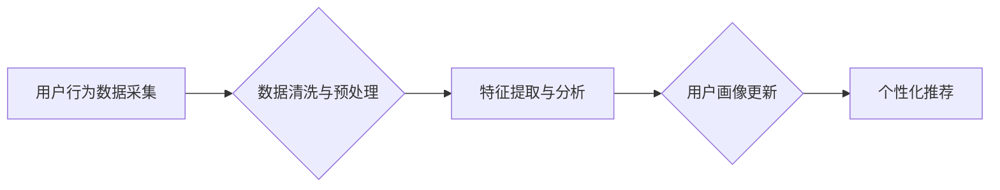

                 

## 电商客户体验个性化中的用户画像动态更新与优化

> 关键词：用户画像、动态更新、个性化推荐、机器学习、电商客户体验

> 摘要：随着电商行业的快速发展，客户体验的个性化已经成为提升用户粘性和促进商业增长的关键因素。本文深入探讨了电商客户体验个性化中的用户画像动态更新与优化，从核心概念、算法原理、数学模型、代码实现、实际应用场景等多个方面进行阐述。通过分析用户行为数据、结合机器学习算法，构建动态更新的用户画像，实现对用户需求的精准把握，从而提供更个性化、更精准的商品推荐、营销活动推送和客户服务，最终提升用户满意度和转化率。

## 1. 背景介绍

在当今数据爆炸的时代，电商平台拥有海量用户数据，这些数据蕴含着丰富的用户行为和偏好信息。传统的静态用户画像难以捕捉用户行为的动态变化，导致个性化推荐效果有限。因此，构建动态更新的用户画像，并将其应用于电商客户体验个性化，成为提升用户体验和商业效益的关键。

### 1.1  用户画像的意义

用户画像是指对用户进行深入分析和总结，构建出用户特征、行为模式、需求偏好等多维度的描述。它为电商平台提供了一个直观的了解用户群体的工具，帮助企业制定更精准的营销策略、提供更个性化的产品和服务。

### 1.2  动态更新的必要性

用户行为是不断变化的，传统的静态用户画像难以捕捉这些变化。动态更新的用户画像能够实时反映用户的最新需求和偏好，从而实现更精准的个性化推荐和服务。

## 2. 核心概念与联系

### 2.1  用户画像构建

用户画像构建是将用户数据进行分析和整合，形成用户特征的描述。

* **用户基本信息:** 年龄、性别、地域、职业等。
* **用户行为数据:** 浏览历史、购买记录、评价信息、购物车内容等。
* **用户兴趣爱好:** 产品类别偏好、品牌偏好、活动参与等。
* **用户价值特征:** 消费能力、忠诚度、购买频率等。

### 2.2  动态更新机制

动态更新机制是指根据用户行为数据实时更新用户画像，使其保持与用户行为的同步。

* **数据采集:** 实时采集用户行为数据，例如浏览记录、购买记录、评价信息等。
* **数据清洗:** 对采集到的数据进行清洗和处理，去除无效数据和噪声数据。
* **数据分析:** 利用机器学习算法对数据进行分析，提取用户特征和行为模式。
* **用户画像更新:** 根据分析结果，实时更新用户画像，并将其存储在数据库中。

### 2.3  个性化推荐

个性化推荐是指根据用户画像，推荐符合用户需求和偏好的商品或服务。

* **基于内容的推荐:** 根据商品的属性和用户兴趣爱好进行推荐。
* **基于协同过滤的推荐:** 根据用户的购买历史和相似用户的购买行为进行推荐。
* **基于深度学习的推荐:** 利用深度学习算法对用户行为数据进行分析，进行更精准的推荐。

**Mermaid 流程图**



## 3. 核心算法原理 & 具体操作步骤

### 3.1  算法原理概述

用户画像动态更新的核心算法主要包括：

* **机器学习算法:** 

    * **分类算法:** 用于将用户进行分类，例如根据用户购买行为将用户分为不同消费群体。
    * **聚类算法:** 用于将用户进行聚类，例如根据用户兴趣爱好将用户分为不同兴趣群。
    * **回归算法:** 用于预测用户未来的行为，例如预测用户的购买金额。

* **深度学习算法:** 

    * **神经网络:** 用于学习用户行为数据中的复杂模式，进行更精准的用户画像构建和个性化推荐。

### 3.2  算法步骤详解

1. **数据采集:** 从电商平台收集用户行为数据，例如浏览记录、购买记录、评价信息、购物车内容等。
2. **数据清洗:** 对采集到的数据进行清洗和处理，去除无效数据和噪声数据，例如重复数据、缺失数据等。
3. **特征提取:** 从用户行为数据中提取特征，例如用户购买的商品类别、用户浏览的页面数量、用户评价的商品评分等。
4. **模型训练:** 利用机器学习算法或深度学习算法对提取的特征进行训练，构建用户画像模型。
5. **用户画像更新:** 将新用户行为数据输入到模型中，更新用户的画像信息。

### 3.3  算法优缺点

**优点:**

* **精准度高:** 基于机器学习和深度学习算法，能够更精准地捕捉用户行为模式和需求偏好。
* **动态性强:** 可以实时更新用户画像，适应用户行为的变化。
* **可扩展性强:** 可以根据需要扩展算法模型，增加更多特征和分析维度。

**缺点:**

* **数据依赖性强:** 需要大量的用户行为数据进行训练，否则模型效果会下降。
* **算法复杂度高:** 需要专业的技术人员进行模型开发和维护。
* **隐私安全问题:** 需要妥善处理用户隐私数据，避免泄露和滥用。

### 3.4  算法应用领域

* **电商个性化推荐:** 根据用户的兴趣爱好和购买历史，推荐个性化的商品。
* **营销活动精准推送:** 根据用户的画像特征，精准推送相关的营销活动。
* **客户服务个性化:** 根据用户的需求和偏好，提供个性化的客户服务。

## 4. 数学模型和公式 & 详细讲解 & 举例说明

### 4.1  数学模型构建

用户画像动态更新的数学模型可以基于概率论和统计学原理构建。例如，可以使用贝叶斯网络模型来表示用户行为之间的依赖关系，并根据用户的历史行为数据更新用户的画像概率。

### 4.2  公式推导过程

假设用户 u 的行为特征为 X，用户画像为 Y，则可以使用以下公式来表示用户画像的更新过程：

$$P(Y|X) = \frac{P(X|Y)P(Y)}{P(X)}$$

其中：

* $P(Y|X)$ 是用户画像 Y 在用户行为特征 X 下的条件概率。
* $P(X|Y)$ 是用户行为特征 X 在用户画像 Y 下的条件概率。
* $P(Y)$ 是用户画像 Y 的先验概率。
* $P(X)$ 是用户行为特征 X 的边缘概率。

### 4.3  案例分析与讲解

例如，假设用户 u 购买了商品 A，并且用户画像中包含了用户对商品 A 的偏好程度。根据贝叶斯网络模型，我们可以更新用户对商品 A 的偏好程度，使其更加接近于购买行为。

## 5. 项目实践：代码实例和详细解释说明

### 5.1  开发环境搭建

* **操作系统:** Linux 或 macOS
* **编程语言:** Python
* **机器学习库:** scikit-learn, TensorFlow 或 PyTorch
* **数据库:** MySQL 或 MongoDB

### 5.2  源代码详细实现

```python
# 导入必要的库
import pandas as pd
from sklearn.model_selection import train_test_split
from sklearn.linear_model import LogisticRegression

# 加载用户行为数据
data = pd.read_csv('user_behavior.csv')

# 选择特征和目标变量
features = ['age', 'gender', 'purchase_history']
target = 'purchase_probability'

# 将数据进行训练集和测试集划分
X_train, X_test, y_train, y_test = train_test_split(data[features], data[target], test_size=0.2)

# 训练逻辑回归模型
model = LogisticRegression()
model.fit(X_train, y_train)

# 对测试集进行预测
y_pred = model.predict(X_test)

# 计算模型准确率
accuracy = model.score(X_test, y_test)
print(f'模型准确率: {accuracy}')

# 使用训练好的模型更新用户画像
new_user_data = pd.DataFrame({'age': [25], 'gender': ['male'], 'purchase_history': [10]})
predicted_probability = model.predict_proba(new_user_data)
print(f'新用户的购买概率: {predicted_probability}')
```

### 5.3  代码解读与分析

* 代码首先导入必要的库，并加载用户行为数据。
* 然后选择特征和目标变量，并将数据进行训练集和测试集划分。
* 训练逻辑回归模型，并对测试集进行预测，计算模型准确率。
* 最后使用训练好的模型更新新用户的画像，并预测其购买概率。

### 5.4  运行结果展示

运行代码后，会输出模型的准确率和新用户的购买概率。

## 6. 实际应用场景

### 6.1  电商商品推荐

根据用户的浏览历史、购买记录和兴趣爱好，推荐个性化的商品，提高用户转化率。

### 6.2  营销活动精准推送

根据用户的画像特征，精准推送相关的营销活动，提高活动参与度和转化率。

### 6.3  客户服务个性化

根据用户的需求和偏好，提供个性化的客户服务，提升用户满意度和忠诚度。

### 6.4  未来应用展望

随着人工智能技术的不断发展，用户画像动态更新将应用于更广泛的场景，例如：

* **个性化内容推荐:** 根据用户的兴趣爱好和阅读习惯，推荐个性化的新闻、文章和视频。
* **精准医疗:** 根据用户的基因信息和健康状况，提供个性化的医疗建议和治疗方案。
* **智能教育:** 根据学生的学习进度和能力，提供个性化的学习内容和辅导。

## 7. 工具和资源推荐

### 7.1  学习资源推荐

* **书籍:**
    * 《深度学习》
    * 《机器学习实战》
    * 《Python机器学习》
* **在线课程:**
    * Coursera
    * edX
    * Udacity

### 7.2  开发工具推荐

* **数据分析工具:**
    * Pandas
    * NumPy
    * SciPy
* **机器学习库:**
    * scikit-learn
    * TensorFlow
    * PyTorch
* **数据库:**
    * MySQL
    * MongoDB

### 7.3  相关论文推荐

* **用户画像构建:**
    * "A Survey on User Profiling Techniques"
    * "User Profiling for Personalized Recommendations"
* **动态更新机制:**
    * "Dynamic User Profiling for Personalized Recommendations"
    * "Real-Time User Profiling for E-Commerce"

## 8. 总结：未来发展趋势与挑战

### 8.1  研究成果总结

用户画像动态更新技术在电商客户体验个性化方面取得了显著成果，能够提高用户满意度、转化率和忠诚度。

### 8.2  未来发展趋势

* **更精准的用户画像:** 利用更先进的机器学习和深度学习算法，构建更精准的用户画像。
* **更个性化的服务:** 基于用户画像，提供更个性化的商品推荐、营销活动推送和客户服务。
* **跨平台用户画像:** 将用户画像跨平台整合，提供更全面的用户体验。

### 8.3  面临的挑战

* **数据隐私安全:** 需要妥善处理用户隐私数据，避免泄露和滥用。
* **算法解释性:** 需要提高机器学习算法的解释性，让用户能够理解模型是如何生成用户画像的。
* **模型可维护性:** 需要开发更可维护的模型，能够适应用户行为的变化。

### 8.4  研究展望

未来，用户画像动态更新技术将继续发展，并应用于更多领域，为用户提供更个性化、更智能化的体验。

## 9. 附录：常见问题与解答

* **Q1: 如何收集用户行为数据？**

    * A1: 可以通过网站访问记录、购买记录、评价信息、购物车内容等方式收集用户行为数据。

* **Q2: 如何选择合适的机器学习算法？**

    * A2: 需要根据用户的画像需求和数据的特点选择合适的算法。例如，如果需要预测用户的购买概率，可以使用逻辑回归算法。

* **Q3: 如何保证用户隐私安全？**

    * A3: 需要采用数据加密、匿名化等技术，保护用户的隐私信息。


作者：禅与计算机程序设计艺术 / Zen and the Art of Computer Programming 
<end_of_turn>

