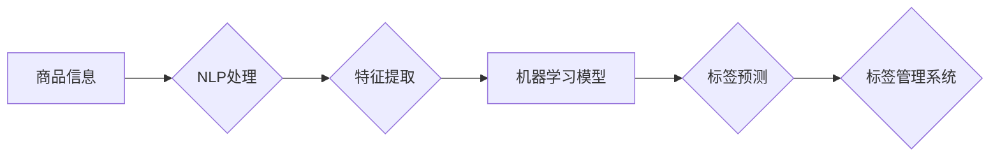

                 

## 电商搜索中的AI商品标签预测模型

> 关键词：电商搜索、商品标签预测、机器学习、深度学习、自然语言处理、推荐系统

## 1. 背景介绍

在当今电子商务蓬勃发展的时代，商品搜索是用户获取所需商品的关键环节。高效、精准的商品搜索体验直接影响着用户满意度和平台转化率。商品标签作为商品信息的精炼表达，在搜索结果排序、推荐系统和用户浏览体验等方面发挥着至关重要的作用。然而，人工标注商品标签是一个耗时费力、成本高昂的过程，难以满足电商平台日益增长的需求。

因此，如何利用人工智能技术自动预测商品标签，成为电商平台优化搜索体验、提升运营效率的关键问题。AI商品标签预测模型能够根据商品的描述、属性、用户行为等信息，自动学习并预测商品的潜在标签，从而实现自动化、精准的商品标签管理。

## 2. 核心概念与联系

### 2.1  商品标签预测模型

商品标签预测模型是一种利用机器学习算法，从商品信息中学习并预测商品标签的模型。它可以帮助电商平台自动生成商品标签，减少人工标注的成本和时间，同时提高标签的准确性和一致性。

### 2.2  相关技术

* **自然语言处理 (NLP)**：用于理解和处理商品描述文本，提取商品特征和语义信息。
* **机器学习 (ML)**：用于训练商品标签预测模型，学习商品特征与标签之间的关系。
* **深度学习 (DL)**：一种更高级的机器学习方法，能够学习更复杂的特征表示，提高模型的预测精度。
* **推荐系统**：可以利用商品标签信息，为用户推荐更相关的商品。

**Mermaid 流程图**



## 3. 核心算法原理 & 具体操作步骤

### 3.1  算法原理概述

商品标签预测模型通常采用监督学习算法，利用已标注的商品标签数据训练模型。常见的算法包括：

* **逻辑回归 (Logistic Regression)**：一种线性分类算法，用于预测商品是否属于某个标签类别。
* **支持向量机 (Support Vector Machine)**：一种基于核函数的分类算法，能够学习更复杂的决策边界。
* **决策树 (Decision Tree)**：一种树形结构的分类算法，通过一系列规则进行分类。
* **随机森林 (Random Forest)**：一种集成学习算法，通过多个决策树的投票进行分类。
* **深度神经网络 (Deep Neural Network)**：一种更复杂的深度学习算法，能够学习更丰富的特征表示。

### 3.2  算法步骤详解

1. **数据收集和预处理**: 收集商品信息数据，包括商品描述、属性、价格、用户评论等，并进行清洗、格式化和特征工程。
2. **标签编码**: 将商品标签转换为数字编码，以便模型训练。
3. **模型训练**: 选择合适的算法，利用训练数据训练模型，并进行参数调优。
4. **模型评估**: 使用测试数据评估模型的性能，常用的指标包括准确率、召回率、F1-score等。
5. **模型部署**: 将训练好的模型部署到线上环境，用于预测新商品的标签。

### 3.3  算法优缺点

| 算法 | 优点 | 缺点 |
|---|---|---|
| 逻辑回归 | 简单易实现， interpretable | 难以处理非线性关系 |
| 支持向量机 | 能够处理高维数据，泛化能力强 | 训练时间长，参数调优复杂 |
| 决策树 | 易于理解和解释，可处理多种数据类型 | 容易过拟合，对数据噪声敏感 |
| 随机森林 | 鲁棒性强，泛化能力好 | 训练时间长，难以解释模型决策 |
| 深度神经网络 | 能够学习更复杂的特征表示，预测精度高 | 训练时间长，参数量大，需要大量数据 |

### 3.4  算法应用领域

商品标签预测模型广泛应用于电商平台的搜索、推荐、分类等场景，例如：

* **商品搜索**: 根据用户搜索关键词，预测相关的商品标签，提高搜索结果的精准度。
* **商品推荐**: 根据用户的浏览历史和购买记录，预测用户可能感兴趣的商品标签，推荐更相关的商品。
* **商品分类**: 根据商品标签信息，自动将商品分类到不同的类别，方便用户浏览和查找。

## 4. 数学模型和公式 & 详细讲解 & 举例说明

### 4.1  数学模型构建

商品标签预测模型通常采用分类模型，将商品标签预测为离散类别。例如，可以使用逻辑回归模型预测商品是否属于某个特定标签类别。

**逻辑回归模型**

逻辑回归模型将线性回归模型的输出映射到0到1之间的概率值，表示商品属于某个标签类别的概率。

**公式**:

$$
P(y=1|x) = \frac{1}{1 + e^{-(w^T x + b)}}
$$

其中：

* $P(y=1|x)$ 是商品属于标签类别的概率。
* $x$ 是商品特征向量。
* $w$ 是模型参数向量。
* $b$ 是模型偏置项。
* $e$ 是自然常数。

### 4.2  公式推导过程

逻辑回归模型的输出概率值可以通过sigmoid函数进行计算。sigmoid函数将线性回归模型的输出映射到0到1之间的概率值，满足以下性质：

* 当输入为正无穷大时，输出为1。
* 当输入为负无穷大时，输出为0。
* 当输入为0时，输出为0.5。

### 4.3  案例分析与讲解

假设我们想要预测商品是否属于“运动鞋”标签类别。我们可以收集商品描述、属性等特征数据，并将其作为输入到逻辑回归模型中。模型会根据训练数据学习商品特征与标签类别的关系，并输出商品属于“运动鞋”标签的概率值。

如果模型输出的概率值大于某个阈值，则预测该商品属于“运动鞋”标签类别；否则，预测该商品不属于“运动鞋”标签类别。

## 5. 项目实践：代码实例和详细解释说明

### 5.1  开发环境搭建

* Python 3.x
* TensorFlow/PyTorch
* scikit-learn
* NLTK

### 5.2  源代码详细实现

```python
# 导入必要的库
import pandas as pd
from sklearn.model_selection import train_test_split
from sklearn.linear_model import LogisticRegression
from sklearn.metrics import accuracy_score

# 加载商品数据
data = pd.read_csv('商品数据.csv')

# 数据预处理
# ...

# 将标签数据转换为数字编码
data['标签'] = data['标签'].map({'运动鞋': 1, '休闲鞋': 0})

# 将数据分为训练集和测试集
X_train, X_test, y_train, y_test = train_test_split(data.drop('标签', axis=1), data['标签'], test_size=0.2)

# 创建逻辑回归模型
model = LogisticRegression()

# 训练模型
model.fit(X_train, y_train)

# 预测测试集标签
y_pred = model.predict(X_test)

# 计算模型准确率
accuracy = accuracy_score(y_test, y_pred)
print(f'模型准确率: {accuracy}')
```

### 5.3  代码解读与分析

* 代码首先导入必要的库，包括pandas用于数据处理、scikit-learn用于模型训练和评估、NLTK用于自然语言处理等。
* 然后，加载商品数据，并进行数据预处理，例如文本特征提取、数据清洗等。
* 将标签数据转换为数字编码，以便模型训练。
* 将数据分为训练集和测试集，用于模型训练和评估。
* 创建逻辑回归模型，并使用训练数据进行模型训练。
* 使用训练好的模型预测测试集标签，并计算模型准确率。

### 5.4  运行结果展示

运行代码后，会输出模型的准确率。

## 6. 实际应用场景

### 6.1  电商搜索

商品标签预测模型可以帮助电商平台提高商品搜索的精准度。例如，当用户搜索“运动鞋”时，模型可以预测相关的商品标签，并返回包含这些标签的商品结果。

### 6.2  商品推荐

商品标签预测模型可以帮助电商平台推荐更相关的商品。例如，根据用户的浏览历史和购买记录，模型可以预测用户可能感兴趣的商品标签，并推荐包含这些标签的商品。

### 6.3  商品分类

商品标签预测模型可以帮助电商平台自动将商品分类到不同的类别。例如，根据商品标签信息，模型可以将商品分类到“服装”、“电子产品”、“家居用品”等不同的类别。

### 6.4  未来应用展望

随着人工智能技术的不断发展，商品标签预测模型的应用场景将会更加广泛。例如，可以利用模型预测商品的未来趋势，帮助电商平台进行库存管理和商品定价。

## 7. 工具和资源推荐

### 7.1  学习资源推荐

* **书籍**:
    * 《深度学习》
    * 《机器学习实战》
* **在线课程**:
    * Coursera
    * edX
    * Udacity

### 7.2  开发工具推荐

* **Python**: 
    * TensorFlow
    * PyTorch
    * scikit-learn
* **数据处理工具**:
    * pandas
    * NumPy

### 7.3  相关论文推荐

* **ACL**: Association for Computational Linguistics
* **EMNLP**: Empirical Methods in Natural Language Processing
* **NAACL**: North American Chapter of the Association for Computational Linguistics

## 8. 总结：未来发展趋势与挑战

### 8.1  研究成果总结

商品标签预测模型在电商平台的应用取得了显著的成果，提高了商品搜索、推荐和分类的精准度，提升了用户体验和平台运营效率。

### 8.2  未来发展趋势

* **模型精度提升**: 探索更先进的深度学习算法，例如Transformer模型，提高模型的预测精度。
* **多模态融合**: 将商品文本描述、图像、视频等多模态信息融合到模型中，提高模型的理解能力和预测准确率。
* **个性化推荐**: 基于用户的行为数据和偏好，进行个性化商品标签预测和推荐。
* **跨平台应用**: 将商品标签预测模型应用到其他电商平台和场景，例如社交电商、直播电商等。

### 8.3  面临的挑战

* **数据质量**: 商品标签数据往往存在噪声和不完整性，需要进行有效的数据清洗和预处理。
* **模型解释性**: 深度学习模型的决策过程难以解释，需要开发更可解释的模型，提高模型的透明度和可信度。
* **实时性**: 随着电商平台的快速发展，商品信息和用户行为数据不断更新，需要开发更快速的模型训练和部署方法，保证模型的实时性。

### 8.4  研究展望

未来，商品标签预测模型的研究将继续朝着更精准、更智能、更可解释的方向发展，为电商平台提供更强大的数据分析和决策支持工具。

## 9. 附录：常见问题与解答

* **Q1**: 如何选择合适的商品标签预测模型？
* **A1**: 选择合适的模型需要根据具体的数据特点和应用场景进行考虑。例如，对于文本数据，可以使用基于自然语言处理的模型，例如BERT模型；对于图像数据，可以使用卷积神经网络模型。

* **Q2**: 如何评估商品标签预测模型的性能？
* **A2**: 常用的评估指标包括准确率、召回率、F1-score等。

* **Q3**: 如何处理商品标签数据中的噪声和不完整性？
* **A3**: 可以使用数据清洗和预处理方法，例如删除重复数据、填充缺失值等。

* **Q4**: 如何提高商品标签预测模型的精度？
* **A4**: 可以尝试使用更先进的深度学习算法、增加训练数据量、进行特征工程等方法。


作者：禅与计算机程序设计艺术 / Zen and the Art of Computer Programming 
<end_of_turn>

