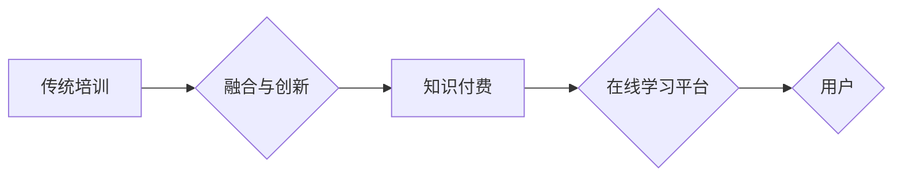

                 

## 知识付费与传统培训的融合与创新

> 关键词：知识付费、在线教育、传统培训、技术融合、未来趋势、学习模式

### 1. 背景介绍

随着互联网技术的飞速发展和数字经济的蓬勃兴起，知识付费模式逐渐成为一种新的学习模式，并对传统培训模式产生了深远影响。知识付费是指以知识、技能、经验等为核心内容，通过线上平台向用户提供付费学习服务。它打破了时间和空间的限制，为用户提供了更加灵活、便捷、个性化的学习体验。

传统培训模式主要以线下课堂、培训机构等形式存在，其特点是面对面授课、互动性强、学习氛围浓厚。然而，传统培训模式也存在一些局限性，例如成本高、时间固定、地域限制等。

知识付费模式的出现，为传统培训模式带来了新的机遇和挑战。一方面，它可以有效补充传统培训模式的不足，提供更加灵活、便捷的学习方式；另一方面，它也对传统培训机构的运营模式和服务内容提出了新的要求。

### 2. 核心概念与联系

#### 2.1 知识付费

知识付费是指以知识、技能、经验等为核心内容，通过线上平台向用户提供付费学习服务。它涵盖了多种形式，例如在线课程、直播讲座、付费咨询、电子书等。

#### 2.2 传统培训

传统培训是指以线下课堂、培训机构等形式存在的学习模式，其特点是面对面授课、互动性强、学习氛围浓厚。

#### 2.3 融合与创新

知识付费与传统培训的融合，是指将知识付费模式的灵活、便捷的优势与传统培训模式的互动性、专业性的优势相结合，创造出更加高效、个性化的学习体验。

**Mermaid 流程图**



### 3. 核心算法原理 & 具体操作步骤

#### 3.1 算法原理概述

知识付费与传统培训的融合与创新，本质上是基于数据分析和算法推荐的个性化学习模式。通过对用户的学习行为、兴趣偏好、知识结构等进行分析，算法可以推荐最适合用户的学习内容和学习路径，从而提高学习效率和用户体验。

#### 3.2 算法步骤详解

1. **数据采集:** 收集用户的学习行为数据，例如学习时长、学习进度、学习内容偏好、评价反馈等。
2. **数据预处理:** 对收集到的数据进行清洗、转换、整合等处理，使其符合算法模型的输入要求。
3. **特征提取:** 从用户数据中提取关键特征，例如学习能力、学习风格、知识结构等。
4. **模型训练:** 利用机器学习算法，对用户特征和学习内容进行建模，构建个性化学习推荐模型。
5. **推荐生成:** 根据用户的当前状态和学习需求，模型生成个性化的学习推荐，包括学习内容、学习路径、学习时间等。
6. **反馈机制:** 收集用户的反馈信息，并将其反馈到模型训练中，不断优化推荐效果。

#### 3.3 算法优缺点

**优点:**

* **个性化学习:** 根据用户的学习需求和特点，提供个性化的学习内容和学习路径。
* **提高学习效率:** 通过精准推荐，帮助用户更快地掌握知识和技能。
* **提升用户体验:** 提供更加灵活、便捷、个性化的学习体验。

**缺点:**

* **数据依赖:** 算法推荐的准确性依赖于数据的质量和数量。
* **算法复杂性:** 建立和维护个性化学习推荐模型需要复杂的算法和技术。
* **伦理问题:** 数据隐私保护和算法公平性等伦理问题需要得到重视。

#### 3.4 算法应用领域

* **在线教育平台:** 为用户提供个性化的学习推荐，提高学习效率和用户粘性。
* **企业培训:** 根据员工的岗位需求和职业发展目标，提供个性化的培训方案。
* **个人学习:** 为个人用户提供个性化的学习建议，帮助他们实现学习目标。

### 4. 数学模型和公式 & 详细讲解 & 举例说明

#### 4.1 数学模型构建

知识付费与传统培训的融合与创新，可以构建一个基于用户行为和内容特征的推荐模型。

**用户行为特征:**

* 学习时长
* 学习进度
* 学习内容偏好
* 评价反馈

**内容特征:**

* 内容主题
* 内容难度
* 内容类型
* 内容受欢迎程度

**推荐模型:**

可以使用协同过滤算法、内容过滤算法或混合算法构建推荐模型。

#### 4.2 公式推导过程

协同过滤算法的核心思想是基于用户的相似度或物品的相似度进行推荐。

**用户相似度计算:**

$$
Sim(u_i, u_j) = \frac{\sum_{k=1}^{n} r_{i,k} * r_{j,k}}{\sqrt{\sum_{k=1}^{n} r_{i,k}^2} * \sqrt{\sum_{k=1}^{n} r_{j,k}^2}}
$$

其中:

* $u_i$ 和 $u_j$ 是两个用户
* $r_{i,k}$ 和 $r_{j,k}$ 是用户 $u_i$ 和 $u_j$ 对物品 $k$ 的评分

**物品相似度计算:**

$$
Sim(i, j) = \frac{\sum_{u=1}^{m} r_{u,i} * r_{u,j}}{\sqrt{\sum_{u=1}^{m} r_{u,i}^2} * \sqrt{\sum_{u=1}^{m} r_{u,j}^2}}
$$

其中:

* $i$ 和 $j$ 是两个物品
* $r_{u,i}$ 和 $r_{u,j}$ 是用户 $u$ 对物品 $i$ 和 $j$ 的评分

#### 4.3 案例分析与讲解

假设有一个在线教育平台，平台上有大量的用户和课程。

* **用户行为数据:** 平台可以收集用户的学习时长、学习进度、学习内容偏好等数据。
* **内容特征数据:** 平台可以对课程进行分类、标注难度等级、收集用户评价等，获取课程特征数据。

通过构建协同过滤模型，平台可以根据用户的学习行为和课程特征，推荐用户可能感兴趣的课程。

例如，如果用户 A 学习了大量的编程课程，并且对算法和数据结构感兴趣，那么模型可以推荐用户 A 学习相关的课程，例如机器学习、深度学习等。

### 5. 项目实践：代码实例和详细解释说明

#### 5.1 开发环境搭建

* **操作系统:** Linux/macOS/Windows
* **编程语言:** Python
* **框架:** Flask/Django
* **数据库:** MySQL/PostgreSQL
* **机器学习库:** scikit-learn/TensorFlow/PyTorch

#### 5.2 源代码详细实现

```python
# 导入必要的库
import pandas as pd
from sklearn.metrics.pairwise import cosine_similarity

# 加载用户行为数据
user_data = pd.read_csv('user_data.csv')

# 加载课程特征数据
course_data = pd.read_csv('course_data.csv')

# 计算用户相似度
user_similarity = cosine_similarity(user_data.drop('user_id', axis=1))

# 计算课程相似度
course_similarity = cosine_similarity(course_data.drop('course_id', axis=1))

# 根据用户相似度推荐课程
def recommend_courses(user_id, top_n=5):
    # 获取用户相似用户
    similar_users = user_similarity[user_id].argsort()[:-top_n-1:-1]

    # 获取相似用户喜欢的课程
    recommended_courses = course_data.loc[user_data.loc[similar_users, 'course_id'].values.flatten()]

    # 返回推荐课程
    return recommended_courses

# 获取用户推荐课程
user_id = 1
recommended_courses = recommend_courses(user_id)

# 打印推荐课程
print(recommended_courses)
```

#### 5.3 代码解读与分析

* **数据加载:** 代码首先加载用户行为数据和课程特征数据。
* **相似度计算:** 使用余弦相似度计算用户相似度和课程相似度。
* **课程推荐:** 根据用户相似度，推荐用户可能感兴趣的课程。

#### 5.4 运行结果展示

运行代码后，会输出用户 ID 为 1 的推荐课程列表。

### 6. 实际应用场景

#### 6.1 在线教育平台

* **个性化学习推荐:** 根据用户的学习行为和兴趣偏好，推荐个性化的学习内容和学习路径。
* **课程推荐:** 根据用户的学习历史和课程特征，推荐用户可能感兴趣的课程。
* **学习计划定制:** 根据用户的学习目标和时间安排，定制个性化的学习计划。

#### 6.2 企业培训

* **员工技能提升:** 根据员工的岗位需求和职业发展目标，推荐相关的培训课程和学习资源。
* **人才培养:** 根据企业的战略目标和人才需求，制定个性化的培训计划，培养企业人才。
* **知识管理:** 建立知识库，并根据员工的需求，推荐相关知识和技能。

#### 6.3 个人学习

* **兴趣探索:** 根据用户的兴趣爱好，推荐相关的学习内容和学习资源。
* **技能提升:** 根据用户的职业目标和学习需求，推荐相关的学习课程和学习资料。
* **知识积累:** 建立个人知识库，并根据用户的学习进度和知识结构，推荐相关知识和技能。

#### 6.4 未来应用展望

随着人工智能技术的不断发展，知识付费与传统培训的融合与创新将更加深入，应用场景也将更加广泛。

* **沉浸式学习:** 利用虚拟现实、增强现实等技术，打造更加沉浸式的学习体验。
* **个性化学习路径:** 基于用户的学习行为和学习风格，动态调整学习路径，提高学习效率。
* **智能辅导:** 利用人工智能技术，为用户提供智能化的学习辅导和答疑服务。

### 7. 工具和资源推荐

#### 7.1 学习资源推荐

* **在线课程平台:** Coursera、edX、Udacity、Khan Academy
* **技术博客:** Towards Data Science、Machine Learning Mastery、Analytics Vidhya
* **开源项目:** TensorFlow、PyTorch、scikit-learn

#### 7.2 开发工具推荐

* **编程语言:** Python
* **框架:** Flask、Django
* **数据库:** MySQL、PostgreSQL
* **机器学习库:** scikit-learn、TensorFlow、PyTorch

#### 7.3 相关论文推荐

* **Collaborative Filtering for Recommender Systems**
* **Content-Based Recommendation Systems**
* **Hybrid Recommender Systems**

### 8. 总结：未来发展趋势与挑战

#### 8.1 研究成果总结

知识付费与传统培训的融合与创新，为用户提供了更加灵活、便捷、个性化的学习体验，并推动了教育行业的发展。

#### 8.2 未来发展趋势

* **人工智能技术的应用:** 人工智能技术将更加深入地应用于知识付费和传统培训领域，例如智能推荐、个性化学习路径、智能辅导等。
* **沉浸式学习体验:** 虚拟现实、增强现实等技术将为用户提供更加沉浸式的学习体验。
* **跨界融合:** 知识付费与传统培训将与其他行业融合，例如游戏、娱乐、文化等，创造出更加丰富的学习内容和学习方式。

#### 8.3 面临的挑战

* **数据隐私保护:** 知识付费平台需要妥善处理用户的个人数据，保障用户的隐私安全。
* **算法公平性:** 算法推荐需要避免偏见和歧视，确保公平公正。
* **内容质量控制:** 知识付费平台需要严格控制内容质量，避免低质量内容的传播。

#### 8.4 研究展望

未来，知识付费与传统培训的融合与创新将继续深入发展，需要进一步研究以下问题:

* 如何更好地利用人工智能技术，为用户提供更加个性化、智能化的学习体验。
* 如何构建更加公平、透明、可解释的推荐算法。
* 如何保障知识付费平台的安全性、可靠性和可持续发展。


### 9. 附录：常见问题与解答

**Q1: 知识付费与传统培训相比，有哪些优势？**

**A1:** 知识付费模式具有更加灵活、便捷、个性化的学习体验，可以根据用户的学习需求和时间安排，提供定制化的学习方案。

**Q2: 知识付费模式有哪些风险？**

**A2:** 知识付费模式存在着内容质量控制、数据隐私保护、算法公平性等风险。

**Q3: 如何选择合适的知识付费平台？**

**A3:** 选择知识付费平台时，可以考虑平台的口碑、内容质量、学习体验、价格等因素。

**作者：禅与计算机程序设计艺术 / Zen and the Art of Computer Programming**<end_of_turn>

