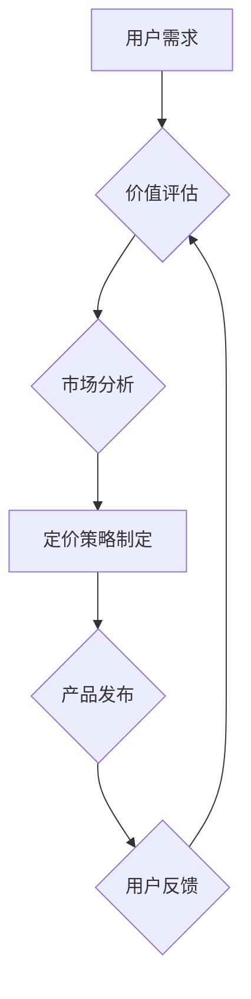

                 

## 知识付费产品的定价策略

> 关键词：知识付费、定价策略、价值评估、市场分析、用户心理、成本控制、盈利模式

## 1. 背景介绍

知识经济时代，知识已成为最宝贵的资源之一。知识付费作为一种新型的商业模式，迅速崛起，为知识产权的传播和变现提供了新的途径。知识付费产品涵盖广泛的领域，从在线课程、电子书、付费博客到咨询服务等，满足了人们对知识获取和技能提升的不断需求。然而，知识付费产品的定价策略是一个复杂且充满挑战的问题。

传统的商业模式往往以产品或服务的成本为基础进行定价，但知识付费产品具有独特的特性，例如：

* **知识的非物质性:** 知识本身没有实体，难以量化其价值。
* **知识的复用性:** 一份知识可以被多人多次使用，但其价值会随着使用次数的增加而递减。
* **知识的更新速度:** 知识更新迭代迅速，需要不断更新和完善，导致知识付费产品的生命周期相对较短。

这些特性使得知识付费产品的定价策略需要更加灵活、精准，并考虑更多因素，例如用户价值感知、市场竞争、成本控制等。

## 2. 核心概念与联系

知识付费产品的定价策略的核心在于 **价值评估** 和 **市场定位**。

* **价值评估:** 准确评估知识付费产品的价值，是制定合理定价策略的基础。需要从多个角度进行评估，例如：知识的实用性、独特性、学习效果、用户需求等。
* **市场定位:** 根据目标用户群体、竞争对手情况、市场需求等因素，确定知识付费产品的市场定位，并制定相应的定价策略。

**Mermaid 流程图:**



## 3. 核心算法原理 & 具体操作步骤

知识付费产品的定价策略并非一个固定的算法，而是需要根据具体情况进行灵活调整。但我们可以借鉴一些常用的定价模型和方法，例如：

### 3.1  算法原理概述

* **成本加成定价:**  根据知识付费产品的开发成本、运营成本等进行计算，并加上一定的利润率，确定最终价格。
* **价值定价:**  根据用户对知识付费产品的价值感知，确定价格。需要通过市场调研、用户反馈等方式，了解用户愿意为知识付费多少。
* **竞争定价:**  参考竞争对手的定价策略，制定相似的价格，或进行差异化定价。
* **分层定价:**  根据知识付费产品的不同内容、级别、服务等，设置不同的价格层级，满足不同用户的需求。

### 3.2  算法步骤详解

1. **成本分析:**  计算知识付费产品的开发成本、运营成本、营销成本等。
2. **价值评估:**  通过市场调研、用户反馈等方式，了解用户对知识付费产品的价值感知。
3. **竞争分析:**  分析竞争对手的定价策略，了解市场价格水平。
4. **定价模型选择:**  根据产品特点、目标用户、市场环境等因素，选择合适的定价模型。
5. **价格制定:**  根据成本、价值、竞争等因素，制定合理的定价方案。
6. **价格测试:**  通过A/B测试等方式，测试不同价格的市场反应。
7. **价格调整:**  根据市场反馈和业务情况，不断调整价格策略。

### 3.3  算法优缺点

* **成本加成定价:**  简单易行，但可能忽视用户价值感知，导致定价过高或过低。
* **价值定价:**  更能体现用户价值，但需要进行深入的市场调研和用户分析。
* **竞争定价:**  易于操作，但可能陷入价格战，降低利润空间。
* **分层定价:**  可以满足不同用户的需求，但需要进行细致的产品分层和定价策略设计。

### 3.4  算法应用领域

知识付费产品的定价策略适用于各种领域，例如：

* **在线教育:**  课程、培训、辅导等。
* **电子出版:**  电子书、期刊、报告等。
* **咨询服务:**  专业咨询、技术支持、项目管理等。
* **会员服务:**  提供专属内容、优惠活动、社区互动等。

## 4. 数学模型和公式 & 详细讲解 & 举例说明

知识付费产品的定价策略可以借助数学模型进行分析和优化。例如，我们可以使用 **需求函数** 来预测不同价格下用户的购买量。

### 4.1  数学模型构建

假设知识付费产品的需求函数为：

$$Q = a - bP$$

其中：

* $Q$：购买量
* $P$：价格
* $a$：需求弹性系数
* $b$：价格系数

### 4.2  公式推导过程

需求函数的推导过程基于以下假设：

* 用户对知识付费产品的需求随着价格的降低而增加。
* 需求弹性系数 $a$ 和价格系数 $b$ 是常数。

根据这些假设，我们可以推导出上述需求函数。

### 4.3  案例分析与讲解

假设一个知识付费产品的需求函数为：

$$Q = 100 - 2P$$

如果价格设置为 $P = 20$，则购买量为：

$$Q = 100 - 2 * 20 = 60$$

如果价格设置为 $P = 40$，则购买量为：

$$Q = 100 - 2 * 40 = 20$$

从案例分析可以看出，价格的降低会导致购买量的增加，反之亦然。

## 5. 项目实践：代码实例和详细解释说明

以下是一个简单的 Python 代码实例，用于计算知识付费产品的收入：

```python
def calculate_revenue(price, quantity):
  """
  计算知识付费产品的收入。

  Args:
    price: 产品价格。
    quantity: 购买量。

  Returns:
    收入。
  """
  return price * quantity

# 设置产品价格和购买量
price = 100
quantity = 50

# 计算收入
revenue = calculate_revenue(price, quantity)

# 打印收入
print(f"收入: {revenue}")
```

### 5.1  开发环境搭建

该代码示例可以使用任何支持 Python 的开发环境进行运行，例如：

* **Python IDLE:**  Python 的内置 IDE。
* **PyCharm:**  一款专业的 Python IDE。
* **VS Code:**  一款功能强大的代码编辑器，支持 Python 插件。

### 5.2  源代码详细实现

代码示例中定义了一个名为 `calculate_revenue` 的函数，该函数接受产品价格和购买量作为参数，并返回收入。

### 5.3  代码解读与分析

代码示例中使用简单的数学运算来计算收入，体现了知识付费产品的收入模型。

### 5.4  运行结果展示

运行该代码示例，将输出以下结果：

```
收入: 5000
```

## 6. 实际应用场景

知识付费产品广泛应用于各个领域，例如：

### 6.1  在线教育

在线课程、培训、辅导等知识付费产品，满足人们对技能提升和知识学习的需求。

### 6.2  电子出版

电子书、期刊、报告等知识付费产品，提供便捷的知识获取方式。

### 6.3  咨询服务

专业咨询、技术支持、项目管理等知识付费服务，帮助用户解决问题、提升效率。

### 6.4  未来应用展望

随着互联网技术的不断发展，知识付费产品的应用场景将更加广泛，例如：

* **虚拟现实/增强现实:**  利用 VR/AR 技术，打造沉浸式的知识付费体验。
* **人工智能:**  利用 AI 技术，个性化推荐知识付费产品，提升用户体验。
* **区块链:**  利用区块链技术，保障知识产权，促进知识付费的公平交易。

## 7. 工具和资源推荐

### 7.1  学习资源推荐

* **Coursera:**  提供各种在线课程和专业证书。
* **edX:**  由哈佛大学和麻省理工学院共同创办的在线学习平台。
* **Udemy:**  提供各种主题的在线课程。

### 7.2  开发工具推荐

* **Python:**  用于开发知识付费产品的后台系统和数据分析工具。
* **Django:**  Python 框架，用于开发 Web 应用。
* **Flask:**  Python 框架，用于开发小型 Web 应用。

### 7.3  相关论文推荐

* **The Economics of Online Education**
* **The Future of Knowledge Sharing**
* **The Impact of Technology on Knowledge Creation and Dissemination**

## 8. 总结：未来发展趋势与挑战

知识付费产品作为一种新型的商业模式，具有巨大的发展潜力。未来，知识付费产品的定价策略将更加精准、个性化，并与人工智能、区块链等新技术深度融合。

### 8.1  研究成果总结

* 知识付费产品的价值评估方法不断完善，更加注重用户价值感知。
* 定价模型更加多样化，能够更好地适应不同类型的知识付费产品。
* 技术手段不断提升，为知识付费产品的开发和推广提供了更强大的支持。

### 8.2  未来发展趋势

* **个性化定价:**  根据用户的需求、行为、支付能力等因素，制定个性化的价格方案。
* **订阅模式:**  用户可以订阅知识付费产品，获得持续更新的内容和服务。
* **社区化:**  知识付费产品将更加注重社区建设，形成用户互动和知识共享的生态系统。

### 8.3  面临的挑战

* **知识产权保护:**  如何有效保护知识付费产品的知识产权，防止盗版和侵权。
* **用户信任:**  如何建立用户对知识付费产品的信任，保证产品质量和服务水平。
* **商业模式创新:**  如何探索新的商业模式，实现知识付费产品的可持续发展。

### 8.4  研究展望

未来，知识付费产品的定价策略将更加智能化、精准化，并与用户行为分析、数据挖掘等技术深度融合，为用户提供更加个性化、高效的知识获取体验。


## 9. 附录：常见问题与解答

### 9.1  如何评估知识付费产品的价值？

评估知识付费产品的价值需要从多个角度进行考虑，例如：

* **知识的实用性:**  知识是否能够帮助用户解决实际问题，提升技能水平。
* **知识的独特性:**  知识是否具有原创性，是否能够提供独特的价值。
* **学习效果:**  知识付费产品是否能够有效地帮助用户学习和掌握知识。
* **用户需求:**  市场上是否存在对该知识的强烈需求。

### 9.2  如何制定合理的知识付费产品定价策略？

制定合理的知识付费产品定价策略需要综合考虑以下因素：

* **成本:**  开发、运营、营销等成本。
* **价值:**  用户对知识付费产品的价值感知。
* **竞争:**  竞争对手的定价策略。
* **目标用户:**  目标用户的消费能力和支付意愿。

### 9.3  如何应对知识付费产品的价格战？

应对知识付费产品的价格战，可以采取以下措施：

* **差异化定价:**  提供不同类型的产品和服务，满足不同用户的需求。
* **提升产品价值:**  不断提升知识付费产品的质量和服务水平，增强用户粘性。
* **建立品牌优势:**  打造独特的品牌形象和口碑，提升用户对产品的信任度。


作者：禅与计算机程序设计艺术 / Zen and the Art of Computer Programming 
<end_of_turn>

