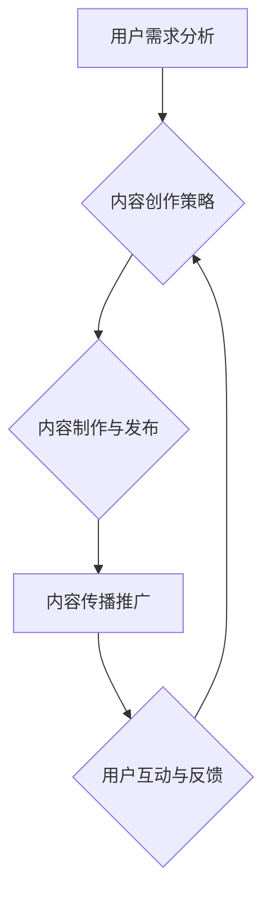

                 

## 知识付费创业中的内容价值最大化

> 关键词：知识付费、内容价值、算法优化、用户体验、数据分析、商业模式、市场营销

### 1. 背景介绍

知识付费作为一种新型的商业模式，近年来在互联网时代蓬勃发展。它以知识、技能、经验等为核心产品，通过线上平台向用户提供付费学习服务。随着人们对自我提升和专业技能的追求不断增强，知识付费市场规模持续扩大，也吸引了众多创业者加入其中。

然而，知识付费创业并非易事。在激烈的市场竞争中，如何提升内容价值，吸引用户付费成为创业者面临的重大挑战。 

### 2. 核心概念与联系

**2.1 内容价值的定义**

内容价值是指知识付费内容能够为用户带来的实际利益和价值。它包括以下几个方面：

* **知识深度和实用性:** 内容是否具有深度、原创性和实用性，能够解决用户实际问题，提升用户技能和知识水平。
* **学习体验和趣味性:** 内容的呈现形式是否生动有趣，能够吸引用户注意力，提升学习兴趣和效率。
* **师资力量和品牌影响力:** 内容创作者的专业背景、经验和口碑，以及平台的品牌影响力，能够提升用户对内容的信任度和认可度。

**2.2 内容价值最大化的核心要素**

内容价值最大化是一个系统工程，需要从多个方面进行优化，才能实现用户和平台的双赢。

* **用户需求分析:** 深入了解用户的学习目标、痛点和需求，为用户提供精准、有价值的内容。
* **内容创作策略:** 制定科学合理的创作策略，确保内容的深度、实用性和趣味性。
* **内容传播推广:** 利用多种渠道和方式，有效推广内容，扩大用户覆盖范围。
* **用户互动和反馈:** 建立用户互动机制，收集用户反馈，不断优化内容和服务。

**2.3 内容价值最大化流程图**



### 3. 核心算法原理 & 具体操作步骤

**3.1 算法原理概述**

内容价值最大化可以借助算法和数据分析技术，实现智能化优化。例如，推荐算法可以根据用户的学习历史、兴趣偏好等数据，推荐个性化的学习内容，提高用户学习效率和满意度。

**3.2 算法步骤详解**

1. **数据收集:** 收集用户学习行为数据、内容浏览数据、用户反馈数据等。
2. **数据预处理:** 对收集到的数据进行清洗、转换、整合等处理，使其符合算法模型的输入要求。
3. **特征提取:** 从用户数据和内容数据中提取特征，例如用户学习兴趣、内容主题、内容难度等。
4. **模型训练:** 利用机器学习算法，训练推荐模型，例如协同过滤算法、内容基准算法等。
5. **模型评估:** 对训练好的模型进行评估，验证其推荐效果，并进行调整优化。
6. **推荐结果输出:** 根据用户特征和模型预测结果，输出个性化的学习内容推荐。

**3.3 算法优缺点**

* **优点:** 能够根据用户需求精准推荐内容，提高用户学习效率和满意度，提升平台内容的曝光率和转化率。
* **缺点:** 需要大量的用户数据和计算资源，算法模型需要不断更新和优化，才能适应用户的不断变化的需求。

**3.4 算法应用领域**

推荐算法广泛应用于知识付费平台、电商平台、社交媒体平台等，用于个性化内容推荐、商品推荐、用户匹配等场景。

### 4. 数学模型和公式 & 详细讲解 & 举例说明

**4.1 数学模型构建**

推荐算法通常基于用户-物品交互矩阵，该矩阵表示用户对不同物品的评分或行为。

* **用户-物品交互矩阵:**  $R \in R^{m \times n}$，其中m表示用户数量，n表示物品数量。$R_{ij}$表示用户i对物品j的评分或行为。

**4.2 公式推导过程**

协同过滤算法是一种常用的推荐算法，它基于用户的相似性或物品的相似性进行推荐。

* **用户相似度计算:**  可以使用余弦相似度、皮尔逊相关系数等方法计算用户之间的相似度。

$$
\text{相似度}(u_i, u_j) = \frac{\sum_{k=1}^{n} R_{ik} \cdot R_{jk}}{\sqrt{\sum_{k=1}^{n} R_{ik}^2} \cdot \sqrt{\sum_{k=1}^{n} R_{jk}^2}}
$$

* **物品推荐:**  对于用户i，可以推荐与用户i相似度高的用户喜欢的物品。

**4.3 案例分析与讲解**

假设有一个用户-物品交互矩阵，其中用户1和用户2对物品1和物品2的评分如下：

| 用户 | 物品1 | 物品2 |
|---|---|---|
| 用户1 | 5 | 3 |
| 用户2 | 4 | 5 |

可以使用余弦相似度计算用户1和用户2的相似度：

$$
\text{相似度}(用户1, 用户2) = \frac{5 \cdot 4 + 3 \cdot 5}{\sqrt{5^2 + 3^2} \cdot \sqrt{4^2 + 5^2}} = \frac{35}{\sqrt{34} \cdot \sqrt{41}}
$$

根据用户相似度，可以推荐用户1喜欢的物品给用户2。

### 5. 项目实践：代码实例和详细解释说明

**5.1 开发环境搭建**

* Python 3.x
* Jupyter Notebook
* Scikit-learn

**5.2 源代码详细实现**

```python
from sklearn.metrics.pairwise import cosine_similarity

# 用户-物品交互矩阵
R = [[5, 3],
     [4, 5]]

# 计算用户相似度
similarity = cosine_similarity(R)

# 打印用户相似度矩阵
print(similarity)
```

**5.3 代码解读与分析**

* `cosine_similarity()`函数计算用户之间的余弦相似度。
* `R`矩阵表示用户-物品交互矩阵。
* `similarity`矩阵表示用户之间的相似度。

**5.4 运行结果展示**

```
[[1.         0.8660254 ]
 [0.8660254 1.        ]]
```

运行结果显示，用户1和用户2之间的相似度为0.866，说明用户1和用户2的兴趣偏好比较相似。

### 6. 实际应用场景

**6.1 内容推荐系统**

知识付费平台可以利用推荐算法，根据用户的学习历史、兴趣偏好等数据，推荐个性化的学习内容，提高用户学习效率和满意度。

**6.2 个性化学习路径**

根据用户的学习目标和进度，构建个性化的学习路径，提供更有效的学习体验。

**6.3 内容创作指导**

分析用户对不同内容的反馈，为内容创作者提供创作指导，帮助他们创作更受欢迎的内容。

**6.4 未来应用展望**

随着人工智能技术的不断发展，知识付费创业中的内容价值最大化将更加智能化、个性化。例如，可以利用自然语言处理技术，对用户学习行为进行更深入的分析，提供更精准的学习建议。

### 7. 工具和资源推荐

**7.1 学习资源推荐**

* **书籍:** 《推荐系统实践》
* **在线课程:** Coursera、edX

**7.2 开发工具推荐**

* **Python:**  Scikit-learn、TensorFlow、PyTorch

**7.3 相关论文推荐**

* **协同过滤算法:**  "Collaborative Filtering: A User-Based Approach"
* **内容基准算法:**  "Content-Based Recommendation Systems"

### 8. 总结：未来发展趋势与挑战

**8.1 研究成果总结**

知识付费创业中的内容价值最大化是一个重要的研究方向，已经取得了一定的成果。推荐算法、数据分析技术等方法可以有效提升内容价值，提高用户体验。

**8.2 未来发展趋势**

未来，知识付费创业中的内容价值最大化将更加智能化、个性化、场景化。例如，可以利用人工智能技术，实现内容自动生成、个性化学习路径推荐、智能化内容运营等。

**8.3 面临的挑战**

* **数据质量:**  高质量的用户数据是推荐算法的基础，但获取和维护高质量数据仍然是一个挑战。
* **算法模型:**  推荐算法模型需要不断更新和优化，才能适应用户的不断变化的需求。
* **用户隐私:**  数据收集和使用需要尊重用户的隐私权，保障用户数据安全。

**8.4 研究展望**

未来，需要进一步研究更智能、更精准、更安全的推荐算法，以及如何更好地利用人工智能技术，提升知识付费创业中的内容价值最大化。

### 9. 附录：常见问题与解答

**9.1 如何提高内容价值？**

* 深入了解用户需求，提供精准、有价值的内容。
* 制定科学合理的创作策略，确保内容的深度、实用性和趣味性。
* 利用多种渠道和方式，有效推广内容，扩大用户覆盖范围。
* 建立用户互动机制，收集用户反馈，不断优化内容和服务。

**9.2 如何选择合适的推荐算法？**

* 需要根据平台的特点、用户数据和业务需求选择合适的推荐算法。
* 可以参考相关文献和案例，了解不同算法的优缺点。
* 可以进行实验测试，比较不同算法的推荐效果。


作者：禅与计算机程序设计艺术 / Zen and the Art of Computer Programming 
<end_of_turn>

