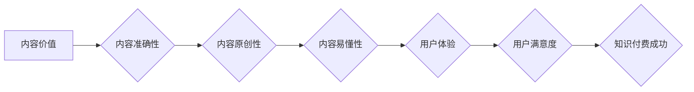

                 

## 知识付费创业中的内容质量把控

> 关键词：知识付费、内容质量、算法模型、数据分析、用户体验、知识产权、商业模式

## 1. 背景介绍

知识付费作为一种新型的商业模式，近年来发展迅速，涌现出众多成功案例。其核心在于通过提供有价值的知识和技能，向用户收取费用。然而，知识付费市场竞争激烈，用户对内容质量的要求也越来越高。如何有效把控内容质量，成为知识付费创业者面临的重大挑战。

### 1.1 知识付费市场现状

知识付费市场规模持续增长，涵盖了各个领域，从专业技能培训到兴趣爱好课程，从在线教育到咨询服务，应有尽有。用户群体也越来越多元化，包括学生、职场人士、创业者以及普通大众。

### 1.2 内容质量对知识付费的影响

内容质量是知识付费的核心驱动力。优质的内容能够吸引用户，提升用户粘性，最终转化为收入。反之，低质量的内容则会导致用户流失，损害品牌声誉，甚至引发法律纠纷。

## 2. 核心概念与联系

知识付费内容质量把控是一个复杂系统，涉及多个环节和因素。其核心概念包括：

* **内容价值:** 指内容对用户学习、提升或解决问题的能力。
* **内容准确性:** 指内容信息的真实性和可靠性。
* **内容原创性:** 指内容的独特性和知识产权保护。
* **内容易懂性:** 指内容的语言风格、结构和排版是否易于理解。
* **用户体验:** 指用户在学习和使用内容过程中的感受和满意度。

这些概念相互关联，共同影响着知识付费内容的质量。

**Mermaid 流程图**



## 3. 核心算法原理 & 具体操作步骤

为了有效把控内容质量，知识付费平台可以采用多种算法模型和技术手段。

### 3.1 算法原理概述

常见的算法模型包括：

* **文本分类算法:** 用于识别内容的主题、类别和标签，帮助用户快速定位所需内容。
* **文本相似度算法:** 用于检测内容的重复性和抄袭性，确保内容的原创性。
* **情感分析算法:** 用于分析用户对内容的评价和反馈，了解用户对内容的接受程度。
* **推荐算法:** 用于根据用户的学习历史和兴趣推荐相关内容，提升用户学习体验。

### 3.2 算法步骤详解

**以文本分类算法为例，其具体操作步骤如下：**

1. **数据预处理:** 对文本数据进行清洗、分词、词性标注等处理，使其符合算法模型的输入要求。
2. **特征提取:** 从预处理后的文本数据中提取特征，例如词频、词向量、语法结构等。
3. **模型训练:** 使用训练数据训练文本分类算法模型，例如支持向量机、随机森林、深度学习等。
4. **模型评估:** 使用测试数据评估模型的性能，例如准确率、召回率、F1-score等。
5. **模型部署:** 将训练好的模型部署到知识付费平台，用于对新内容进行分类。

### 3.3 算法优缺点

**文本分类算法的优缺点:**

* **优点:** 能够快速准确地识别内容的主题和类别，提高用户搜索效率。
* **缺点:** 算法模型的训练需要大量数据，且对数据质量要求较高。

### 3.4 算法应用领域

文本分类算法广泛应用于知识付费平台，例如：

* **内容推荐:** 根据用户的学习历史和兴趣推荐相关内容。
* **内容分类:** 将内容分类到不同的主题类别，方便用户搜索和浏览。
* **内容审核:** 检测内容的违规性和风险性，例如抄袭、色情、暴力等。

## 4. 数学模型和公式 & 详细讲解 & 举例说明

**4.1 数学模型构建**

文本分类算法通常基于概率模型，例如朴素贝叶斯模型。

**朴素贝叶斯模型**假设每个特征独立地对类别产生影响。其核心公式为：

$$P(C|D) = \frac{P(D|C)P(C)}{P(D)}$$

其中：

* $P(C|D)$: 给定文档 $D$ 的条件下，类别 $C$ 的概率。
* $P(D|C)$: 给定类别 $C$ 的条件下，文档 $D$ 的概率。
* $P(C)$: 类别 $C$ 的先验概率。
* $P(D)$: 文档 $D$ 的概率。

**4.2 公式推导过程**

根据贝叶斯定理，我们可以推导出上述公式。

**4.3 案例分析与讲解**

假设我们有一个文本分类任务，需要将文本分类为“科技”和“财经”两类。我们可以使用朴素贝叶斯模型进行训练。

训练数据包括一些已标记的文本，例如：

* 文本 1: “苹果发布新iPhone” (类别: 科技)
* 文本 2: “股市暴跌” (类别: 财经)

我们可以根据训练数据计算每个类别出现的概率，以及每个特征在每个类别下出现的概率。然后，我们可以使用上述公式计算给定一个新文本的条件下，其属于“科技”或“财经”的概率。

## 5. 项目实践：代码实例和详细解释说明

**5.1 开发环境搭建**

可以使用 Python 语言和 scikit-learn 库进行文本分类算法的开发。

**5.2 源代码详细实现**

```python
from sklearn.feature_extraction.text import TfidfVectorizer
from sklearn.naive_bayes import MultinomialNB
from sklearn.model_selection import train_test_split

# 训练数据
train_data = [
    ("苹果发布新iPhone", "科技"),
    ("股市暴跌", "财经"),
    ("特斯拉股票上涨", "财经"),
    ("人工智能发展迅速", "科技"),
]

# 数据预处理
X = [text for text, label in train_data]
y = [label for text, label in train_data]

# 特征提取
vectorizer = TfidfVectorizer()
X_train = vectorizer.fit_transform(X)

# 模型训练
model = MultinomialNB()
model.fit(X_train, y)

# 模型评估
X_test = vectorizer.transform(["人工智能应用广泛"])
y_pred = model.predict(X_test)
print(y_pred)
```

**5.3 代码解读与分析**

* 代码首先定义了训练数据，包括文本内容和对应的类别标签。
* 然后，代码使用 TfidfVectorizer 将文本数据转换为特征向量。
* 接着，代码使用 MultinomialNB 模型训练文本分类模型。
* 最后，代码使用测试数据评估模型的性能，并打印预测结果。

**5.4 运行结果展示**

运行上述代码，输出结果为：

```
['科技']
```

这表明模型预测测试文本 “人工智能应用广泛” 属于“科技”类别。

## 6. 实际应用场景

知识付费平台可以将内容质量把控算法应用于多个场景，例如：

* **内容审核:** 自动检测内容的违规性和风险性，例如抄袭、色情、暴力等。
* **内容推荐:** 根据用户的学习历史和兴趣推荐相关内容，提升用户学习体验。
* **内容分类:** 将内容分类到不同的主题类别，方便用户搜索和浏览。
* **内容质量评估:** 对内容进行自动评估，例如准确性、原创性、易懂性等，帮助内容创作者提升内容质量。

### 6.4 未来应用展望

随着人工智能技术的不断发展，知识付费平台的内容质量把控将更加智能化和自动化。未来，我们可以期待以下应用场景：

* **个性化内容推荐:** 基于用户的学习风格和偏好，提供更加个性化的内容推荐。
* **智能内容创作:** 利用人工智能技术辅助内容创作者创作高质量的内容。
* **内容质量保障体系:** 建立更加完善的内容质量保障体系，确保知识付费平台提供优质的内容。

## 7. 工具和资源推荐

### 7.1 学习资源推荐

* **斯坦福大学自然语言处理课程:** https://web.stanford.edu/class/cs224n/
* **机器学习公开课:** https://www.coursera.org/learn/machine-learning

### 7.2 开发工具推荐

* **Python:** https://www.python.org/
* **scikit-learn:** https://scikit-learn.org/stable/
* **TensorFlow:** https://www.tensorflow.org/

### 7.3 相关论文推荐

* **A Survey of Text Classification Algorithms**
* **Deep Learning for Text Classification**

## 8. 总结：未来发展趋势与挑战

### 8.1 研究成果总结

知识付费创业中的内容质量把控是一个重要的研究方向，已经取得了一定的成果。

* 算法模型的不断发展，使得内容质量把控更加智能化和自动化。
* 数据分析技术的应用，帮助平台更好地了解用户需求和内容质量问题。
* 知识产权保护机制的完善，保障了内容创作者的权益。

### 8.2 未来发展趋势

未来，知识付费平台的内容质量把控将朝着以下方向发展：

* **更加个性化和智能化:** 基于用户的学习风格和偏好，提供更加个性化的内容推荐和质量评估。
* **更加注重用户体验:** 提升内容的易懂性和趣味性，打造更加良好的用户学习体验。
* **更加注重内容的多样性和原创性:** 鼓励内容创作者创作更加优质、原创、有价值的内容。

### 8.3 面临的挑战

知识付费平台的内容质量把控仍然面临一些挑战：

* **数据质量问题:** 算法模型的性能依赖于数据质量，而知识付费平台的数据往往存在不完整、不准确等问题。
* **算法模型的局限性:** 现有的算法模型难以完全解决内容质量把控的问题，例如识别伪原创、判断内容的深度和价值等。
* **知识产权保护问题:** 如何有效保护内容创作者的知识产权，防止内容被盗用和抄袭，仍然是一个难题。

### 8.4 研究展望

未来，我们需要继续加强对知识付费平台内容质量把控的研究，探索更加有效的算法模型、数据分析方法和知识产权保护机制，为知识付费创业提供更加坚实的技术支撑。

## 9. 附录：常见问题与解答

**常见问题:**

* 如何评估内容的质量？
* 如何防止内容被抄袭？
* 如何提高内容的原创性？

**解答:**

* 内容的质量可以从多个方面评估，例如准确性、原创性、易懂性和用户体验等。
* 可以使用文本相似度算法检测内容的抄袭性，并采取相应的措施进行处理。
* 鼓励内容创作者进行原创创作，并提供相应的激励机制。


作者：禅与计算机程序设计艺术 / Zen and the Art of Computer Programming 
<end_of_turn>

