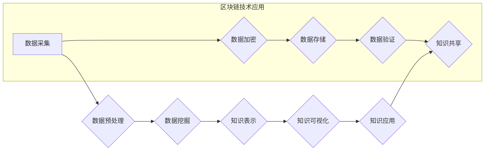

                 

## 知识发现引擎的区块链技术应用

> 关键词：知识发现引擎、区块链、去中心化、数据安全、可信性、透明性、智能合约

## 1. 背景介绍

知识是企业和社会发展的核心驱动力，而知识发现引擎 (Knowledge Discovery Engine, KDE) 正是帮助人们从海量数据中挖掘有价值知识的强大工具。传统的KDE通常依赖于集中式数据库和服务器架构，存在数据孤岛、数据安全和可信性问题。

区块链技术作为一种去中心化、分布式、安全可靠的底层技术，为KDE的应用带来了新的机遇。区块链可以解决传统KDE面临的挑战，构建更加安全、透明、可信的知识发现生态系统。

## 2. 核心概念与联系

### 2.1  知识发现引擎 (KDE)

知识发现引擎 (KDE) 是指利用计算机技术从海量数据中挖掘出有价值的知识，并将其以可理解的形式呈现给用户。KDE通常包含以下几个关键模块：

* **数据预处理:** 对原始数据进行清洗、转换和格式化，使其适合后续的分析和挖掘。
* **数据挖掘:** 利用各种算法和技术，从数据中发现模式、趋势和关联关系。
* **知识表示:** 将挖掘出的知识以结构化的形式表示，例如知识图谱、规则等。
* **知识可视化:** 将知识以直观易懂的方式呈现给用户，例如图表、地图等。

### 2.2  区块链技术

区块链是一种分布式、去中心化的账本技术，其核心特点包括：

* **去中心化:** 数据存储在多个节点上，不存在单点故障和控制中心。
* **不可篡改:** 数据一旦写入区块链，就无法被修改或删除。
* **透明性:** 所有交易记录都公开透明，任何人都可以查看。
* **安全性:** 使用加密算法和共识机制保证数据的安全性和完整性。

### 2.3  区块链与KDE的结合

区块链技术可以为KDE带来以下优势：

* **数据安全:** 将知识数据存储在区块链上，可以保证数据的不可篡改性和安全性。
* **数据可信性:** 区块链的透明性和不可篡改性可以提高知识数据的可信度。
* **数据共享:** 区块链可以实现数据共享和协作，促进知识的传播和利用。
* **智能合约:** 智能合约可以自动化知识发现和交易流程，提高效率和降低成本。

**Mermaid 流程图**



## 3. 核心算法原理 & 具体操作步骤

### 3.1  算法原理概述

区块链技术与KDE的结合主要体现在以下几个方面：

* **数据加密:** 将知识数据进行加密，保证数据的安全性。
* **数据存储:** 将加密后的数据存储在区块链上，实现数据的去中心化和不可篡改。
* **数据验证:** 利用区块链的共识机制，验证数据的真实性和完整性。
* **知识共享:** 利用智能合约，实现知识的共享和交易。

### 3.2  算法步骤详解

1. **数据采集:** 从各种数据源收集相关数据。
2. **数据预处理:** 对数据进行清洗、转换和格式化，使其适合后续的分析和挖掘。
3. **数据加密:** 使用加密算法对数据进行加密，生成加密后的数据块。
4. **数据存储:** 将加密后的数据块添加到区块链上，并通过共识机制进行验证。
5. **数据验证:** 利用区块链的透明性和不可篡改性，验证数据的真实性和完整性。
6. **知识挖掘:** 利用数据挖掘算法，从区块链上的数据中挖掘出有价值的知识。
7. **知识表示:** 将挖掘出的知识以结构化的形式表示，例如知识图谱、规则等。
8. **知识可视化:** 将知识以直观易懂的方式呈现给用户，例如图表、地图等。
9. **知识应用:** 将挖掘出的知识应用于实际场景，例如决策支持、风险管理等。

### 3.3  算法优缺点

**优点:**

* 数据安全性和可信性高
* 数据共享和协作更加便捷
* 自动化程度高，提高效率

**缺点:**

* 技术复杂度高
* 数据查询和分析效率相对较低
* 隐私保护方面仍需进一步研究

### 3.4  算法应用领域

* **医疗保健:** 构建患者医疗数据的去中心化存储和共享平台，促进医疗数据的安全利用和知识发现。
* **金融服务:** 提高金融数据的安全性、透明性和可信性，促进金融风险管理和智能合约应用。
* **教育:** 建立知识共享平台，促进教育资源的开放和利用，提高教育效率。
* **科研:** 构建科研数据的共享平台，促进科研成果的传播和利用，加速科技创新。

## 4. 数学模型和公式 & 详细讲解 & 举例说明

### 4.1  数学模型构建

区块链技术中的知识发现模型可以基于图论和概率统计模型构建。

* **图论模型:** 将知识表示为节点和边构成的图，节点代表知识实体，边代表知识关系。
* **概率统计模型:** 利用贝叶斯网络、马尔科夫链等模型，描述知识之间的概率关系和依赖性。

### 4.2  公式推导过程

例如，利用贝叶斯网络模型，可以推导知识发现的概率公式：

$$P(K|D) = \frac{P(D|K)P(K)}{P(D)}$$

其中：

* $P(K|D)$: 给定数据 $D$ 下知识 $K$ 的概率
* $P(D|K)$: 给定知识 $K$ 下数据 $D$ 的概率
* $P(K)$: 知识 $K$ 的先验概率
* $P(D)$: 数据 $D$ 的先验概率

### 4.3  案例分析与讲解

假设我们想要发现某个疾病的潜在风险因素。我们可以构建一个贝叶斯网络模型，其中节点代表疾病、风险因素和症状，边代表它们之间的因果关系。

通过收集患者的医疗数据，我们可以训练贝叶斯网络模型，并利用该模型计算出给定特定风险因素下患病的概率。

## 5. 项目实践：代码实例和详细解释说明

### 5.1  开发环境搭建

* **编程语言:** Python
* **区块链框架:** Hyperledger Fabric
* **数据挖掘库:** scikit-learn

### 5.2  源代码详细实现

```python
# 数据预处理
from sklearn.preprocessing import StandardScaler

# 数据挖掘
from sklearn.ensemble import RandomForestClassifier

# 区块链交互
from fabric_client import FabricClient

# ...

# 数据加载和预处理
data = load_data()
scaler = StandardScaler()
data_scaled = scaler.fit_transform(data)

# 模型训练
model = RandomForestClassifier()
model.fit(data_scaled, labels)

# 模型部署到区块链
fabric_client = FabricClient()
contract = fabric_client.deploy_contract(model)

# ...

# 数据查询和分析
query_result = fabric_client.query_contract(contract, data)
```

### 5.3  代码解读与分析

* 数据预处理部分使用 scikit-learn 库中的 StandardScaler 类对数据进行标准化处理。
* 数据挖掘部分使用 RandomForestClassifier 类训练一个随机森林模型。
* 区块链交互部分使用 FabricClient 类与区块链网络进行交互，部署模型到智能合约中。
* 数据查询和分析部分使用 FabricClient 类查询智能合约中的模型，并对数据进行分析。

### 5.4  运行结果展示

运行结果将展示模型在区块链上的部署情况，以及对数据进行分析的结果。

## 6. 实际应用场景

### 6.1  医疗保健

* **患者医疗数据共享:** 利用区块链技术构建患者医疗数据的去中心化存储和共享平台，方便医生进行诊断和治疗。
* **药物研发:** 利用区块链技术记录药物研发过程中的数据，提高药物研发效率和安全性。

### 6.2  金融服务

* **欺诈检测:** 利用区块链技术记录交易数据，提高欺诈检测的准确性和效率。
* **供应链金融:** 利用区块链技术追踪货物运输过程，提高供应链金融的透明度和安全性。

### 6.3  教育

* **知识共享平台:** 利用区块链技术构建知识共享平台，促进教育资源的开放和利用。
* **学历认证:** 利用区块链技术记录学生的学历信息，提高学历认证的安全性。

### 6.4  未来应用展望

随着区块链技术的不断发展，其在KDE领域的应用将更加广泛和深入。未来，我们可以期待看到以下应用场景：

* **个性化知识发现:** 利用区块链技术构建个性化知识发现引擎，根据用户的兴趣和需求提供定制化的知识服务。
* **知识经济:** 利用区块链技术促进知识的交易和流通，构建知识经济新模式。
* **人工智能与区块链的融合:** 将人工智能技术与区块链技术相结合，构建更加智能和高效的知识发现引擎。

## 7. 工具和资源推荐

### 7.1  学习资源推荐

* **区块链技术入门书籍:** 《区块链技术入门》、《区块链：从原理到实践》
* **KDE相关书籍:** 《数据挖掘导论》、《机器学习实战》
* **在线课程:** Coursera、edX 等平台提供区块链技术和KDE相关的在线课程。

### 7.2  开发工具推荐

* **区块链框架:** Hyperledger Fabric、Ethereum
* **数据挖掘库:** scikit-learn、TensorFlow
* **编程语言:** Python、Java

### 7.3  相关论文推荐

* **区块链与KDE的结合:**
    * "Blockchain-Based Knowledge Discovery: A Survey"
    * "Secure and Transparent Knowledge Sharing using Blockchain Technology"
* **KDE相关论文:**
    * "Data Mining: Concepts and Techniques"
    * "Introduction to Machine Learning"

## 8. 总结：未来发展趋势与挑战

### 8.1  研究成果总结

区块链技术与KDE的结合为知识发现领域带来了新的机遇和挑战。

* 区块链技术可以提高知识数据的安全性、透明性和可信性，促进知识的共享和利用。
* 然而，区块链技术在KDE领域的应用还处于早期阶段，面临着技术复杂度高、数据查询和分析效率相对较低等挑战。

### 8.2  未来发展趋势

未来，区块链技术与KDE的结合将朝着以下方向发展：

* **更智能的知识发现引擎:** 将人工智能技术与区块链技术相结合，构建更加智能和高效的知识发现引擎。
* **更广泛的应用场景:** 将区块链技术应用于更多领域，例如医疗保健、金融服务、教育等。
* **更完善的生态系统:** 构建更加完善的区块链技术和KDE生态系统，促进技术创新和应用推广。

### 8.3  面临的挑战

区块链技术与KDE的结合还面临着以下挑战：

* **技术标准化:** 缺乏统一的区块链技术标准，导致不同平台之间互不兼容。
* **隐私保护:** 区块链技术的公开透明性可能会带来隐私保护问题。
* **可扩展性:** 区块链技术的可扩展性有限，难以处理海量数据。

### 8.4  研究展望

未来，我们需要继续深入研究区块链技术与KDE的结合，解决技术挑战，推动其在各个领域的应用。


## 9. 附录：常见问题与解答

**Q1: 区块链技术与传统数据库相比，有哪些优势？**

**A1:** 区块链技术相比传统数据库，具有以下优势：

* **去中心化:** 数据存储在多个节点上，不存在单点故障和控制中心。
* **不可篡改:** 数据一旦写入区块链，就无法被修改或删除。
* **透明性:** 所有交易记录都公开透明，任何人都可以查看。
* **安全性:** 使用加密算法和共识机制保证数据的安全性和完整性。

**Q2: 区块链技术在KDE领域有哪些应用场景？**

**A2:** 区块链技术在KDE领域可以应用于以下场景：

* **患者医疗数据共享:** 构建患者医疗数据的去中心化存储和共享平台。
* **药物研发:** 记录药物研发过程中的数据，提高研发效率和安全性。
* **欺诈检测:** 记录交易数据，提高欺诈检测的准确性和效率。
* **知识共享平台:** 构建知识共享平台，促进教育资源的开放和利用。

**Q3: 区块链技术与KDE的结合面临哪些挑战？**

**A3:** 区块链技术与KDE的结合面临以下挑战：

* **技术标准化:** 缺乏统一的区块链技术标准，导致不同平台之间互不兼容。
* **隐私保护:** 区块链技术的公开透明性可能会带来隐私保护问题。
* **可扩展性:** 区块链技术的可扩展性有限，难以处理海量数据。


作者：禅与计算机程序设计艺术 / Zen and the Art of Computer Programming 
<end_of_turn>

