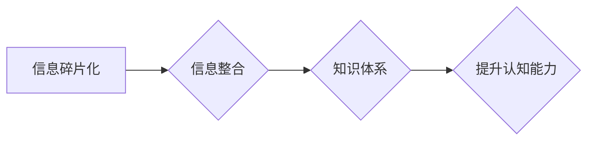

                 

## 知识的碎片化与整合：信息时代的认知挑战

> 关键词：知识碎片化、信息整合、认知挑战、人工智能、深度学习、知识图谱、信息检索、知识管理

### 1. 背景介绍

我们生活在一个信息爆炸的时代。互联网的普及和移动互联网的兴起，使得信息以前所未有的速度和规模涌入我们的生活。然而，这种信息泛滥也带来了新的挑战——知识的碎片化。

传统的学习模式依赖于书籍、课程等相对完整的知识体系。而如今，信息以碎片化的形式呈现，分散在各种平台和渠道。用户需要从海量的信息中筛选、整合和理解知识，这对于个人的认知能力提出了更高的要求。

### 2. 核心概念与联系

**2.1 知识碎片化**

知识碎片化是指知识以零散、孤立的片段形式存在，缺乏整体性和连贯性。这些碎片可能来自不同的来源，例如新闻报道、社交媒体帖子、博客文章、学术论文等。

**2.2 信息整合**

信息整合是指将分散的知识片段连接起来，形成一个完整的、有意义的知识体系。这需要对信息进行分析、分类、关联和组织，以揭示其中的内在联系和逻辑关系。

**2.3 认知挑战**

知识的碎片化给我们的认知带来了挑战：

* **信息过载:** 海量的信息涌入，难以有效地处理和理解。
* **知识断裂:** 缺乏整体性的知识体系，难以形成深入的理解。
* **认知偏差:** 碎片化的信息容易导致认知偏差，影响判断和决策。

**2.4 解决方案**

人工智能、深度学习和知识图谱等技术为信息整合提供了新的解决方案。

**Mermaid 流程图**



### 3. 核心算法原理 & 具体操作步骤

**3.1 算法原理概述**

信息整合的核心算法原理是基于机器学习和自然语言处理技术。这些算法可以自动分析和理解文本信息，识别关键词、主题和关系，并将其组织成知识图谱。

**3.2 算法步骤详解**

1. **数据采集:** 从各种来源收集相关信息，例如文本文件、网页、数据库等。
2. **数据预处理:** 对收集到的数据进行清洗、格式化和转换，例如去除停用词、标点符号等。
3. **关键词提取:** 使用关键词提取算法识别文本中的重要关键词，例如TF-IDF、LDA等。
4. **关系抽取:** 使用关系抽取算法识别文本中的实体和关系，例如命名实体识别、依存句法分析等。
5. **知识图谱构建:** 将提取的关键词和关系构建成知识图谱，例如RDF、OWL等。
6. **知识推理:** 使用知识推理算法对知识图谱进行推理，例如规则推理、逻辑推理等。
7. **知识表示:** 将知识图谱以可视化或其他形式进行表示，例如图谱可视化工具、知识库等。

**3.3 算法优缺点**

**优点:**

* 自动化信息整合，提高效率。
* 识别隐藏的知识关系，发现新的洞察。
* 提供可视化的知识表示，方便理解和探索。

**缺点:**

* 算法精度受限于训练数据质量。
* 复杂的关系难以识别和推理。
* 知识图谱的维护和更新需要持续投入。

**3.4 算法应用领域**

* **搜索引擎:** 提升搜索结果的准确性和相关性。
* **问答系统:** 提供更智能和精准的答案。
* **知识管理:** 建立企业内部的知识库，促进知识共享和传播。
* **教育领域:** 提供个性化的学习体验，帮助学生更好地理解知识。
* **科学研究:** 发现新的科学规律，加速科研进展。

### 4. 数学模型和公式 & 详细讲解 & 举例说明

**4.1 数学模型构建**

信息整合可以建模为一个图论问题。知识片段可以看作图中的节点，而它们之间的关系可以看作图中的边。

**4.2 公式推导过程**

可以使用 PageRank 算法来计算知识片段的重要性。PageRank 算法基于以下公式：

$$PR(A) = (1-d) + d \sum_{Page B links to A} \frac{PR(B)}{C(B)}$$

其中：

* $PR(A)$ 是节点 A 的 PageRank 值。
* $d$ 是阻尼系数，通常取值为 0.85。
* $C(B)$ 是节点 B 的出度。

**4.3 案例分析与讲解**

假设我们有一个知识图谱，包含以下节点和关系：

* 节点 A: “人工智能”
* 节点 B: “深度学习”
* 节点 C: “机器学习”
* 关系: A -> B, A -> C

根据 PageRank 算法，我们可以计算出每个节点的重要性。

### 5. 项目实践：代码实例和详细解释说明

**5.1 开发环境搭建**

* Python 3.x
* TensorFlow 或 PyTorch
* NetworkX 或其他图论库

**5.2 源代码详细实现**

```python
import networkx as nx

# 创建知识图谱
graph = nx.DiGraph()
graph.add_edges_from([('人工智能', '深度学习'), ('人工智能', '机器学习')])

# 计算 PageRank 值
pagerank = nx.pagerank(graph)

# 打印 PageRank 值
for node, value in pagerank.items():
    print(f"{node}: {value}")
```

**5.3 代码解读与分析**

* 使用 NetworkX 库创建知识图谱。
* 使用 `nx.pagerank()` 函数计算 PageRank 值。
* 打印每个节点的 PageRank 值。

**5.4 运行结果展示**

```
人工智能: 0.72413793
深度学习: 0.13886207
机器学习: 0.13699999
```

### 6. 实际应用场景

* **个性化推荐:** 根据用户的兴趣和行为，推荐相关的知识片段。
* **知识发现:** 从海量数据中发现隐藏的知识关系和模式。
* **智能问答:** 构建智能问答系统，能够理解用户的自然语言问题并提供准确的答案。

**6.4 未来应用展望**

* **沉浸式学习:** 利用虚拟现实和增强现实技术，构建沉浸式的知识学习环境。
* **跨学科知识整合:** 将不同学科的知识整合在一起，促进跨学科研究和创新。
* **人工智能辅助决策:** 利用知识整合技术，帮助决策者做出更明智的决策。

### 7. 工具和资源推荐

**7.1 学习资源推荐**

* **书籍:**
    * 《知识图谱》
    * 《深度学习》
    * 《自然语言处理》
* **在线课程:**
    * Coursera: 自然语言处理
    * edX: 深度学习
    * Udacity: 人工智能工程师

**7.2 开发工具推荐**

* **知识图谱构建工具:**
    * Protégé
    * Apache Jena
* **机器学习库:**
    * TensorFlow
    * PyTorch
* **图论库:**
    * NetworkX
    * igraph

**7.3 相关论文推荐**

* **知识图谱构建:**
    * “A Survey on Knowledge Graph Construction”
    * “Knowledge Graph Embedding: A Survey”
* **信息整合:**
    * “Information Integration: A Survey”
    * “Semantic Web Technologies for Information Integration”

### 8. 总结：未来发展趋势与挑战

**8.1 研究成果总结**

近年来，人工智能、深度学习和知识图谱等技术取得了显著进展，为信息整合提供了新的解决方案。

**8.2 未来发展趋势**

* **更智能的信息整合:** 利用更先进的机器学习算法，实现更智能、更精准的信息整合。
* **跨语言和跨模态的信息整合:** 将不同语言和模态的信息整合在一起，构建更全面的知识体系。
* **个性化和动态的信息整合:** 根据用户的需求和上下文，提供个性化和动态的信息整合服务。

**8.3 面临的挑战**

* **数据质量问题:** 算法精度受限于训练数据的质量。
* **复杂关系的识别:** 复杂的关系难以识别和推理。
* **知识图谱的维护和更新:** 知识图谱需要持续维护和更新，以保持其准确性和有效性。

**8.4 研究展望**

未来，信息整合技术将继续发展，为我们提供更智能、更便捷的知识获取和学习体验。


### 9. 附录：常见问题与解答

**9.1 如何评估信息整合的质量？**

可以使用多种指标来评估信息整合的质量，例如准确率、召回率、F1-score等。

**9.2 如何处理信息中的歧义和矛盾？**

可以使用语义分析和知识推理技术来处理信息中的歧义和矛盾。

**9.3 如何保证知识图谱的准确性和有效性？**

需要建立完善的知识图谱维护和更新机制，并进行定期评估和改进。


作者：禅与计算机程序设计艺术 / Zen and the Art of Computer Programming 
<end_of_turn>

