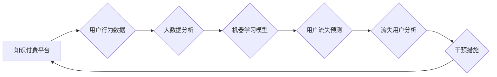

                 

## 知识经济下知识付费的大数据用户流失预测模型

> 关键词：知识付费、用户流失预测、大数据、机器学习、深度学习、模型评估、推荐系统

## 1. 背景介绍

知识经济时代，知识付费成为一种重要的商业模式，其核心是通过提供有价值的知识和技能，向用户收取费用。然而，知识付费平台面临着用户流失的严峻挑战。用户流失不仅会直接影响平台的收入，还会损害平台的品牌形象和用户口碑。因此，准确预测用户流失行为，并采取有效的措施降低流失率，对于知识付费平台的长期发展至关重要。

传统的用户流失预测方法主要依赖于用户行为数据和人口统计学特征，但这些方法往往难以捕捉用户行为的复杂性和动态性。随着大数据的兴起，知识付费平台拥有了海量用户行为数据，这为用户流失预测提供了新的机遇。

## 2. 核心概念与联系

### 2.1  知识付费平台用户流失

用户流失是指用户在使用知识付费平台后，不再继续付费或使用平台服务的现象。用户流失的原因复杂多样，包括：

* **内容质量问题:** 内容不符合用户预期，缺乏实用价值或创新性。
* **平台体验问题:** 平台界面设计不友好，功能使用体验差，支付流程复杂。
* **价格问题:** 价格过高，用户难以接受。
* **竞争问题:** 其他平台提供更优质的内容或服务，吸引了用户。
* **用户自身因素:** 用户学习目标改变，兴趣转移，或遇到其他生活问题。

### 2.2  大数据分析

大数据是指海量、高速度、高多样性的数据。大数据分析是指利用各种技术手段，对大数据进行收集、存储、处理、分析和挖掘，以发现隐藏的模式、趋势和知识。

### 2.3  机器学习

机器学习是人工智能领域的重要分支，它通过算法训练模型，使模型能够从数据中学习，并对新的数据进行预测或分类。机器学习算法可以用于用户流失预测，例如：

* **分类算法:** 将用户分为流失用户和非流失用户两类。
* **回归算法:** 预测用户流失的概率。

### 2.4  深度学习

深度学习是机器学习的子领域，它利用多层神经网络，能够学习更复杂的特征和模式。深度学习算法在用户流失预测方面具有更高的准确率。

**核心概念与联系流程图**



## 3. 核心算法原理 & 具体操作步骤

### 3.1  算法原理概述

用户流失预测模型通常基于机器学习算法，例如逻辑回归、支持向量机、决策树、随机森林、梯度提升树等。这些算法通过学习用户历史行为数据，识别出影响用户流失的特征，并建立预测模型。

### 3.2  算法步骤详解

1. **数据收集:** 收集用户行为数据，包括用户注册信息、学习记录、支付记录、评论反馈等。
2. **数据预处理:** 对收集到的数据进行清洗、转换、编码等预处理操作，以确保数据质量和算法训练的有效性。
3. **特征工程:** 从原始数据中提取特征，例如用户活跃度、学习时长、课程评价等，这些特征可以帮助模型更好地理解用户行为。
4. **模型选择:** 根据数据特点和预测目标，选择合适的机器学习算法。
5. **模型训练:** 使用训练数据训练模型，调整模型参数，使模型能够准确预测用户流失。
6. **模型评估:** 使用测试数据评估模型的性能，常用的评估指标包括准确率、召回率、F1-score等。
7. **模型部署:** 将训练好的模型部署到生产环境，用于实时预测用户流失。

### 3.3  算法优缺点

**优点:**

* **准确性高:** 机器学习算法能够学习复杂的用户行为模式，提高预测准确率。
* **可扩展性强:** 大数据分析平台可以处理海量用户数据，支持模型的规模化部署。
* **实时性强:** 模型可以实时预测用户流失，及时采取干预措施。

**缺点:**

* **数据依赖性强:** 模型的准确性依赖于数据质量和数量。
* **算法复杂性高:** 需要专业的技术人员进行模型开发和维护。
* **解释性弱:** 部分机器学习算法的决策过程难以解释，难以理解模型的预测结果。

### 3.4  算法应用领域

用户流失预测模型广泛应用于以下领域:

* **电商平台:** 预测用户购买意愿，提高转化率。
* **社交媒体平台:** 预测用户活跃度，降低用户流失率。
* **金融机构:** 预测用户风险，降低贷款风险。
* **教育机构:** 预测学生学习效果，提高教学质量。

## 4. 数学模型和公式 & 详细讲解 & 举例说明

### 4.1  数学模型构建

用户流失预测模型通常采用分类模型，例如逻辑回归模型。逻辑回归模型将用户流失预测问题转化为二分类问题，即用户是否流失。

### 4.2  公式推导过程

逻辑回归模型的输出是一个概率值，表示用户流失的可能性。该概率值由以下公式计算：

$$
P(y=1|x) = \frac{1}{1 + e^{-(w^T x + b)}}
$$

其中：

* $P(y=1|x)$ 是用户流失的概率。
* $x$ 是用户特征向量。
* $w$ 是模型参数向量。
* $b$ 是模型偏置项。
* $e$ 是自然对数的底数。

### 4.3  案例分析与讲解

假设我们有一个知识付费平台，收集了用户的学习时长、课程评价、支付记录等数据。我们可以将这些数据作为用户特征向量 $x$，训练一个逻辑回归模型，预测用户是否流失。

如果模型训练完成后，对于一个用户的特征向量 $x$，模型输出的概率值 $P(y=1|x)$ 为0.7，则表示该用户流失的可能性为70%。

## 5. 项目实践：代码实例和详细解释说明

### 5.1  开发环境搭建

* Python 3.x
* Jupyter Notebook
* pandas
* scikit-learn
* TensorFlow/PyTorch

### 5.2  源代码详细实现

```python
import pandas as pd
from sklearn.model_selection import train_test_split
from sklearn.linear_model import LogisticRegression
from sklearn.metrics import accuracy_score

# 加载数据
data = pd.read_csv('user_data.csv')

# 特征工程
# ...

# 将数据分为训练集和测试集
X_train, X_test, y_train, y_test = train_test_split(data.drop('churn', axis=1), data['churn'], test_size=0.2)

# 训练逻辑回归模型
model = LogisticRegression()
model.fit(X_train, y_train)

# 预测测试集结果
y_pred = model.predict(X_test)

# 评估模型性能
accuracy = accuracy_score(y_test, y_pred)
print(f'模型准确率: {accuracy}')
```

### 5.3  代码解读与分析

* 数据加载：使用 pandas 库加载用户数据。
* 特征工程：根据业务需求，提取用户特征，例如学习时长、课程评价等。
* 数据分割：将数据分为训练集和测试集，用于模型训练和评估。
* 模型训练：使用 scikit-learn 库的 LogisticRegression 类训练逻辑回归模型。
* 模型预测：使用训练好的模型预测测试集结果。
* 模型评估：使用 accuracy_score 函数计算模型的准确率。

### 5.4  运行结果展示

运行代码后，会输出模型的准确率。

## 6. 实际应用场景

### 6.1  用户画像分析

根据用户流失预测模型的输出结果，可以对用户进行画像分析，识别出不同类型的流失用户，例如：

* **内容不满意用户:** 对平台内容不感兴趣，学习效果不佳。
* **价格敏感用户:** 对平台价格不接受，选择更便宜的替代方案。
* **体验差用户:** 对平台界面设计、功能使用体验不满意。

### 6.2  个性化推荐

针对不同类型的流失用户，可以提供个性化的推荐服务，例如：

* **内容推荐:** 为内容不满意用户推荐更符合其兴趣和学习目标的课程。
* **价格优惠:** 为价格敏感用户提供优惠活动或定制化套餐。
* **体验优化:** 为体验差用户优化平台界面设计、功能使用体验。

### 6.3  流失预警

通过实时监控用户流失概率，可以及时预警潜在流失用户，并采取措施挽留用户。

### 6.4  未来应用展望

随着人工智能技术的不断发展，用户流失预测模型将更加智能化、精准化。未来，用户流失预测模型可以应用于以下领域:

* **用户行为预测:** 预测用户未来的学习行为，例如学习时长、课程选择等。
* **用户价值评估:** 评估用户的价值，为平台制定个性化服务策略。
* **营销策略优化:** 优化平台的营销策略，提高用户转化率和留存率。

## 7. 工具和资源推荐

### 7.1  学习资源推荐

* **书籍:**
    * 《机器学习》 - 周志华
    * 《深度学习》 - Ian Goodfellow
* **在线课程:**
    * Coursera: Machine Learning
    * edX: Deep Learning

### 7.2  开发工具推荐

* **Python:** 
    * pandas
    * scikit-learn
    * TensorFlow/PyTorch
* **数据可视化工具:**
    * matplotlib
    * seaborn

### 7.3  相关论文推荐

* 《Predicting Customer Churn with Machine Learning》
* 《Deep Learning for Customer Churn Prediction》

## 8. 总结：未来发展趋势与挑战

### 8.1  研究成果总结

本文介绍了知识经济下知识付费大数据用户流失预测模型的构建方法，包括数据收集、特征工程、模型选择、模型训练、模型评估等步骤。

### 8.2  未来发展趋势

* **模型精度提升:** 探索更先进的机器学习算法和深度学习模型，提高用户流失预测的准确率。
* **多源数据融合:** 将用户行为数据、平台运营数据、外部环境数据等多源数据融合，构建更全面的用户画像，提高预测精度。
* **个性化干预:** 基于用户画像和流失预测结果，提供个性化的干预措施，提高用户留存率。

### 8.3  面临的挑战

* **数据质量问题:** 用户数据往往存在缺失、噪声、不一致等问题，需要进行有效的数据清洗和处理。
* **模型解释性问题:** 部分机器学习算法的决策过程难以解释，难以理解模型的预测结果，需要探索更可解释的模型。
* **隐私保护问题:** 用户数据涉及个人隐私，需要采取有效的措施保护用户数据安全。

### 8.4  研究展望

未来，用户流失预测模型将朝着更智能化、精准化、个性化的方向发展，为知识付费平台提供更有效的用户运营策略，促进知识经济的健康发展。

## 9. 附录：常见问题与解答

**Q1: 如何选择合适的机器学习算法？**

A1: 选择合适的机器学习算法需要根据数据特点和预测目标。例如，如果数据量较大，特征维度较高，可以使用树模型或梯度提升树；如果数据量较小，特征维度较低，可以使用逻辑回归或支持向量机。

**Q2: 如何评估模型的性能？**

A2: 模型性能可以通过多种指标评估，例如准确率、召回率、F1-score等。选择合适的评估指标需要根据具体的业务需求。

**Q3: 如何处理用户数据中的缺失值？**

A3: 处理用户数据中的缺失值可以使用多种方法，例如删除缺失值、用均值或中位数填充缺失值、使用机器学习算法进行预测填充等。

**Q4: 如何保护用户数据隐私？**

A4: 保护用户数据隐私需要采取多种措施，例如数据脱敏、加密传输、安全存储等。


作者：禅与计算机程序设计艺术 / Zen and the Art of Computer Programming 
<end_of_turn>

