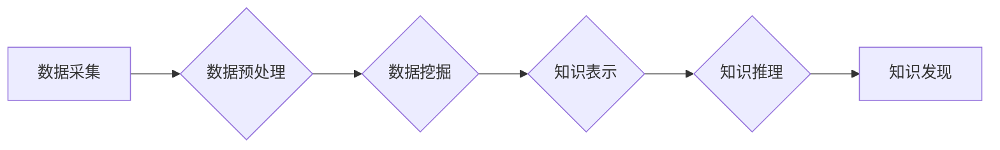

                 

## 程序员如何利用AI技术优化知识发现

> 关键词：人工智能、知识发现、机器学习、自然语言处理、深度学习、数据挖掘、程序员效率

## 1. 背景介绍

在当今科技飞速发展的时代，程序员面临着海量代码、文档和技术资料的挑战。如何高效地发现所需知识，提升学习效率和工作效率，成为程序员亟需解决的问题。传统搜索引擎虽然可以帮助程序员查找相关信息，但往往难以理解程序员的意图，并提供精准、有针对性的知识发现结果。

人工智能（AI）技术的兴起为程序员提供了新的机遇。AI算法能够学习和理解人类语言，并从海量数据中挖掘出隐藏的知识模式。通过利用AI技术，程序员可以更有效地发现所需知识，提升工作效率和学习能力。

## 2. 核心概念与联系

### 2.1 知识发现

知识发现是指从海量数据中挖掘出有价值、可解释的知识的过程。它涉及到数据预处理、数据挖掘、知识表示和知识推理等多个环节。

### 2.2 人工智能

人工智能是指模拟人类智能行为的计算机系统。它涵盖了多个领域，包括机器学习、深度学习、自然语言处理等。

### 2.3 AI技术在知识发现中的应用

AI技术可以应用于各个环节的知识发现过程中，例如：

* **数据预处理:** AI算法可以自动识别和处理数据中的噪声、缺失值和异常值，提高数据质量。
* **数据挖掘:** AI算法可以从数据中发现模式、趋势和关联关系，例如关联规则挖掘、聚类分析等。
* **知识表示:** AI算法可以将发现的知识表示成可理解和可操作的形式，例如知识图谱、概念网络等。
* **知识推理:** AI算法可以根据已有的知识进行推理和推导，发现新的知识或解决问题。

**Mermaid 流程图**



## 3. 核心算法原理 & 具体操作步骤

### 3.1 算法原理概述

在AI技术辅助知识发现中，常用的算法包括：

* **机器学习算法:** 

    * **监督学习:** 利用标记数据训练模型，预测未知数据。例如，分类算法（如支持向量机、决策树）和回归算法（如线性回归、逻辑回归）。
    * **无监督学习:** 从未标记数据中发现模式和结构。例如，聚类算法（如k-means聚类、层次聚类）和降维算法（如主成分分析、奇异值分解）。

* **深度学习算法:** 利用多层神经网络学习复杂数据特征。例如，卷积神经网络（CNN）、循环神经网络（RNN）和变分自编码器（VAE）。
* **自然语言处理算法:** 处理和理解自然语言文本。例如，词嵌入模型（如Word2Vec、GloVe）、文本分类算法和文本摘要算法。

### 3.2 算法步骤详解

以机器学习算法为例，其步骤如下：

1. **数据收集和预处理:** 收集相关数据，并进行清洗、转换和特征工程等预处理操作。
2. **模型选择:** 根据任务需求选择合适的机器学习算法模型。
3. **模型训练:** 利用训练数据训练模型，调整模型参数，使其能够准确预测未知数据。
4. **模型评估:** 利用测试数据评估模型的性能，例如准确率、召回率、F1-score等。
5. **模型部署:** 将训练好的模型部署到实际应用场景中，用于预测和分析新数据。

### 3.3 算法优缺点

**机器学习算法:**

* **优点:** 能够学习复杂数据模式，具有较高的预测精度。
* **缺点:** 需要大量标记数据进行训练，训练过程耗时较长。

**深度学习算法:**

* **优点:** 能够学习更深层次的数据特征，具有更强的表达能力。
* **缺点:** 需要更强大的计算资源，训练过程更加复杂。

**自然语言处理算法:**

* **优点:** 能够理解和处理自然语言文本，为知识发现提供更丰富的语义信息。
* **缺点:** 自然语言理解仍然是一个复杂问题，算法性能还有待提升。

### 3.4 算法应用领域

AI技术在知识发现领域的应用非常广泛，例如：

* **代码理解和分析:** 利用自然语言处理和机器学习算法，理解代码结构、功能和语义，帮助程序员进行代码阅读、维护和重构。
* **代码生成和推荐:** 利用机器学习算法，根据程序员的意图和代码上下文，生成代码片段或推荐相关代码库。
* **问题解答和故障诊断:** 利用知识图谱和机器学习算法，构建知识库，并根据程序员的问题，提供精准的答案或故障诊断建议。
* **技术文档自动生成:** 利用自然语言处理和机器学习算法，自动生成技术文档，例如API文档、用户手册等。

## 4. 数学模型和公式 & 详细讲解 & 举例说明

### 4.1 数学模型构建

在知识发现过程中，常用的数学模型包括：

* **概率模型:** 用于描述数据之间的概率关系，例如贝叶斯网络、隐马尔可夫模型等。
* **图模型:** 用于表示数据之间的结构关系，例如知识图谱、概念网络等。
* **统计模型:** 用于描述数据的统计特征，例如均值、方差、协方差等。

### 4.2 公式推导过程

以贝叶斯网络为例，其核心公式为：

$$P(A|B) = \frac{P(B|A)P(A)}{P(B)}$$

其中：

* $P(A|B)$ 表示在已知事件B发生的情况下，事件A发生的概率。
* $P(B|A)$ 表示在已知事件A发生的情况下，事件B发生的概率。
* $P(A)$ 表示事件A发生的概率。
* $P(B)$ 表示事件B发生的概率。

### 4.3 案例分析与讲解

假设我们有一个关于疾病诊断的贝叶斯网络，其中包含以下节点：

* $S$: 患者患有疾病的概率。
* $C$: 患者出现症状的概率。
* $T$: 患者进行测试的概率。
* $R$: 测试结果为阳性的概率。

根据贝叶斯网络的结构和已知的概率，我们可以计算出患者出现症状的情况下，患有疾病的概率：

$$P(S|C) = \frac{P(C|S)P(S)}{P(C)}$$

其中：

* $P(C|S)$ 表示患者患有疾病的情况下，出现症状的概率。
* $P(S)$ 表示患者患有疾病的概率。
* $P(C)$ 表示患者出现症状的概率。

通过计算上述公式，我们可以得到患者出现症状的情况下，患有疾病的概率。

## 5. 项目实践：代码实例和详细解释说明

### 5.1 开发环境搭建

* **操作系统:** Ubuntu 20.04 LTS
* **编程语言:** Python 3.8
* **深度学习框架:** TensorFlow 2.0
* **数据处理库:** Pandas, NumPy
* **自然语言处理库:** NLTK, SpaCy

### 5.2 源代码详细实现

```python
import pandas as pd
from sklearn.feature_extraction.text import TfidfVectorizer
from sklearn.metrics.pairwise import cosine_similarity

# 加载数据
data = pd.read_csv('code_data.csv')

# 数据预处理
def preprocess_text(text):
    # 这里可以进行文本清洗、分词、词干提取等预处理操作
    return text

data['code'] = data['code'].apply(preprocess_text)

# 创建TF-IDF向量化器
vectorizer = TfidfVectorizer()

# 将代码转换为TF-IDF向量
code_vectors = vectorizer.fit_transform(data['code'])

# 计算代码之间的余弦相似度
similarity_matrix = cosine_similarity(code_vectors)

# 查找与给定代码最相似的代码片段
def find_similar_code(query_code):
    query_vector = vectorizer.transform([preprocess_text(query_code)])
    similarities = cosine_similarity(query_vector, code_vectors)
    similar_indices = similarities.argsort()[0][::-1]
    return similar_indices

# 示例使用
query_code = "def sum(a, b):\n return a + b"
similar_indices = find_similar_code(query_code)
similar_code_snippets = data['code'].iloc[similar_indices]
print(similar_code_snippets)
```

### 5.3 代码解读与分析

* 代码首先加载数据，并进行文本预处理。
* 然后，使用TF-IDF向量化器将代码转换为向量表示。
* 计算代码之间的余弦相似度，构建相似度矩阵。
* `find_similar_code`函数用于查找与给定代码最相似的代码片段。
* 示例代码演示了如何使用该函数查找与给定代码最相似的代码片段。

### 5.4 运行结果展示

运行代码后，将输出与给定代码最相似的代码片段。

## 6. 实际应用场景

### 6.1 代码搜索和推荐

AI技术可以帮助程序员更快速、更精准地搜索和发现所需代码片段。例如，GitHub Copilot 是一款基于AI的代码助手，可以根据程序员的代码上下文，推荐相关的代码片段。

### 6.2 代码理解和文档生成

AI技术可以帮助程序员理解复杂的代码结构和功能，并自动生成技术文档。例如，DeepCode 是一款基于AI的代码分析工具，可以识别代码中的潜在错误和安全漏洞。

### 6.3 代码重构和优化

AI技术可以帮助程序员进行代码重构和优化，提高代码质量和可维护性。例如，DeepCode 可以建议程序员进行代码重构，使其更简洁、更易读。

### 6.4 未来应用展望

随着AI技术的不断发展，其在程序员知识发现领域的应用将更加广泛和深入。例如：

* **个性化学习推荐:** 根据程序员的学习进度和兴趣，推荐个性化的学习资源和代码示例。
* **代码自动生成:** 基于自然语言描述，自动生成完整的代码程序。
* **跨语言代码理解:** 能够理解不同编程语言的代码，实现跨语言代码搜索和转换。

## 7. 工具和资源推荐

### 7.1 学习资源推荐

* **在线课程:** Coursera, edX, Udacity 等平台提供人工智能、机器学习和深度学习相关的在线课程。
* **书籍:** 《深度学习》、《机器学习实战》、《自然语言处理》等书籍。
* **博客和论坛:** Kaggle, Towards Data Science 等平台提供丰富的AI技术相关博客和论坛。

### 7.2 开发工具推荐

* **深度学习框架:** TensorFlow, PyTorch, Keras 等。
* **数据处理库:** Pandas, NumPy 等。
* **自然语言处理库:** NLTK, SpaCy, Gensim 等。

### 7.3 相关论文推荐

* **Attention Is All You Need:** https://arxiv.org/abs/1706.03762
* **BERT: Pre-training of Deep Bidirectional Transformers for Language Understanding:** https://arxiv.org/abs/1810.04805
* **Graph Convolutional Networks for Text Classification:** https://arxiv.org/abs/1706.01806

## 8. 总结：未来发展趋势与挑战

### 8.1 研究成果总结

AI技术在程序员知识发现领域的应用取得了显著成果，例如代码搜索、代码理解、代码生成等。

### 8.2 未来发展趋势

* **更强大的AI模型:** 随着深度学习技术的不断发展，将出现更强大的AI模型，能够更好地理解和处理代码。
* **更个性化的学习体验:** AI技术将帮助程序员个性化学习，推荐更适合自己的学习资源和代码示例。
* **代码自动生成:** AI技术将能够自动生成更复杂的代码程序，减轻程序员的工作负担。

### 8.3 面临的挑战

* **数据质量:** AI模型的性能依赖于高质量的数据，而代码数据往往存在噪声、不完整等问题。
* **解释性:** 许多AI模型的决策过程难以解释，这使得程序员难以理解模型的 reasoning。
* **安全性和隐私性:** AI模型可能会泄露程序员的代码和个人信息，需要加强安全性和隐私保护。

### 8.4 研究展望

未来，AI技术在程序员知识发现领域的应用将更加广泛和深入，需要进一步研究以下问题：

* 如何提高代码数据的质量和可解释性。
* 如何设计更安全、更可靠的AI模型。
* 如何将AI技术与其他技术融合，例如虚拟现实、增强现实等，创造更沉浸式的学习体验。

## 9. 附录：常见问题与解答

**Q1: 如何选择合适的AI算法？**

**A1:** 选择合适的AI算法需要根据具体任务需求和数据特点进行选择。例如，对于代码分类任务，可以使用支持向量机或决策树算法；对于代码相似度计算，可以使用TF-IDF向量化和余弦相似度算法。

**Q2: 如何评估AI模型的性能？**

**A2:** AI模型的性能可以通过多种指标进行评估，例如准确率、召回率、F1-score、AUC等。选择合适的评估指标需要根据具体任务需求进行选择。

**Q3: 如何解决代码数据质量问题？**

**A3:** 可以通过以下方法解决代码数据质量问题：

* 数据清洗：去除代码中的噪声、重复数据等。
* 数据增强：通过代码重构、代码翻译等方法生成新的代码数据。
* 数据标注：人工标注代码数据，提高数据质量。


作者：禅与计算机程序设计艺术 / Zen and the Art of Computer Programming<end_of_turn>

