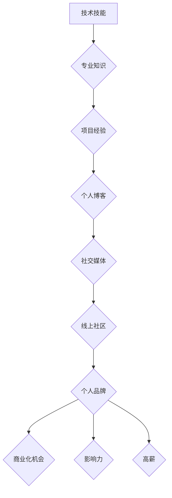

                 

## 程序员如何打造千万美元身价的个人品牌

> 关键词：个人品牌，程序员，价值创造，影响力，商业化

> 摘要：本文探讨了程序员如何通过打造个人品牌，积累影响力，最终实现商业化，从而获得千万美元身价的路径。从核心概念、算法原理、项目实践到实际应用场景，我们将深入分析打造个人品牌的步骤和方法，并提供工具和资源推荐，帮助程序员实现个人价值最大化。

## 1. 背景介绍

在当今科技飞速发展的时代，程序员作为数字时代的基石，拥有着前所未有的机遇和挑战。随着互联网和人工智能的蓬勃发展，程序员的需求量持续增长，但竞争也日益激烈。单纯依靠技术技能已经不足以获得成功，打造个人品牌成为程序员脱颖而出、获得高薪、实现财务自由的关键。

个人品牌，简单来说就是你独特的价值观、技能、经验和影响力在公众眼中的综合体现。对于程序员来说，个人品牌代表着你的专业能力、技术专长、项目经验和个人魅力。一个强大的个人品牌可以帮助你：

* **提升个人价值:**  个人品牌可以让你在竞争激烈的市场中脱颖而出，获得更高的薪资和职业发展机会。
* **拓展人脉资源:**  个人品牌可以帮助你建立广泛的人脉关系，与行业内其他专业人士建立联系，获得合作机会和资源支持。
* **获得商业化机会:**  个人品牌可以成为你创业的基石，帮助你开发自己的产品或服务，并将其商业化。
* **建立个人影响力:**  个人品牌可以让你成为行业内的 thought leader，分享你的知识和经验，影响其他程序员和行业发展。

## 2. 核心概念与联系

打造个人品牌是一个系统工程，需要从多个方面进行规划和执行。以下是一个简单的流程图，展示了打造个人品牌的核心概念和联系：



**核心概念解释:**

* **技术技能:**  这是程序员的基石，需要不断学习和提升，才能在竞争激烈的市场中保持优势。
* **专业知识:**  除了技术技能，还需要掌握相关的专业知识，例如软件架构、设计模式、算法分析等，才能成为真正的专家。
* **项目经验:**  参与实际项目开发，积累经验，并展示你的能力，是提升个人品牌的有效途径。
* **个人博客:**  通过博客分享你的技术文章、项目经验和个人见解，建立你的专业形象，并吸引潜在读者和雇主。
* **社交媒体:**  利用社交媒体平台，与其他程序员和行业人士互动，建立人脉关系，并推广你的个人品牌。
* **线上社区:**  积极参与线上社区，例如 Stack Overflow、GitHub 等，分享你的知识和经验，并解答其他人的问题，提升你的知名度和影响力。
* **个人品牌:**  所有这些努力最终都会汇聚成你的个人品牌，它代表着你独特的价值观、技能、经验和影响力。
* **商业化机会:**  一个强大的个人品牌可以为你带来商业化机会，例如咨询、培训、开源项目赞助等。
* **影响力:**  个人品牌可以让你成为行业内的 thought leader，影响其他程序员和行业发展。
* **高薪:**  一个强大的个人品牌可以让你获得更高的薪资和职业发展机会。

## 3. 核心算法原理 & 具体操作步骤

打造个人品牌并非一蹴而就，需要遵循一定的算法原理和操作步骤，才能取得成功。

### 3.1  算法原理概述

打造个人品牌的算法原理可以概括为以下几个方面：

* **价值创造:**  你需要提供有价值的内容和服务，例如技术文章、项目经验、培训课程等，才能吸引和留住你的受众。
* **影响力积累:**  你需要通过社交媒体、线上社区等平台，与其他程序员和行业人士互动，建立人脉关系，并分享你的知识和经验，才能提升你的影响力。
* **商业化策略:**  你需要制定合理的商业化策略，例如咨询、培训、开源项目赞助等，才能将你的个人品牌转化为经济效益。
* **持续迭代:**  打造个人品牌是一个持续迭代的过程，你需要不断学习、提升和调整你的策略，才能保持竞争力。

### 3.2  算法步骤详解

以下是打造个人品牌的具体操作步骤：

1. **明确目标:**  首先，你需要明确你的个人品牌目标是什么，你想通过打造个人品牌实现什么？是获得更高的薪资、创业成功还是成为行业内的 thought leader？
2. **定位你的优势:**  分析你的技术技能、专业知识、项目经验等，确定你的优势和独特卖点，并将其融入你的个人品牌定位。
3. **打造个人网站和博客:**  建立一个专业的个人网站和博客，分享你的技术文章、项目经验和个人见解，并将其推广到社交媒体平台。
4. **活跃在社交媒体:**  选择适合你的社交媒体平台，例如 Twitter、LinkedIn、GitHub 等，积极参与行业讨论，分享你的知识和经验，并与其他程序员和行业人士建立联系。
5. **参与线上社区:**  积极参与线上社区，例如 Stack Overflow、GitHub 等，解答其他人的问题，分享你的知识和经验，并建立你的专业形象。
6. **建立人脉关系:**  参加行业会议、研讨会等活动，与其他程序员和行业人士建立人脉关系，并拓展你的商业机会。
7. **持续学习和提升:**  科技发展日新月异，你需要不断学习和提升你的技术技能和专业知识，才能保持竞争力。
8. **制定商业化策略:**  根据你的个人品牌目标和优势，制定合理的商业化策略，例如咨询、培训、开源项目赞助等。

### 3.3  算法优缺点

**优点:**

* **可量化:**  通过数据分析，可以量化你的个人品牌影响力和商业价值。
* **可持续:**  个人品牌是一个长期积累的过程，可以为你带来持续的收益。
* **可扩展:**  个人品牌可以帮助你拓展人脉资源、商业机会和影响力。

**缺点:**

* **需要时间和精力:**  打造个人品牌需要投入大量的时间和精力，需要坚持不懈的努力。
* **竞争激烈:**  互联网时代，个人品牌竞争日益激烈，需要不断提升自己的价值和影响力。
* **风险不可控:**  个人品牌受到网络舆论和市场变化的影响，存在一定的风险。

### 3.4  算法应用领域

打造个人品牌适用于所有程序员，无论你是自由职业者、企业员工还是创业者。

## 4. 数学模型和公式 & 详细讲解 & 举例说明

打造个人品牌的成功可以看作是一个数学模型，其中涉及到多个变量和公式。

### 4.1  数学模型构建

我们可以将个人品牌价值 (PV) 定义为以下公式：

$$PV = f(TS, PK, PE, IM, CO)$$

其中：

* **TS:** 技术技能 (Technical Skills)
* **PK:** 专业知识 (Professional Knowledge)
* **PE:** 项目经验 (Project Experience)
* **IM:** 个人影响力 (Personal Influence)
* **CO:** 商业化机会 (Commercial Opportunities)

每个变量都对个人品牌价值有不同的贡献，并且相互影响。

### 4.2  公式推导过程

* **技术技能 (TS):**  技术技能是个人品牌的基石，它决定了你能解决哪些问题，并为哪些领域提供价值。
* **专业知识 (PK):**  专业知识可以帮助你更深入地理解技术，并将其应用到实际项目中。
* **项目经验 (PE):**  项目经验可以证明你的能力，并让你积累宝贵的实战经验。
* **个人影响力 (IM):**  个人影响力可以帮助你吸引更多关注，并建立更广泛的人脉关系。
* **商业化机会 (CO):**  商业化机会可以将你的个人品牌转化为经济效益。

### 4.3  案例分析与讲解

例如，一位拥有丰富经验的软件架构师，拥有扎实的技术技能和专业知识，并参与过多个大型项目的开发，他的个人品牌价值会很高。他可以利用自己的影响力，撰写技术文章、举办培训课程，并获得商业化机会，例如咨询、开源项目赞助等。

## 5. 项目实践：代码实例和详细解释说明

以下是一个简单的代码实例，展示了如何使用 Python 构建一个简单的个人博客网站：

### 5.1  开发环境搭建

你需要安装 Python 和 Flask 框架。

```bash
pip install flask
```

### 5.2  源代码详细实现

```python
from flask import Flask, render_template

app = Flask(__name__)

@app.route('/')
def index():
    return render_template('index.html')

if __name__ == '__main__':
    app.run(debug=True)
```

### 5.3  代码解读与分析

* `from flask import Flask, render_template`:  导入 Flask 框架和模板渲染功能。
* `app = Flask(__name__)`:  创建 Flask 应用实例。
* `@app.route('/')`:  定义路由规则，当访问根路径 '/' 时，执行 `index()` 函数。
* `def index()`:  定义首页函数，返回 `index.html` 模板。
* `if __name__ == '__main__':`:  启动 Flask 应用。

### 5.4  运行结果展示

运行代码后，访问 `http://127.0.0.1:5000/`，即可看到你的个人博客首页。

## 6. 实际应用场景

个人品牌可以应用于各种场景，例如：

* **求职:**  一个强大的个人品牌可以帮助你脱颖而出，获得更好的求职机会。
* **创业:**  个人品牌可以成为你创业的基石，帮助你吸引投资和用户。
* **自由职业:**  个人品牌可以帮助你建立客户信任，获得更多项目机会。
* **行业影响力:**  个人品牌可以让你成为行业内的 thought leader，影响其他程序员和行业发展。

### 6.4  未来应用展望

随着人工智能和虚拟现实等技术的不断发展，个人品牌将更加重要，并呈现出以下趋势：

* **个性化定制:**  个人品牌将更加个性化，能够满足不同用户的需求。
* **沉浸式体验:**  虚拟现实和增强现实技术将为个人品牌提供更沉浸式的体验。
* **数据驱动:**  数据分析将帮助程序员更好地了解自己的个人品牌价值，并制定更有效的策略。

## 7. 工具和资源推荐

### 7.1  学习资源推荐

* **书籍:**  《程序员如何打造千万美元身价的个人品牌》
* **博客:**  Hacker News, Medium, Dev.to
* **在线课程:**  Coursera, Udemy, edX

### 7.2  开发工具推荐

* **代码编辑器:**  VS Code, Sublime Text, Atom
* **版本控制系统:**  Git, GitHub
* **项目管理工具:**  Trello, Asana, Jira

### 7.3  相关论文推荐

* **The Impact of Personal Branding on Career Success**
* **Building a Strong Personal Brand in the Digital Age**

## 8. 总结：未来发展趋势与挑战

### 8.1  研究成果总结

打造个人品牌是一个系统工程，需要程序员从多个方面进行规划和执行，才能取得成功。

### 8.2  未来发展趋势

未来，个人品牌将更加个性化、沉浸式和数据驱动。

### 8.3  面临的挑战

程序员需要不断学习和提升，才能保持竞争力。

### 8.4  研究展望

未来研究将更加关注个人品牌在人工智能和虚拟现实等新技术下的应用。

## 9. 附录：常见问题与解答

* **如何建立个人网站和博客？**

可以使用 WordPress、Ghost 等平台搭建个人网站和博客。

* **如何提高个人影响力？**

积极参与社交媒体和线上社区，分享你的知识和经验，并与其他程序员和行业人士建立联系。

* **如何将个人品牌转化为商业化机会？**

可以提供咨询、培训、开源项目赞助等服务。


作者：禅与计算机程序设计艺术 / Zen and the Art of Computer Programming 
<end_of_turn>

