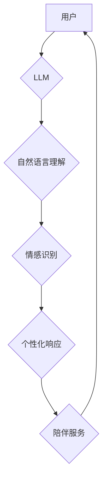

                 

## 老年护理陪伴：LLM 改善老年人生活

> 关键词：LLM, 老年护理, 人工智能, 陪伴机器人, 自然语言处理, 认知衰退

> 摘要：随着全球人口老龄化趋势加剧，老年护理问题日益突出。本文探讨了大型语言模型（LLM）在老年护理陪伴领域的应用潜力，分析了其核心概念、算法原理、数学模型以及实际应用场景。通过代码实例和案例分析，阐述了LLM如何通过自然语言理解和生成技术，为老年人提供个性化陪伴、情感支持、认知训练和生活辅助等服务，最终提升老年人的生活质量。

## 1. 背景介绍

1.1 全球老龄化趋势

全球人口老龄化是一个不可逆转的趋势。根据联合国数据，到2050年，全球65岁及以上人口将达到16% ，其中许多老年人面临着孤独、健康问题和生活不便等挑战。

1.2 老年护理需求与挑战

传统的老年护理模式主要依靠人力，存在着人力成本高、服务质量参差不齐、难以满足个性化需求等问题。随着科技发展，人工智能（AI）技术逐渐被应用于老年护理领域，为解决这些挑战提供了新的思路。

1.3 LLM 在老年护理中的应用前景

大型语言模型（LLM）作为人工智能领域的一项重要突破，拥有强大的自然语言理解和生成能力，在老年护理领域具有广阔的应用前景。LLM可以理解和响应老年人的语言需求，提供个性化陪伴、情感支持、认知训练和生活辅助等服务，有效缓解老年人的孤独感和生活压力，提升他们的生活质量。

## 2. 核心概念与联系

2.1 LLM 简介

大型语言模型（LLM）是一种基于深度学习的强大人工智能模型，通过训练海量文本数据，学习语言的结构、语法和语义，能够理解和生成人类语言。

2.2 自然语言处理（NLP）

自然语言处理（NLP）是人工智能领域的一个重要分支，致力于使计算机能够理解、处理和生成人类语言。LLM是NLP领域的重要应用，其强大的语言理解和生成能力为老年护理提供了新的解决方案。

2.3 陪伴机器人

陪伴机器人是一种能够与人类进行互动和交流的机器人，通常配备了语音识别、自然语言处理和情感识别等功能。LLM可以作为陪伴机器人的核心技术，赋予其更智能、更人性化的交互能力。

**Mermaid 流程图**



## 3. 核心算法原理 & 具体操作步骤

3.1 算法原理概述

LLM的核心算法原理是基于Transformer网络结构，通过自注意力机制学习语言的上下文关系，实现更精准的语言理解和生成。

3.2 算法步骤详解

1. **数据预处理:** 收集和清洗海量文本数据，将其转换为模型可理解的格式。
2. **模型训练:** 使用Transformer网络结构和自注意力机制，训练LLM模型，使其能够理解和生成人类语言。
3. **模型评估:** 使用测试数据集评估模型的性能，例如准确率、流畅度和语义理解能力。
4. **模型部署:** 将训练好的LLM模型部署到实际应用场景中，例如陪伴机器人或智能客服系统。

3.3 算法优缺点

**优点:**

* 强大的语言理解和生成能力
* 可以处理复杂的任务，例如对话、翻译和文本摘要
* 可以个性化服务，根据用户的需求提供定制化的响应

**缺点:**

* 训练成本高，需要大量的计算资源和数据
* 模型参数量大，部署成本较高
* 存在潜在的偏见和误导性问题

3.4 算法应用领域

LLM在多个领域都有广泛的应用，例如：

* 自然语言理解和生成
* 机器翻译
* 文本摘要和问答
* 聊天机器人和虚拟助手
* 代码生成和软件开发

## 4. 数学模型和公式 & 详细讲解 & 举例说明

4.1 数学模型构建

LLM的核心数学模型是Transformer网络，其结构由多个编码器和解码器层组成。每个层包含多个自注意力机制和前馈神经网络。

4.2 公式推导过程

Transformer网络的注意力机制使用以下公式计算每个词的权重：

$$
Attention(Q, K, V) = softmax(\frac{QK^T}{\sqrt{d_k}})V
$$

其中：

* Q：查询矩阵
* K：键矩阵
* V：值矩阵
* $d_k$：键向量的维度

4.3 案例分析与讲解

例如，在翻译句子“The cat sat on the mat”时，LLM会首先将句子编码成向量表示，然后使用注意力机制计算每个词的权重，最终生成翻译后的句子“Le chat s'est assis sur le tapis”。

## 5. 项目实践：代码实例和详细解释说明

5.1 开发环境搭建

可以使用Python语言和深度学习框架TensorFlow或PyTorch搭建LLM开发环境。

5.2 源代码详细实现

以下是一个简单的LLM代码示例，使用PyTorch框架实现一个基本的文本生成模型：

```python
import torch
import torch.nn as nn

class TextGenerator(nn.Module):
    def __init__(self, vocab_size, embedding_dim, hidden_dim):
        super(TextGenerator, self).__init__()
        self.embedding = nn.Embedding(vocab_size, embedding_dim)
        self.lstm = nn.LSTM(embedding_dim, hidden_dim)
        self.fc = nn.Linear(hidden_dim, vocab_size)

    def forward(self, x):
        embedded = self.embedding(x)
        output, (hidden, cell) = self.lstm(embedded)
        output = self.fc(output[:, -1, :])
        return output

# 实例化模型
model = TextGenerator(vocab_size=10000, embedding_dim=128, hidden_dim=256)

# 定义损失函数和优化器
criterion = nn.CrossEntropyLoss()
optimizer = torch.optim.Adam(model.parameters())

# 训练模型
# ...

```

5.3 代码解读与分析

该代码实现了一个简单的文本生成模型，其结构包括嵌入层、LSTM层和全连接层。嵌入层将单词转换为向量表示，LSTM层捕捉文本的上下文关系，全连接层将LSTM输出映射到单词的概率分布。

5.4 运行结果展示

训练完成后，模型可以根据输入的文本序列生成新的文本序列。

## 6. 实际应用场景

6.1 个性化陪伴

LLM可以根据老年人的兴趣爱好、生活习惯和情感状态，提供个性化的陪伴服务，例如聊天、故事讲述、音乐播放和游戏互动。

6.2 情感支持

LLM可以识别老年人的情绪变化，并提供相应的安慰和支持，例如鼓励、倾听和建议。

6.3 认知训练

LLM可以进行语言游戏、谜语和问答等认知训练，帮助老年人保持大脑活跃，延缓认知衰退。

6.4 生活辅助

LLM可以帮助老年人完成一些生活任务，例如设置闹钟、查询天气预报、预约医生和购物。

6.5 未来应用展望

未来，LLM在老年护理领域的应用将更加广泛和深入，例如：

* 更智能的陪伴机器人，能够更好地理解和响应老年人的需求。
* 更个性化的健康管理服务，能够根据老年人的健康状况提供定制化的建议和提醒。
* 更便捷的远程医疗服务，能够帮助老年人远程咨询医生和获取医疗信息。

## 7. 工具和资源推荐

7.1 学习资源推荐

* **书籍:**
    * 《深度学习》
    * 《自然语言处理》
* **在线课程:**
    * Coursera: 自然语言处理
    * edX: 深度学习

7.2 开发工具推荐

* **Python:** 
* **TensorFlow:** 
* **PyTorch:** 

7.3 相关论文推荐

* **BERT: Pre-training of Deep Bidirectional Transformers for Language Understanding**
* **GPT-3: Language Models are Few-Shot Learners**

## 8. 总结：未来发展趋势与挑战

8.1 研究成果总结

LLM在老年护理领域的应用取得了显著进展，能够为老年人提供个性化陪伴、情感支持、认知训练和生活辅助等服务，有效提升老年人的生活质量。

8.2 未来发展趋势

未来，LLM在老年护理领域的应用将更加智能、个性化和深入，例如：

* 更强大的语言理解和生成能力
* 更精准的情感识别和分析
* 更个性化的服务定制
* 更广泛的应用场景

8.3 面临的挑战

LLM在老年护理领域的应用也面临着一些挑战，例如：

* 数据安全和隐私保护
* 模型偏见和误导性问题
* 伦理和社会影响

8.4 研究展望

未来研究方向包括：

* 开发更安全、更可靠的LLM模型
* 探索LLM在老年护理领域的更多应用场景
* 研究LLM的伦理和社会影响

## 9. 附录：常见问题与解答

9.1 如何确保LLM模型的安全性和可靠性？

9.2 如何解决LLM模型的偏见和误导性问题？

9.3 如何保护老年人的数据安全和隐私？


作者：禅与计算机程序设计艺术 / Zen and the Art of Computer Programming 
<end_of_turn>

