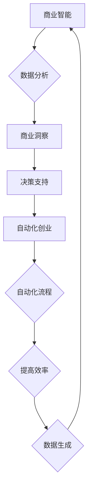

                 

## 自动化创业中的商业智能应用

> 关键词：商业智能、自动化、机器学习、数据分析、创业、决策支持、预测建模、人工智能

## 1. 背景介绍

在当今数据爆炸的时代，商业智能（Business Intelligence，BI）已成为企业决策的核心驱动力。BI通过收集、分析和可视化数据，帮助企业洞察市场趋势、识别商业机会、优化运营效率，最终实现可持续发展。对于创业公司来说，BI的应用尤为重要，因为它可以帮助他们以有限的资源实现最大化的效益，在激烈的市场竞争中立于不败之地。

传统BI系统通常依赖于人工干预和经验判断，而自动化创业则强调利用技术手段实现高效、智能的决策支持。随着人工智能（AI）和机器学习（ML）技术的快速发展，自动化创业中的商业智能应用呈现出前所未有的机遇和挑战。

## 2. 核心概念与联系

### 2.1 商业智能（BI）

商业智能是指利用数据分析技术，从海量数据中提取有价值的信息，并将其转化为可操作的商业洞察，从而支持企业决策和战略制定。BI系统通常包括数据收集、数据清洗、数据分析、数据可视化和数据报告等环节。

### 2.2 自动化创业

自动化创业是指利用自动化技术，构建高效、智能的创业模式，以降低运营成本、提高效率和竞争力。自动化创业涵盖了多个领域，例如自动化营销、自动化运营、自动化客服等。

### 2.3 商业智能与自动化创业的联系

商业智能和自动化创业相互促进，共同推动企业发展。自动化创业通过技术手段提高运营效率，产生更多数据，为商业智能分析提供基础。而商业智能则通过数据分析，为自动化创业提供决策支持，优化自动化流程，提升自动化效果。

**核心概念与联系流程图**



## 3. 核心算法原理 & 具体操作步骤

### 3.1 算法原理概述

在自动化创业中的商业智能应用中，常用的算法包括机器学习、深度学习、自然语言处理等。这些算法通过学习数据中的模式和规律，实现对数据的预测、分类、聚类等分析，从而为企业决策提供支持。

### 3.2 算法步骤详解

以机器学习为例，其核心步骤包括：

1. **数据收集和预处理:** 收集相关数据，并进行清洗、转换、归一化等预处理操作，以确保数据质量和算法的有效性。
2. **特征工程:** 从原始数据中提取有价值的特征，这些特征将作为算法的输入，影响算法的学习效果。
3. **模型选择:** 根据具体任务选择合适的机器学习模型，例如线性回归、逻辑回归、决策树、支持向量机等。
4. **模型训练:** 使用训练数据训练选定的模型，调整模型参数，使其能够准确地预测或分类数据。
5. **模型评估:** 使用测试数据评估模型的性能，例如准确率、召回率、F1-score等指标。
6. **模型部署:** 将训练好的模型部署到生产环境中，用于对实时数据进行预测或分类。

### 3.3 算法优缺点

**机器学习算法**

* **优点:** 能够从数据中学习复杂模式，实现对数据的精准预测和分类。
* **缺点:** 需要大量的训练数据，训练过程耗时，对数据质量要求高。

**深度学习算法**

* **优点:** 能够处理更复杂的数据，例如图像、文本等，具有更强的学习能力。
* **缺点:** 需要更强大的计算资源，训练过程更加耗时，对数据标注要求更高。

### 3.4 算法应用领域

* **客户关系管理 (CRM):** 通过分析客户数据，预测客户行为，提供个性化服务。
* **市场营销:** 分析市场趋势，识别潜在客户，优化营销策略。
* **运营管理:** 分析运营数据，优化流程，提高效率。
* **风险管理:** 分析风险数据，识别潜在风险，制定风险控制策略。

## 4. 数学模型和公式 & 详细讲解 & 举例说明

### 4.1 数学模型构建

在商业智能应用中，常用的数学模型包括线性回归模型、逻辑回归模型、决策树模型等。这些模型通过数学公式来描述数据之间的关系，并进行预测或分类。

**线性回归模型**

线性回归模型假设数据之间存在线性关系，可以用以下公式表示：

$$y = mx + c$$

其中：

* $y$ 是预测值
* $x$ 是输入特征
* $m$ 是回归系数
* $c$ 是截距

**逻辑回归模型**

逻辑回归模型用于二分类问题，其输出值是一个概率，表示数据属于某一类别的可能性。其数学公式如下：

$$P(y=1|x) = \frac{1}{1 + e^{-(mx + c)}}$$

其中：

* $P(y=1|x)$ 是数据属于类别1的概率
* $x$ 是输入特征
* $m$ 是回归系数
* $c$ 是截距

### 4.2 公式推导过程

线性回归模型的回归系数 $m$ 和截距 $c$ 可以通过最小二乘法来求解。最小二乘法旨在找到一条直线，使得直线到所有数据点的距离之和最小。

逻辑回归模型的回归系数 $m$ 和截距 $c$ 可以通过最大似然估计法来求解。最大似然估计法旨在找到一组参数，使得模型生成的样本分布与实际样本分布最接近。

### 4.3 案例分析与讲解

**案例：预测客户流失**

假设一家公司想要预测客户流失，可以使用逻辑回归模型。

* **输入特征:** 客户的年龄、购买频率、消费金额等。
* **输出变量:** 是否流失（0表示未流失，1表示流失）。

通过训练逻辑回归模型，可以得到一个预测模型，用于预测新客户是否会流失。

## 5. 项目实践：代码实例和详细解释说明

### 5.1 开发环境搭建

* Python 3.x
* Jupyter Notebook
* scikit-learn 机器学习库
* pandas 数据处理库
* matplotlib 数据可视化库

### 5.2 源代码详细实现

```python
import pandas as pd
from sklearn.model_selection import train_test_split
from sklearn.linear_model import LogisticRegression
from sklearn.metrics import accuracy_score

# 加载数据
data = pd.read_csv('customer_data.csv')

# 选择特征和目标变量
features = ['age', 'purchase_frequency', 'spending_amount']
target = 'churn'

# 将数据划分为训练集和测试集
X_train, X_test, y_train, y_test = train_test_split(data[features], data[target], test_size=0.2, random_state=42)

# 创建逻辑回归模型
model = LogisticRegression()

# 训练模型
model.fit(X_train, y_train)

# 对测试集进行预测
y_pred = model.predict(X_test)

# 计算模型准确率
accuracy = accuracy_score(y_test, y_pred)
print(f'模型准确率: {accuracy}')
```

### 5.3 代码解读与分析

* 首先，加载数据并选择特征和目标变量。
* 然后，将数据划分为训练集和测试集，用于训练和评估模型。
* 创建逻辑回归模型，并使用训练集进行训练。
* 训练完成后，使用测试集进行预测，并计算模型的准确率。

### 5.4 运行结果展示

运行上述代码后，会输出模型的准确率。

## 6. 实际应用场景

### 6.1 客户流失预测

通过分析客户的历史数据，预测哪些客户可能会流失，以便采取措施挽留。

### 6.2 市场营销精准推送

根据客户的兴趣爱好和购买行为，精准推送营销信息，提高营销效果。

### 6.3 产品推荐

根据用户的购买历史和浏览记录，推荐相关的产品，提升用户体验和销售额。

### 6.4 运营效率优化

分析运营数据，识别瓶颈和改进点，优化运营流程，提高效率。

### 6.5 风险管理

分析风险数据，识别潜在风险，制定风险控制策略，降低风险损失。

## 7. 工具和资源推荐

### 7.1 学习资源推荐

* **书籍:**
    * 《Python数据科学手册》
    * 《机器学习实战》
    * 《深度学习》
* **在线课程:**
    * Coursera
    * edX
    * Udacity

### 7.2 开发工具推荐

* **Python:**
    * Jupyter Notebook
    * PyCharm
* **数据可视化工具:**
    * Tableau
    * Power BI
    * matplotlib

### 7.3 相关论文推荐

* **机器学习:**
    * 《Support Vector Machines》
    * 《A Probabilistic Approach to Neural Network Learning》
* **深度学习:**
    * 《ImageNet Classification with Deep Convolutional Neural Networks》
    * 《Attention Is All You Need》

## 8. 总结：未来发展趋势与挑战

### 8.1 研究成果总结

自动化创业中的商业智能应用取得了显著进展，为企业决策提供更精准、更智能的支持。

### 8.2 未来发展趋势

* **更强大的计算能力:** 随着计算能力的提升，深度学习等更复杂的算法将得到更广泛的应用。
* **更丰富的数据来源:** 数据的种类和数量将不断增加，为商业智能分析提供更丰富的素材。
* **更智能的算法:** 算法将更加智能化，能够自动学习和优化，提供更精准的预测和建议。

### 8.3 面临的挑战

* **数据质量问题:** 数据质量直接影响商业智能分析的准确性，需要加强数据清洗和预处理工作。
* **算法解释性问题:** 一些深度学习算法的决策过程难以解释，需要研究更可解释的算法模型。
* **伦理问题:** 商业智能应用需要考虑伦理问题，例如数据隐私保护和算法偏见等。

### 8.4 研究展望

未来，自动化创业中的商业智能应用将更加智能化、个性化和可解释化，为企业提供更全面的决策支持，推动企业发展。

## 9. 附录：常见问题与解答

**Q1: 商业智能和数据分析有什么区别？**

**A1:** 商业智能（BI）是利用数据分析技术，从海量数据中提取有价值的信息，并将其转化为可操作的商业洞察，从而支持企业决策和战略制定。数据分析则是更广泛的概念，是指对数据进行收集、整理、分析和解释的过程，其目的可以是探索数据中的模式、趋势和关系，也可以是解决特定问题。

**Q2: 如何选择合适的商业智能算法？**

**A2:** 选择合适的商业智能算法需要根据具体任务和数据特点来决定。例如，如果要预测客户流失，可以使用逻辑回归模型；如果要识别图像中的物体，可以使用深度学习模型。

**Q3: 商业智能应用有哪些伦理问题？**

**A3:** 商业智能应用需要考虑数据隐私保护、算法偏见、透明度和可解释性等伦理问题。例如，企业在收集和使用客户数据时，需要获得客户的同意，并确保数据的安全和隐私。


作者：禅与计算机程序设计艺术 / Zen and the Art of Computer Programming 
<end_of_turn>

