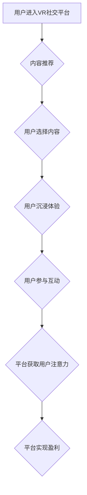

                 

## 虚拟现实社交平台的注意力经济模式

> 关键词：虚拟现实、社交平台、注意力经济、用户行为、算法设计、数据分析

> 摘要：本文探讨了虚拟现实（VR）社交平台的注意力经济模式，分析了VR环境对用户注意力吸引力的独特机制，并深入研究了平台如何通过算法设计、内容推荐和交互设计等手段获取和利用用户注意力。同时，文章还探讨了VR注意力经济模式的潜在问题和挑战，并展望了未来发展趋势。

## 1. 背景介绍

1.1  虚拟现实技术发展

虚拟现实技术近年来取得了飞速发展，从最初的笨重设备到如今轻便舒适的VR头显，其沉浸式体验和交互性不断提升，为人们提供了全新的数字世界探索和社交方式。

1.2  社交平台的注意力经济

社交平台已经成为人们获取信息、娱乐和社交的主要渠道，其商业模式的核心是通过获取和利用用户注意力来实现盈利。社交平台通过算法推荐、个性化内容和不断更新的动态信息，吸引用户持续使用平台，从而获取广告收入、会员订阅和数据交易等收益。

1.3  VR社交平台的兴起

随着VR技术的成熟，VR社交平台应运而生，例如Facebook Horizon、VRChat、Rec Room等。这些平台利用VR环境的沉浸性和交互性，创造了更加真实和丰富的社交体验，吸引了越来越多的用户参与。

## 2. 核心概念与联系

2.1  注意力经济

注意力经济是指在信息爆炸的时代，注意力成为稀缺资源，而掌握用户注意力的平台能够获得巨大的经济价值。

2.2  VR环境对注意力的影响

VR环境能够通过以下方式吸引用户注意力：

* **沉浸式体验:** VR环境能够将用户完全沉浸在虚拟世界中，增强用户的感知和参与感。
* **交互性:** VR环境支持用户与虚拟世界和虚拟角色进行交互，提高用户的参与度和注意力。
* **感官刺激:** VR环境能够通过视觉、听觉、触觉等多种感官刺激，吸引用户的注意力。

2.3  VR社交平台的注意力经济模式

VR社交平台通过以下方式获取和利用用户注意力：

* **内容推荐:** 基于用户的兴趣和行为，推荐个性化的VR内容，例如游戏、虚拟活动、社交互动等。
* **社交互动:** 鼓励用户与其他用户进行社交互动，例如聊天、组队、共同体验虚拟活动等。
* **虚拟物品交易:** 提供虚拟物品交易功能，吸引用户参与虚拟经济活动。

**Mermaid 流程图**



## 3. 核心算法原理 & 具体操作步骤

3.1  算法原理概述

VR社交平台的注意力经济模式依赖于一系列复杂的算法，例如内容推荐算法、用户行为分析算法、虚拟物品交易算法等。这些算法通过分析用户的兴趣、行为和偏好，为用户提供个性化的内容和体验，从而吸引用户持续使用平台。

3.2  算法步骤详解

* **用户行为分析:** 收集用户的行为数据，例如浏览记录、点赞、评论、分享等，分析用户的兴趣和偏好。
* **内容推荐:** 基于用户的行为数据，推荐个性化的VR内容，例如游戏、虚拟活动、社交互动等。
* **虚拟物品交易:** 建立虚拟物品交易平台，允许用户购买、出售和交易虚拟物品。
* **算法优化:** 持续优化算法模型，提高推荐精准度和用户体验。

3.3  算法优缺点

* **优点:**

    * 个性化推荐，提高用户体验。
    * 提升用户粘性，延长用户停留时间。
    * 促进虚拟经济发展，增加平台收入。

* **缺点:**

    * 可能导致用户信息泄露和隐私问题。
    * 算法偏差可能导致推荐内容不公平或歧视性。
    * 过度依赖算法可能会降低用户自主性和创造性。

3.4  算法应用领域

VR社交平台的注意力经济模式算法应用领域广泛，例如：

* **内容平台:** 推荐个性化的VR视频、游戏和虚拟活动。
* **电商平台:** 推广虚拟物品和服务，促进虚拟经济发展。
* **教育平台:** 提供个性化的VR学习内容和互动体验。
* **医疗平台:** 提供VR模拟手术训练和虚拟康复治疗。

## 4. 数学模型和公式 & 详细讲解 & 举例说明

4.1  数学模型构建

VR社交平台的注意力经济模式可以抽象为一个用户-内容-平台三方交互的系统，可以使用以下数学模型来描述：

* **用户注意力:**  用户对平台内容的关注度，可以用一个数值表示，例如注意力分数。
* **内容吸引力:**  内容本身的吸引力，可以用一个数值表示，例如内容评分。
* **平台推荐策略:**  平台根据用户行为和内容吸引力，推荐内容给用户，可以用一个算法表示。

4.2  公式推导过程

用户注意力可以根据以下公式计算：

$$
Attention Score = f(User Behavior, Content Attractiveness, Platform Recommendation Strategy)
$$

其中，f()是一个函数，代表用户注意力计算的复杂逻辑。

4.3  案例分析与讲解

假设一个VR社交平台，用户A喜欢玩动作游戏，平台根据用户A的浏览记录和游戏评分，推荐了一款新的动作游戏。如果这款游戏质量高，用户A会对游戏产生较高的注意力，从而延长游戏时间，增加平台收入。

## 5. 项目实践：代码实例和详细解释说明

5.1  开发环境搭建

* 操作系统: Windows/macOS/Linux
* 编程语言: Python
* 开发工具: PyCharm/VS Code
* VR框架: Unity/Unreal Engine

5.2  源代码详细实现

```python
# 用户行为分析
def analyze_user_behavior(user_id):
    # 从数据库中获取用户行为数据
    user_data = get_user_data(user_id)
    # 分析用户行为，例如浏览记录、点赞、评论等
    # 返回用户兴趣和偏好
    return user_interests

# 内容推荐
def recommend_content(user_interests):
    # 从数据库中获取所有内容数据
    all_content = get_all_content()
    # 根据用户兴趣，推荐相关内容
    recommended_content = filter_content(all_content, user_interests)
    # 返回推荐内容列表
    return recommended_content

# 虚拟物品交易
def trade_virtual_item(user_id, item_id):
    # 从数据库中获取用户和物品信息
    user_info = get_user_info(user_id)
    item_info = get_item_info(item_id)
    # 处理虚拟物品交易逻辑
    # 更新用户和物品信息
    update_user_info(user_info)
    update_item_info(item_info)
```

5.3  代码解读与分析

* 用户行为分析模块：分析用户的浏览记录、点赞、评论等行为，并根据这些行为推断用户的兴趣和偏好。
* 内容推荐模块：根据用户的兴趣和偏好，从数据库中筛选出相关的内容并推荐给用户。
* 虚拟物品交易模块：处理用户购买、出售和交易虚拟物品的逻辑，并更新用户和物品信息。

5.4  运行结果展示

运行上述代码，可以实现VR社交平台的基本功能，例如用户注册登录、内容浏览、社交互动、虚拟物品交易等。

## 6. 实际应用场景

6.1  社交互动

VR社交平台可以提供更加沉浸式的社交体验，例如虚拟聚会、虚拟旅行、虚拟游戏等。用户可以与朋友和家人在虚拟世界中互动，分享生活和体验。

6.2  教育培训

VR社交平台可以用于教育培训，例如虚拟实验室、虚拟课堂、虚拟模拟训练等。用户可以身临其境地体验学习内容，提高学习效率和兴趣。

6.3  商业营销

VR社交平台可以用于商业营销，例如虚拟展会、虚拟试衣间、虚拟产品体验等。企业可以利用VR技术创造更加生动的营销体验，吸引用户关注和购买。

6.4  未来应用展望

随着VR技术的不断发展，VR社交平台的应用场景将会更加广泛，例如虚拟医疗、虚拟艺术、虚拟娱乐等。

## 7. 工具和资源推荐

7.1  学习资源推荐

* **书籍:**

    * 《虚拟现实技术》
    * 《VR开发入门》
    * 《注意力经济》

* **在线课程:**

    * Coursera: VR开发课程
    * Udemy: VR社交平台开发课程

7.2  开发工具推荐

* **VR头显:** Oculus Quest、HTC Vive、Valve Index
* **VR开发框架:** Unity、Unreal Engine
* **编程语言:** Python、C#、C++

7.3  相关论文推荐

* **VR社交平台的用户体验研究**
* **VR注意力经济模式的分析与展望**
* **VR虚拟物品交易的经济学研究**

## 8. 总结：未来发展趋势与挑战

8.1  研究成果总结

VR社交平台的注意力经济模式是一个新兴的领域，研究成果不断涌现。

* 用户行为分析算法不断改进，推荐内容更加精准。
* 虚拟物品交易平台更加完善，虚拟经济发展更加活跃。
* VR社交平台的应用场景不断拓展，覆盖更多领域。

8.2  未来发展趋势

* **更沉浸式的体验:** VR技术将更加成熟，提供更加逼真的虚拟世界体验。
* **更个性化的内容:** 算法将更加智能，提供更加个性化的内容推荐。
* **更丰富的交互方式:** VR社交平台将支持更多交互方式，例如手势识别、语音识别等。

8.3  面临的挑战

* **隐私安全问题:** VR社交平台收集大量用户数据，需要加强隐私安全保护。
* **算法偏差问题:** 算法可能存在偏差，导致推荐内容不公平或歧视性。
* **虚拟经济监管问题:** 虚拟物品交易需要建立完善的监管机制。

8.4  研究展望

未来研究将重点关注以下方面:

* **更安全可靠的VR社交平台:** 提高平台安全性，保护用户隐私。
* **更公平公正的算法设计:** 减少算法偏差，确保推荐内容公平公正。
* **更可持续的虚拟经济发展:** 建立完善的虚拟经济监管机制，促进虚拟经济健康发展。

## 9. 附录：常见问题与解答

9.1  VR社交平台如何保证用户隐私安全？

VR社交平台需要采取以下措施保证用户隐私安全:

* **数据加密:** 用户数据传输和存储过程中进行加密保护。
* **访问控制:** 限制对用户数据的访问权限，只有授权人员才能访问。
* **隐私政策:** 明确用户数据的使用方式和保护措施，并获得用户同意。

9.2  VR社交平台的算法如何避免偏差？

VR社交平台需要采取以下措施避免算法偏差:

* **数据多样化:** 使用来自不同背景和特征的用户数据训练算法。
* **算法透明化:** 公开算法模型和训练数据，方便第三方进行审计。
* **持续优化:** 定期评估算法性能，并根据反馈进行调整优化。


作者：禅与计算机程序设计艺术 / Zen and the Art of Computer Programming 
<end_of_turn>

