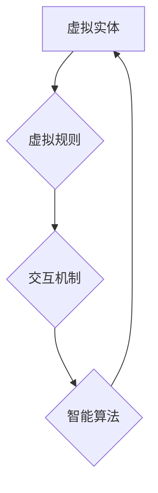

                 

## 虚拟生态系统理论：AI驱动的数字世界构建

> 关键词：虚拟生态系统，人工智能，数字世界，模拟仿真，智能算法，系统架构，未来趋势

> 摘要：本文探讨了虚拟生态系统理论，阐述了其在AI驱动的数字世界构建中的核心概念、算法原理、数学模型以及实际应用场景。通过分析虚拟生态系统理论的构建过程和应用前景，旨在为构建更加智能、可持续和充满活力的数字世界提供理论支撑和实践指导。

## 1. 背景介绍

随着人工智能技术的飞速发展，数字世界正在从静态的虚拟环境向动态的虚拟生态系统演进。虚拟生态系统是指由虚拟实体、规则和交互机制组成的复杂系统，能够模拟现实世界生态系统的复杂性，并通过人工智能算法实现自主演化和自组织。

传统虚拟世界主要以游戏和娱乐为主，缺乏真实世界的复杂性和动态性。而虚拟生态系统则旨在构建更加逼真、智能和可交互的数字世界，其核心目标是：

* **模拟真实世界生态系统：** 通过构建虚拟环境、虚拟生物和虚拟规则，模拟现实世界生态系统的复杂交互关系和演化过程。
* **实现智能化交互：** 利用人工智能算法，赋予虚拟实体自主学习、决策和交互的能力，使数字世界更加智能和充满活力。
* **创造可持续发展：** 通过虚拟生态系统的模拟和演化，探索可持续发展模式，为解决现实世界环境和社会问题提供新的思路和解决方案。

## 2. 核心概念与联系

虚拟生态系统理论的核心概念包括：

* **虚拟实体：** 指在虚拟环境中存在的虚拟对象，例如虚拟生物、虚拟资源、虚拟设施等。
* **虚拟规则：** 指在虚拟生态系统中 governing 虚拟实体的行为和交互的规则，例如生存规则、繁殖规则、竞争规则等。
* **交互机制：** 指虚拟实体之间进行交互的方式和方法，例如信息传递、资源共享、竞争合作等。
* **智能算法：** 指用于控制虚拟实体行为、模拟生态系统演化和实现智能交互的人工智能算法，例如强化学习、进化算法、神经网络等。

**Mermaid 流程图：**



## 3. 核心算法原理 & 具体操作步骤

### 3.1  算法原理概述

虚拟生态系统理论的核心算法原理是基于模拟和演化的思想，通过设计合理的虚拟规则和智能算法，模拟现实世界生态系统的复杂性，并实现虚拟生态系统的自主演化和自组织。

常见的虚拟生态系统算法包括：

* **强化学习：** 通过奖励机制，训练虚拟实体学习最佳行为策略，使其在虚拟环境中生存和繁衍。
* **进化算法：** 通过模拟自然选择和遗传机制，优化虚拟实体的特性，使其适应虚拟环境的挑战。
* **神经网络：** 通过构建复杂的网络结构，模拟生物神经网络的运作机制，赋予虚拟实体更强大的学习和决策能力。

### 3.2  算法步骤详解

以强化学习为例，其在虚拟生态系统中的具体操作步骤如下：

1. **环境建模：** 建立虚拟环境模型，定义虚拟实体、虚拟规则和交互机制。
2. **奖励函数设计：** 设计奖励函数，根据虚拟实体的行为和状态，给予相应的奖励或惩罚。
3. **智能代理训练：** 利用强化学习算法，训练虚拟实体（智能代理）学习最佳行为策略，使其能够最大化奖励。
4. **虚拟生态系统演化：** 观察和分析虚拟生态系统的演化过程，调整虚拟规则和智能算法，使其更加逼真和智能。

### 3.3  算法优缺点

**优点：**

* **模拟真实世界：** 可以模拟现实世界生态系统的复杂性，研究生态系统演化规律。
* **智能化交互：** 可以赋予虚拟实体自主学习、决策和交互的能力，构建更加智能的数字世界。
* **可持续发展：** 可以探索可持续发展模式，为解决现实世界环境和社会问题提供新的思路。

**缺点：**

* **算法复杂度高：** 建立和训练虚拟生态系统算法需要复杂的数学模型和计算资源。
* **数据依赖性强：** 虚拟生态系统的模拟精度依赖于真实世界数据的质量和完整性。
* **伦理挑战：** 虚拟生态系统的构建和应用可能带来伦理挑战，例如虚拟实体的权利和责任问题。

### 3.4  算法应用领域

虚拟生态系统理论和算法在以下领域具有广泛的应用前景：

* **环境模拟与保护：** 模拟生态系统变化，预测环境风险，探索环境保护策略。
* **生物医药研究：** 模拟生物系统，研究疾病机制，开发新药和治疗方法。
* **城市规划与管理：** 模拟城市发展，优化城市布局，提高城市可持续发展水平。
* **教育与培训：** 创建沉浸式学习环境，提高学习效率和趣味性。

## 4. 数学模型和公式 & 详细讲解 & 举例说明

### 4.1  数学模型构建

虚拟生态系统可以抽象为一个复杂的动态系统，其状态和演化过程可以用数学模型来描述。常用的数学模型包括：

* **差分方程：** 描述虚拟实体数量随时间的变化规律。
* **微分方程：** 描述虚拟实体状态和行为的连续变化规律。
* **随机过程：** 描述虚拟生态系统中随机事件的影响。

### 4.2  公式推导过程

以虚拟生物种群数量的增长模型为例，其差分方程可以表示为：

$$
N_{t+1} = N_t + rN_t - \alpha N_t^2
$$

其中：

* $N_t$ 表示时间 $t$ 时刻的虚拟生物种群数量。
* $r$ 表示虚拟生物的增长率。
* $\alpha$ 表示虚拟生物的竞争系数。

该公式表明，虚拟生物种群数量的增长受到自身增长率和竞争系数的影响。当增长率大于竞争系数时，种群数量会增长；反之，则会减少。

### 4.3  案例分析与讲解

假设虚拟生物的增长率为 $r = 0.1$，竞争系数为 $\alpha = 0.01$，初始种群数量为 $N_0 = 100$。

通过代入公式，可以计算出不同时间点的虚拟生物种群数量：

* $N_1 = 100 + 0.1 \times 100 - 0.01 \times 100^2 = 110$
* $N_2 = 110 + 0.1 \times 110 - 0.01 \times 110^2 = 111$
* $N_3 = 111 + 0.1 \times 111 - 0.01 \times 111^2 = 111.1$

可以看出，虚拟生物种群数量随着时间的推移逐渐趋于稳定。

## 5. 项目实践：代码实例和详细解释说明

### 5.1  开发环境搭建

虚拟生态系统开发环境通常需要以下软件：

* **编程语言：** Python、C++、Java 等。
* **图形引擎：** OpenGL、Unity、Unreal Engine 等。
* **人工智能库：** TensorFlow、PyTorch、OpenAI Gym 等。

### 5.2  源代码详细实现

以下是一个简单的虚拟生态系统代码示例，使用 Python 和 Pygame 库实现：

```python
import pygame

# 初始化 Pygame
pygame.init()

# 设置窗口大小
width = 800
height = 600
screen = pygame.display.set_mode((width, height))

# 创建虚拟生物类
class VirtualCreature:
    def __init__(self, x, y):
        self.x = x
        self.y = y
        self.size = 10
        self.color = (255, 0, 0)

    def move(self):
        # 随机移动
        self.x += random.randint(-1, 1)
        self.y += random.randint(-1, 1)

    def draw(self):
        pygame.draw.circle(screen, self.color, (self.x, self.y), self.size)

# 创建虚拟生物列表
creatures = []
for i in range(10):
    creatures.append(VirtualCreature(random.randint(0, width), random.randint(0, height)))

# 游戏循环
running = True
while running:
    for event in pygame.event.get():
        if event.type == pygame.QUIT:
            running = False

    # 更新虚拟生物位置
    for creature in creatures:
        creature.move()

    # 绘制虚拟生物
    screen.fill((0, 0, 0))  # 清空屏幕
    for creature in creatures:
        creature.draw()

    # 更新显示
    pygame.display.flip()

# 退出 Pygame
pygame.quit()
```

### 5.3  代码解读与分析

该代码示例实现了简单的虚拟生物模拟。

* 首先，初始化 Pygame 库并设置窗口大小。
* 然后，定义虚拟生物类 `VirtualCreature`，包含生物的位置、大小和颜色等属性，以及移动和绘制方法。
* 创建虚拟生物列表 `creatures`，并随机生成多个虚拟生物。
* 游戏循环中，不断更新虚拟生物的位置，并绘制到屏幕上。

### 5.4  运行结果展示

运行该代码后，会在窗口中显示多个红色圆形，它们会随机移动，模拟虚拟生物的活动。

## 6. 实际应用场景

### 6.1  环境模拟与保护

虚拟生态系统可以用于模拟不同环境条件下的生态系统演化，例如气候变化、污染物排放等，预测环境风险，探索环境保护策略。

### 6.2  生物医药研究

虚拟生态系统可以模拟生物系统，例如细胞、组织、器官等，研究疾病机制，开发新药和治疗方法。

### 6.3  城市规划与管理

虚拟生态系统可以模拟城市发展，优化城市布局，提高城市可持续发展水平。

### 6.4  未来应用展望

随着人工智能技术的不断发展，虚拟生态系统理论和算法将在更多领域得到应用，例如：

* **教育与培训：** 创建沉浸式学习环境，提高学习效率和趣味性。
* **娱乐与游戏：** 开发更加逼真、智能和交互的虚拟世界游戏。
* **社会科学研究：** 模拟社会系统，研究社会现象和行为模式。

## 7. 工具和资源推荐

### 7.1  学习资源推荐

* **书籍：** 《人工智能：现代方法》
* **在线课程：** Coursera、edX 等平台上的人工智能课程。
* **开源项目：** TensorFlow、PyTorch 等人工智能库的官方文档和示例代码。

### 7.2  开发工具推荐

* **编程语言：** Python、C++、Java 等。
* **图形引擎：** OpenGL、Unity、Unreal Engine 等。
* **人工智能库：** TensorFlow、PyTorch、OpenAI Gym 等。

### 7.3  相关论文推荐

* **《虚拟生态系统理论》**
* **《人工智能驱动的虚拟生态系统》**
* **《基于强化学习的虚拟生态系统模拟》**

## 8. 总结：未来发展趋势与挑战

### 8.1  研究成果总结

虚拟生态系统理论和算法在模拟复杂系统、探索智能行为和解决现实世界问题方面取得了显著成果。

### 8.2  未来发展趋势

未来，虚拟生态系统理论和算法将朝着以下方向发展：

* **更加逼真的模拟：** 利用更先进的数学模型和计算技术，构建更加逼真的虚拟生态系统。
* **更智能的交互：** 开发更强大的人工智能算法，赋予虚拟实体更智能的学习、决策和交互能力。
* **更广泛的应用：** 将虚拟生态系统应用于更多领域，例如教育、娱乐、社会科学等。

### 8.3  面临的挑战

虚拟生态系统理论和算法也面临着一些挑战：

* **算法复杂度：** 建立和训练复杂的虚拟生态系统算法需要大量的计算资源和时间。
* **数据依赖性：** 虚拟生态系统的模拟精度依赖于真实世界数据的质量和完整性。
* **伦理挑战：** 虚拟生态系统的构建和应用可能带来伦理挑战，例如虚拟实体的权利和责任问题。

### 8.4  研究展望

未来，需要加强虚拟生态系统理论和算法的研究，克服面临的挑战，推动其在更多领域得到应用，为构建更加智能、可持续和充满活力的数字世界做出贡献。

## 9. 附录：常见问题与解答

**Q1：虚拟生态系统与传统虚拟世界有什么区别？**

**A1：** 虚拟生态系统与传统虚拟世界的主要区别在于：

* **复杂性：** 虚拟生态系统更加复杂，模拟了现实世界生态系统的复杂交互关系和演化过程。
* **智能化：** 虚拟生态系统中虚拟实体具有自主学习、决策和交互的能力，更加智能。
* **可持续性：** 虚拟生态系统旨在探索可持续发展模式，为解决现实世界环境和社会问题提供新的思路。

**Q2：如何构建一个虚拟生态系统？**

**A2：** 构建一个虚拟生态系统需要以下步骤：

1. **定义虚拟环境：** 确定虚拟生态系统的类型、规模和规则。
2. **设计虚拟实体：** 创建虚拟生物、虚拟资源、虚拟设施等虚拟实体。
3. **制定虚拟规则：** 设计虚拟实体的行为和交互规则。
4. **选择算法：** 选择合适的智能算法，赋予虚拟实体自主学习和决策能力。
5. **搭建平台：** 选择合适的开发工具和平台，构建虚拟生态系统。
6. **测试和优化：** 测试虚拟生态系统的运行效果，并根据需要进行优化。


作者：禅与计算机程序设计艺术 / Zen and the Art of Computer Programming<end_of_turn>

