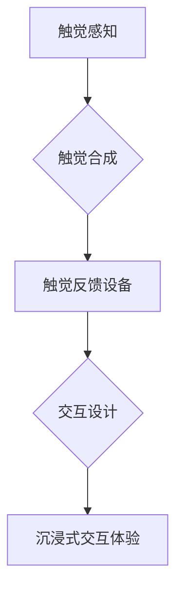

                 

## 虚拟触觉交响曲：AI创作的触感艺术

> 关键词：虚拟触觉、人工智能、触感反馈、深度学习、神经网络、触觉合成、交互设计、艺术创作

### 1. 背景介绍

人类与世界的交互方式，一直以来都依赖于五感。视觉、听觉、嗅觉、味觉和触觉，共同构成了我们感知世界的完整图景。然而，在数字世界中，我们主要依靠视觉和听觉来体验内容，触觉这一感官却显得格外缺失。

虚拟现实 (VR) 和增强现实 (AR) 技术的快速发展，为我们提供了沉浸式数字体验的可能性。然而，缺乏触觉反馈，仍然限制了这些技术的应用范围。想象一下，身临其境的虚拟世界，能够通过触觉反馈，让用户感受到虚拟物体的大小、形状、材质和温度，这将彻底改变我们与数字世界的交互方式。

近年来，人工智能 (AI) 技术的飞速发展，为虚拟触觉的实现提供了新的可能性。通过深度学习和神经网络，我们可以训练AI模型，学习并模拟人类触觉感知的机制。这使得虚拟触觉不再是科幻小说中的幻想，而是即将成为现实的技术。

### 2. 核心概念与联系

虚拟触觉的核心概念是通过模拟真实触觉的物理和神经机制，在数字世界中创造出逼真的触觉体验。这涉及到多个领域，包括：

* **触觉感知:** 理解人类触觉感知的原理，包括皮肤感受器、神经传导和大脑处理等。
* **触觉合成:** 基于触觉感知原理，设计算法和模型，生成逼真的触觉信号。
* **触觉反馈设备:** 开发能够将触觉信号转换为物理刺激的设备，例如触觉手套、触觉座椅等。
* **交互设计:** 将虚拟触觉技术融入到交互设计中，创造出更加沉浸性和自然的交互体验。

**核心概念与联系流程图:**



### 3. 核心算法原理 & 具体操作步骤

#### 3.1 算法原理概述

虚拟触觉的算法原理主要基于以下几个方面：

* **触觉信号建模:** 通过分析真实触觉的物理特性，例如压力、振动、温度等，建立数学模型来描述触觉信号。
* **神经网络学习:** 利用深度学习技术，训练神经网络模型，学习人类触觉感知的映射关系，将物理刺激转换为触觉信号。
* **触觉信号生成:** 基于建模和学习的结果，生成逼真的触觉信号，并将其转换为物理刺激。

#### 3.2 算法步骤详解

1. **数据采集:** 收集真实触觉的物理数据，例如压力传感器、振动传感器、温度传感器等采集的数据。
2. **数据预处理:** 对采集到的数据进行清洗、归一化等预处理，使其适合神经网络训练。
3. **神经网络训练:** 利用深度学习框架，构建神经网络模型，并使用预处理后的数据进行训练。训练目标是让神经网络能够将物理刺激映射到相应的触觉信号。
4. **模型评估:** 使用测试数据评估模型的性能，例如准确率、召回率等指标。
5. **触觉信号生成:** 将训练好的模型应用于新的物理刺激数据，生成相应的触觉信号。
6. **触觉反馈:** 将生成的触觉信号转换为物理刺激，例如通过触觉手套、触觉座椅等设备，让用户感受到虚拟触觉。

#### 3.3 算法优缺点

**优点:**

* **逼真度高:** 基于深度学习的算法能够学习人类触觉感知的复杂映射关系，生成逼真的触觉信号。
* **可定制性强:** 可以根据不同的应用场景，调整模型参数和训练数据，定制不同的触觉体验。
* **扩展性好:** 可以扩展到多种触觉反馈设备，例如触觉手套、触觉座椅、触觉衣物等。

**缺点:**

* **训练数据量大:** 深度学习模型需要大量的触觉数据进行训练，数据采集和标注成本较高。
* **计算资源需求高:** 训练深度学习模型需要大量的计算资源，例如GPU等。
* **技术复杂度高:** 需要对深度学习、神经网络、触觉感知等领域有深入的了解。

#### 3.4 算法应用领域

虚拟触觉技术在多个领域都有着广泛的应用前景，例如：

* **游戏:** 为游戏玩家提供更加沉浸式的游戏体验，例如感受虚拟武器的重量、虚拟环境的温度等。
* **医疗:** 用于医疗训练和康复治疗，例如模拟手术操作、训练肢体功能等。
* **教育:** 用于教学演示和互动体验，例如让学生感受虚拟物体的大小、形状、材质等。
* **设计:** 用于产品设计和原型制作，例如让设计师感受虚拟产品的触感和手感等。

### 4. 数学模型和公式 & 详细讲解 & 举例说明

#### 4.1 数学模型构建

虚拟触觉的数学模型主要基于以下几个方面：

* **触觉信号的表示:** 使用向量或张量来表示触觉信号，例如压力、振动、温度等物理量。
* **触觉感知的映射关系:** 建立数学函数或神经网络模型，描述物理刺激与触觉信号之间的映射关系。
* **触觉反馈的生成:** 使用数学公式或算法，将触觉信号转换为物理刺激，例如电压、电流、气压等。

#### 4.2 公式推导过程

例如，我们可以使用线性回归模型来描述压力与触觉信号之间的关系：

$$
y = mx + b
$$

其中：

* $y$ 是触觉信号强度
* $x$ 是压力值
* $m$ 是斜率，表示压力变化对触觉信号强度的影响
* $b$ 是截距，表示在压力为零时触觉信号的强度

通过训练数据，我们可以使用最小二乘法等算法，求解出 $m$ 和 $b$ 的最佳值。

#### 4.3 案例分析与讲解

假设我们有一个触觉传感器，可以测量压力值。我们可以使用线性回归模型，训练一个AI模型，学习压力值与触觉信号强度之间的关系。

训练完成后，我们可以将新的压力值输入到模型中，得到相应的触觉信号强度。例如，如果压力值为 10 N，模型预测的触觉信号强度为 5，我们可以将这个信号转换为相应的物理刺激，例如通过触觉手套，让用户感受到 5 的触觉强度。

### 5. 项目实践：代码实例和详细解释说明

#### 5.1 开发环境搭建

为了实现虚拟触觉的项目实践，我们需要搭建一个合适的开发环境。

* **操作系统:** Linux 或 Windows
* **编程语言:** Python
* **深度学习框架:** TensorFlow 或 PyTorch
* **触觉反馈设备:** 触觉手套、触觉座椅等

#### 5.2 源代码详细实现

以下是一个使用 TensorFlow 框架实现虚拟触觉的简单代码示例：

```python
import tensorflow as tf

# 定义模型结构
model = tf.keras.Sequential([
    tf.keras.layers.Dense(64, activation='relu', input_shape=(1,)),
    tf.keras.layers.Dense(1)
])

# 编译模型
model.compile(optimizer='adam', loss='mse')

# 训练模型
model.fit(x_train, y_train, epochs=10)

# 使用模型预测
pressure = 10
predicted_signal = model.predict([[pressure]])
print(predicted_signal)
```

#### 5.3 代码解读与分析

* **模型结构:** 我们定义了一个简单的全连接神经网络模型，包含两个隐藏层和一个输出层。
* **输入数据:** 模型的输入数据是一个一维向量，代表压力值。
* **输出数据:** 模型的输出数据是一个一维向量，代表触觉信号强度。
* **训练过程:** 我们使用 Adam 优化器和均方误差损失函数，训练模型。
* **预测过程:** 我们将新的压力值输入到模型中，得到相应的触觉信号强度。

#### 5.4 运行结果展示

运行上述代码后，我们可以得到模型预测的触觉信号强度。

### 6. 实际应用场景

#### 6.1 游戏

虚拟触觉技术可以为游戏玩家提供更加沉浸式的游戏体验。例如，在动作游戏中，玩家可以感受到虚拟武器的重量和反作用力，在模拟驾驶游戏中，玩家可以感受到虚拟方向盘的转动和震动，在冒险游戏中，玩家可以感受到虚拟环境的温度和湿度。

#### 6.2 医疗

虚拟触觉技术在医疗领域也有着广泛的应用前景。例如，可以用于医疗训练和康复治疗。

* **手术训练:** 医生可以通过虚拟触觉设备，模拟手术操作，练习手术技巧，提高手术成功率。
* **肢体功能康复:** 患者可以通过虚拟触觉设备，进行肢体功能训练，例如握拳、抓取等动作，帮助恢复肢体功能。

#### 6.3 教育

虚拟触觉技术可以用于教学演示和互动体验。例如，可以让学生感受虚拟物体的大小、形状、材质等，加深对知识的理解。

* **科学演示:** 教师可以通过虚拟触觉设备，演示物理现象，例如液体流动、气体膨胀等，让学生更加直观地理解科学知识。
* **历史文化体验:** 学生可以通过虚拟触觉设备，体验古代文物、历史场景等，加深对历史文化的理解。

#### 6.4 未来应用展望

随着虚拟触觉技术的不断发展，其应用场景将会更加广泛。例如：

* **远程协作:** 虚拟触觉技术可以帮助远程团队成员进行更加自然的协作，例如共同设计产品、进行远程手术等。
* **虚拟社交:** 虚拟触觉技术可以为虚拟社交平台增添更加丰富的交互体验，例如虚拟拥抱、虚拟握手等。
* **增强现实:** 虚拟触觉技术可以与增强现实技术相结合，为用户提供更加沉浸式的现实体验，例如虚拟试衣、虚拟家居装修等。

### 7. 工具和资源推荐

#### 7.1 学习资源推荐

* **书籍:**
    * 《深度学习》 - Ian Goodfellow, Yoshua Bengio, Aaron Courville
    * 《神经网络与深度学习》 - Michael Nielsen
* **在线课程:**
    * Coursera: 深度学习 Specialization
    * Udacity: Deep Learning Nanodegree
* **博客和论坛:**
    * TensorFlow Blog
    * PyTorch Blog
    * Reddit: r/MachineLearning

#### 7.2 开发工具推荐

* **深度学习框架:** TensorFlow, PyTorch
* **触觉反馈设备:** HaptX Gloves, Teslasuit
* **虚拟现实平台:** Unity, Unreal Engine

#### 7.3 相关论文推荐

* **《Generative Adversarial Networks》** - Ian Goodfellow et al.
* **《Deep Reinforcement Learning》** - Volodymyr Mnih et al.
* **《Tactile Sensing with Deep Learning》** -  Yannik Schütze et al.

### 8. 总结：未来发展趋势与挑战

#### 8.1 研究成果总结

虚拟触觉技术近年来取得了显著的进展，从早期基于规则的触觉合成，发展到如今基于深度学习的逼真触觉生成。

#### 8.2 未来发展趋势

* **触觉感知的增强:** 开发更加精细、灵敏的触觉传感器，能够感知更丰富的触觉信息。
* **触觉模型的复杂化:** 构建更加复杂的触觉模型，能够模拟人类触觉感知的复杂机制。
* **触觉反馈的多样化:** 开发更加多样化的触觉反馈设备，能够提供更加丰富的触觉体验。
* **跨模态交互:** 将虚拟触觉与其他感官信息，例如视觉、听觉、嗅觉等，进行融合，创造更加沉浸式的交互体验。

#### 8.3 面临的挑战

* **数据获取和标注:** 触觉数据采集和标注成本较高，需要开发更加高效的数据获取和标注方法。
* **模型训练和优化:** 训练复杂的触觉模型需要大量的计算资源和时间，需要开发更加高效的训练和优化算法。
* **设备成本和普及:** 触觉反馈设备的成本较高，需要降低设备成本，提高设备的普及率。
* **伦理和安全:** 虚拟触觉技术可能会带来一些伦理和安全问题，例如触觉欺骗、触觉依赖等，需要进行深入的伦理和安全研究。

#### 8.4 研究展望

虚拟触觉技术是一个充满挑战和机遇的领域，未来将会有更多的研究和应用。相信随着技术的不断发展，虚拟触觉技术将会为我们带来更加丰富多彩的数字体验。

### 9. 附录：常见问题与解答

**Q1: 虚拟触觉技术与触觉反馈技术有什么区别？**

**A1:** 虚拟触觉技术是指通过模拟真实触觉的物理和神经机制，在数字世界中创造出逼真的触觉体验。触觉反馈技术是指通过物理刺激，例如压力、振动、温度等，向用户提供触觉信息。虚拟触觉技术是触觉反馈技术的更高层次的应用，它不仅能够提供触觉信息，还可以模拟触觉的复杂性和多样性。

**Q2: 虚拟触觉技术目前有哪些应用场景？**

**A2:** 虚拟触觉技术目前主要应用于以下场景：

* 游戏
* 医疗
* 教育
* 设计

**Q3: 虚拟触觉技术未来的发展趋势是什么？**

**A3:** 虚拟触觉技术的未来发展趋势包括：

* 触觉感知的增强
* 触觉模型的复杂化
* 触觉反馈的多样化
* 跨模态交互


作者：禅与计算机程序设计艺术 / Zen and the Art of Computer Programming 
<end_of_turn>

