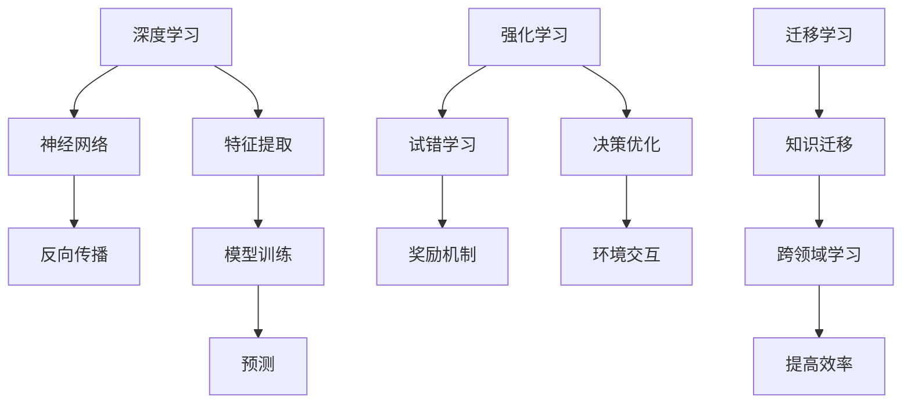

                 

# AI 2.0 基础设施建设：人才培养与社会责任

> 关键词：AI 2.0, 人才培养, 社会责任, 人工智能, 教育, 技术伦理, 未来趋势

> 摘要：本文旨在探讨AI 2.0时代下的人才培养与社会责任。通过分析当前AI技术的发展现状，我们提出了一系列关于AI人才培养的策略和建议，同时强调了在AI技术广泛应用过程中应承担的社会责任。文章将从背景介绍、核心概念与联系、核心算法原理与具体操作步骤、数学模型与公式、项目实战、实际应用场景、工具和资源推荐、总结与未来趋势、常见问题解答以及扩展阅读等多个方面进行详细阐述。

## 1. 背景介绍

随着AI技术的飞速发展，我们正步入AI 2.0时代。AI 2.0不仅在技术层面取得了突破，更在应用层面展现出前所未有的潜力。然而，这一进程也带来了新的挑战，特别是在人才培养和伦理责任方面。本文将深入探讨AI 2.0时代下的人才培养与社会责任问题，旨在为相关领域的从业者和决策者提供有价值的参考。

## 2. 核心概念与联系

### 2.1 AI 2.0概述

AI 2.0是指在AI 1.0的基础上，进一步融合了深度学习、强化学习、迁移学习等先进技术，形成了更加智能化、自适应的系统。AI 2.0不仅能够处理复杂的数据，还能在不断变化的环境中进行自我优化和学习。

### 2.2 人才培养的重要性

在AI 2.0时代，人才是推动技术进步的关键。一个国家或地区的AI人才储备直接影响其在AI领域的竞争力。因此，培养高质量的AI人才成为当务之急。

### 2.3 社会责任的定义

社会责任是指企业在追求经济利益的同时，还应承担起对社会、环境和伦理的责任。在AI领域，社会责任主要体现在确保技术的公平性、透明性和安全性等方面。

### 2.4 核心概念原理与架构

#### 2.4.1 深度学习原理

深度学习是一种基于神经网络的机器学习方法，通过多层非线性变换实现对复杂数据的高效处理。其核心在于通过反向传播算法优化权重参数，从而实现模型的训练和预测。

#### 2.4.2 强化学习原理

强化学习是一种通过试错学习的方法，通过与环境的交互来优化决策策略。其核心在于通过奖励机制引导智能体进行学习和优化。

#### 2.4.3 迁移学习原理

迁移学习是指将一个领域的知识迁移到另一个领域，以提高学习效率和泛化能力。其核心在于通过共享特征和知识，实现跨领域的学习和应用。

### 2.5 Mermaid 流程图



## 3. 核心算法原理 & 具体操作步骤

### 3.1 深度学习算法原理

深度学习算法的核心在于构建多层神经网络模型，通过反向传播算法优化权重参数。具体步骤如下：

1. **数据预处理**：对原始数据进行清洗、归一化等预处理操作。
2. **模型构建**：设计多层神经网络结构，包括输入层、隐藏层和输出层。
3. **权重初始化**：对模型参数进行随机初始化。
4. **前向传播**：将输入数据通过神经网络进行前向传播，计算输出结果。
5. **损失函数计算**：计算预测结果与真实标签之间的差异，得到损失值。
6. **反向传播**：通过损失函数计算梯度，反向传播到每一层，更新权重参数。
7. **模型训练**：重复前向传播和反向传播过程，直到模型收敛。

### 3.2 强化学习算法原理

强化学习算法的核心在于通过试错学习，优化决策策略。具体步骤如下：

1. **环境建模**：定义智能体与环境的交互过程。
2. **状态空间定义**：定义智能体所处的状态空间。
3. **动作空间定义**：定义智能体可以采取的动作空间。
4. **奖励机制设计**：设计合理的奖励机制，引导智能体进行学习。
5. **策略选择**：选择合适的策略进行决策。
6. **经验回放**：通过经验回放机制，提高学习效率。
7. **策略优化**：通过试错学习，不断优化决策策略。

### 3.3 迁移学习算法原理

迁移学习算法的核心在于通过共享特征和知识，实现跨领域的学习和应用。具体步骤如下：

1. **源领域选择**：选择一个或多个源领域，作为知识迁移的来源。
2. **目标领域定义**：定义目标领域，作为知识迁移的目标。
3. **特征提取**：从源领域中提取共享特征。
4. **模型构建**：构建目标领域的模型。
5. **知识迁移**：将源领域的特征和知识迁移到目标领域。
6. **模型训练**：对目标领域的模型进行训练。
7. **模型评估**：评估模型在目标领域的性能。

## 4. 数学模型和公式 & 详细讲解 & 举例说明

### 4.1 深度学习数学模型

深度学习的数学模型主要基于神经网络和反向传播算法。具体公式如下：

1. **前向传播公式**：

    $$ z^{(l)} = W^{(l)}a^{(l-1)} + b^{(l)} $$
    $$ a^{(l)} = \sigma(z^{(l)}) $$

2. **损失函数公式**：

    $$ L = \frac{1}{m} \sum_{i=1}^{m} \mathcal{L}(y^{(i)}, \hat{y}^{(i)}) $$

3. **反向传播公式**：

    $$ \delta^{(l)} = \sigma'(z^{(l)}) \odot \left( \frac{\partial L}{\partial z^{(l)}} \right) $$
    $$ \frac{\partial L}{\partial W^{(l)}} = \frac{1}{m} a^{(l-1)T} \delta^{(l)} $$
    $$ \frac{\partial L}{\partial b^{(l)}} = \frac{1}{m} \sum_{i=1}^{m} \delta^{(l)} $$

### 4.2 强化学习数学模型

强化学习的数学模型主要基于马尔可夫决策过程（MDP）。具体公式如下：

1. **状态转移概率**：

    $$ P(s_{t+1} | s_t, a_t) $$

2. **奖励函数**：

    $$ R(s_t, a_t) $$

3. **价值函数**：

    $$ V(s) = \mathbb{E}[\sum_{t=0}^{\infty} \gamma^t R(s_t, a_t) | s_0 = s] $$

4. **策略函数**：

    $$ \pi(a | s) $$

### 4.3 迁移学习数学模型

迁移学习的数学模型主要基于特征共享和知识迁移。具体公式如下：

1. **源领域特征提取**：

    $$ f_{\theta}(x) $$

2. **目标领域特征提取**：

    $$ g_{\theta'}(x) $$

3. **知识迁移**：

    $$ \theta' = \theta + \Delta\theta $$

## 5. 项目实战：代码实际案例和详细解释说明

### 5.1 开发环境搭建

为了进行AI 2.0项目的开发，我们需要搭建一个合适的开发环境。具体步骤如下：

1. **安装Python**：确保安装了最新版本的Python。
2. **安装深度学习库**：安装TensorFlow、PyTorch等深度学习库。
3. **安装强化学习库**：安装Gym、RLlib等强化学习库。
4. **安装迁移学习库**：安装Transfer Learning Library等迁移学习库。
5. **安装开发工具**：安装Jupyter Notebook、VS Code等开发工具。

### 5.2 源代码详细实现和代码解读

#### 5.2.1 深度学习代码实现

```python
import tensorflow as tf
from tensorflow.keras.models import Sequential
from tensorflow.keras.layers import Dense

# 数据预处理
(x_train, y_train), (x_test, y_test) = tf.keras.datasets.mnist.load_data()
x_train = x_train / 255.0
x_test = x_test / 255.0

# 模型构建
model = Sequential([
    tf.keras.layers.Flatten(input_shape=(28, 28)),
    tf.keras.layers.Dense(128, activation='relu'),
    tf.keras.layers.Dense(10, activation='softmax')
])

# 损失函数和优化器
model.compile(optimizer='adam',
              loss='sparse_categorical_crossentropy',
              metrics=['accuracy'])

# 模型训练
model.fit(x_train, y_train, epochs=10)

# 模型评估
model.evaluate(x_test, y_test)
```

#### 5.2.2 强化学习代码实现

```python
import gym
from stable_baselines3 import PPO

# 环境建模
env = gym.make('CartPole-v1')

# 模型构建
model = PPO('MlpPolicy', env, verbose=1)

# 模型训练
model.learn(total_timesteps=10000)

# 模型评估
obs = env.reset()
for i in range(1000):
    action, _states = model.predict(obs, deterministic=True)
    obs, rewards, dones, info = env.step(action)
    env.render()
```

#### 5.2.3 迁移学习代码实现

```python
from transfer_learning_library import TransferLearningModel

# 源领域特征提取
source_model = TransferLearningModel('source_model')
source_features = source_model.extract_features(source_data)

# 目标领域特征提取
target_model = TransferLearningModel('target_model')
target_features = target_model.extract_features(target_data)

# 知识迁移
target_model.transfer(source_features, target_features)
```

### 5.3 代码解读与分析

通过上述代码实现，我们可以看到深度学习、强化学习和迁移学习的基本流程。深度学习通过构建多层神经网络模型，实现对复杂数据的高效处理；强化学习通过试错学习，优化决策策略；迁移学习通过共享特征和知识，实现跨领域的学习和应用。

## 6. 实际应用场景

### 6.1 深度学习应用场景

深度学习在图像识别、自然语言处理、语音识别等领域有着广泛的应用。例如，通过深度学习模型可以实现自动驾驶汽车的图像识别，提高驾驶安全性。

### 6.2 强化学习应用场景

强化学习在游戏、机器人控制、智能推荐等领域有着广泛的应用。例如，通过强化学习算法可以实现智能游戏AI，提高游戏体验。

### 6.3 迁移学习应用场景

迁移学习在医疗、金融、教育等领域有着广泛的应用。例如，通过迁移学习可以实现医疗图像识别模型的快速部署，提高医疗诊断效率。

## 7. 工具和资源推荐

### 7.1 学习资源推荐

1. **书籍**：《深度学习》、《强化学习》、《迁移学习》
2. **论文**：《深度学习在图像识别中的应用》、《强化学习在游戏中的应用》、《迁移学习在医疗领域的应用》
3. **博客**：AI天才研究员的博客、机器之心的博客
4. **网站**：GitHub、Kaggle

### 7.2 开发工具框架推荐

1. **深度学习框架**：TensorFlow、PyTorch
2. **强化学习框架**：Gym、RLlib
3. **迁移学习框架**：Transfer Learning Library

### 7.3 相关论文著作推荐

1. **深度学习**：《深度学习》（Ian Goodfellow, Yoshua Bengio, Aaron Courville）
2. **强化学习**：《强化学习》（Richard S. Sutton, Andrew G. Barto）
3. **迁移学习**：《迁移学习》（Jiawei Han, Micheline Kamber, Jian Pei）

## 8. 总结：未来发展趋势与挑战

### 8.1 未来发展趋势

1. **技术融合**：深度学习、强化学习、迁移学习等技术将进一步融合，形成更加智能化的系统。
2. **应用拓展**：AI技术将在更多领域得到应用，推动社会进步。
3. **伦理规范**：AI技术的发展将更加注重伦理规范，确保技术的公平性、透明性和安全性。

### 8.2 挑战

1. **数据隐私**：如何保护用户数据隐私，避免数据泄露。
2. **算法偏见**：如何避免算法偏见，确保技术的公平性。
3. **伦理规范**：如何制定合理的伦理规范，确保技术的安全性。

## 9. 附录：常见问题与解答

### 9.1 问题1：如何处理数据隐私问题？

答：可以通过数据脱敏、加密等技术手段保护用户数据隐私。

### 9.2 问题2：如何避免算法偏见？

答：可以通过多样化的数据集、公平性评估等方法避免算法偏见。

### 9.3 问题3：如何制定合理的伦理规范？

答：可以通过制定行业标准、法律法规等方法制定合理的伦理规范。

## 10. 扩展阅读 & 参考资料

1. **书籍**：《深度学习》、《强化学习》、《迁移学习》
2. **论文**：《深度学习在图像识别中的应用》、《强化学习在游戏中的应用》、《迁移学习在医疗领域的应用》
3. **博客**：AI天才研究员的博客、机器之心的博客
4. **网站**：GitHub、Kaggle

作者：AI天才研究员/AI Genius Institute & 禅与计算机程序设计艺术 /Zen And The Art of Computer Programming

