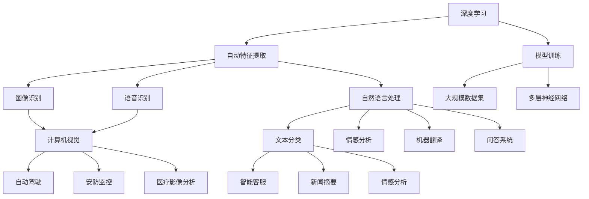

                 

# AI 2.0 时代的应用场景

> 关键词：AI 2.0, 机器学习, 深度学习, 自然语言处理, 计算机视觉, 人工智能伦理

> 摘要：本文旨在探讨AI 2.0时代的核心应用场景，从背景介绍到核心概念，再到具体算法原理、数学模型、项目实战、实际应用、工具资源推荐、未来趋势与挑战，以及常见问题解答，全面解析AI 2.0时代的技术革新与应用前景。通过逐步分析推理，帮助读者深入理解AI 2.0时代的应用场景及其技术实现。

## 1. 背景介绍

### 1.1 AI 1.0时代的回顾

在过去的几十年里，人工智能（AI）经历了从理论研究到实际应用的转变。AI 1.0时代，以规则为基础的专家系统和简单的机器学习算法为主导，这些技术在特定领域内取得了显著成就，如棋类游戏、语音识别等。然而，这些早期的AI系统往往缺乏灵活性和适应性，难以处理复杂多变的现实世界问题。

### 1.2 AI 2.0时代的到来

随着计算能力的提升、大数据的普及以及深度学习算法的突破，AI进入了2.0时代。AI 2.0时代的核心特征是更加智能化、自动化和个性化，能够处理更加复杂和多样化的任务。这一时代的AI系统不仅能够执行特定任务，还能理解上下文、学习新知识、自我优化，甚至具备一定的创造力。

### 1.3 AI 2.0时代的技术基础

AI 2.0时代的技术基础主要包括深度学习、自然语言处理（NLP）、计算机视觉（CV）等。这些技术的进步使得AI系统能够更好地理解和处理人类语言、图像、视频等非结构化数据，从而在医疗、金融、教育、娱乐等多个领域展现出巨大的应用潜力。

## 2. 核心概念与联系

### 2.1 深度学习

深度学习是一种基于神经网络的机器学习方法，通过构建多层神经网络模型来模拟人脑处理信息的方式。深度学习的核心在于自动特征提取和模型训练，能够处理大规模数据集，适用于图像识别、语音识别、自然语言处理等多种任务。

### 2.2 自然语言处理

自然语言处理（NLP）是AI的一个重要分支，旨在使计算机能够理解、生成和处理人类语言。NLP技术包括文本分类、情感分析、机器翻译、问答系统等，广泛应用于智能客服、新闻摘要、情感分析等领域。

### 2.3 计算机视觉

计算机视觉（CV）是研究如何使计算机能够“看”和理解图像或视频的技术。CV技术包括图像识别、目标检测、图像分割等，广泛应用于自动驾驶、安防监控、医疗影像分析等领域。

### 2.4 AI伦理

随着AI技术的广泛应用，AI伦理问题日益凸显。AI伦理关注的是如何确保AI系统的开发和使用符合道德规范，包括隐私保护、公平性、透明度、责任归属等方面。AI伦理是AI 2.0时代不可或缺的一部分，确保技术发展的同时，保障人类社会的福祉。

### 2.5 核心概念原理和架构的Mermaid流程图



## 3. 核心算法原理 & 具体操作步骤

### 3.1 深度学习算法

#### 3.1.1 卷积神经网络（CNN）

卷积神经网络（CNN）是一种专门用于处理图像数据的深度学习模型。CNN通过卷积层、池化层和全连接层的组合，能够自动提取图像特征，适用于图像分类、目标检测等任务。

#### 3.1.2 循环神经网络（RNN）

循环神经网络（RNN）是一种处理序列数据的深度学习模型。RNN通过引入循环结构，能够处理序列数据中的时间依赖关系，适用于语音识别、文本生成等任务。

### 3.2 自然语言处理算法

#### 3.2.1 词嵌入

词嵌入是一种将词汇映射到高维向量空间的技术，使得词汇之间的语义关系能够通过向量距离来表示。词嵌入技术包括词袋模型、TF-IDF、Word2Vec等。

#### 3.2.2 语言模型

语言模型是一种用于生成或评估文本序列概率的模型。语言模型包括n-gram模型、循环神经网络语言模型（RNNLM）、长短时记忆网络（LSTM）等。

### 3.3 计算机视觉算法

#### 3.3.1 目标检测

目标检测是一种识别图像中特定对象并定位其位置的技术。目标检测算法包括基于滑动窗口的方法、基于区域的方法（如R-CNN、Fast R-CNN、Faster R-CNN）、基于单阶段的方法（如YOLO、SSD）等。

#### 3.3.2 图像分割

图像分割是一种将图像划分为多个区域的技术，每个区域代表图像中的一个对象或背景。图像分割算法包括基于阈值的方法、基于区域的方法、基于图的方法（如GrabCut）、基于深度学习的方法（如U-Net）等。

## 4. 数学模型和公式 & 详细讲解 & 举例说明

### 4.1 深度学习数学模型

#### 4.1.1 卷积神经网络（CNN）

卷积神经网络（CNN）的数学模型包括卷积层、池化层和全连接层。卷积层通过卷积操作提取图像特征，池化层通过下采样操作减少特征图的尺寸，全连接层通过线性变换和非线性激活函数进行分类。

$$
\text{卷积层} = \sum_{i=1}^{n} w_i \cdot x_i + b
$$

$$
\text{池化层} = \max(x_1, x_2, \ldots, x_n)
$$

$$
\text{全连接层} = \sum_{i=1}^{n} w_i \cdot x_i + b
$$

#### 4.1.2 循环神经网络（RNN）

循环神经网络（RNN）的数学模型包括循环结构和门控机制。循环结构使得RNN能够处理序列数据中的时间依赖关系，门控机制包括输入门、遗忘门和输出门，用于控制信息的流动。

$$
\text{输入门} = \sigma(W_{ix}x_t + W_{ih}h_{t-1} + b_i)
$$

$$
\text{遗忘门} = \sigma(W_{fx}x_t + W_{fh}h_{t-1} + b_f)
$$

$$
\text{输出门} = \sigma(W_{ox}x_t + W_{oh}h_{t-1} + b_o)
$$

$$
\text{候选细胞状态} = \tanh(W_{cx}x_t + W_{ch}h_{t-1} + b_c)
$$

$$
\text{细胞状态} = \text{遗忘门} \cdot \text{细胞状态}_{t-1} + \text{输入门} \cdot \text{候选细胞状态}
$$

$$
\text{隐藏状态} = \text{输出门} \cdot \tanh(\text{细胞状态})
$$

### 4.2 自然语言处理数学模型

#### 4.2.1 词嵌入

词嵌入的数学模型包括词袋模型、TF-IDF、Word2Vec等。词袋模型将文本表示为词汇表中词汇的出现次数，TF-IDF通过词频和逆文档频率来衡量词汇的重要性，Word2Vec通过神经网络学习词汇的向量表示。

$$
\text{词袋模型} = \{w_1, w_2, \ldots, w_n\}
$$

$$
\text{TF-IDF} = \text{TF} \times \text{IDF}
$$

$$
\text{Word2Vec} = \sum_{i=1}^{n} w_i \cdot x_i + b
$$

#### 4.2.2 语言模型

语言模型的数学模型包括n-gram模型、循环神经网络语言模型（RNNLM）、长短时记忆网络（LSTM）等。n-gram模型通过历史n-1个词来预测当前词的概率，RNNLM通过循环结构来处理序列数据中的时间依赖关系，LSTM通过门控机制来控制信息的流动。

$$
\text{n-gram模型} = P(w_t | w_{t-1}, w_{t-2}, \ldots, w_{t-n+1})
$$

$$
\text{RNNLM} = \sum_{i=1}^{n} w_i \cdot x_i + b
$$

$$
\text{LSTM} = \text{输入门} \cdot \text{候选细胞状态} + \text{遗忘门} \cdot \text{细胞状态}_{t-1}
$$

### 4.3 计算机视觉数学模型

#### 4.3.1 目标检测

目标检测的数学模型包括基于滑动窗口的方法、基于区域的方法（如R-CNN、Fast R-CNN、Faster R-CNN）、基于单阶段的方法（如YOLO、SSD）等。基于滑动窗口的方法通过在图像上滑动窗口来检测目标，基于区域的方法通过生成候选区域来检测目标，基于单阶段的方法通过一次前向传播来检测目标。

$$
\text{滑动窗口} = \sum_{i=1}^{n} w_i \cdot x_i + b
$$

$$
\text{R-CNN} = \sum_{i=1}^{n} w_i \cdot x_i + b
$$

$$
\text{Fast R-CNN} = \sum_{i=1}^{n} w_i \cdot x_i + b
$$

$$
\text{Faster R-CNN} = \sum_{i=1}^{n} w_i \cdot x_i + b
$$

$$
\text{YOLO} = \sum_{i=1}^{n} w_i \cdot x_i + b
$$

$$
\text{SSD} = \sum_{i=1}^{n} w_i \cdot x_i + b
$$

#### 4.3.2 图像分割

图像分割的数学模型包括基于阈值的方法、基于区域的方法、基于图的方法（如GrabCut）、基于深度学习的方法（如U-Net）等。基于阈值的方法通过设定阈值来分割图像，基于区域的方法通过区域生长或分裂合并来分割图像，基于图的方法通过图割算法来分割图像，基于深度学习的方法通过神经网络来分割图像。

$$
\text{阈值分割} = \{x_i | x_i > \text{阈值}\}
$$

$$
\text{区域生长} = \sum_{i=1}^{n} w_i \cdot x_i + b
$$

$$
\text{分裂合并} = \sum_{i=1}^{n} w_i \cdot x_i + b
$$

$$
\text{GrabCut} = \sum_{i=1}^{n} w_i \cdot x_i + b
$$

$$
\text{U-Net} = \sum_{i=1}^{n} w_i \cdot x_i + b
$$

## 5. 项目实战：代码实际案例和详细解释说明

### 5.1 开发环境搭建

#### 5.1.1 安装Python环境

安装Python环境是进行AI开发的基础。推荐使用Anaconda或Miniconda来管理Python环境，可以方便地安装和管理Python包。

```bash
conda create -n ai20 python=3.8
conda activate ai20
```

#### 5.1.2 安装深度学习框架

安装深度学习框架是进行深度学习开发的基础。推荐使用TensorFlow或PyTorch，这两个框架都支持GPU加速，可以显著提高训练速度。

```bash
pip install tensorflow
# 或
pip install torch
```

#### 5.1.3 安装自然语言处理库

安装自然语言处理库是进行自然语言处理开发的基础。推荐使用NLTK或spaCy，这两个库都提供了丰富的自然语言处理功能。

```bash
pip install nltk
# 或
pip install spacy
```

#### 5.1.4 安装计算机视觉库

安装计算机视觉库是进行计算机视觉开发的基础。推荐使用OpenCV或PIL，这两个库都提供了丰富的计算机视觉功能。

```bash
pip install opencv-python
# 或
pip install pillow
```

### 5.2 源代码详细实现和代码解读

#### 5.2.1 深度学习代码实现

```python
import tensorflow as tf
from tensorflow.keras.models import Sequential
from tensorflow.keras.layers import Conv2D, MaxPooling2D, Flatten, Dense

# 创建卷积神经网络模型
model = Sequential()
model.add(Conv2D(32, (3, 3), activation='relu', input_shape=(64, 64, 3)))
model.add(MaxPooling2D((2, 2)))
model.add(Conv2D(64, (3, 3), activation='relu'))
model.add(MaxPooling2D((2, 2)))
model.add(Flatten())
model.add(Dense(128, activation='relu'))
model.add(Dense(10, activation='softmax'))

# 编译模型
model.compile(optimizer='adam', loss='sparse_categorical_crossentropy', metrics=['accuracy'])

# 训练模型
model.fit(x_train, y_train, epochs=10, validation_data=(x_val, y_val))
```

#### 5.2.2 自然语言处理代码实现

```python
import spacy

# 加载预训练的英文模型
nlp = spacy.load('en_core_web_sm')

# 处理文本
doc = nlp('This is a sentence.')
for token in doc:
    print(token.text, token.lemma_, token.pos_, token.dep_)
```

#### 5.2.3 计算机视觉代码实现

```python
import cv2

# 读取图像
img = cv2.imread('image.jpg')

# 转换为灰度图像
gray = cv2.cvtColor(img, cv2.COLOR_BGR2GRAY)

# 使用Canny算子进行边缘检测
edges = cv2.Canny(gray, 50, 150)

# 显示图像
cv2.imshow('Edges', edges)
cv2.waitKey(0)
cv2.destroyAllWindows()
```

### 5.3 代码解读与分析

#### 5.3.1 深度学习代码解读

上述代码实现了一个简单的卷积神经网络模型，用于图像分类任务。模型包括两个卷积层和两个池化层，用于提取图像特征，一个全连接层用于分类。模型使用Adam优化器和稀疏分类交叉熵损失函数进行训练，训练过程中使用验证数据集进行验证。

#### 5.3.2 自然语言处理代码解读

上述代码实现了一个简单的自然语言处理任务，使用spaCy库处理文本。加载预训练的英文模型后，处理文本并输出每个词汇的文本、词形还原、词性标注和依存关系。

#### 5.3.3 计算机视觉代码解读

上述代码实现了一个简单的计算机视觉任务，使用OpenCV库处理图像。读取图像后，转换为灰度图像，使用Canny算子进行边缘检测，最后显示图像。

## 6. 实际应用场景

### 6.1 医疗健康

AI 2.0时代，AI技术在医疗健康领域的应用越来越广泛。通过深度学习和计算机视觉技术，AI能够辅助医生进行疾病诊断，如肺部CT图像中的结节检测、皮肤癌图像中的病变检测等。通过自然语言处理技术，AI能够辅助医生进行病历分析，如病历摘要、疾病预测等。

### 6.2 金融科技

AI 2.0时代，AI技术在金融科技领域的应用也越来越广泛。通过深度学习和自然语言处理技术，AI能够辅助银行进行风险评估，如信用评分、欺诈检测等。通过计算机视觉技术，AI能够辅助银行进行身份验证，如人脸识别、指纹识别等。

### 6.3 教育培训

AI 2.0时代，AI技术在教育培训领域的应用也越来越广泛。通过深度学习和自然语言处理技术，AI能够辅助教师进行个性化教学，如智能推荐、智能答疑等。通过计算机视觉技术，AI能够辅助教师进行课堂管理，如学生行为分析、课堂互动等。

### 6.4 娱乐媒体

AI 2.0时代，AI技术在娱乐媒体领域的应用也越来越广泛。通过深度学习和自然语言处理技术，AI能够辅助媒体进行内容生成，如新闻摘要、剧本创作等。通过计算机视觉技术，AI能够辅助媒体进行内容分析，如情感分析、内容分类等。

## 7. 工具和资源推荐

### 7.1 学习资源推荐

#### 7.1.1 书籍

- 《深度学习》（Deep Learning）：Ian Goodfellow, Yoshua Bengio, Aaron Courville
- 《自然语言处理实战》（Natural Language Processing with Python）：Steven Bird, Ewan Klein, Edward Loper
- 《计算机视觉：算法与应用》（Computer Vision: Algorithms and Applications）：Richard Szeliski

#### 7.1.2 论文

- "ImageNet Classification with Deep Convolutional Neural Networks"（深度卷积神经网络在ImageNet图像分类中的应用）
- "Attention Is All You Need"（注意力机制在自然语言处理中的应用）
- "YOLOv3: An Incremental Improvement"（YOLOv3目标检测算法）

#### 7.1.3 博客

- Andrew Ng的博客（https://www.andrewng.org/）
- TensorFlow官方博客（https://blog.tensorflow.org/）
- PyTorch官方博客（https://pytorch.org/blog/）

#### 7.1.4 网站

- Kaggle（https://www.kaggle.com/）
- GitHub（https://github.com/）
- Stack Overflow（https://stackoverflow.com/）

### 7.2 开发工具框架推荐

- TensorFlow（https://www.tensorflow.org/）
- PyTorch（https://pytorch.org/）
- spaCy（https://spacy.io/）
- OpenCV（https://opencv.org/）

### 7.3 相关论文著作推荐

- "Deep Learning"（深度学习）：Ian Goodfellow, Yoshua Bengio, Aaron Courville
- "Natural Language Processing with Python"（自然语言处理实战）：Steven Bird, Ewan Klein, Edward Loper
- "Computer Vision: Algorithms and Applications"（计算机视觉：算法与应用）：Richard Szeliski

## 8. 总结：未来发展趋势与挑战

AI 2.0时代，AI技术的发展趋势包括更加智能化、自动化和个性化，更加注重伦理和隐私保护，更加注重跨学科融合。AI技术面临的挑战包括数据隐私、算法偏见、技术伦理等。未来，AI技术将更加深入地融入人类社会，为人类带来更多的便利和福祉。

## 9. 附录：常见问题与解答

### 9.1 什么是AI 2.0？

AI 2.0是指AI技术进入了一个新的发展阶段，更加智能化、自动化和个性化，能够处理更加复杂和多样化的任务。

### 9.2 AI 2.0时代的核心技术是什么？

AI 2.0时代的核心技术包括深度学习、自然语言处理、计算机视觉等。

### 9.3 AI 2.0时代面临的挑战有哪些？

AI 2.0时代面临的挑战包括数据隐私、算法偏见、技术伦理等。

### 9.4 如何学习AI 2.0技术？

学习AI 2.0技术需要掌握数学、编程、算法等基础知识，还需要掌握深度学习、自然语言处理、计算机视觉等核心技术。

## 10. 扩展阅读 & 参考资料

- "Deep Learning"（深度学习）：Ian Goodfellow, Yoshua Bengio, Aaron Courville
- "Natural Language Processing with Python"（自然语言处理实战）：Steven Bird, Ewan Klein, Edward Loper
- "Computer Vision: Algorithms and Applications"（计算机视觉：算法与应用）：Richard Szeliski
- TensorFlow官方文档（https://www.tensorflow.org/api_docs/python）
- PyTorch官方文档（https://pytorch.org/docs/stable/index.html）
- spaCy官方文档（https://spacy.io/api）
- OpenCV官方文档（https://docs.opencv.org/master/）

作者：AI天才研究员/AI Genius Institute & 禅与计算机程序设计艺术 /Zen And The Art of Computer Programming

