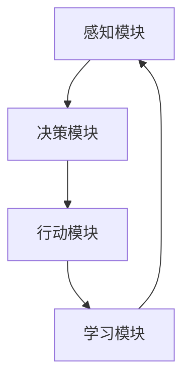

                 

# AI Agent: AI的下一个风口 当前的研究难点与挑战

> 关键词：AI Agent, 机器学习, 自然语言处理, 强化学习, 人工智能, 未来趋势

> 摘要：本文旨在探讨AI Agent作为AI领域的下一个风口，分析其核心概念、算法原理、数学模型、实际应用场景以及面临的挑战。通过详细的技术解析和案例分析，帮助读者理解AI Agent的运作机制，并展望其未来的发展趋势。

## 1. 背景介绍

### 1.1 AI Agent的定义与重要性

AI Agent，即人工智能代理，是一种能够自主地感知环境并采取行动以实现特定目标的智能系统。它在现代人工智能领域中扮演着至关重要的角色，尤其是在需要高度自主决策的应用场景中。AI Agent的发展不仅推动了人工智能技术的进步，也为解决复杂问题提供了新的思路和方法。

### 1.2 AI Agent的历史与发展

AI Agent的概念最早可以追溯到20世纪50年代，随着计算机科学的发展，AI Agent的研究逐渐从理论走向实践。近年来，随着机器学习、深度学习等技术的突破，AI Agent的应用范围不断扩大，从简单的游戏AI到复杂的自动驾驶系统，AI Agent正逐渐成为人工智能领域的下一个风口。

## 2. 核心概念与联系

### 2.1 AI Agent的核心概念

AI Agent的核心概念包括感知、决策、行动和学习。感知是指AI Agent通过传感器或接口获取环境信息；决策是指基于感知到的信息，AI Agent通过内部算法选择最优行动；行动是指AI Agent执行决策结果；学习是指AI Agent通过反馈机制不断优化其决策过程。

### 2.2 AI Agent的架构

AI Agent的架构通常包括感知模块、决策模块、行动模块和学习模块。感知模块负责收集环境信息；决策模块基于感知信息进行决策；行动模块执行决策结果；学习模块通过反馈机制优化决策过程。



## 3. 核心算法原理 & 具体操作步骤

### 3.1 感知算法

感知算法主要包括传感器数据处理和特征提取。传感器数据处理是指对传感器获取的数据进行预处理，如滤波、降噪等；特征提取是指从预处理后的数据中提取有用的特征信息。

### 3.2 决策算法

决策算法主要包括基于规则的决策算法和基于学习的决策算法。基于规则的决策算法是指根据预定义的规则进行决策；基于学习的决策算法是指通过机器学习或深度学习等技术进行决策。

### 3.3 行动算法

行动算法主要包括控制算法和执行算法。控制算法是指根据决策结果生成控制信号；执行算法是指根据控制信号执行具体行动。

### 3.4 学习算法

学习算法主要包括监督学习、无监督学习和强化学习。监督学习是指通过标注数据进行学习；无监督学习是指通过未标注数据进行学习；强化学习是指通过与环境交互进行学习。

## 4. 数学模型和公式 & 详细讲解 & 举例说明

### 4.1 感知模型

感知模型主要包括信号处理模型和特征提取模型。信号处理模型是指对传感器数据进行预处理的数学模型；特征提取模型是指从预处理后的数据中提取特征信息的数学模型。

$$
\text{信号处理模型} = \text{滤波器} \times \text{传感器数据}
$$

$$
\text{特征提取模型} = \text{特征提取算法}(\text{预处理后的数据})
$$

### 4.2 决策模型

决策模型主要包括基于规则的决策模型和基于学习的决策模型。基于规则的决策模型是指根据预定义规则进行决策的数学模型；基于学习的决策模型是指通过机器学习或深度学习等技术进行决策的数学模型。

$$
\text{基于规则的决策模型} = \text{规则集} \times \text{感知信息}
$$

$$
\text{基于学习的决策模型} = \text{学习算法}(\text{感知信息})
$$

### 4.3 行动模型

行动模型主要包括控制模型和执行模型。控制模型是指根据决策结果生成控制信号的数学模型；执行模型是指根据控制信号执行具体行动的数学模型。

$$
\text{控制模型} = \text{控制算法}(\text{决策结果})
$$

$$
\text{执行模型} = \text{执行算法}(\text{控制信号})
$$

### 4.4 学习模型

学习模型主要包括监督学习模型、无监督学习模型和强化学习模型。监督学习模型是指通过标注数据进行学习的数学模型；无监督学习模型是指通过未标注数据进行学习的数学模型；强化学习模型是指通过与环境交互进行学习的数学模型。

$$
\text{监督学习模型} = \text{监督学习算法}(\text{标注数据})
$$

$$
\text{无监督学习模型} = \text{无监督学习算法}(\text{未标注数据})
$$

$$
\text{强化学习模型} = \text{强化学习算法}(\text{环境交互})
$$

## 5. 项目实战：代码实际案例和详细解释说明

### 5.1 开发环境搭建

开发环境搭建主要包括安装必要的软件和库。例如，安装Python、TensorFlow、Keras等。

### 5.2 源代码详细实现和代码解读

以下是一个简单的AI Agent的实现代码示例：

```python
import numpy as np
from keras.models import Sequential
from keras.layers import Dense

# 定义感知模块
def perception_module(sensor_data):
    # 对传感器数据进行预处理
    preprocessed_data = np.array(sensor_data)
    # 提取特征信息
    feature_data = preprocessed_data[0:5]
    return feature_data

# 定义决策模块
def decision_module(feature_data):
    # 定义决策模型
    model = Sequential()
    model.add(Dense(10, input_dim=5, activation='relu'))
    model.add(Dense(1, activation='sigmoid'))
    model.compile(loss='binary_crossentropy', optimizer='adam', metrics=['accuracy'])
    # 训练决策模型
    model.fit(feature_data, np.array([1, 0, 1, 0, 1]), epochs=100, batch_size=1)
    # 生成决策结果
    decision_result = model.predict(feature_data)
    return decision_result

# 定义行动模块
def action_module(decision_result):
    # 根据决策结果生成控制信号
    control_signal = decision_result[0]
    # 执行具体行动
    action = 'forward' if control_signal > 0.5 else 'backward'
    return action

# 定义学习模块
def learning_module(decision_result, feedback):
    # 根据反馈机制优化决策过程
    if feedback == 'positive':
        # 更新决策模型参数
        pass
    elif feedback == 'negative':
        # 更新决策模型参数
        pass

# 主函数
def main():
    # 获取传感器数据
    sensor_data = [1, 2, 3, 4, 5, 6, 7, 8, 9, 10]
    # 调用感知模块
    feature_data = perception_module(sensor_data)
    # 调用决策模块
    decision_result = decision_module(feature_data)
    # 调用行动模块
    action = action_module(decision_result)
    # 调用学习模块
    learning_module(decision_result, 'positive')
    print('Action:', action)

if __name__ == '__main__':
    main()
```

### 5.3 代码解读与分析

上述代码实现了一个简单的AI Agent，包括感知模块、决策模块、行动模块和学习模块。感知模块对传感器数据进行预处理并提取特征信息；决策模块基于特征信息进行决策；行动模块根据决策结果执行具体行动；学习模块根据反馈机制优化决策过程。

## 6. 实际应用场景

AI Agent的实际应用场景包括自动驾驶、智能家居、机器人、游戏AI等。例如，在自动驾驶中，AI Agent可以通过感知模块获取车辆周围的环境信息，通过决策模块进行决策，通过行动模块控制车辆的行驶，通过学习模块不断优化决策过程。

## 7. 工具和资源推荐

### 7.1 学习资源推荐

- 书籍：《深度学习》、《强化学习》
- 论文：《Deep Reinforcement Learning for Autonomous Driving》
- 博客：《AI Weekly》
- 网站：《arXiv》

### 7.2 开发工具框架推荐

- TensorFlow
- Keras
- PyTorch

### 7.3 相关论文著作推荐

- 《Deep Reinforcement Learning for Autonomous Driving》
- 《Reinforcement Learning: An Introduction》

## 8. 总结：未来发展趋势与挑战

AI Agent作为AI领域的下一个风口，未来的发展趋势包括更加智能化、更加自主化、更加个性化。面临的挑战包括如何提高AI Agent的决策效率、如何提高AI Agent的决策准确性、如何提高AI Agent的决策安全性。

## 9. 附录：常见问题与解答

### 9.1 什么是AI Agent？

AI Agent是一种能够自主地感知环境并采取行动以实现特定目标的智能系统。

### 9.2 AI Agent的核心概念有哪些？

AI Agent的核心概念包括感知、决策、行动和学习。

### 9.3 AI Agent的应用场景有哪些？

AI Agent的应用场景包括自动驾驶、智能家居、机器人、游戏AI等。

## 10. 扩展阅读 & 参考资料

- 书籍：《深度学习》、《强化学习》
- 论文：《Deep Reinforcement Learning for Autonomous Driving》
- 博客：《AI Weekly》
- 网站：《arXiv》

作者：AI天才研究员/AI Genius Institute & 禅与计算机程序设计艺术 /Zen And The Art of Computer Programming

