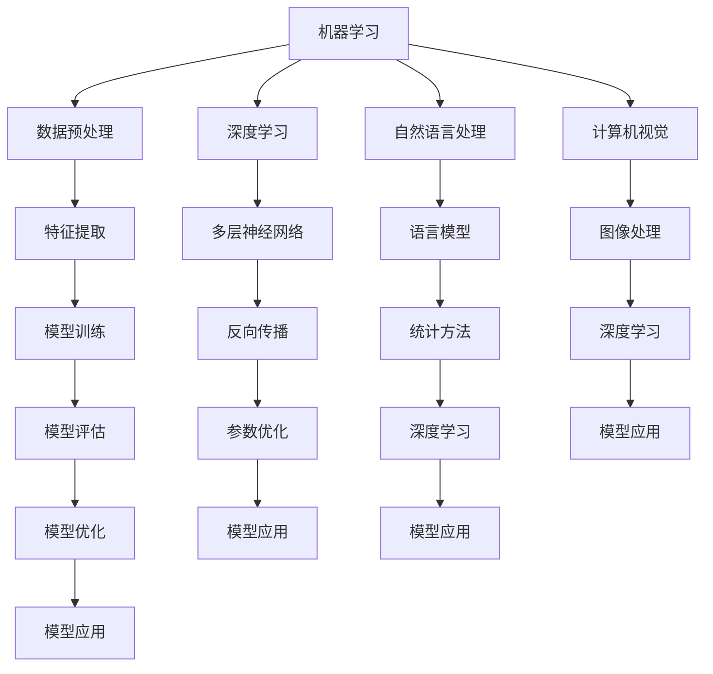

                 

# AI 人才培养：智能时代的人力资本投资

> 关键词：AI教育, 人才培养, 智能时代, 人力资本, 技术创新, 教学方法, 项目实战

> 摘要：在智能时代，人工智能（AI）技术正以前所未有的速度改变着我们的生活和工作方式。AI技术的发展不仅依赖于技术本身的进步，更依赖于具备深厚AI知识和技能的人才。本文将从AI人才培养的角度出发，探讨如何在智能时代进行有效的人力资本投资，包括核心概念与联系、核心算法原理、数学模型与公式、项目实战案例、实际应用场景、工具和资源推荐、未来发展趋势与挑战等内容，旨在为AI教育者和从业者提供有价值的参考和指导。

## 1. 背景介绍

随着大数据、云计算、物联网等技术的迅猛发展，人工智能（AI）已经成为推动社会进步的重要力量。AI技术的应用范围日益广泛，从自动驾驶、医疗健康、金融科技到智能制造等各个领域，AI技术正在重塑我们的工作和生活方式。然而，AI技术的发展不仅依赖于技术本身的进步，更依赖于具备深厚AI知识和技能的人才。因此，AI人才培养成为智能时代的重要议题。

### 1.1 AI技术的发展历程

AI技术的发展经历了从符号主义到连接主义，再到深度学习的演变过程。早期的AI研究主要集中在符号主义方法上，如专家系统和逻辑推理。然而，这些方法在处理复杂问题时表现出明显的局限性。随着神经网络的发展，特别是深度学习技术的兴起，AI技术取得了突破性进展。深度学习通过模拟人脑神经元的工作原理，能够处理大规模数据集，并在图像识别、语音识别、自然语言处理等领域取得了显著成果。

### 1.2 AI技术的应用场景

AI技术的应用场景广泛，涵盖了多个行业和领域。例如，在医疗健康领域，AI技术可以通过分析大量的医疗数据，帮助医生进行疾病诊断和治疗方案制定；在金融科技领域，AI技术可以用于风险控制、智能投顾等；在智能制造领域，AI技术可以实现生产线的智能化管理，提高生产效率和产品质量。这些应用场景不仅展示了AI技术的强大功能，也为AI人才培养提供了丰富的实践机会。

### 1.3 AI人才培养的重要性

AI技术的发展离不开人才的支持。具备深厚AI知识和技能的人才能够推动技术进步，解决实际问题，创造更多价值。因此，AI人才培养成为智能时代的重要任务。通过培养具备扎实理论基础和实践能力的人才，可以为AI技术的发展提供源源不断的动力，促进社会的进步和发展。

## 2. 核心概念与联系

### 2.1 AI的基本概念

AI是指由计算机系统所表现出的智能行为。AI技术的核心在于模拟人类智能，通过学习、推理、感知和决策等过程，实现对复杂问题的解决。AI技术主要包括机器学习、深度学习、自然语言处理、计算机视觉等多个分支。

### 2.2 AI技术的核心概念

- **机器学习（Machine Learning, ML）**：机器学习是AI的一个重要分支，通过算法使计算机系统能够从数据中学习并改进性能。机器学习的核心在于构建模型，通过训练数据集优化模型参数，从而实现对未知数据的预测和分类。
- **深度学习（Deep Learning, DL）**：深度学习是机器学习的一个子领域，通过多层神经网络实现对复杂数据的建模。深度学习的核心在于构建深层神经网络，通过反向传播算法优化网络参数，从而实现对复杂模式的识别和分类。
- **自然语言处理（Natural Language Processing, NLP）**：自然语言处理是AI技术的一个重要分支，通过计算机系统理解和生成人类语言。自然语言处理的核心在于构建语言模型，通过统计方法和深度学习技术实现对语言的理解和生成。
- **计算机视觉（Computer Vision, CV）**：计算机视觉是AI技术的一个重要分支，通过计算机系统理解和分析图像和视频。计算机视觉的核心在于构建图像处理和分析模型，通过深度学习技术实现对图像和视频的理解和分析。

### 2.3 AI技术的核心概念流程图



## 3. 核心算法原理 & 具体操作步骤

### 3.1 机器学习算法原理

机器学习算法主要包括监督学习、无监督学习和强化学习。监督学习通过给定输入和输出数据对，训练模型进行预测；无监督学习通过分析数据的内在结构，发现数据的潜在模式；强化学习通过与环境的交互，学习最优策略。

#### 3.1.1 监督学习算法

监督学习算法主要包括线性回归、逻辑回归、支持向量机（SVM）、决策树、随机森林、梯度提升树（GBDT）等。以线性回归为例，其基本原理如下：

$$
y = \beta_0 + \beta_1 x_1 + \beta_2 x_2 + \cdots + \beta_n x_n + \epsilon
$$

其中，$y$ 是目标变量，$x_1, x_2, \cdots, x_n$ 是输入变量，$\beta_0, \beta_1, \cdots, \beta_n$ 是模型参数，$\epsilon$ 是误差项。通过最小化损失函数（如均方误差），可以求解模型参数。

#### 3.1.2 无监督学习算法

无监督学习算法主要包括聚类、降维、关联规则等。以K均值聚类为例，其基本原理如下：

1. 初始化聚类中心
2. 将每个样本分配到最近的聚类中心
3. 更新聚类中心
4. 重复步骤2和3，直到聚类中心不再变化

### 3.2 深度学习算法原理

深度学习算法主要包括卷积神经网络（CNN）、循环神经网络（RNN）、长短时记忆网络（LSTM）等。以卷积神经网络为例，其基本原理如下：

1. 输入层：接收输入数据
2. 卷积层：通过卷积操作提取特征
3. 池化层：通过池化操作降低特征维度
4. 全连接层：将特征映射到输出空间
5. 输出层：输出预测结果

### 3.3 自然语言处理算法原理

自然语言处理算法主要包括词袋模型、TF-IDF、词嵌入、序列标注等。以词嵌入为例，其基本原理如下：

1. 将词汇映射到高维向量空间
2. 通过训练模型学习词汇之间的关系
3. 通过向量操作实现对文本的理解和生成

### 3.4 计算机视觉算法原理

计算机视觉算法主要包括图像预处理、特征提取、目标检测、图像分割等。以目标检测为例，其基本原理如下：

1. 图像预处理：对图像进行归一化、缩放等操作
2. 特征提取：通过卷积操作提取图像特征
3. 目标检测：通过滑动窗口或区域提议网络（RPN）检测目标
4. 目标分类：通过分类器对检测到的目标进行分类

## 4. 数学模型和公式 & 详细讲解 & 举例说明

### 4.1 机器学习数学模型

机器学习数学模型主要包括线性回归、逻辑回归、支持向量机（SVM）等。以线性回归为例，其数学模型如下：

$$
y = \beta_0 + \beta_1 x_1 + \beta_2 x_2 + \cdots + \beta_n x_n + \epsilon
$$

其中，$y$ 是目标变量，$x_1, x_2, \cdots, x_n$ 是输入变量，$\beta_0, \beta_1, \cdots, \beta_n$ 是模型参数，$\epsilon$ 是误差项。通过最小化损失函数（如均方误差），可以求解模型参数。

### 4.2 深度学习数学模型

深度学习数学模型主要包括卷积神经网络（CNN）、循环神经网络（RNN）、长短时记忆网络（LSTM）等。以卷积神经网络为例，其数学模型如下：

1. 输入层：接收输入数据
2. 卷积层：通过卷积操作提取特征
3. 池化层：通过池化操作降低特征维度
4. 全连接层：将特征映射到输出空间
5. 输出层：输出预测结果

### 4.3 自然语言处理数学模型

自然语言处理数学模型主要包括词袋模型、TF-IDF、词嵌入、序列标注等。以词嵌入为例，其数学模型如下：

1. 将词汇映射到高维向量空间
2. 通过训练模型学习词汇之间的关系
3. 通过向量操作实现对文本的理解和生成

### 4.4 计算机视觉数学模型

计算机视觉数学模型主要包括图像预处理、特征提取、目标检测、图像分割等。以目标检测为例，其数学模型如下：

1. 图像预处理：对图像进行归一化、缩放等操作
2. 特征提取：通过卷积操作提取图像特征
3. 目标检测：通过滑动窗口或区域提议网络（RPN）检测目标
4. 目标分类：通过分类器对检测到的目标进行分类

## 5. 项目实战：代码实际案例和详细解释说明

### 5.1 开发环境搭建

为了进行AI项目实战，需要搭建合适的开发环境。开发环境主要包括Python编程语言、TensorFlow深度学习框架、Jupyter Notebook等工具。具体步骤如下：

1. 安装Python：访问Python官方网站下载并安装最新版本的Python。
2. 安装TensorFlow：使用pip命令安装TensorFlow库。
3. 安装Jupyter Notebook：使用pip命令安装Jupyter Notebook。
4. 配置开发环境：在Jupyter Notebook中创建新的Python Notebook，导入所需的库和模块。

### 5.2 源代码详细实现和代码解读

以一个简单的线性回归模型为例，展示如何使用Python和TensorFlow实现线性回归。

```python
import numpy as np
import tensorflow as tf
import matplotlib.pyplot as plt

# 生成模拟数据
np.random.seed(0)
X = np.random.rand(100, 1)
y = 2 + 3 * X + np.random.rand(100, 1)

# 定义模型参数
W = tf.Variable(tf.random.uniform([1, 1], -1.0, 1.0))
b = tf.Variable(tf.zeros([1]))

# 定义模型
def model(X):
    return tf.add(tf.matmul(X, W), b)

# 定义损失函数
def loss(y_true, y_pred):
    return tf.reduce_mean(tf.square(y_true - y_pred))

# 定义优化器
optimizer = tf.optimizers.SGD(learning_rate=0.01)

# 训练模型
for i in range(1000):
    with tf.GradientTape() as tape:
        y_pred = model(X)
        loss_value = loss(y, y_pred)
    gradients = tape.gradient(loss_value, [W, b])
    optimizer.apply_gradients(zip(gradients, [W, b]))

# 输出模型参数
print("W:", W.numpy())
print("b:", b.numpy())

# 绘制拟合结果
plt.scatter(X, y)
plt.plot(X, model(X).numpy(), color='red')
plt.show()
```

### 5.3 代码解读与分析

1. **数据生成**：使用NumPy生成模拟数据，包括输入变量X和目标变量y。
2. **模型参数初始化**：使用TensorFlow定义模型参数W和b。
3. **模型定义**：定义线性回归模型，通过矩阵乘法和加法实现线性变换。
4. **损失函数定义**：定义均方误差作为损失函数，用于衡量模型预测值与真实值之间的差异。
5. **优化器定义**：使用随机梯度下降（SGD）作为优化器，通过调整模型参数来最小化损失函数。
6. **模型训练**：通过梯度下降算法更新模型参数，迭代1000次。
7. **模型输出**：输出训练后的模型参数W和b。
8. **结果可视化**：使用Matplotlib绘制拟合结果，展示模型对模拟数据的拟合情况。

## 6. 实际应用场景

### 6.1 医疗健康领域

在医疗健康领域，AI技术可以用于疾病诊断、治疗方案制定、药物研发等方面。例如，通过分析大量的医疗数据，AI技术可以帮助医生进行疾病诊断和治疗方案制定，提高诊断准确性和治疗效果。

### 6.2 金融科技领域

在金融科技领域，AI技术可以用于风险控制、智能投顾等方面。例如，通过分析大量的金融数据，AI技术可以帮助金融机构进行风险评估和控制，提高风险管理水平；通过分析用户行为数据，AI技术可以帮助金融机构提供个性化的投资建议，提高用户满意度。

### 6.3 智能制造领域

在智能制造领域，AI技术可以用于生产线的智能化管理，提高生产效率和产品质量。例如，通过分析生产线上的传感器数据，AI技术可以帮助企业实时监控生产线状态，预测设备故障，提高生产效率；通过分析产品质量数据，AI技术可以帮助企业进行质量控制，提高产品质量。

## 7. 工具和资源推荐

### 7.1 学习资源推荐

- **书籍**：《深度学习》（Goodfellow, Bengio, Courville著）、《机器学习》（周志华著）、《自然语言处理入门》（Jurafsky, Martin著）
- **论文**：《Attention Is All You Need》（Vaswani et al.）、《ResNet: Deep Residual Learning for Image Recognition》（He et al.）
- **博客**：Medium上的AI技术博客、GitHub上的AI项目教程
- **网站**：Coursera、edX、Udacity等在线教育平台

### 7.2 开发工具框架推荐

- **Python**：Python是AI开发的首选语言，具有丰富的库和工具支持。
- **TensorFlow**：TensorFlow是Google开发的深度学习框架，具有强大的模型训练和部署能力。
- **PyTorch**：PyTorch是Facebook开发的深度学习框架，具有灵活的模型定义和动态计算图支持。
- **Jupyter Notebook**：Jupyter Notebook是Python开发的交互式编程环境，支持代码、文本和可视化等多种内容。

### 7.3 相关论文著作推荐

- **书籍**：《深度学习》（Goodfellow, Bengio, Courville著）、《机器学习》（周志华著）、《自然语言处理入门》（Jurafsky, Martin著）
- **论文**：《Attention Is All You Need》（Vaswani et al.）、《ResNet: Deep Residual Learning for Image Recognition》（He et al.）

## 8. 总结：未来发展趋势与挑战

### 8.1 未来发展趋势

1. **技术融合**：AI技术与其他技术（如物联网、大数据、云计算等）的融合将进一步推动技术进步。
2. **应用场景拓展**：AI技术将在更多领域得到应用，如智能城市、智能交通、智能农业等。
3. **技术创新**：AI技术将持续创新，如强化学习、迁移学习、联邦学习等。
4. **伦理与法律**：AI技术的发展将引发伦理和法律问题，需要制定相应的规范和标准。

### 8.2 挑战

1. **数据隐私**：AI技术需要大量数据进行训练，如何保护用户数据隐私成为重要挑战。
2. **算法公平性**：AI算法可能存在偏见，如何保证算法公平性成为重要问题。
3. **技术普及**：AI技术的普及需要解决技术门槛和成本问题，如何降低技术门槛成为重要挑战。
4. **人才短缺**：AI技术的发展需要大量人才支持，如何培养AI人才成为重要问题。

## 9. 附录：常见问题与解答

### 9.1 问题1：如何选择合适的AI技术？

**解答**：选择合适的AI技术需要考虑具体应用场景和需求。例如，在医疗健康领域，可以使用深度学习技术进行疾病诊断；在金融科技领域，可以使用机器学习技术进行风险控制；在智能制造领域，可以使用计算机视觉技术进行生产线监控。

### 9.2 问题2：如何保护用户数据隐私？

**解答**：保护用户数据隐私可以通过数据脱敏、数据加密、访问控制等技术手段实现。同时，需要制定相应的数据保护政策和规范，确保用户数据的安全。

### 9.3 问题3：如何保证AI算法公平性？

**解答**：保证AI算法公平性可以通过数据预处理、算法设计、模型评估等方法实现。例如，在数据预处理阶段，可以使用数据均衡技术消除数据偏见；在算法设计阶段，可以使用公平性约束优化算法；在模型评估阶段，可以使用公平性指标评估模型性能。

## 10. 扩展阅读 & 参考资料

- **书籍**：《深度学习》（Goodfellow, Bengio, Courville著）、《机器学习》（周志华著）、《自然语言处理入门》（Jurafsky, Martin著）
- **论文**：《Attention Is All You Need》（Vaswani et al.）、《ResNet: Deep Residual Learning for Image Recognition》（He et al.）
- **网站**：Coursera、edX、Udacity等在线教育平台

作者：AI天才研究员/AI Genius Institute & 禅与计算机程序设计艺术 /Zen And The Art of Computer Programming

