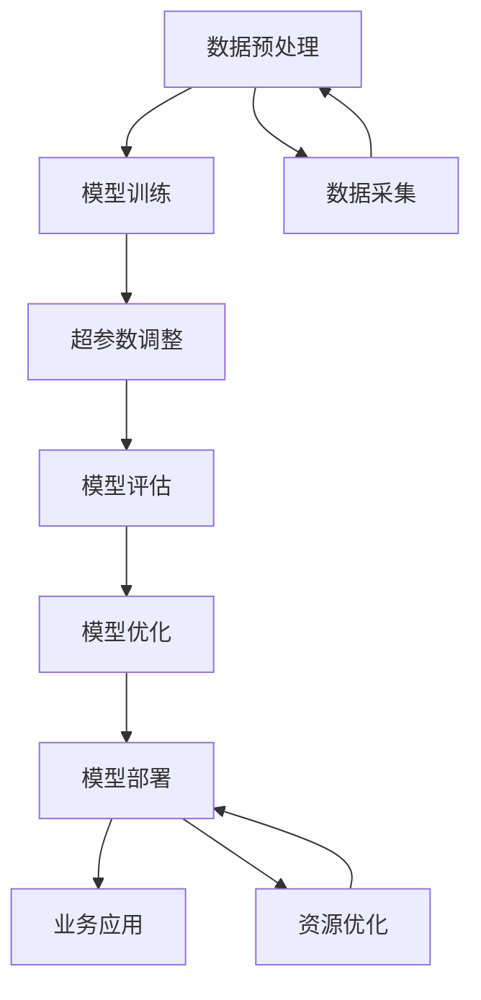

                 

# AI 创业公司的大模型转型策略

> 关键词：大模型转型、AI创业公司、技术架构、业务增长、模型优化、资源分配、市场趋势

> 摘要：本文旨在为AI创业公司提供大模型转型的策略指导，通过逐步分析推理的方式，探讨如何在保持现有业务的同时，逐步引入和优化大模型，以实现业务增长和技术升级。文章将从背景介绍、核心概念与联系、核心算法原理、项目实战、实际应用场景、工具和资源推荐、总结与未来趋势等多方面进行详细阐述。

## 1. 背景介绍

随着人工智能技术的飞速发展，大模型因其强大的计算能力和广泛的适用性，成为众多AI创业公司的关注焦点。大模型不仅能够处理复杂的任务，还能在多个领域实现突破性的进展。然而，对于许多初创公司而言，如何在现有业务基础上成功转型至大模型，是一个充满挑战的任务。本文将探讨AI创业公司在大模型转型过程中可能遇到的问题，以及如何通过合理的策略实现平稳过渡。

### 1.1 问题与挑战

- **资源限制**：初创公司往往面临资金、人才和技术资源的限制。
- **技术复杂性**：大模型的训练和部署涉及复杂的算法和硬件需求。
- **业务连续性**：如何在转型过程中保持现有业务的稳定运行。
- **市场适应性**：如何快速适应市场变化，确保产品竞争力。

### 1.2 转型目标

- **技术升级**：提升现有产品的技术含量，增强市场竞争力。
- **业务扩展**：通过引入大模型，开拓新的业务领域。
- **资源优化**：合理分配资源，提高整体效率。

## 2. 核心概念与联系

### 2.1 大模型概述

大模型是指具有大量参数和复杂结构的机器学习模型，通常用于处理大规模数据和复杂任务。大模型的优势在于其强大的泛化能力和对新数据的适应性。

### 2.2 核心概念原理

- **模型架构**：包括Transformer、BERT、GPT等。
- **训练过程**：涉及数据预处理、模型训练、超参数调整等。
- **部署策略**：包括模型压缩、量化、推理优化等。

### 2.3 Mermaid 流程图



## 3. 核心算法原理 & 具体操作步骤

### 3.1 模型训练

- **数据准备**：收集和清洗数据，确保数据质量和多样性。
- **模型选择**：根据任务需求选择合适的模型架构。
- **超参数调整**：通过实验确定最佳超参数组合。
- **训练过程**：使用优化算法进行模型训练。

### 3.2 模型优化

- **模型压缩**：通过剪枝、量化等技术减少模型大小。
- **量化技术**：将模型权重从浮点数转换为定点数。
- **推理优化**：优化模型推理过程，提高运行效率。

### 3.3 具体操作步骤

1. **数据准备**：收集和清洗数据，确保数据质量和多样性。
2. **模型选择**：根据任务需求选择合适的模型架构。
3. **超参数调整**：通过实验确定最佳超参数组合。
4. **模型训练**：使用优化算法进行模型训练。
5. **模型优化**：通过模型压缩、量化等技术减少模型大小。
6. **模型部署**：将优化后的模型部署到生产环境。
7. **业务应用**：将模型应用于实际业务场景，实现业务增长。

## 4. 数学模型和公式 & 详细讲解 & 举例说明

### 4.1 模型训练公式

$$
\text{Loss} = \frac{1}{N} \sum_{i=1}^{N} \text{Loss}(y_i, \hat{y}_i)
$$

其中，$N$ 是样本数量，$y_i$ 是真实标签，$\hat{y}_i$ 是模型预测值。

### 4.2 模型优化公式

$$
\text{Quantization Error} = \left| \frac{w - \hat{w}}{w} \right|
$$

其中，$w$ 是原始权重，$\hat{w}$ 是量化后的权重。

### 4.3 举例说明

假设我们有一个简单的线性回归模型，其损失函数为：

$$
\text{Loss} = \frac{1}{N} \sum_{i=1}^{N} (y_i - \hat{y}_i)^2
$$

通过梯度下降法优化模型参数，可以逐步减小损失函数值。

## 5. 项目实战：代码实际案例和详细解释说明

### 5.1 开发环境搭建

1. **安装Python环境**：确保安装了Python 3.8及以上版本。
2. **安装依赖库**：安装TensorFlow、PyTorch等深度学习框架。
3. **配置硬件资源**：确保有足够强大的GPU支持。

### 5.2 源代码详细实现和代码解读

```python
import tensorflow as tf
from tensorflow.keras.models import Sequential
from tensorflow.keras.layers import Dense

# 数据准备
(x_train, y_train), (x_test, y_test) = tf.keras.datasets.mnist.load_data()
x_train = x_train / 255.0
x_test = x_test / 255.0

# 模型构建
model = Sequential([
    tf.keras.layers.Flatten(input_shape=(28, 28)),
    tf.keras.layers.Dense(128, activation='relu'),
    tf.keras.layers.Dense(10, activation='softmax')
])

# 模型编译
model.compile(optimizer='adam',
              loss='sparse_categorical_crossentropy',
              metrics=['accuracy'])

# 模型训练
model.fit(x_train, y_train, epochs=10)

# 模型评估
test_loss, test_acc = model.evaluate(x_test, y_test)
print(f'Test accuracy: {test_acc}')
```

### 5.3 代码解读与分析

- **数据准备**：使用MNIST数据集，进行归一化处理。
- **模型构建**：构建一个简单的全连接神经网络。
- **模型编译**：选择优化器、损失函数和评估指标。
- **模型训练**：使用训练数据进行模型训练。
- **模型评估**：使用测试数据评估模型性能。

## 6. 实际应用场景

### 6.1 语音识别

通过引入大模型，提高语音识别的准确率和鲁棒性。

### 6.2 图像分类

利用大模型进行图像分类，提升分类精度和速度。

### 6.3 自然语言处理

通过大模型进行文本生成、情感分析等任务，提升产品竞争力。

## 7. 工具和资源推荐

### 7.1 学习资源推荐

- **书籍**：《深度学习》（Goodfellow et al.）
- **论文**：《Attention is All You Need》（Vaswani et al.）
- **博客**：Medium上的AI技术博客
- **网站**：TensorFlow.org、PyTorch.org

### 7.2 开发工具框架推荐

- **深度学习框架**：TensorFlow、PyTorch
- **开发工具**：Jupyter Notebook、VS Code

### 7.3 相关论文著作推荐

- **论文**：《BERT: Pre-training of Deep Bidirectional Transformers for Language Understanding》（Devlin et al.）
- **著作**：《深度学习实战》（吴恩达）

## 8. 总结：未来发展趋势与挑战

### 8.1 未来发展趋势

- **技术升级**：大模型将继续推动AI技术的发展。
- **业务扩展**：大模型将为更多领域带来创新机会。
- **资源优化**：资源分配将更加合理，提高整体效率。

### 8.2 挑战

- **技术复杂性**：大模型的训练和部署仍面临技术挑战。
- **市场适应性**：快速适应市场变化，确保产品竞争力。
- **资源限制**：合理分配资源，克服资金、人才和技术限制。

## 9. 附录：常见问题与解答

### 9.1 问题1：如何选择合适的模型架构？

- **答案**：根据任务需求选择合适的模型架构，如Transformer、BERT等。

### 9.2 问题2：如何优化模型性能？

- **答案**：通过模型压缩、量化等技术减少模型大小，提高运行效率。

## 10. 扩展阅读 & 参考资料

- **书籍**：《深度学习》（Goodfellow et al.）
- **论文**：《Attention is All You Need》（Vaswani et al.）
- **网站**：TensorFlow.org、PyTorch.org

---

作者：禅与计算机程序设计艺术 / Zen and the Art of Computer Programming

