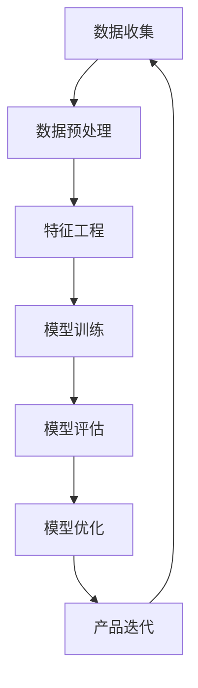

                 

# AI创业公司的产品迭代策略

> 关键词：AI创业公司, 产品迭代, 机器学习, 数据驱动, 用户反馈, A/B测试, 模型优化

> 摘要：本文旨在为AI创业公司提供一套系统化的产品迭代策略，通过深入分析产品开发过程中的关键环节，结合实际案例和数学模型，帮助创业团队更好地理解如何利用数据驱动的方法来优化产品性能，提升用户体验。文章将从背景介绍、核心概念与联系、核心算法原理、项目实战、实际应用场景、工具和资源推荐、总结与未来趋势等多个方面进行详细阐述。

## 1. 背景介绍

随着人工智能技术的飞速发展，越来越多的创业公司开始涉足AI领域，希望通过创新的产品和服务来满足市场需求。然而，AI产品的开发和迭代并非易事，尤其是在创业初期，资源有限、时间紧迫的情况下，如何高效地进行产品迭代成为了一个亟待解决的问题。本文将从AI创业公司的角度出发，探讨如何制定一套科学合理的产品迭代策略，以确保产品能够快速响应市场变化，满足用户需求。

## 2. 核心概念与联系

### 2.1 机器学习与AI产品开发

机器学习是AI领域的重要分支，它通过算法和统计模型来使计算机系统能够从数据中学习并做出预测或决策。在AI产品开发过程中，机器学习技术的应用至关重要，它能够帮助产品更好地理解用户需求，提供个性化的服务，从而提升用户体验。

### 2.2 数据驱动的产品开发

数据驱动的产品开发是指在产品开发过程中，充分利用数据来指导决策，优化产品性能。通过收集和分析用户行为数据、反馈数据等，可以更准确地了解用户需求，从而指导产品迭代的方向。

### 2.3 A/B测试与模型优化

A/B测试是一种常用的实验方法，通过对比不同版本的产品来评估其效果。模型优化则是指通过对模型参数的调整来提高模型的性能。这两者在产品迭代过程中发挥着重要作用，能够帮助团队快速发现产品的问题并进行改进。

### 2.4 用户反馈与迭代优化

用户反馈是产品迭代的重要依据。通过收集用户反馈，可以了解产品存在的问题和改进空间，从而指导产品迭代的方向。用户反馈可以来自多种渠道，如用户调研、用户访谈、用户行为分析等。

### 2.5 数据流图



## 3. 核心算法原理 & 具体操作步骤

### 3.1 数据预处理

数据预处理是机器学习流程中的重要步骤，主要包括数据清洗、数据转换、数据归一化等。具体操作步骤如下：

1. **数据清洗**：去除重复数据、处理缺失值、纠正错误数据。
2. **数据转换**：将非数值型数据转换为数值型数据，如将文本数据转换为词向量。
3. **数据归一化**：将数据缩放到一个特定的范围，如0到1之间，以提高模型训练效果。

### 3.2 特征工程

特征工程是指从原始数据中提取有用的特征，以提高模型的性能。具体操作步骤如下：

1. **特征选择**：选择与目标变量相关的特征，去除无关特征。
2. **特征构造**：通过组合原始特征来构造新的特征，如时间序列特征、用户行为特征等。
3. **特征缩放**：对特征进行标准化或归一化处理，以提高模型训练效果。

### 3.3 模型训练

模型训练是机器学习流程中的核心步骤，具体操作步骤如下：

1. **选择模型**：根据问题类型选择合适的机器学习模型，如线性回归、决策树、神经网络等。
2. **训练模型**：使用训练数据集对模型进行训练，调整模型参数。
3. **验证模型**：使用验证数据集对模型进行验证，评估模型性能。

### 3.4 模型评估

模型评估是衡量模型性能的重要步骤，具体操作步骤如下：

1. **选择评估指标**：根据问题类型选择合适的评估指标，如准确率、召回率、F1值等。
2. **计算评估指标**：使用测试数据集计算模型的评估指标。
3. **分析评估结果**：分析评估结果，了解模型的优缺点，指导模型优化。

### 3.5 模型优化

模型优化是提高模型性能的重要步骤，具体操作步骤如下：

1. **调整模型参数**：通过调整模型参数来优化模型性能。
2. **特征选择与构造**：通过特征选择与构造来提高模型性能。
3. **集成学习**：通过集成多个模型来提高模型性能。

## 4. 数学模型和公式 & 详细讲解 & 举例说明

### 4.1 逻辑回归模型

逻辑回归是一种常用的分类模型，其数学模型如下：

$$
P(y=1|x) = \frac{1}{1 + e^{-(\beta_0 + \beta_1 x_1 + \beta_2 x_2 + ... + \beta_n x_n)}}
$$

其中，$P(y=1|x)$ 表示在给定特征 $x$ 的情况下，目标变量 $y$ 为1的概率；$\beta_0, \beta_1, \beta_2, ..., \beta_n$ 是模型参数。

### 4.2 决策树模型

决策树是一种常用的分类模型，其数学模型如下：

$$
f(x) = \begin{cases}
    y_1 & \text{if } x \in R_1 \\
    y_2 & \text{if } x \in R_2 \\
    \vdots \\
    y_m & \text{if } x \in R_m
\end{cases}
$$

其中，$f(x)$ 表示在给定特征 $x$ 的情况下，目标变量 $y$ 的预测值；$R_1, R_2, ..., R_m$ 是决策树的划分区域。

### 4.3 神经网络模型

神经网络是一种常用的分类模型，其数学模型如下：

$$
f(x) = \sigma(W_1 x + b_1) \sigma(W_2 \sigma(W_1 x + b_1) + b_2) \cdots \sigma(W_n \sigma(W_{n-1} \cdots \sigma(W_1 x + b_{n-1}) + b_{n-1}) + b_n)
$$

其中，$\sigma$ 表示激活函数；$W_1, W_2, ..., W_n$ 和 $b_1, b_2, ..., b_n$ 是模型参数。

## 5. 项目实战：代码实际案例和详细解释说明

### 5.1 开发环境搭建

为了进行项目实战，我们需要搭建一个合适的开发环境。具体步骤如下：

1. **安装Python**：确保安装了最新版本的Python。
2. **安装依赖库**：使用pip安装所需的机器学习库，如scikit-learn、tensorflow等。
3. **配置开发工具**：选择合适的开发工具，如Jupyter Notebook、PyCharm等。

### 5.2 源代码详细实现和代码解读

假设我们要实现一个简单的逻辑回归模型，具体代码如下：

```python
import numpy as np
from sklearn.linear_model import LogisticRegression
from sklearn.model_selection import train_test_split
from sklearn.metrics import accuracy_score

# 生成示例数据
X = np.random.rand(100, 2)
y = np.random.randint(0, 2, 100)

# 划分训练集和测试集
X_train, X_test, y_train, y_test = train_test_split(X, y, test_size=0.2, random_state=42)

# 创建逻辑回归模型
model = LogisticRegression()

# 训练模型
model.fit(X_train, y_train)

# 预测测试集
y_pred = model.predict(X_test)

# 计算准确率
accuracy = accuracy_score(y_test, y_pred)
print("Accuracy:", accuracy)
```

### 5.3 代码解读与分析

1. **导入库**：导入所需的库，包括numpy、scikit-learn等。
2. **生成示例数据**：生成随机的示例数据，包括特征 $X$ 和目标变量 $y$。
3. **划分训练集和测试集**：使用train_test_split函数将数据集划分为训练集和测试集。
4. **创建逻辑回归模型**：创建逻辑回归模型实例。
5. **训练模型**：使用训练数据集对模型进行训练。
6. **预测测试集**：使用测试数据集对模型进行预测。
7. **计算准确率**：使用accuracy_score函数计算模型的准确率。

## 6. 实际应用场景

### 6.1 用户推荐系统

用户推荐系统是AI产品中常见的应用场景之一。通过分析用户的历史行为数据，可以为用户推荐相关的产品或服务，从而提升用户体验。具体步骤如下：

1. **收集用户行为数据**：收集用户的浏览记录、购买记录等行为数据。
2. **构建用户画像**：通过用户行为数据构建用户画像，了解用户的兴趣和需求。
3. **构建推荐模型**：使用机器学习算法构建推荐模型，如协同过滤、深度学习等。
4. **实现推荐系统**：将推荐模型集成到产品中，实现推荐功能。

### 6.2 语音识别系统

语音识别系统是AI产品中另一个常见的应用场景。通过分析用户的语音数据，可以实现语音识别和语音合成等功能，从而提升用户体验。具体步骤如下：

1. **收集语音数据**：收集用户的语音数据，包括语音样本和对应的文本数据。
2. **构建语音识别模型**：使用机器学习算法构建语音识别模型，如深度神经网络、循环神经网络等。
3. **实现语音识别系统**：将语音识别模型集成到产品中，实现语音识别功能。

## 7. 工具和资源推荐

### 7.1 学习资源推荐

1. **书籍**：《机器学习》（周志华著）、《深度学习》（Ian Goodfellow著）
2. **论文**：《A Gentle Introduction to Machine Learning》、《Deep Learning for Natural Language Processing》
3. **博客**：Medium上的AI相关博客、GitHub上的机器学习项目
4. **网站**：Kaggle、Coursera、edX等在线学习平台

### 7.2 开发工具框架推荐

1. **开发工具**：Jupyter Notebook、PyCharm、VS Code
2. **框架**：TensorFlow、PyTorch、scikit-learn

### 7.3 相关论文著作推荐

1. **论文**：《Deep Residual Learning for Image Recognition》、《Attention Is All You Need》
2. **著作**：《Pattern Recognition and Machine Learning》、《Neural Networks and Deep Learning》

## 8. 总结：未来发展趋势与挑战

### 8.1 未来发展趋势

1. **数据驱动的产品开发**：数据驱动的产品开发将成为主流，通过充分利用数据来指导产品迭代。
2. **模型优化与集成学习**：模型优化和集成学习将成为提高模型性能的重要手段。
3. **个性化推荐系统**：个性化推荐系统将成为AI产品的重要组成部分，通过分析用户行为数据来提供个性化的服务。

### 8.2 面临的挑战

1. **数据隐私与安全**：如何在保护用户隐私的同时充分利用数据来指导产品迭代。
2. **模型解释性**：如何提高模型的解释性，使用户能够理解模型的决策过程。
3. **模型泛化能力**：如何提高模型的泛化能力，使其能够在不同场景下表现良好。

## 9. 附录：常见问题与解答

### 9.1 问题1：如何处理缺失值？

**解答**：可以采用多种方法处理缺失值，如删除含有缺失值的样本、使用均值或中位数填充缺失值、使用插值方法填充缺失值等。

### 9.2 问题2：如何选择合适的机器学习模型？

**解答**：选择合适的机器学习模型需要考虑问题类型、数据特征、模型性能等因素。可以通过实验比较不同模型的性能，选择最适合当前问题的模型。

### 9.3 问题3：如何提高模型的泛化能力？

**解答**：可以通过增加训练数据量、使用正则化方法、采用集成学习等方法提高模型的泛化能力。

## 10. 扩展阅读 & 参考资料

1. **书籍**：《机器学习》（周志华著）、《深度学习》（Ian Goodfellow著）
2. **论文**：《A Gentle Introduction to Machine Learning》、《Deep Learning for Natural Language Processing》
3. **博客**：Medium上的AI相关博客、GitHub上的机器学习项目
4. **网站**：Kaggle、Coursera、edX等在线学习平台

---

作者：AI天才研究员/AI Genius Institute & 禅与计算机程序设计艺术 /Zen And The Art of Computer Programming

