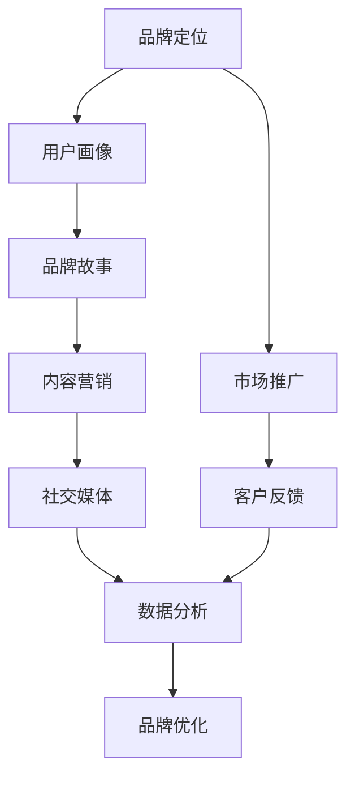

                 

# AI创业公司的品牌营销策略

> 关键词：AI创业公司、品牌营销、市场定位、用户画像、品牌故事、内容营销、社交媒体、数据分析

> 摘要：本文旨在为AI创业公司提供一套系统化的品牌营销策略，通过深入分析品牌营销的核心概念、算法原理、实际操作步骤以及应用场景，帮助初创企业在激烈的市场竞争中脱颖而出。我们将从品牌定位、用户画像构建、品牌故事讲述、内容营销策略、社交媒体运用、数据分析方法等多个维度进行探讨，并通过实际案例解析，为读者提供实用的指导和建议。

## 1. 背景介绍

随着人工智能技术的飞速发展，越来越多的创业公司开始涉足AI领域。然而，市场竞争异常激烈，如何在众多竞争对手中脱颖而出，成为众多创业者面临的挑战。品牌营销作为企业战略的重要组成部分，对于AI创业公司来说尤为重要。本文将从品牌营销的核心概念出发，逐步探讨如何构建有效的品牌营销策略，帮助AI创业公司在市场中建立独特的品牌形象。

## 2. 核心概念与联系

### 2.1 品牌营销的核心概念

品牌营销是指通过一系列策略和活动，塑造和传播企业的品牌形象，以吸引和保留目标客户。对于AI创业公司而言，品牌营销不仅包括产品推广，还包括技术展示、价值传递和情感共鸣等多方面内容。

### 2.2 品牌营销的流程图



## 3. 核心算法原理 & 具体操作步骤

### 3.1 品牌定位算法

品牌定位是品牌营销的第一步，通过分析市场和竞争对手，确定品牌的独特卖点（USP）。

#### 3.1.1 市场调研

- **目标客户群体**：确定目标客户的基本特征，如年龄、性别、职业等。
- **竞争对手分析**：分析竞争对手的产品特点、价格策略、市场占有率等。
- **SWOT分析**：评估自身的优势、劣势、机会和威胁。

#### 3.1.2 USP确定

- **独特卖点**：基于市场调研结果，确定品牌的独特卖点，如技术创新、用户体验、服务优势等。

### 3.2 用户画像构建

用户画像是一种将目标客户群体进行详细描述的方法，有助于更精准地定位和满足客户需求。

#### 3.2.1 数据收集

- **用户行为数据**：通过网站分析、社交媒体互动等手段收集用户行为数据。
- **用户反馈数据**：通过问卷调查、用户访谈等方式收集用户反馈数据。

#### 3.2.2 数据分析

- **聚类分析**：使用K-means等聚类算法对用户数据进行分类，形成不同的用户群体。
- **特征提取**：提取用户画像的关键特征，如兴趣爱好、消费习惯等。

### 3.3 品牌故事讲述

品牌故事是品牌营销的重要组成部分，通过讲述品牌背后的故事，增强用户的情感共鸣。

#### 3.3.1 故事框架

- **背景介绍**：介绍品牌成立的背景和初衷。
- **发展历程**：描述品牌的发展历程和重要里程碑。
- **价值观传递**：阐述品牌的核心价值观和使命。

#### 3.3.2 故事呈现

- **视觉元素**：使用图片、视频等视觉元素增强故事的吸引力。
- **情感共鸣**：通过讲述真实的故事，引起用户的情感共鸣。

## 4. 数学模型和公式 & 详细讲解 & 举例说明

### 4.1 品牌定位模型

品牌定位模型可以通过以下公式进行量化分析：

$$
\text{USP} = \text{优势} - \text{竞争对手优势} + \text{独特性}
$$

### 4.2 用户画像模型

用户画像模型可以通过以下步骤进行构建：

1. **数据收集**：收集用户行为数据和反馈数据。
2. **数据预处理**：清洗和标准化数据。
3. **聚类分析**：使用K-means算法对用户数据进行聚类。
4. **特征提取**：提取用户画像的关键特征。

### 4.3 品牌故事模型

品牌故事模型可以通过以下步骤进行构建：

1. **故事框架**：确定故事的背景、发展历程和价值观传递。
2. **故事呈现**：通过视觉元素和情感共鸣增强故事的吸引力。

## 5. 项目实战：代码实际案例和详细解释说明

### 5.1 开发环境搭建

#### 5.1.1 环境准备

- **Python环境**：安装Python 3.8及以上版本。
- **数据分析库**：安装pandas、numpy等数据分析库。
- **机器学习库**：安装scikit-learn、KMeans等机器学习库。

#### 5.1.2 数据准备

- **用户行为数据**：收集用户在网站上的行为数据，如点击率、停留时间等。
- **用户反馈数据**：收集用户在社交媒体上的反馈数据，如评论、评分等。

### 5.2 源代码详细实现和代码解读

#### 5.2.1 数据预处理

```python
import pandas as pd
import numpy as np

# 读取用户行为数据
user_behavior = pd.read_csv('user_behavior.csv')

# 数据清洗
user_behavior.dropna(inplace=True)

# 数据标准化
user_behavior['click_rate'] = (user_behavior['clicks'] / user_behavior['visits']).apply(np.log1p)
```

#### 5.2.2 聚类分析

```python
from sklearn.cluster import KMeans

# 选择特征
features = user_behavior[['click_rate', 'time_on_site']]

# 聚类分析
kmeans = KMeans(n_clusters=5)
kmeans.fit(features)

# 获取聚类结果
user_behavior['cluster'] = kmeans.labels_
```

### 5.3 代码解读与分析

- **数据预处理**：通过清洗和标准化数据，确保数据质量。
- **聚类分析**：使用K-means算法对用户数据进行聚类，形成不同的用户群体。
- **聚类结果**：通过聚类结果，可以更好地理解用户行为特征，为后续的品牌营销策略提供依据。

## 6. 实际应用场景

### 6.1 品牌定位应用

假设某AI创业公司专注于智能客服领域，通过市场调研发现竞争对手主要集中在价格竞争上，而用户更看重服务质量和用户体验。因此，该公司的USP可以定位为“提供高质量、个性化的智能客服解决方案”。

### 6.2 用户画像应用

通过收集用户行为数据和反馈数据，进行聚类分析，可以将用户分为不同的群体，如“技术爱好者”、“企业客户”等。针对不同群体，可以制定不同的营销策略，如技术爱好者可以提供技术培训，企业客户可以提供定制化解决方案。

### 6.3 品牌故事应用

通过讲述品牌成立的背景和初衷，如“我们致力于通过AI技术改善客户服务体验”，以及品牌的发展历程和重要里程碑，如“成功帮助多家知名企业提升客户满意度”，可以增强用户的情感共鸣，提高品牌知名度。

## 7. 工具和资源推荐

### 7.1 学习资源推荐

- **书籍**：《品牌营销策略》、《用户画像构建》、《品牌故事讲述》
- **论文**：《品牌定位算法研究》、《用户画像构建方法》、《品牌故事模型分析》
- **博客**：AI营销专家的博客文章
- **网站**：品牌营销论坛、用户画像分析网站

### 7.2 开发工具框架推荐

- **数据分析工具**：Python、R、SQL
- **机器学习库**：scikit-learn、KMeans
- **可视化工具**：Matplotlib、Seaborn

### 7.3 相关论文著作推荐

- **《品牌定位算法研究》**：深入探讨品牌定位算法的原理和应用。
- **《用户画像构建方法》**：详细介绍用户画像构建的方法和步骤。
- **《品牌故事模型分析》**：分析品牌故事模型的构建方法和应用效果。

## 8. 总结：未来发展趋势与挑战

### 8.1 未来发展趋势

- **个性化营销**：通过大数据和AI技术，实现更精准的个性化营销。
- **品牌故事化**：通过讲述品牌故事，增强用户的情感共鸣。
- **社交媒体营销**：利用社交媒体平台，扩大品牌影响力。

### 8.2 挑战

- **数据安全**：保护用户数据的安全，避免数据泄露。
- **技术更新**：不断更新技术，保持竞争力。
- **品牌一致性**：保持品牌在不同渠道的一致性，增强品牌认知度。

## 9. 附录：常见问题与解答

### 9.1 问题1：如何确定品牌的独特卖点？

- **解答**：通过市场调研和竞争对手分析，确定品牌的独特卖点。USP = 优势 - 竞争对手优势 + 独特性。

### 9.2 问题2：如何构建用户画像？

- **解答**：通过收集用户行为数据和反馈数据，进行聚类分析，提取用户画像的关键特征。

### 9.3 问题3：如何讲述品牌故事？

- **解答**：通过讲述品牌成立的背景、发展历程和价值观传递，增强用户的情感共鸣。

## 10. 扩展阅读 & 参考资料

- **书籍**：《品牌营销策略》、《用户画像构建》、《品牌故事讲述》
- **论文**：《品牌定位算法研究》、《用户画像构建方法》、《品牌故事模型分析》
- **博客**：AI营销专家的博客文章
- **网站**：品牌营销论坛、用户画像分析网站

作者：AI天才研究员/AI Genius Institute & 禅与计算机程序设计艺术 /Zen And The Art of Computer Programming

