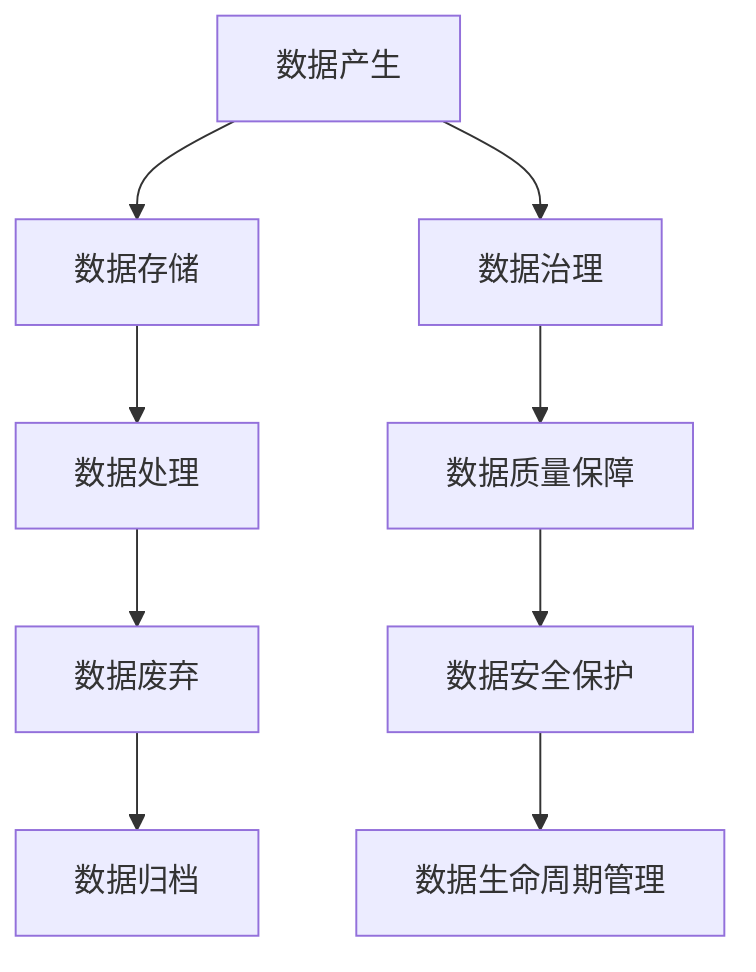

                 

# AI创业：数据管理的核心做法

> 关键词：数据管理、AI创业、数据架构、数据治理、数据质量、数据安全、数据生命周期

> 摘要：在AI创业中，数据管理是核心环节之一。本文将深入探讨数据管理的核心做法，从数据架构设计、数据治理、数据质量保障、数据安全保护以及数据生命周期管理等方面进行详细分析。通过一步步的推理和实际案例，帮助创业者构建高效、安全的数据管理体系，为AI项目的成功奠定坚实基础。

## 1. 背景介绍

在当今数字化时代，数据已成为企业最重要的资产之一。对于AI创业公司而言，数据不仅是训练模型的基础，更是驱动业务增长的关键。然而，数据管理并非易事，它涉及到数据的收集、存储、处理、分析和保护等多个环节。本文将从以下几个方面探讨AI创业中数据管理的核心做法：

- **数据架构设计**：如何构建一个高效的数据架构，以支持AI项目的顺利进行。
- **数据治理**：如何确保数据的质量和一致性，提高数据的可信度。
- **数据质量保障**：如何通过数据清洗、验证和监控，确保数据的准确性。
- **数据安全保护**：如何保护数据免受未经授权的访问和泄露。
- **数据生命周期管理**：如何有效管理数据的整个生命周期，从数据的产生到废弃。

## 2. 核心概念与联系

### 2.1 数据架构设计

数据架构设计是数据管理的基础。它涉及到数据的存储、处理和访问方式，直接影响到数据的可用性和效率。数据架构设计的核心概念包括：

- **数据模型**：描述数据的结构和关系，常见的数据模型有关系型模型、NoSQL模型和图模型。
- **数据存储**：选择合适的数据存储技术，如数据库、数据湖和数据仓库。
- **数据访问**：设计高效的数据访问接口，如API和数据服务。

### 2.2 数据治理

数据治理是确保数据质量、一致性和安全性的关键。数据治理的核心概念包括：

- **数据质量**：确保数据的准确性、完整性和一致性。
- **数据安全**：保护数据免受未经授权的访问和泄露。
- **数据合规**：遵守相关法律法规，确保数据的合法使用。

### 2.3 数据质量保障

数据质量保障是确保数据准确性和一致性的关键步骤。数据质量保障的核心概念包括：

- **数据清洗**：去除无效、重复和错误的数据。
- **数据验证**：通过规则和算法验证数据的准确性。
- **数据监控**：实时监控数据的质量，及时发现和解决问题。

### 2.4 数据安全保护

数据安全保护是确保数据免受未经授权的访问和泄露的关键措施。数据安全保护的核心概念包括：

- **数据加密**：使用加密技术保护数据的安全。
- **访问控制**：通过权限管理确保数据的访问安全。
- **数据备份**：定期备份数据，防止数据丢失。

### 2.5 数据生命周期管理

数据生命周期管理是确保数据在整个生命周期内得到有效管理的关键。数据生命周期管理的核心概念包括：

- **数据产生**：数据的收集和生成。
- **数据存储**：数据的存储和管理。
- **数据处理**：数据的清洗、分析和应用。
- **数据废弃**：数据的归档和废弃。

### Mermaid 流程图



## 3. 核心算法原理 & 具体操作步骤

### 3.1 数据架构设计

数据架构设计的核心算法原理包括：

- **数据模型选择**：根据业务需求选择合适的数据模型。
- **数据存储选择**：根据数据量和访问模式选择合适的数据存储技术。
- **数据访问设计**：设计高效的数据访问接口，提高数据的可用性。

具体操作步骤如下：

1. **需求分析**：明确业务需求，确定数据的类型和规模。
2. **数据模型设计**：选择合适的数据模型，设计数据的结构和关系。
3. **数据存储选择**：根据数据量和访问模式选择合适的数据存储技术。
4. **数据访问设计**：设计高效的数据访问接口，提高数据的可用性。

### 3.2 数据治理

数据治理的核心算法原理包括：

- **数据质量规则**：定义数据质量规则，确保数据的准确性、完整性和一致性。
- **数据安全策略**：制定数据安全策略，确保数据的安全性。
- **数据合规要求**：遵守相关法律法规，确保数据的合法使用。

具体操作步骤如下：

1. **数据质量规则定义**：定义数据质量规则，确保数据的准确性、完整性和一致性。
2. **数据安全策略制定**：制定数据安全策略，确保数据的安全性。
3. **数据合规要求遵守**：遵守相关法律法规，确保数据的合法使用。

### 3.3 数据质量保障

数据质量保障的核心算法原理包括：

- **数据清洗算法**：使用数据清洗算法去除无效、重复和错误的数据。
- **数据验证算法**：使用数据验证算法验证数据的准确性。
- **数据监控算法**：使用数据监控算法实时监控数据的质量，及时发现和解决问题。

具体操作步骤如下：

1. **数据清洗**：使用数据清洗算法去除无效、重复和错误的数据。
2. **数据验证**：使用数据验证算法验证数据的准确性。
3. **数据监控**：使用数据监控算法实时监控数据的质量，及时发现和解决问题。

### 3.4 数据安全保护

数据安全保护的核心算法原理包括：

- **数据加密算法**：使用数据加密算法保护数据的安全。
- **访问控制算法**：使用访问控制算法确保数据的访问安全。
- **数据备份算法**：使用数据备份算法定期备份数据，防止数据丢失。

具体操作步骤如下：

1. **数据加密**：使用数据加密算法保护数据的安全。
2. **访问控制**：使用访问控制算法确保数据的访问安全。
3. **数据备份**：使用数据备份算法定期备份数据，防止数据丢失。

### 3.5 数据生命周期管理

数据生命周期管理的核心算法原理包括：

- **数据产生管理**：管理数据的收集和生成。
- **数据存储管理**：管理数据的存储和管理。
- **数据处理管理**：管理数据的清洗、分析和应用。
- **数据废弃管理**：管理数据的归档和废弃。

具体操作步骤如下：

1. **数据产生管理**：管理数据的收集和生成。
2. **数据存储管理**：管理数据的存储和管理。
3. **数据处理管理**：管理数据的清洗、分析和应用。
4. **数据废弃管理**：管理数据的归档和废弃。

## 4. 数学模型和公式 & 详细讲解 & 举例说明

### 4.1 数据质量规则

数据质量规则可以使用数学模型来定义。例如，可以使用以下公式来定义数据的准确性：

$$
\text{Accuracy} = \frac{\text{Number of Correct Data Points}}{\text{Total Number of Data Points}}
$$

### 4.2 数据安全策略

数据安全策略可以使用数学模型来定义。例如，可以使用以下公式来定义数据的访问权限：

$$
\text{Access Control} = \begin{cases} 
1 & \text{if user has access} \\
0 & \text{if user does not have access} 
\end{cases}
$$

### 4.3 数据监控算法

数据监控算法可以使用数学模型来定义。例如，可以使用以下公式来定义数据的质量监控：

$$
\text{Quality Monitoring} = \begin{cases} 
1 & \text{if data quality is good} \\
0 & \text{if data quality is bad} 
\end{cases}
$$

## 5. 项目实战：代码实际案例和详细解释说明

### 5.1 开发环境搭建

为了实现上述数据管理的核心做法，我们需要搭建一个合适的开发环境。具体步骤如下：

1. **安装Python**：确保安装了Python 3.8及以上版本。
2. **安装依赖库**：安装必要的依赖库，如pandas、numpy和scikit-learn。
3. **配置数据库**：配置数据库，如MySQL或PostgreSQL。

### 5.2 源代码详细实现和代码解读

以下是一个简单的数据清洗和验证的代码示例：

```python
import pandas as pd
import numpy as np

# 读取数据
data = pd.read_csv('data.csv')

# 数据清洗
data = data.dropna()  # 去除无效数据
data = data.drop_duplicates()  # 去除重复数据

# 数据验证
def validate_data(data):
    if data.isnull().sum().sum() > 0:
        return False
    if data.duplicated().sum() > 0:
        return False
    return True

if validate_data(data):
    print("数据验证通过")
else:
    print("数据验证失败")

# 数据监控
def monitor_data(data):
    if data.isnull().sum().sum() > 0:
        print("存在无效数据")
    if data.duplicated().sum() > 0:
        print("存在重复数据")

monitor_data(data)
```

### 5.3 代码解读与分析

- **数据清洗**：使用`dropna()`和`drop_duplicates()`方法去除无效数据和重复数据。
- **数据验证**：定义`validate_data`函数，检查数据是否存在无效数据和重复数据。
- **数据监控**：定义`monitor_data`函数，实时监控数据的质量，及时发现和解决问题。

## 6. 实际应用场景

数据管理的核心做法在实际应用场景中具有广泛的应用。例如，在电商领域，可以通过数据管理实现以下功能：

- **用户行为分析**：通过分析用户的行为数据，了解用户的需求和偏好，优化产品和服务。
- **推荐系统**：通过分析用户的历史数据，实现个性化推荐，提高用户满意度。
- **库存管理**：通过分析销售数据，实现库存的合理管理，降低库存成本。

## 7. 工具和资源推荐

### 7.1 学习资源推荐

- **书籍**：《数据质量管理》、《数据治理》
- **论文**：《数据治理与数据质量》、《数据生命周期管理》
- **博客**：Data Science Central、KDNuggets
- **网站**：Data Quality Central、Data Governance Institute

### 7.2 开发工具框架推荐

- **数据存储**：MySQL、PostgreSQL、Hadoop
- **数据处理**：pandas、numpy、scikit-learn
- **数据治理**：DataGrip、Tableau

### 7.3 相关论文著作推荐

- **论文**：《数据治理与数据质量》、《数据生命周期管理》
- **著作**：《数据质量管理》、《数据治理》

## 8. 总结：未来发展趋势与挑战

数据管理在未来的发展趋势和挑战包括：

- **自动化**：通过自动化工具和算法，提高数据管理的效率和准确性。
- **智能化**：通过人工智能技术，实现数据的智能分析和应用。
- **合规性**：遵守相关法律法规，确保数据的合法使用。
- **安全性**：加强数据安全保护，防止数据泄露和滥用。

## 9. 附录：常见问题与解答

### 9.1 问题：如何选择合适的数据模型？

**解答**：选择合适的数据模型需要考虑业务需求和数据特点。例如，关系型模型适用于结构化数据，NoSQL模型适用于非结构化数据，图模型适用于复杂关系数据。

### 9.2 问题：如何确保数据的安全性？

**解答**：确保数据的安全性需要采取多种措施，如数据加密、访问控制和数据备份。同时，还需要遵守相关法律法规，确保数据的合法使用。

### 9.3 问题：如何实现数据的智能化分析？

**解答**：实现数据的智能化分析需要使用人工智能技术，如机器学习和深度学习。通过训练模型，实现数据的智能分析和应用。

## 10. 扩展阅读 & 参考资料

- **书籍**：《数据质量管理》、《数据治理》
- **论文**：《数据治理与数据质量》、《数据生命周期管理》
- **博客**：Data Science Central、KDNuggets
- **网站**：Data Quality Central、Data Governance Institute

---

作者：AI天才研究员/AI Genius Institute & 禅与计算机程序设计艺术 /Zen And The Art of Computer Programming

