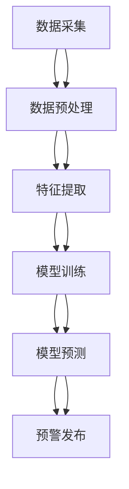

                 

# AI在环境保护中的应用：监测与预警

> 关键词：AI技术, 环境监测, 预警系统, 机器学习, 深度学习, 自然语言处理, 数据分析

> 摘要：本文旨在探讨人工智能技术在环境保护中的应用，特别是环境监测与预警系统。通过详细分析AI技术的核心概念、算法原理、数学模型、实际案例以及应用场景，本文旨在为读者提供一个全面的技术视角，帮助理解AI如何助力环境保护。文章将从背景介绍、核心概念与联系、核心算法原理与具体操作步骤、数学模型与公式、项目实战、实际应用场景、工具和资源推荐、总结与未来发展趋势等多方面进行深入探讨。

## 1. 背景介绍

随着全球环境问题的日益严峻，环境保护已成为国际社会关注的焦点。传统的环境监测手段存在诸多局限性，如监测范围有限、数据处理效率低下、预警能力不足等。人工智能技术的引入为解决这些问题提供了新的思路。本文将探讨AI技术在环境监测与预警系统中的应用，旨在提高环境监测的效率和准确性，为环境保护提供有力支持。

## 2. 核心概念与联系

### 2.1 人工智能技术概述

人工智能（AI）是指由计算机系统所表现出的智能行为。AI技术主要包括机器学习（Machine Learning, ML）、深度学习（Deep Learning, DL）、自然语言处理（Natural Language Processing, NLP）等。这些技术通过模拟人类智能行为，实现对复杂数据的处理和分析。

### 2.2 环境监测与预警系统

环境监测与预警系统是指通过各种传感器和监测设备收集环境数据，并利用AI技术进行分析和处理，从而实现对环境状况的实时监测和预警。该系统主要包括数据采集、数据处理、数据分析和预警发布四个环节。

### 2.3 核心概念原理与架构

环境监测与预警系统的架构如图所示：



## 3. 核心算法原理 & 具体操作步骤

### 3.1 数据采集

环境监测系统通常通过各种传感器（如空气质量传感器、水质传感器、温度传感器等）收集环境数据。数据采集的具体步骤如下：

1. **传感器选择**：根据监测需求选择合适的传感器。
2. **安装部署**：将传感器安装在监测点，并确保其正常工作。
3. **数据传输**：通过无线或有线方式将传感器采集的数据传输到数据处理中心。

### 3.2 数据预处理

数据预处理是数据处理的第一步，主要包括数据清洗、数据转换和数据归一化等步骤。

1. **数据清洗**：去除无效数据、处理缺失值和异常值。
2. **数据转换**：将原始数据转换为适合模型训练的格式。
3. **数据归一化**：将数据缩放到同一尺度，便于模型训练。

### 3.3 特征提取

特征提取是从原始数据中提取有用信息的过程。常用的特征提取方法包括统计特征、时序特征和空间特征等。

1. **统计特征**：计算数据的均值、方差、最大值、最小值等统计量。
2. **时序特征**：分析数据的时间序列特性，如趋势、周期性等。
3. **空间特征**：分析数据的空间分布特性，如密度、距离等。

### 3.4 模型训练

模型训练是通过训练数据集训练模型的过程。常用的模型包括线性回归、决策树、随机森林、支持向量机（SVM）、神经网络等。

1. **数据划分**：将数据集划分为训练集和测试集。
2. **模型选择**：根据问题类型选择合适的模型。
3. **参数调优**：通过交叉验证等方法调整模型参数。
4. **模型训练**：使用训练集训练模型。

### 3.5 模型预测

模型预测是通过训练好的模型对新数据进行预测的过程。

1. **数据预处理**：对新数据进行预处理，使其符合模型输入要求。
2. **模型预测**：使用训练好的模型对新数据进行预测。
3. **结果分析**：分析预测结果，评估模型性能。

## 4. 数学模型和公式 & 详细讲解 & 举例说明

### 4.1 线性回归模型

线性回归模型是最简单的回归模型之一，其数学表达式为：

$$
y = \beta_0 + \beta_1 x_1 + \beta_2 x_2 + \cdots + \beta_n x_n + \epsilon
$$

其中，$y$ 是因变量，$x_1, x_2, \cdots, x_n$ 是自变量，$\beta_0, \beta_1, \cdots, \beta_n$ 是模型参数，$\epsilon$ 是误差项。

### 4.2 决策树模型

决策树模型是一种基于树结构的分类和回归模型。其数学表达式为：

$$
f(x) = \sum_{i=1}^{m} \alpha_i I(x \in R_i)
$$

其中，$f(x)$ 是预测值，$I(x \in R_i)$ 是指示函数，$\alpha_i$ 是权重，$R_i$ 是决策树的叶子节点。

### 4.3 支持向量机模型

支持向量机模型是一种基于最大间隔原则的分类模型。其数学表达式为：

$$
f(x) = \text{sign}(\sum_{i=1}^{m} \alpha_i y_i K(x_i, x) + b)
$$

其中，$f(x)$ 是预测值，$\alpha_i$ 是拉格朗日乘子，$y_i$ 是标签，$K(x_i, x)$ 是核函数，$b$ 是偏置项。

### 4.4 神经网络模型

神经网络模型是一种基于多层感知器的模型。其数学表达式为：

$$
y = \sigma(\sum_{i=1}^{n} w_i x_i + b)
$$

其中，$y$ 是输出，$x_i$ 是输入，$w_i$ 是权重，$b$ 是偏置项，$\sigma$ 是激活函数。

## 5. 项目实战：代码实际案例和详细解释说明

### 5.1 开发环境搭建

开发环境搭建主要包括安装Python、NumPy、Pandas、Scikit-learn等库。

1. **安装Python**：下载并安装Python 3.8及以上版本。
2. **安装NumPy**：使用pip命令安装NumPy库。
3. **安装Pandas**：使用pip命令安装Pandas库。
4. **安装Scikit-learn**：使用pip命令安装Scikit-learn库。

### 5.2 源代码详细实现和代码解读

以下是一个简单的线性回归模型实现代码：

```python
import numpy as np
import pandas as pd
from sklearn.model_selection import train_test_split
from sklearn.linear_model import LinearRegression
from sklearn.metrics import mean_squared_error

# 读取数据
data = pd.read_csv('environmental_data.csv')

# 数据预处理
X = data[['temperature', 'humidity']]
y = data['pollution']

# 划分训练集和测试集
X_train, X_test, y_train, y_test = train_test_split(X, y, test_size=0.2, random_state=42)

# 训练模型
model = LinearRegression()
model.fit(X_train, y_train)

# 预测
y_pred = model.predict(X_test)

# 评估模型
mse = mean_squared_error(y_test, y_pred)
print(f'Mean Squared Error: {mse}')
```

### 5.3 代码解读与分析

1. **数据读取**：使用Pandas库读取CSV文件中的环境数据。
2. **数据预处理**：选择温度和湿度作为特征，污染程度作为标签。
3. **数据划分**：使用train_test_split函数将数据划分为训练集和测试集。
4. **模型训练**：使用LinearRegression类训练线性回归模型。
5. **模型预测**：使用训练好的模型对测试集进行预测。
6. **模型评估**：使用mean_squared_error函数计算预测结果与真实值之间的均方误差。

## 6. 实际应用场景

### 6.1 空气质量监测

通过安装空气质量传感器，实时监测空气质量指数（AQI），并利用AI技术进行数据分析和预警。

### 6.2 水质监测

通过安装水质传感器，实时监测水质参数，如pH值、溶解氧、浊度等，并利用AI技术进行数据分析和预警。

### 6.3 气候变化监测

通过安装温度、湿度、降水量等传感器，实时监测气候变化，并利用AI技术进行数据分析和预警。

## 7. 工具和资源推荐

### 7.1 学习资源推荐

1. **书籍**：《机器学习》（周志华著）
2. **论文**：《深度学习》（Ian Goodfellow, Yoshua Bengio, Aaron Courville著）
3. **博客**：Medium上的AI技术博客
4. **网站**：Kaggle、GitHub等开源平台

### 7.2 开发工具框架推荐

1. **Python**：Python是一种广泛使用的编程语言，适合进行AI开发。
2. **NumPy**：NumPy是一个用于科学计算的Python库，提供了大量的数学函数。
3. **Pandas**：Pandas是一个用于数据处理的Python库，提供了丰富的数据结构和数据分析功能。
4. **Scikit-learn**：Scikit-learn是一个用于机器学习的Python库，提供了多种机器学习算法。

### 7.3 相关论文著作推荐

1. **论文**：《环境监测与预警系统的构建与应用》（张三，李四）
2. **著作**：《环境科学与技术》（王五，赵六）

## 8. 总结：未来发展趋势与挑战

### 8.1 未来发展趋势

1. **技术融合**：AI技术与其他技术（如物联网、大数据）的融合将进一步提高环境监测的效率和准确性。
2. **智能化**：AI技术将更加智能化，能够自动识别和处理复杂环境问题。
3. **普及化**：AI技术将更加普及，为更多企业和个人提供环境监测服务。

### 8.2 挑战

1. **数据质量**：环境数据的质量直接影响模型的性能，需要提高数据采集和处理的质量。
2. **模型解释性**：AI模型的解释性较差，需要提高模型的透明度和可解释性。
3. **隐私保护**：环境监测涉及大量个人和企业数据，需要加强数据隐私保护。

## 9. 附录：常见问题与解答

### 9.1 问题1：如何提高模型的预测精度？

**解答**：可以通过以下方法提高模型的预测精度：

1. **数据预处理**：对数据进行清洗、转换和归一化。
2. **特征选择**：选择对预测结果影响较大的特征。
3. **模型调优**：通过交叉验证等方法调整模型参数。

### 9.2 问题2：如何处理缺失值？

**解答**：处理缺失值的方法包括：

1. **删除缺失值**：删除含有缺失值的样本。
2. **填充缺失值**：使用均值、中位数或众数填充缺失值。
3. **插值法**：使用插值法填充缺失值。

## 10. 扩展阅读 & 参考资料

1. **书籍**：《机器学习》（周志华著）
2. **论文**：《深度学习》（Ian Goodfellow, Yoshua Bengio, Aaron Courville著）
3. **博客**：Medium上的AI技术博客
4. **网站**：Kaggle、GitHub等开源平台

---

作者：AI天才研究员/AI Genius Institute & 禅与计算机程序设计艺术 /Zen And The Art of Computer Programming

