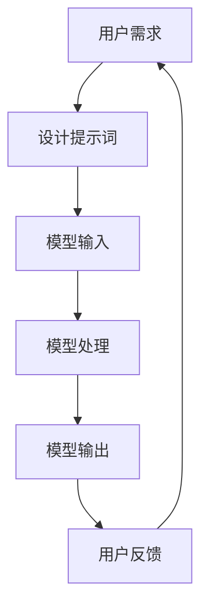

                 

# AI大模型LLM提示词工程实战

> 关键词：AI大模型、LLM、提示词工程、自然语言处理、机器学习

> 摘要：本文旨在深入探讨AI大模型LLM（Large Language Model）中的提示词工程（Prompt Engineering）技术，通过分析其核心概念、算法原理、数学模型、项目实战、应用场景、工具资源推荐以及未来发展趋势，为读者提供一个全面而深入的理解。本文适合对AI大模型和自然语言处理感兴趣的读者，特别是希望深入了解提示词工程的开发者和研究人员。

## 1. 背景介绍

随着AI技术的快速发展，特别是自然语言处理（NLP）领域，大模型（如GPT系列、BERT等）的应用越来越广泛。这些模型通过大量的文本数据训练，能够理解和生成高质量的自然语言文本。然而，如何有效地利用这些模型来解决具体问题，成为了研究和应用中的关键挑战。提示词工程（Prompt Engineering）正是解决这一问题的重要技术之一。通过精心设计的提示词，可以引导大模型生成符合特定需求的输出，从而实现更精准的应用。

提示词工程的核心在于如何设计和优化提示词，以最大化模型的输出效果。这不仅涉及到对模型特性的深入理解，还需要对应用场景的具体需求有清晰的认识。本文将从理论到实践，全面介绍提示词工程的相关知识和技术。

## 2. 核心概念与联系

### 2.1 大模型与提示词工程

大模型（如GPT-3、BERT等）是基于Transformer架构的深度学习模型，通过大量的文本数据训练，能够理解和生成高质量的自然语言文本。提示词工程则是通过设计特定的提示词，引导这些模型生成符合需求的输出。提示词可以是简单的文本字符串，也可以是复杂的多轮对话，其设计直接影响模型的输出效果。

### 2.2 提示词工程的原理

提示词工程的原理在于通过设计特定的提示词，引导模型生成符合需求的输出。提示词的设计需要考虑模型的特性、应用场景的具体需求以及用户交互的体验。通过优化提示词，可以最大化模型的输出效果，提高应用的准确性和实用性。

### 2.3 核心概念原理和架构的Mermaid流程图



## 3. 核心算法原理 & 具体操作步骤

### 3.1 提示词设计的基本原则

提示词设计的基本原则包括：简洁性、明确性、针对性和可扩展性。简洁性是指提示词应尽可能简洁明了；明确性是指提示词应明确表达需求；针对性是指提示词应针对具体的应用场景；可扩展性是指提示词应具备一定的灵活性，以适应不同的应用场景。

### 3.2 提示词设计的具体步骤

1. **需求分析**：明确应用场景的具体需求。
2. **模型特性分析**：了解所使用的模型的特性，包括模型的输入格式、输出格式等。
3. **设计初步提示词**：根据需求分析和模型特性分析，设计初步的提示词。
4. **测试与优化**：通过实际测试，评估提示词的效果，并根据反馈进行优化。
5. **迭代改进**：根据实际应用效果，不断迭代改进提示词，以达到最佳效果。

## 4. 数学模型和公式 & 详细讲解 & 举例说明

### 4.1 提示词工程的数学模型

提示词工程的数学模型主要涉及模型的输入输出关系。假设模型的输入为$x$，输出为$y$，提示词为$p$，则模型的输出可以表示为$y = f(x, p)$，其中$f$为模型的映射函数。提示词$p$的设计直接影响模型的输出$y$。

### 4.2 举例说明

假设我们希望使用GPT-3模型生成一段描述秋天的诗歌。我们可以设计提示词为“秋天的诗歌”，模型的输入为提示词，输出为生成的诗歌。通过调整提示词，如“秋天的诗歌，描述落叶纷飞”，可以引导模型生成更具体的诗歌内容。

## 5. 项目实战：代码实际案例和详细解释说明

### 5.1 开发环境搭建

#### 5.1.1 硬件环境

- CPU：Intel i7 或同等性能
- GPU：NVIDIA RTX 3080 或同等性能
- 内存：16GB 或以上

#### 5.1.2 软件环境

- 操作系统：Ubuntu 20.04 或同等性能
- Python：3.8 或以上
- PyTorch：1.9 或以上
- Transformers：4.10 或以上

### 5.2 源代码详细实现和代码解读

```python
from transformers import pipeline

# 初始化模型
generator = pipeline('text-generation', model='gpt-3')

# 设计提示词
prompt = "秋天的诗歌，描述落叶纷飞"

# 生成文本
output = generator(prompt, max_length=50)

# 输出结果
print(output)
```

### 5.3 代码解读与分析

上述代码中，我们使用了Hugging Face的Transformers库来初始化GPT-3模型，并设计了提示词“秋天的诗歌，描述落叶纷飞”。通过调用模型的生成函数，我们可以得到模型生成的文本。通过调整提示词，可以引导模型生成更具体的文本内容。

## 6. 实际应用场景

提示词工程在实际应用中有着广泛的应用场景，包括但不限于：

- **文本生成**：生成描述性文本、故事、诗歌等。
- **问答系统**：通过设计特定的提示词，引导模型生成准确的答案。
- **对话系统**：通过设计多轮对话的提示词，实现更自然的对话交互。
- **文本摘要**：通过设计提示词，引导模型生成高质量的文本摘要。

## 7. 工具和资源推荐

### 7.1 学习资源推荐

- **书籍**：《深度学习》（Ian Goodfellow等著）
- **论文**：《Attention is All You Need》（Vaswani等著）
- **博客**：Hugging Face官方博客
- **网站**：Transformers库官方文档

### 7.2 开发工具框架推荐

- **Transformers库**：Hugging Face提供的深度学习模型库。
- **PyTorch**：Facebook开发的深度学习框架。
- **TensorFlow**：Google开发的深度学习框架。

### 7.3 相关论文著作推荐

- **《Attention is All You Need》**：介绍了Transformer架构。
- **《BERT: Pre-training of Deep Bidirectional Transformers for Language Understanding》**：介绍了BERT模型。
- **《GPT-3: Language Models are Few-Shot Learners》**：介绍了GPT-3模型。

## 8. 总结：未来发展趋势与挑战

提示词工程作为AI大模型应用中的关键技术，未来将面临更多的挑战和机遇。一方面，随着模型的不断进步，提示词工程将更加复杂和精细；另一方面，随着应用场景的不断扩展，提示词工程将更加多样化和个性化。未来的研究将更加注重提示词的设计方法、优化策略以及应用场景的拓展。

## 9. 附录：常见问题与解答

### 9.1 什么是提示词工程？

提示词工程是通过设计特定的提示词，引导AI大模型生成符合需求的输出的技术。

### 9.2 提示词工程的核心是什么？

提示词工程的核心在于如何设计和优化提示词，以最大化模型的输出效果。

### 9.3 提示词工程的应用场景有哪些？

提示词工程的应用场景包括文本生成、问答系统、对话系统、文本摘要等。

## 10. 扩展阅读 & 参考资料

- **书籍**：《深度学习》（Ian Goodfellow等著）
- **论文**：《Attention is All You Need》（Vaswani等著）
- **博客**：Hugging Face官方博客
- **网站**：Transformers库官方文档

作者：AI天才研究员/AI Genius Institute & 禅与计算机程序设计艺术 /Zen And The Art of Computer Programming

