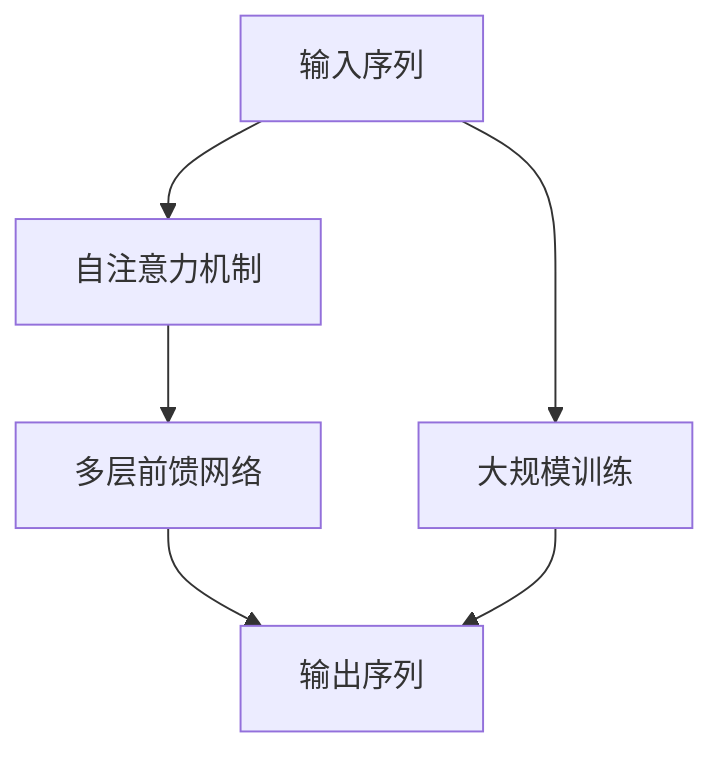

                 

# AI大模型创业：2024年最热门的10个应用方向

> 关键词：AI大模型、创业、2024年、热门应用方向、技术趋势、商业机会

> 摘要：本文将深入探讨2024年AI大模型创业的热门应用方向，通过分析当前的技术趋势、市场需求和商业机会，为创业者提供有价值的见解和指导。我们将从技术原理、实际应用案例、未来发展趋势等多个维度进行详细阐述，帮助读者理解AI大模型在各个领域的潜力和挑战。

## 1. 背景介绍

随着人工智能技术的飞速发展，大模型（如Transformer、BERT等）已经成为推动行业变革的关键力量。大模型不仅在自然语言处理、计算机视觉等领域取得了显著成果，还在医疗健康、金融科技、智能制造等多个领域展现出巨大的应用潜力。本文将从技术趋势、市场需求和商业机会三个维度出发，分析2024年AI大模型创业的热门应用方向。

### 1.1 技术趋势

近年来，大模型技术取得了突破性进展，主要体现在以下几个方面：

- **模型规模扩大**：大模型的参数量不断增加，从最初的几十万参数发展到现在的数十亿甚至上百亿参数。
- **训练效率提升**：通过分布式训练、混合精度训练等技术，大幅提高了模型训练的效率。
- **应用领域拓展**：大模型不仅在自然语言处理领域表现出色，还在图像识别、语音识别、推荐系统等多个领域展现出强大的应用潜力。

### 1.2 市场需求

随着技术的不断进步，市场需求也在不断增长。具体表现在以下几个方面：

- **个性化需求**：用户对个性化服务的需求日益增长，如个性化推荐、智能客服等。
- **智能化需求**：企业对智能化解决方案的需求不断增加，如智能制造、智能医疗等。
- **数据驱动决策**：企业希望通过大数据分析和智能算法进行数据驱动的决策，提高运营效率和竞争力。

### 1.3 商业机会

大模型技术的发展为创业者提供了丰富的商业机会。具体表现在以下几个方面：

- **技术创新**：通过技术创新，开发出具有竞争力的大模型产品和服务。
- **市场拓展**：通过市场拓展，将大模型技术应用到更多领域，满足不同行业的需求。
- **生态建设**：通过生态建设，构建完整的产业链，形成良好的商业生态。

## 2. 核心概念与联系

### 2.1 大模型概述

大模型是指参数量巨大、训练数据量庞大、计算资源需求高的机器学习模型。大模型通常采用Transformer架构，具有自注意力机制，能够捕捉长距离依赖关系，适用于自然语言处理、图像识别等多个领域。

### 2.2 核心概念原理

大模型的核心概念包括：

- **自注意力机制**：通过自注意力机制，模型能够捕捉输入序列中的长距离依赖关系。
- **Transformer架构**：Transformer架构由自注意力机制、多层前馈网络等组成，能够高效地处理序列数据。
- **大规模训练**：通过大规模训练，模型能够学习到更丰富的特征表示，提高模型的泛化能力。

### 2.3 Mermaid流程图



## 3. 核心算法原理 & 具体操作步骤

### 3.1 自注意力机制

自注意力机制是大模型的核心组成部分，其主要步骤如下：

1. **输入序列**：将输入序列表示为一个向量序列。
2. **计算注意力权重**：通过计算输入序列之间的相似度，得到注意力权重。
3. **加权求和**：根据注意力权重对输入序列进行加权求和，得到新的表示。
4. **线性变换**：对加权求和后的表示进行线性变换，得到最终的注意力表示。

### 3.2 多层前馈网络

多层前馈网络是大模型中的另一个重要组成部分，其主要步骤如下：

1. **输入表示**：将注意力表示作为多层前馈网络的输入。
2. **前馈网络**：通过多层前馈网络进行非线性变换，提取更丰富的特征表示。
3. **残差连接**：通过残差连接，提高模型的训练效率和泛化能力。
4. **输出表示**：将前馈网络的输出作为最终的表示。

### 3.3 大规模训练

大规模训练是大模型训练的关键步骤，其主要步骤如下：

1. **数据准备**：准备大规模训练数据，包括标注数据和未标注数据。
2. **模型初始化**：初始化模型参数，包括权重和偏置。
3. **分布式训练**：通过分布式训练，提高模型训练的效率和稳定性。
4. **优化算法**：选择合适的优化算法，如Adam、SGD等，进行参数更新。
5. **模型评估**：通过模型评估，监控模型的训练效果和泛化能力。

## 4. 数学模型和公式 & 详细讲解 & 举例说明

### 4.1 自注意力机制

自注意力机制的数学模型可以表示为：

$$
\text{Attention}(Q, K, V) = \text{softmax}\left(\frac{QK^T}{\sqrt{d_k}}\right)V
$$

其中，$Q$、$K$、$V$分别表示查询向量、键向量和值向量，$d_k$表示键向量的维度。

### 4.2 多层前馈网络

多层前馈网络的数学模型可以表示为：

$$
\text{FFN}(x) = \text{ReLU}(W_2 \cdot \text{ReLU}(W_1 \cdot x + b_1) + b_2)
$$

其中，$W_1$、$W_2$分别表示第一层和第二层的权重矩阵，$b_1$、$b_2$分别表示第一层和第二层的偏置向量。

### 4.3 大规模训练

大规模训练的数学模型可以表示为：

$$
\text{Loss} = \frac{1}{N} \sum_{i=1}^{N} \text{Loss}_i
$$

其中，$N$表示样本数量，$\text{Loss}_i$表示第$i$个样本的损失函数。

## 5. 项目实战：代码实际案例和详细解释说明

### 5.1 开发环境搭建

为了进行大模型的开发，我们需要搭建一个合适的开发环境。具体步骤如下：

1. **安装Python**：确保安装了Python 3.7及以上版本。
2. **安装依赖库**：安装TensorFlow、PyTorch等深度学习框架。
3. **安装开发工具**：安装Jupyter Notebook、VS Code等开发工具。

### 5.2 源代码详细实现和代码解读

以下是一个简单的Transformer模型的实现代码：

```python
import torch
import torch.nn as nn

class Transformer(nn.Module):
    def __init__(self, input_dim, output_dim, d_model, nhead, num_layers):
        super(Transformer, self).__init__()
        self.embedding = nn.Embedding(input_dim, d_model)
        self.transformer = nn.Transformer(d_model, nhead, num_layers, num_layers)
        self.fc = nn.Linear(d_model, output_dim)

    def forward(self, src):
        src = self.embedding(src)
        output = self.transformer(src, src)
        output = self.fc(output)
        return output
```

### 5.3 代码解读与分析

- **Embedding层**：将输入序列转换为词向量。
- **Transformer层**：通过Transformer层进行自注意力机制和多层前馈网络的计算。
- **全连接层**：将Transformer层的输出进行线性变换，得到最终的输出。

## 6. 实际应用场景

### 6.1 自然语言处理

大模型在自然语言处理领域具有广泛的应用，如：

- **文本生成**：通过大模型生成高质量的文本，如新闻文章、诗歌等。
- **情感分析**：通过大模型进行情感分析，判断文本的情感倾向。
- **机器翻译**：通过大模型进行机器翻译，实现跨语言交流。

### 6.2 计算机视觉

大模型在计算机视觉领域也具有广泛的应用，如：

- **图像分类**：通过大模型进行图像分类，识别图像中的物体。
- **目标检测**：通过大模型进行目标检测，识别图像中的目标位置。
- **图像生成**：通过大模型生成高质量的图像，如照片、绘画等。

### 6.3 医疗健康

大模型在医疗健康领域具有广泛的应用，如：

- **疾病诊断**：通过大模型进行疾病诊断，辅助医生进行诊断。
- **药物研发**：通过大模型进行药物研发，加速新药的研发过程。
- **健康管理**：通过大模型进行健康管理，提供个性化的健康管理方案。

### 6.4 金融科技

大模型在金融科技领域具有广泛的应用，如：

- **风险评估**：通过大模型进行风险评估，预测金融风险。
- **智能投顾**：通过大模型进行智能投顾，提供个性化的投资建议。
- **反欺诈**：通过大模型进行反欺诈，识别金融欺诈行为。

### 6.5 智能制造

大模型在智能制造领域具有广泛的应用，如：

- **生产优化**：通过大模型进行生产优化，提高生产效率。
- **质量检测**：通过大模型进行质量检测，提高产品质量。
- **设备维护**：通过大模型进行设备维护，预测设备故障。

## 7. 工具和资源推荐

### 7.1 学习资源推荐

- **书籍**：《深度学习》、《自然语言处理实战》、《计算机视觉实战》
- **论文**：《Attention is All You Need》、《BERT: Pre-training of Deep Bidirectional Transformers for Language Understanding》
- **博客**：阿里云开发者社区、GitHub开源项目
- **网站**：TensorFlow官网、PyTorch官网

### 7.2 开发工具框架推荐

- **深度学习框架**：TensorFlow、PyTorch
- **开发工具**：Jupyter Notebook、VS Code
- **版本控制工具**：Git、GitHub

### 7.3 相关论文著作推荐

- **书籍**：《深度学习》、《自然语言处理实战》、《计算机视觉实战》
- **论文**：《Attention is All You Need》、《BERT: Pre-training of Deep Bidirectional Transformers for Language Understanding》

## 8. 总结：未来发展趋势与挑战

### 8.1 未来发展趋势

- **模型规模扩大**：大模型的参数量将继续扩大，模型的性能将进一步提升。
- **训练效率提升**：通过分布式训练、混合精度训练等技术，模型的训练效率将进一步提升。
- **应用领域拓展**：大模型将在更多领域得到应用，如自动驾驶、智能物流等。

### 8.2 挑战

- **计算资源需求**：大模型的训练和推理对计算资源的需求较高，需要更多的计算资源支持。
- **数据隐私保护**：大模型的训练需要大量的数据，如何保护数据隐私是一个重要挑战。
- **模型解释性**：大模型的黑盒特性使得模型的解释性成为一个重要问题，需要进一步研究。

## 9. 附录：常见问题与解答

### 9.1 问题1：大模型的训练需要大量的计算资源，如何解决？

**解答**：可以通过分布式训练、混合精度训练等技术，提高模型的训练效率，减少计算资源的需求。

### 9.2 问题2：大模型的黑盒特性使得模型的解释性成为一个重要问题，如何解决？

**解答**：可以通过模型解释性技术，如LIME、SHAP等，提高模型的解释性，帮助用户理解模型的决策过程。

## 10. 扩展阅读 & 参考资料

- **书籍**：《深度学习》、《自然语言处理实战》、《计算机视觉实战》
- **论文**：《Attention is All You Need》、《BERT: Pre-training of Deep Bidirectional Transformers for Language Understanding》
- **网站**：TensorFlow官网、PyTorch官网

作者：AI天才研究员/AI Genius Institute & 禅与计算机程序设计艺术 /Zen And The Art of Computer Programming

