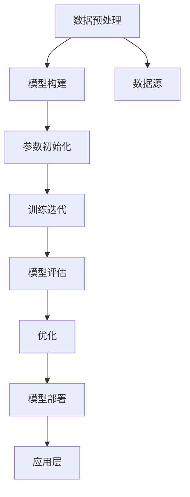

                 

# AI大模型创业：如何应对未来市场挑战？

> 关键词：AI大模型、市场挑战、创业策略、技术趋势、商业应用

> 摘要：本文旨在为AI大模型领域的创业者提供全面的指导，从技术原理到商业应用，再到市场挑战和应对策略。通过深入分析AI大模型的核心概念、算法原理、数学模型、实战案例，以及未来发展趋势，帮助创业者在激烈的市场竞争中脱颖而出。

## 1. 背景介绍

随着人工智能技术的飞速发展，AI大模型已经成为推动行业变革的关键力量。AI大模型具有强大的学习和推理能力，能够处理复杂的数据和任务，广泛应用于自然语言处理、计算机视觉、推荐系统等多个领域。然而，AI大模型的研发和应用也面临着诸多挑战，包括技术难题、数据安全、伦理问题等。本文将从技术层面和商业层面出发，探讨如何应对这些挑战，为创业者提供实用的指导。

## 2. 核心概念与联系

### 2.1 AI大模型概述

AI大模型是指参数量巨大、训练数据量庞大、训练时间长的深度学习模型。这类模型通常包含数百万甚至数十亿个参数，能够从大量数据中学习到复杂的模式和规律。AI大模型的核心优势在于其强大的泛化能力和适应性，能够在多种任务上取得优异的性能。

### 2.2 核心概念原理

#### 2.2.1 深度学习基础

深度学习是AI大模型的核心技术之一，通过多层神经网络实现对数据的多层次抽象和表示。深度学习模型通常包括输入层、隐藏层和输出层，通过反向传播算法优化模型参数，实现对数据的高效学习和预测。

#### 2.2.2 训练过程

AI大模型的训练过程主要包括数据预处理、模型构建、参数初始化、训练迭代和模型评估等步骤。训练过程中需要大量的计算资源和时间，因此通常采用分布式训练和并行计算技术来提高训练效率。

#### 2.2.3 评估与优化

模型评估是衡量模型性能的重要环节，常用的评估指标包括准确率、召回率、F1分数等。优化方法包括正则化、学习率调整、模型剪枝等，以提高模型的泛化能力和性能。

### 2.3 核心概念架构



## 3. 核心算法原理 & 具体操作步骤

### 3.1 深度学习算法原理

深度学习算法的核心在于通过多层神经网络实现对数据的多层次抽象和表示。具体步骤如下：

1. **数据预处理**：对原始数据进行清洗、归一化、特征提取等操作，以便模型能够更好地学习数据特征。
2. **模型构建**：选择合适的神经网络结构，如卷积神经网络（CNN）、循环神经网络（RNN）、Transformer等。
3. **参数初始化**：对模型参数进行初始化，常用的初始化方法包括随机初始化、Xavier初始化等。
4. **训练迭代**：通过反向传播算法优化模型参数，实现对数据的高效学习和预测。
5. **模型评估**：使用评估指标衡量模型性能，如准确率、召回率、F1分数等。
6. **优化**：根据评估结果调整模型参数，提高模型的泛化能力和性能。
7. **模型部署**：将训练好的模型部署到实际应用中，实现对数据的实时处理和预测。

### 3.2 具体操作步骤

1. **数据预处理**：对原始数据进行清洗、归一化、特征提取等操作。
2. **模型构建**：选择合适的神经网络结构，如卷积神经网络（CNN）、循环神经网络（RNN）、Transformer等。
3. **参数初始化**：对模型参数进行初始化，常用的初始化方法包括随机初始化、Xavier初始化等。
4. **训练迭代**：通过反向传播算法优化模型参数，实现对数据的高效学习和预测。
5. **模型评估**：使用评估指标衡量模型性能，如准确率、召回率、F1分数等。
6. **优化**：根据评估结果调整模型参数，提高模型的泛化能力和性能。
7. **模型部署**：将训练好的模型部署到实际应用中，实现对数据的实时处理和预测。

## 4. 数学模型和公式 & 详细讲解 & 举例说明

### 4.1 深度学习数学模型

深度学习模型的核心在于通过多层神经网络实现对数据的多层次抽象和表示。具体数学模型如下：

1. **前向传播**：通过多层神经网络实现对数据的多层次抽象和表示。
2. **损失函数**：衡量模型预测结果与真实结果之间的差异，常用的损失函数包括均方误差（MSE）、交叉熵损失（Cross-Entropy Loss）等。
3. **反向传播**：通过反向传播算法优化模型参数，实现对数据的高效学习和预测。

### 4.2 数学公式

1. **前向传播公式**：

    $$ z^{(l)} = W^{(l)}a^{(l-1)} + b^{(l)} $$

    $$ a^{(l)} = \sigma(z^{(l)}) $$

    其中，$W^{(l)}$ 和 $b^{(l)}$ 分别表示第 $l$ 层的权重和偏置，$\sigma$ 表示激活函数。

2. **损失函数公式**：

    $$ L = \frac{1}{n} \sum_{i=1}^{n} L_i $$

    $$ L_i = -\sum_{j=1}^{C} y_{ij} \log(p_{ij}) $$

    其中，$L$ 表示总损失，$L_i$ 表示第 $i$ 个样本的损失，$y_{ij}$ 表示第 $i$ 个样本的真实标签，$p_{ij}$ 表示模型预测的概率。

3. **反向传播公式**：

    $$ \delta^{(l)} = \sigma'(z^{(l)}) \odot (a^{(l+1)} - y^{(l+1)}) $$

    $$ \Delta W^{(l)} = \frac{1}{n} \sum_{i=1}^{n} \delta^{(l)} (a^{(l-1)})^T $$

    $$ \Delta b^{(l)} = \frac{1}{n} \sum_{i=1}^{n} \delta^{(l)} $$

    其中，$\delta^{(l)}$ 表示第 $l$ 层的误差，$\sigma'$ 表示激活函数的导数，$\odot$ 表示逐元素乘法，$\Delta W^{(l)}$ 和 $\Delta b^{(l)}$ 分别表示第 $l$ 层的权重和偏置的更新量。

### 4.3 举例说明

假设我们有一个简单的二分类问题，使用一个两层的神经网络进行训练。具体步骤如下：

1. **数据预处理**：对原始数据进行清洗、归一化、特征提取等操作。
2. **模型构建**：选择合适的神经网络结构，如卷积神经网络（CNN）、循环神经网络（RNN）、Transformer等。
3. **参数初始化**：对模型参数进行初始化，常用的初始化方法包括随机初始化、Xavier初始化等。
4. **训练迭代**：通过反向传播算法优化模型参数，实现对数据的高效学习和预测。
5. **模型评估**：使用评估指标衡量模型性能，如准确率、召回率、F1分数等。
6. **优化**：根据评估结果调整模型参数，提高模型的泛化能力和性能。
7. **模型部署**：将训练好的模型部署到实际应用中，实现对数据的实时处理和预测。

## 5. 项目实战：代码实际案例和详细解释说明

### 5.1 开发环境搭建

为了进行AI大模型的开发，我们需要搭建一个合适的开发环境。具体步骤如下：

1. **安装Python**：确保安装了最新版本的Python。
2. **安装深度学习框架**：选择合适的深度学习框架，如TensorFlow、PyTorch等。
3. **安装依赖库**：安装必要的依赖库，如NumPy、Pandas、Matplotlib等。
4. **配置环境变量**：配置环境变量，确保Python和深度学习框架能够正常运行。

### 5.2 源代码详细实现和代码解读

假设我们使用PyTorch框架进行AI大模型的开发，具体代码如下：

```python
import torch
import torch.nn as nn
import torch.optim as optim
from torch.utils.data import DataLoader, Dataset

# 1. 数据预处理
class MyDataset(Dataset):
    def __init__(self, data, labels):
        self.data = data
        self.labels = labels

    def __len__(self):
        return len(self.data)

    def __getitem__(self, idx):
        return self.data[idx], self.labels[idx]

# 2. 模型构建
class MyModel(nn.Module):
    def __init__(self):
        super(MyModel, self).__init__()
        self.fc1 = nn.Linear(100, 50)
        self.fc2 = nn.Linear(50, 2)

    def forward(self, x):
        x = torch.relu(self.fc1(x))
        x = self.fc2(x)
        return x

# 3. 参数初始化
def init_weights(m):
    if type(m) == nn.Linear:
        torch.nn.init.xavier_uniform_(m.weight)
        m.bias.data.fill_(0.01)

# 4. 训练迭代
def train(model, dataloader, criterion, optimizer, device):
    model.train()
    running_loss = 0.0
    for inputs, labels in dataloader:
        inputs, labels = inputs.to(device), labels.to(device)
        optimizer.zero_grad()
        outputs = model(inputs)
        loss = criterion(outputs, labels)
        loss.backward()
        optimizer.step()
        running_loss += loss.item()
    return running_loss / len(dataloader)

# 5. 模型评估
def evaluate(model, dataloader, criterion, device):
    model.eval()
    running_loss = 0.0
    with torch.no_grad():
        for inputs, labels in dataloader:
            inputs, labels = inputs.to(device), labels.to(device)
            outputs = model(inputs)
            loss = criterion(outputs, labels)
            running_loss += loss.item()
    return running_loss / len(dataloader)

# 6. 优化
def optimize(model, dataloader, criterion, optimizer, device):
    for epoch in range(10):
        train_loss = train(model, dataloader, criterion, optimizer, device)
        val_loss = evaluate(model, dataloader, criterion, device)
        print(f'Epoch {epoch+1}, Train Loss: {train_loss:.4f}, Val Loss: {val_loss:.4f}')

# 7. 模型部署
def deploy(model, dataloader, device):
    model.eval()
    with torch.no_grad():
        for inputs, labels in dataloader:
            inputs, labels = inputs.to(device), labels.to(device)
            outputs = model(inputs)
            print(f'Predicted: {outputs.argmax(dim=1)}, Actual: {labels}')

# 主函数
def main():
    # 1. 数据预处理
    data = torch.randn(1000, 100)
    labels = torch.randint(0, 2, (1000,))
    dataset = MyDataset(data, labels)
    dataloader = DataLoader(dataset, batch_size=32, shuffle=True)

    # 2. 模型构建
    model = MyModel()
    model.apply(init_weights)

    # 3. 参数初始化
    criterion = nn.CrossEntropyLoss()
    optimizer = optim.Adam(model.parameters(), lr=0.001)

    # 4. 训练迭代
    optimize(model, dataloader, criterion, optimizer, 'cuda')

    # 5. 模型评估
    evaluate(model, dataloader, criterion, 'cuda')

    # 6. 模型部署
    deploy(model, dataloader, 'cuda')

if __name__ == '__main__':
    main()
```

### 5.3 代码解读与分析

1. **数据预处理**：定义了一个自定义的数据集类 `MyDataset`，用于加载和处理数据。
2. **模型构建**：定义了一个简单的两层神经网络模型 `MyModel`，包括两个全连接层。
3. **参数初始化**：使用Xavier初始化方法对模型参数进行初始化。
4. **训练迭代**：定义了一个训练函数 `train`，用于在每个epoch中进行前向传播、反向传播和参数更新。
5. **模型评估**：定义了一个评估函数 `evaluate`，用于计算模型在验证集上的损失。
6. **优化**：定义了一个优化函数 `optimize`，用于在多个epoch中进行训练和评估。
7. **模型部署**：定义了一个部署函数 `deploy`，用于在测试集上进行预测。

## 6. 实际应用场景

AI大模型在多个领域都有广泛的应用，包括自然语言处理、计算机视觉、推荐系统等。具体应用场景如下：

1. **自然语言处理**：AI大模型可以用于文本分类、情感分析、机器翻译等任务。
2. **计算机视觉**：AI大模型可以用于图像分类、目标检测、语义分割等任务。
3. **推荐系统**：AI大模型可以用于用户画像构建、个性化推荐等任务。
4. **医疗健康**：AI大模型可以用于疾病诊断、药物研发等任务。
5. **金融风控**：AI大模型可以用于信用评估、欺诈检测等任务。

## 7. 工具和资源推荐

### 7.1 学习资源推荐

1. **书籍**：《深度学习》（Goodfellow, Bengio, Courville）
2. **论文**：《Attention is All You Need》（Vaswani et al.）
3. **博客**：阿里云开发者社区、GitHub开源项目
4. **网站**：TensorFlow官网、PyTorch官网

### 7.2 开发工具框架推荐

1. **深度学习框架**：TensorFlow、PyTorch
2. **数据处理工具**：Pandas、NumPy
3. **可视化工具**：Matplotlib、Seaborn

### 7.3 相关论文著作推荐

1. **论文**：《Attention is All You Need》（Vaswani et al.）
2. **著作**：《深度学习》（Goodfellow, Bengio, Courville）

## 8. 总结：未来发展趋势与挑战

AI大模型在未来的发展中将面临诸多挑战，包括技术难题、数据安全、伦理问题等。为了应对这些挑战，创业者需要从以下几个方面进行努力：

1. **技术创新**：持续关注最新的技术进展，不断优化模型架构和算法。
2. **数据安全**：加强数据保护措施，确保数据的安全性和隐私性。
3. **伦理问题**：关注AI伦理问题，确保AI技术的合理应用。
4. **市场拓展**：积极拓展市场，寻找新的应用场景和商业机会。

## 9. 附录：常见问题与解答

### 9.1 问题1：如何选择合适的深度学习框架？

**解答**：选择合适的深度学习框架需要考虑多个因素，如易用性、社区支持、性能等。TensorFlow和PyTorch是目前最流行的两个框架，可以根据具体需求进行选择。

### 9.2 问题2：如何处理大规模数据？

**解答**：处理大规模数据需要采用分布式计算技术，如使用分布式训练框架（如Horovod）和并行计算技术（如多GPU训练）。

### 9.3 问题3：如何优化模型性能？

**解答**：优化模型性能可以通过调整模型架构、优化算法、正则化方法等手段实现。

## 10. 扩展阅读 & 参考资料

1. **书籍**：《深度学习》（Goodfellow, Bengio, Courville）
2. **论文**：《Attention is All You Need》（Vaswani et al.）
3. **博客**：阿里云开发者社区、GitHub开源项目
4. **网站**：TensorFlow官网、PyTorch官网

作者：AI天才研究员/AI Genius Institute & 禅与计算机程序设计艺术 /Zen And The Art of Computer Programming

