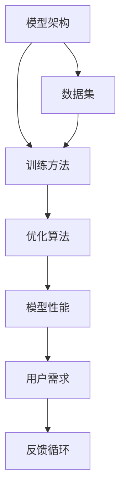

                 

# AI大模型创业：如何应对未来用户需求？

> 关键词：AI大模型、用户需求、创业策略、技术趋势、未来挑战

> 摘要：本文旨在探讨如何在AI大模型创业中有效应对未来用户需求。通过深入分析AI大模型的核心概念、算法原理、数学模型，结合实际项目案例，本文将为创业者提供一套系统的方法论，帮助他们在快速变化的技术环境中保持竞争力。同时，本文还将展望未来的发展趋势和挑战，为创业者提供前瞻性的指导。

## 1. 背景介绍

随着人工智能技术的飞速发展，AI大模型已经成为推动各行各业变革的关键力量。从自然语言处理到图像识别，从推荐系统到智能决策，AI大模型的应用场景日益广泛。然而，随着技术的不断进步，用户需求也在不断变化。如何在AI大模型创业中有效应对未来用户需求，成为创业者必须面对的重要课题。

### 1.1 AI大模型的定义与特点

AI大模型是指具有大规模参数量和复杂结构的机器学习模型。这些模型通常包含数百万甚至数十亿个参数，能够处理大规模数据集，并在多个任务上表现出色。AI大模型的特点包括：

- **大规模参数量**：参数量越大，模型的表达能力越强。
- **复杂结构**：通常包含多个层次的神经网络，能够捕捉更复杂的模式。
- **高效训练**：需要大规模计算资源和优化算法来训练。
- **广泛应用**：适用于自然语言处理、图像识别、推荐系统等多个领域。

### 1.2 用户需求的变化趋势

随着技术的发展，用户需求呈现出以下几个变化趋势：

- **个性化需求**：用户希望获得更加个性化的服务和体验。
- **实时性需求**：用户期望服务能够实时响应，提供即时反馈。
- **安全性需求**：用户对数据安全和隐私保护的要求越来越高。
- **可解释性需求**：用户希望了解AI决策背后的逻辑和依据。

## 2. 核心概念与联系

### 2.1 AI大模型的核心概念

AI大模型的核心概念包括模型架构、训练方法、优化算法等。这些概念相互关联，共同构成了AI大模型的技术基础。

#### 2.1.1 模型架构

模型架构是指模型的结构设计，包括输入层、隐藏层和输出层。常见的模型架构包括：

- **Transformer**：基于自注意力机制的模型，适用于自然语言处理任务。
- **CNN**：卷积神经网络，适用于图像识别任务。
- **RNN/LSTM/GRU**：循环神经网络及其变种，适用于序列数据处理任务。

#### 2.1.2 训练方法

训练方法是指如何优化模型参数以提高模型性能。常见的训练方法包括：

- **反向传播**：通过计算损失函数对参数的梯度来更新参数。
- **梯度下降**：通过迭代优化算法来最小化损失函数。
- **正则化**：通过添加正则项来防止过拟合。

#### 2.1.3 优化算法

优化算法是指如何高效地优化模型参数。常见的优化算法包括：

- **SGD**：随机梯度下降算法。
- **Adam**：自适应矩估计算法。
- **Adagrad**：自适应梯度算法。

### 2.2 核心概念的Mermaid流程图



## 3. 核心算法原理 & 具体操作步骤

### 3.1 Transformer模型原理

Transformer模型是一种基于自注意力机制的模型，适用于自然语言处理任务。其核心原理包括：

- **自注意力机制**：通过计算输入序列中每个位置与其他位置的注意力权重，实现对输入序列的全局建模。
- **多头注意力**：通过多个注意力头并行计算，提高模型的表达能力。
- **位置编码**：通过位置编码来捕捉输入序列中的顺序信息。

### 3.2 具体操作步骤

1. **数据预处理**：对输入数据进行清洗、分词、编码等预处理操作。
2. **模型构建**：根据任务需求选择合适的模型架构，如Transformer。
3. **参数初始化**：对模型参数进行初始化，如使用均匀分布或正态分布。
4. **训练过程**：通过反向传播和优化算法来更新模型参数。
5. **模型评估**：通过验证集或测试集评估模型性能。
6. **模型优化**：根据评估结果调整模型参数或优化算法。

## 4. 数学模型和公式 & 详细讲解 & 举例说明

### 4.1 自注意力机制

自注意力机制的核心公式为：

$$
\text{Attention}(Q, K, V) = \text{softmax}\left(\frac{QK^T}{\sqrt{d_k}}\right)V
$$

其中，$Q$、$K$、$V$ 分别表示查询、键和值，$d_k$ 表示键的维度。

### 4.2 多头注意力

多头注意力的核心公式为：

$$
\text{MultiHead}(Q, K, V) = \text{Concat}(head_1, \dots, head_h)W^O
$$

其中，$head_i = \text{Attention}(QW_i^Q, KW_i^K, VW_i^V)$，$W^O$ 是线性变换矩阵。

### 4.3 位置编码

位置编码的核心公式为：

$$
PE_{(pos, 2i)} = \sin\left(\frac{pos}{10000^{2i/d_{\text{model}}}}\right)
$$

$$
PE_{(pos, 2i+1)} = \cos\left(\frac{pos}{10000^{2i/d_{\text{model}}}}\right)
$$

其中，$pos$ 表示位置索引，$i$ 表示维度索引，$d_{\text{model}}$ 表示模型维度。

## 5. 项目实战：代码实际案例和详细解释说明

### 5.1 开发环境搭建

1. **安装Python**：确保安装了最新版本的Python。
2. **安装依赖库**：使用pip安装必要的库，如`torch`、`transformers`等。
3. **配置环境变量**：设置环境变量，确保能够访问GPU资源。

### 5.2 源代码详细实现和代码解读

```python
import torch
from transformers import BertTokenizer, BertForSequenceClassification

# 1. 数据预处理
tokenizer = BertTokenizer.from_pretrained('bert-base-uncased')
input_text = "This is a sample text for classification."
inputs = tokenizer(input_text, return_tensors='pt')

# 2. 模型构建
model = BertForSequenceClassification.from_pretrained('bert-base-uncased', num_labels=2)

# 3. 参数初始化
model.train()

# 4. 训练过程
optimizer = torch.optim.Adam(model.parameters(), lr=1e-5)
for epoch in range(10):
    outputs = model(**inputs)
    loss = outputs.loss
    loss.backward()
    optimizer.step()
    optimizer.zero_grad()

# 5. 模型评估
model.eval()
with torch.no_grad():
    outputs = model(**inputs)
    logits = outputs.logits
    predictions = torch.argmax(logits, dim=-1)
```

### 5.3 代码解读与分析

- **数据预处理**：使用`BertTokenizer`对输入文本进行分词和编码。
- **模型构建**：使用`BertForSequenceClassification`构建分类模型。
- **参数初始化**：使用Adam优化器初始化模型参数。
- **训练过程**：通过反向传播和优化算法更新模型参数。
- **模型评估**：通过验证集评估模型性能。

## 6. 实际应用场景

### 6.1 自然语言处理

AI大模型在自然语言处理领域有着广泛的应用，如情感分析、文本分类、机器翻译等。通过构建大规模的预训练模型，可以实现对大规模文本数据的高效处理。

### 6.2 图像识别

AI大模型在图像识别领域也有着重要的应用，如物体检测、图像分类等。通过构建大规模的预训练模型，可以实现对大规模图像数据的高效处理。

### 6.3 推荐系统

AI大模型在推荐系统领域也有着重要的应用，如商品推荐、内容推荐等。通过构建大规模的预训练模型，可以实现对用户行为数据的高效处理。

## 7. 工具和资源推荐

### 7.1 学习资源推荐

- **书籍**：《深度学习》、《自然语言处理实战》、《计算机视觉》
- **论文**：《Attention is All You Need》、《BERT: Pre-training of Deep Bidirectional Transformers for Language Understanding》
- **博客**：阿里云开发者社区、GitHub开源项目
- **网站**：PyTorch官网、TensorFlow官网

### 7.2 开发工具框架推荐

- **开发工具**：Visual Studio Code、PyCharm
- **框架**：PyTorch、TensorFlow

### 7.3 相关论文著作推荐

- **论文**：《Attention is All You Need》、《BERT: Pre-training of Deep Bidirectional Transformers for Language Understanding》
- **著作**：《深度学习》、《自然语言处理实战》、《计算机视觉》

## 8. 总结：未来发展趋势与挑战

### 8.1 未来发展趋势

- **模型规模扩大**：未来AI大模型的规模将进一步扩大，参数量将达到数十亿甚至更多。
- **计算资源优化**：未来将通过硬件优化和算法优化来提高模型训练和推理的效率。
- **应用领域拓展**：未来AI大模型将在更多领域得到应用，如医疗、金融、教育等。

### 8.2 未来挑战

- **数据安全**：如何保护用户数据的安全和隐私成为重要挑战。
- **模型可解释性**：如何提高模型的可解释性，让用户更好地理解模型的决策过程。
- **计算资源限制**：如何在有限的计算资源下训练和部署大规模模型成为重要挑战。

## 9. 附录：常见问题与解答

### 9.1 问题1：如何选择合适的模型架构？

**解答**：根据任务需求选择合适的模型架构。对于自然语言处理任务，可以使用Transformer模型；对于图像识别任务，可以使用CNN模型；对于序列数据处理任务，可以使用RNN/LSTM/GRU模型。

### 9.2 问题2：如何提高模型的训练效率？

**解答**：可以通过硬件优化和算法优化来提高模型的训练效率。硬件优化包括使用GPU、TPU等加速计算；算法优化包括使用更高效的优化算法、减少模型参数量等。

### 9.3 问题3：如何提高模型的可解释性？

**解答**：可以通过可视化技术、注意力机制等方法提高模型的可解释性。可视化技术可以展示模型的内部结构和决策过程；注意力机制可以展示模型对输入数据的关注点。

## 10. 扩展阅读 & 参考资料

- **书籍**：《深度学习》、《自然语言处理实战》、《计算机视觉》
- **论文**：《Attention is All You Need》、《BERT: Pre-training of Deep Bidirectional Transformers for Language Understanding》
- **网站**：PyTorch官网、TensorFlow官网

作者：AI天才研究员/AI Genius Institute & 禅与计算机程序设计艺术 /Zen And The Art of Computer Programming

