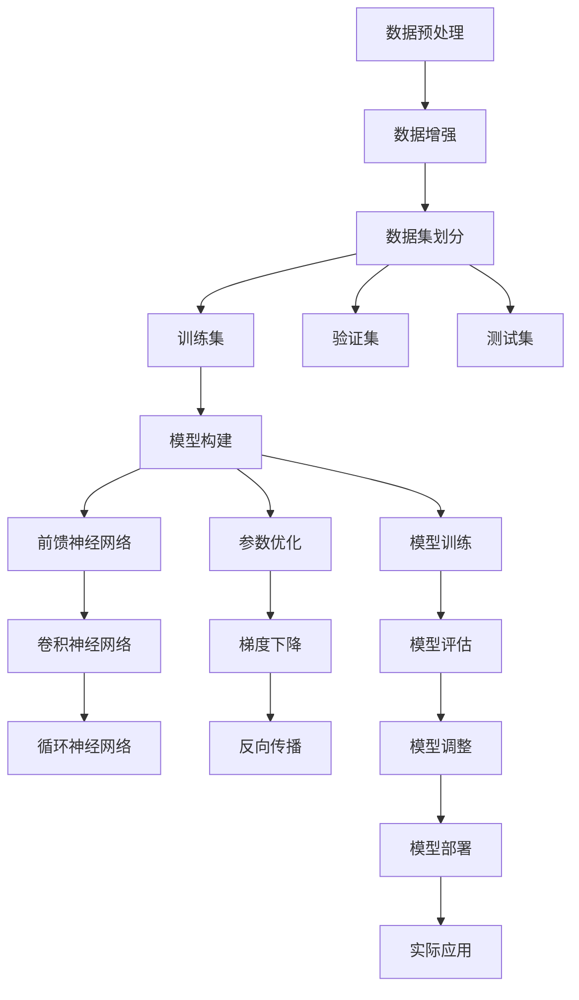

                 

# AI大模型创业：如何应对未来行业发展趋势？

> 关键词：AI大模型、行业趋势、创业策略、技术挑战、未来展望

> 摘要：本文旨在为AI大模型领域的创业者提供全面的指导，从技术原理到实际应用，再到未来发展趋势，帮助创业者更好地理解AI大模型的构建与应用，以及如何在快速变化的市场环境中保持竞争力。通过深入分析AI大模型的核心概念、算法原理、数学模型、实战案例，以及未来的发展趋势，本文为创业者提供了宝贵的见解和策略。

## 1. 背景介绍

随着人工智能技术的飞速发展，AI大模型已经成为推动行业变革的关键力量。AI大模型不仅在自然语言处理、计算机视觉、语音识别等领域取得了显著成果，还在医疗、金融、教育等多个行业展现出巨大的应用潜力。然而，AI大模型的开发和应用面临着诸多挑战，包括技术复杂性、数据安全、伦理问题等。因此，对于创业者而言，深入了解AI大模型的构建原理和应用策略至关重要。

## 2. 核心概念与联系

### 2.1 AI大模型概述

AI大模型是指参数量巨大、训练数据量庞大、训练时间较长的深度学习模型。这些模型通常包含数百万甚至数十亿个参数，能够处理复杂的任务和大规模的数据集。AI大模型的核心优势在于其强大的泛化能力和对复杂模式的捕捉能力。

### 2.2 核心概念原理

#### 2.2.1 深度学习基础

深度学习是构建AI大模型的基础。深度学习通过多层神经网络来模拟人脑的处理方式，从而实现对复杂数据的高效处理。深度学习的关键在于前馈神经网络、卷积神经网络（CNN）、循环神经网络（RNN）等模型的设计与优化。

#### 2.2.2 参数量与模型复杂度

AI大模型的参数量通常非常庞大，这使得模型具有更强的表达能力。然而，参数量的增加也带来了计算资源的需求和训练时间的延长。因此，如何在保持模型性能的同时降低计算成本，是AI大模型开发中的一个重要问题。

#### 2.2.3 数据量与模型训练

AI大模型的训练需要大量的高质量数据。数据量的大小直接影响模型的训练效果和泛化能力。数据的质量也至关重要，包括数据的多样性和准确性。数据预处理和增强技术是提高模型性能的关键步骤。

### 2.3 核心概念架构

以下是AI大模型的核心概念架构图：



## 3. 核心算法原理 & 具体操作步骤

### 3.1 深度学习算法原理

深度学习算法的核心在于前馈神经网络、卷积神经网络和循环神经网络的设计与优化。

#### 3.1.1 前馈神经网络

前馈神经网络是最基本的深度学习模型之一。其结构包括输入层、隐藏层和输出层。每个隐藏层由多个神经元组成，神经元之间通过权重连接。前馈神经网络通过前向传播计算输出，并通过反向传播调整权重。

#### 3.1.2 卷积神经网络

卷积神经网络（CNN）主要用于处理图像数据。其核心在于卷积层和池化层。卷积层通过卷积操作提取图像的局部特征，池化层通过降采样减少特征图的尺寸。CNN通过多层卷积和池化操作，逐步提取图像的高级特征。

#### 3.1.3 循环神经网络

循环神经网络（RNN）主要用于处理序列数据。其核心在于循环层，通过循环操作捕捉序列中的时间依赖关系。RNN通过门控机制（如LSTM和GRU）来处理长期依赖问题。

### 3.2 具体操作步骤

#### 3.2.1 数据预处理

数据预处理是AI大模型开发的第一步。主要包括数据清洗、数据增强和数据集划分。

1. **数据清洗**：去除无效数据、处理缺失值和异常值。
2. **数据增强**：通过旋转、缩放、裁剪等操作增加数据多样性。
3. **数据集划分**：将数据集划分为训练集、验证集和测试集。

#### 3.2.2 模型构建

模型构建是AI大模型开发的核心步骤。主要包括选择合适的模型架构、设置超参数和初始化权重。

1. **选择模型架构**：根据任务需求选择合适的模型架构，如CNN、RNN或Transformer。
2. **设置超参数**：设置学习率、批量大小、迭代次数等超参数。
3. **初始化权重**：使用随机初始化或预训练权重进行初始化。

#### 3.2.3 模型训练

模型训练是通过反向传播算法调整模型权重的过程。主要包括前向传播、计算损失、反向传播和权重更新。

1. **前向传播**：计算模型的输出。
2. **计算损失**：计算模型输出与真实标签之间的差异。
3. **反向传播**：计算损失对权重的梯度。
4. **权重更新**：使用梯度下降算法更新权重。

#### 3.2.4 模型评估

模型评估是通过验证集和测试集评估模型性能的过程。主要包括计算准确率、召回率、F1分数等指标。

1. **验证集评估**：使用验证集评估模型性能，调整超参数。
2. **测试集评估**：使用测试集评估最终模型性能。

## 4. 数学模型和公式 & 详细讲解 & 举例说明

### 4.1 深度学习数学模型

深度学习的数学模型主要包括前向传播、损失函数和反向传播。

#### 4.1.1 前向传播

前向传播是计算模型输出的过程。对于前馈神经网络，前向传播公式如下：

$$
\text{output} = \sigma(\text{input} \times \text{weight} + \text{bias})
$$

其中，$\sigma$ 是激活函数，如ReLU、Sigmoid或Tanh。

#### 4.1.2 损失函数

损失函数用于衡量模型输出与真实标签之间的差异。常用的损失函数包括均方误差（MSE）、交叉熵损失（CE）等。

1. **均方误差**：

$$
\text{MSE} = \frac{1}{n} \sum_{i=1}^{n} (y_i - \hat{y}_i)^2
$$

其中，$y_i$ 是真实标签，$\hat{y}_i$ 是模型预测值，$n$ 是样本数量。

2. **交叉熵损失**：

$$
\text{CE} = -\frac{1}{n} \sum_{i=1}^{n} \sum_{j=1}^{C} y_{ij} \log(\hat{y}_{ij})
$$

其中，$y_{ij}$ 是真实标签，$\hat{y}_{ij}$ 是模型预测值，$C$ 是类别数量。

#### 4.1.3 反向传播

反向传播是通过计算损失对权重的梯度来调整权重的过程。反向传播公式如下：

$$
\frac{\partial \text{loss}}{\partial \text{weight}} = \frac{\partial \text{loss}}{\partial \text{output}} \times \frac{\partial \text{output}}{\partial \text{weight}}
$$

其中，$\frac{\partial \text{loss}}{\partial \text{output}}$ 是损失对输出的梯度，$\frac{\partial \text{output}}{\partial \text{weight}}$ 是输出对权重的梯度。

### 4.2 举例说明

假设我们有一个简单的前馈神经网络，用于二分类任务。网络结构如下：

- 输入层：2个节点
- 隐藏层：1个节点
- 输出层：1个节点

激活函数为Sigmoid。损失函数为交叉熵损失。

#### 4.2.1 前向传播

假设输入为$x = [0.5, 0.3]$，权重为$w = [0.4, 0.6]$，偏置为$b = 0.2$。前向传播计算如下：

$$
\text{hidden} = \sigma(x \times w + b) = \sigma(0.5 \times 0.4 + 0.3 \times 0.6 + 0.2) = \sigma(0.44) \approx 0.60
$$

$$
\text{output} = \sigma(\text{hidden} \times w_{\text{output}} + b_{\text{output}}) = \sigma(0.60 \times 0.8 + 0.1) = \sigma(0.58) \approx 0.62
$$

#### 4.2.2 损失函数

假设真实标签为$y = [1]$，预测值为$\hat{y} = 0.62$。计算交叉熵损失：

$$
\text{CE} = -1 \times \log(0.62) \approx 0.49
$$

#### 4.2.3 反向传播

假设损失对输出的梯度为$\frac{\partial \text{loss}}{\partial \text{output}} = -1$。计算损失对权重的梯度：

$$
\frac{\partial \text{loss}}{\partial w_{\text{output}}} = \frac{\partial \text{loss}}{\partial \text{output}} \times \frac{\partial \text{output}}{\partial w_{\text{output}}} = -1 \times 0.62 \times (1 - 0.62) \times 0.8 \approx -0.19
$$

$$
\frac{\partial \text{loss}}{\partial b_{\text{output}}} = \frac{\partial \text{loss}}{\partial \text{output}} \times \frac{\partial \text{output}}{\partial b_{\text{output}}} = -1 \times 0.62 \times (1 - 0.62) \approx -0.19
$$

## 5. 项目实战：代码实际案例和详细解释说明

### 5.1 开发环境搭建

为了进行AI大模型的开发，我们需要搭建一个合适的开发环境。主要包括安装Python、TensorFlow或PyTorch等深度学习框架，以及配置GPU加速。

#### 5.1.1 安装Python

首先，确保安装了Python 3.7或更高版本。可以通过以下命令安装：

```bash
sudo apt-get update
sudo apt-get install python3.7
```

#### 5.1.2 安装TensorFlow

安装TensorFlow 2.x版本，支持GPU加速。可以通过以下命令安装：

```bash
pip install tensorflow
```

#### 5.1.3 配置GPU加速

确保安装了CUDA和cuDNN库，并配置环境变量。可以通过以下命令安装：

```bash
sudo apt-get install nvidia-cuda-toolkit
```

配置环境变量：

```bash
export PATH=/usr/local/cuda-11.0/bin${PATH:+:${PATH}}
export LD_LIBRARY_PATH=/usr/local/cuda-11.0/lib64${LD_LIBRARY_PATH:+:${LD_LIBRARY_PATH}}
```

### 5.2 源代码详细实现和代码解读

以下是一个简单的前馈神经网络实现代码示例：

```python
import tensorflow as tf
from tensorflow.keras import layers, models

# 定义模型结构
model = models.Sequential([
    layers.Dense(16, activation='relu', input_shape=(2,)),
    layers.Dense(1, activation='sigmoid')
])

# 编译模型
model.compile(optimizer='adam', loss='binary_crossentropy', metrics=['accuracy'])

# 准备数据
import numpy as np

x_train = np.random.random((1000, 2))
y_train = np.random.randint(2, size=(1000, 1))

# 训练模型
model.fit(x_train, y_train, epochs=10, batch_size=32)

# 评估模型
x_test = np.random.random((100, 2))
y_test = np.random.randint(2, size=(100, 1))
loss, accuracy = model.evaluate(x_test, y_test)
print(f'Loss: {loss}, Accuracy: {accuracy}')
```

### 5.3 代码解读与分析

#### 5.3.1 模型定义

```python
model = models.Sequential([
    layers.Dense(16, activation='relu', input_shape=(2,)),
    layers.Dense(1, activation='sigmoid')
])
```

定义了一个包含两个全连接层的前馈神经网络。第一个全连接层有16个节点，使用ReLU激活函数，输入形状为(2,)。第二个全连接层有1个节点，使用Sigmoid激活函数。

#### 5.3.2 模型编译

```python
model.compile(optimizer='adam', loss='binary_crossentropy', metrics=['accuracy'])
```

编译模型，选择Adam优化器，损失函数为二元交叉熵，评估指标为准确率。

#### 5.3.3 数据准备

```python
x_train = np.random.random((1000, 2))
y_train = np.random.randint(2, size=(1000, 1))
```

生成随机训练数据，输入形状为(1000, 2)，标签形状为(1000, 1)。

#### 5.3.4 模型训练

```python
model.fit(x_train, y_train, epochs=10, batch_size=32)
```

使用训练数据训练模型，共训练10个周期，每个周期处理32个样本。

#### 5.3.5 模型评估

```python
x_test = np.random.random((100, 2))
y_test = np.random.randint(2, size=(100, 1))
loss, accuracy = model.evaluate(x_test, y_test)
print(f'Loss: {loss}, Accuracy: {accuracy}')
```

使用测试数据评估模型性能，输出损失和准确率。

## 6. 实际应用场景

AI大模型在多个行业和领域中展现出巨大的应用潜力。以下是一些实际应用场景：

### 6.1 自然语言处理

AI大模型在自然语言处理领域取得了显著成果，如情感分析、机器翻译、文本生成等。例如，BERT模型在多项自然语言处理任务中取得了SOTA（State-of-the-Art）性能。

### 6.2 计算机视觉

AI大模型在计算机视觉领域也展现出强大的能力，如图像分类、目标检测、图像生成等。例如，ResNet模型在ImageNet数据集上取得了卓越的性能。

### 6.3 语音识别

AI大模型在语音识别领域也取得了重要进展，如语音识别、语音合成等。例如，Transformer模型在语音识别任务中表现出色。

### 6.4 医疗健康

AI大模型在医疗健康领域也有广泛应用，如疾病诊断、药物研发、医疗影像分析等。例如，深度学习模型在医学影像分析中取得了显著成果。

### 6.5 金融科技

AI大模型在金融科技领域也展现出巨大潜力，如风险管理、信用评估、智能投顾等。例如，深度学习模型在风险管理任务中表现出色。

## 7. 工具和资源推荐

### 7.1 学习资源推荐

- **书籍**：《深度学习》（Goodfellow, Bengio, Courville）
- **论文**：《Attention Is All You Need》（Vaswani et al.）
- **博客**：Medium上的深度学习系列文章
- **网站**：TensorFlow官网、PyTorch官网

### 7.2 开发工具框架推荐

- **TensorFlow**：强大的深度学习框架，支持GPU加速
- **PyTorch**：灵活的深度学习框架，支持动态图

### 7.3 相关论文著作推荐

- **《深度学习》**（Goodfellow, Bengio, Courville）
- **《神经网络与深度学习》**（Michael Nielsen）
- **《深度学习实战》**（Ian Goodfellow）

## 8. 总结：未来发展趋势与挑战

### 8.1 未来发展趋势

- **模型规模扩大**：AI大模型的参数量将进一步增加，模型性能将不断提升。
- **计算资源优化**：通过模型剪枝、量化等技术降低计算成本。
- **多模态融合**：结合多种数据类型（如文本、图像、语音）提高模型的综合能力。
- **自动化训练**：通过自动化工具和框架提高模型训练效率。

### 8.2 面临的挑战

- **数据安全**：保护用户数据隐私，防止数据泄露。
- **伦理问题**：确保模型的公平性和透明性，避免偏见和歧视。
- **计算资源**：提高模型训练和推理的效率，降低计算成本。
- **模型解释性**：提高模型的可解释性，便于用户理解和信任。

## 9. 附录：常见问题与解答

### 9.1 问题1：如何选择合适的模型架构？

**解答**：根据任务需求选择合适的模型架构。例如，对于图像分类任务，可以选择ResNet或EfficientNet；对于自然语言处理任务，可以选择BERT或Transformer。

### 9.2 问题2：如何处理数据不平衡问题？

**解答**：可以通过过采样、欠采样、SMOTE等方法处理数据不平衡问题。此外，还可以使用Focal Loss等损失函数来平衡类别权重。

### 9.3 问题3：如何提高模型的泛化能力？

**解答**：可以通过数据增强、正则化、早停等方法提高模型的泛化能力。此外，还可以使用迁移学习和多任务学习等技术。

## 10. 扩展阅读 & 参考资料

- **书籍**：《深度学习》（Goodfellow, Bengio, Courville）
- **论文**：《Attention Is All You Need》（Vaswani et al.）
- **博客**：Medium上的深度学习系列文章
- **网站**：TensorFlow官网、PyTorch官网

---

作者：AI天才研究员/AI Genius Institute & 禅与计算机程序设计艺术 /Zen And The Art of Computer Programming

