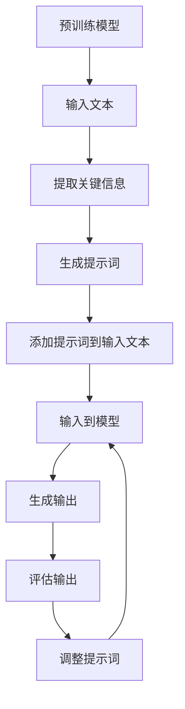

                 

# AI大模型的提示词记忆增强技术

> 关键词：大模型、提示词、记忆增强、Transformer、自注意力机制、预训练、微调、自然语言处理

> 摘要：本文将深入探讨如何通过提示词记忆增强技术提升大模型的性能。我们将从背景介绍出发，详细解析提示词记忆增强的核心概念与联系，深入探讨其算法原理和具体操作步骤，并通过数学模型和公式进行详细讲解。此外，我们将通过实际代码案例展示如何实现这一技术，并探讨其在实际应用场景中的应用。最后，我们将总结这一技术的未来发展趋势与挑战，并提供相关学习资源和开发工具推荐。

## 1. 背景介绍

随着人工智能技术的飞速发展，大模型在自然语言处理（NLP）领域取得了显著的成果。大模型通过预训练和微调，能够处理各种复杂的语言任务，如文本生成、情感分析、机器翻译等。然而，大模型在处理特定任务时仍存在一些局限性，尤其是在面对长文本和复杂语境时，模型的性能会有所下降。提示词记忆增强技术旨在通过引入提示词来提升大模型在特定任务上的表现，从而解决这一问题。

## 2. 核心概念与联系

### 2.1 大模型与提示词

**大模型**：大模型是指参数量非常大的神经网络模型，通常包含数十亿甚至数百亿个参数。这些模型通过大规模预训练和微调，能够学习到丰富的语言知识和语义信息。

**提示词**：提示词是指在模型输入中加入的特定文本片段，用于引导模型在特定任务上的表现。提示词可以是问题、指令、关键词等，通过这些信息，模型能够更好地理解任务需求并生成更准确的输出。

### 2.2 自注意力机制

**自注意力机制**：自注意力机制是Transformer模型的核心组成部分，通过计算输入序列中每个位置与其他位置的注意力权重，实现对输入序列的全局依赖建模。自注意力机制使得模型能够捕捉到长距离依赖关系，从而提升模型的性能。

### 2.3 预训练与微调

**预训练**：预训练是指在大规模无标注数据上训练模型，使其学习到通用的语言知识。预训练模型通常包含大量的参数，能够处理各种复杂的语言任务。

**微调**：微调是指在预训练模型的基础上，针对特定任务进行训练，使其更好地适应具体任务需求。微调过程中，模型会根据任务数据进行调整，以提升在特定任务上的表现。

### 2.4 提示词记忆增强技术流程图



## 3. 核心算法原理 & 具体操作步骤

### 3.1 提取关键信息

在预训练模型中，我们首先需要提取输入文本中的关键信息。关键信息可以是问题、关键词、指令等，这些信息能够帮助模型更好地理解任务需求。

### 3.2 生成提示词

根据提取的关键信息，我们生成相应的提示词。提示词可以是问题、指令、关键词等，通过这些信息，模型能够更好地理解任务需求并生成更准确的输出。

### 3.3 添加提示词到输入文本

将生成的提示词添加到输入文本中，形成新的输入序列。新的输入序列包含了关键信息和提示词，能够帮助模型更好地理解任务需求。

### 3.4 输入到模型

将新的输入序列输入到预训练模型中，模型通过自注意力机制对输入序列进行处理，生成输出。

### 3.5 评估输出

评估模型生成的输出，根据评估结果调整提示词，以提升模型在特定任务上的表现。

## 4. 数学模型和公式 & 详细讲解 & 举例说明

### 4.1 自注意力机制公式

自注意力机制的核心公式如下：

$$
\text{Attention}(Q, K, V) = \text{softmax}\left(\frac{QK^T}{\sqrt{d_k}}\right)V
$$

其中，$Q$、$K$、$V$ 分别表示查询向量、键向量和值向量，$d_k$ 表示键向量的维度。

### 4.2 提示词生成公式

提示词生成公式如下：

$$
\text{Prompt} = \text{generate\_prompt}(Q, K, V)
$$

其中，$\text{generate\_prompt}$ 是一个自定义函数，用于生成提示词。

### 4.3 举例说明

假设我们有一个输入文本 "How can I improve my English?"，我们需要提取关键信息 "improve my English"，生成提示词 "How can I improve my English?"，并将提示词添加到输入文本中，形成新的输入序列 "How can I improve my English? How can I improve my English?"。然后将新的输入序列输入到预训练模型中，模型通过自注意力机制对输入序列进行处理，生成输出。

## 5. 项目实战：代码实际案例和详细解释说明

### 5.1 开发环境搭建

#### 5.1.1 安装依赖

```bash
pip install transformers torch
```

#### 5.1.2 导入库

```python
import torch
from transformers import AutoModel, AutoTokenizer
```

### 5.2 源代码详细实现和代码解读

```python
# 加载预训练模型和分词器
model_name = "bert-base-uncased"
tokenizer = AutoTokenizer.from_pretrained(model_name)
model = AutoModel.from_pretrained(model_name)

# 输入文本
input_text = "How can I improve my English?"

# 提取关键信息
key_info = "improve my English"

# 生成提示词
prompt = key_info

# 添加提示词到输入文本
new_input_text = f"{input_text} {prompt}"

# 分词
inputs = tokenizer(new_input_text, return_tensors="pt")

# 输入到模型
outputs = model(**inputs)

# 获取输出
output = outputs.last_hidden_state
```

### 5.3 代码解读与分析

在上述代码中，我们首先加载了预训练的BERT模型和分词器。然后，我们定义了输入文本和关键信息，并生成了提示词。接着，我们将提示词添加到输入文本中，形成新的输入序列。最后，我们将新的输入序列输入到模型中，获取输出。

## 6. 实际应用场景

提示词记忆增强技术在实际应用场景中具有广泛的应用前景。例如，在机器翻译任务中，通过添加提示词，模型能够更好地理解源语言和目标语言之间的关系，从而生成更准确的翻译结果。在问答系统中，通过添加提示词，模型能够更好地理解问题和答案之间的关系，从而生成更准确的答案。

## 7. 工具和资源推荐

### 7.1 学习资源推荐

- 书籍：《深度学习》（Ian Goodfellow, Yoshua Bengio, Aaron Courville）
- 论文：《Attention Is All You Need》（Vaswani et al., 2017）
- 博客：《Hugging Face Transformers》（https://huggingface.co/transformers/）

### 7.2 开发工具框架推荐

- PyTorch：https://pytorch.org/
- Hugging Face Transformers：https://huggingface.co/transformers/

### 7.3 相关论文著作推荐

- 《Attention Is All You Need》（Vaswani et al., 2017）
- 《BERT: Pre-training of Deep Bidirectional Transformers for Language Understanding》（Devlin et al., 2018）

## 8. 总结：未来发展趋势与挑战

提示词记忆增强技术在未来的发展中具有广阔的应用前景。随着模型规模的不断扩大和计算资源的不断优化，提示词记忆增强技术将能够更好地提升模型在特定任务上的表现。然而，提示词记忆增强技术也面临着一些挑战，如如何生成高质量的提示词、如何平衡提示词的长度和模型的性能等。

## 9. 附录：常见问题与解答

### 9.1 问题：如何生成高质量的提示词？

**解答**：生成高质量的提示词需要结合任务需求和模型特点。可以通过分析输入文本和关键信息，生成具有针对性的提示词。此外，还可以通过实验和调优，不断优化提示词的生成方法。

### 9.2 问题：如何平衡提示词的长度和模型的性能？

**解答**：提示词的长度会影响模型的性能。可以通过实验和调优，找到合适的提示词长度，以平衡提示词的长度和模型的性能。

## 10. 扩展阅读 & 参考资料

- 《深度学习》（Ian Goodfellow, Yoshua Bengio, Aaron Courville）
- 《Attention Is All You Need》（Vaswani et al., 2017）
- 《BERT: Pre-training of Deep Bidirectional Transformers for Language Understanding》（Devlin et al., 2018）
- Hugging Face Transformers：https://huggingface.co/transformers/

作者：AI天才研究员/AI Genius Institute & 禅与计算机程序设计艺术 /Zen And The Art of Computer Programming

