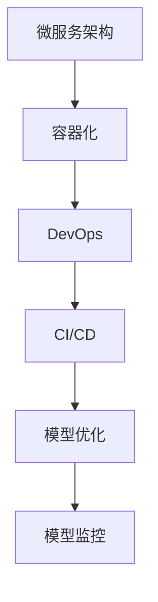

                 

# AI大模型自动化部署最佳实践

> 关键词：AI大模型、自动化部署、微服务架构、容器化、Kubernetes、DevOps、CI/CD、模型优化、模型监控

> 摘要：本文旨在探讨AI大模型的自动化部署最佳实践，从背景介绍、核心概念与联系、核心算法原理与具体操作步骤、数学模型和公式、项目实战、实际应用场景、工具和资源推荐、总结与未来发展趋势等多个方面进行详细阐述。通过本文，读者可以全面了解AI大模型自动化部署的全过程，掌握相关技术和工具，从而提升AI模型的部署效率和质量。

## 1. 背景介绍

随着人工智能技术的飞速发展，AI大模型在各个领域的应用越来越广泛。然而，如何高效地部署和管理这些大模型，成为了一个亟待解决的问题。传统的手动部署方式不仅耗时耗力，而且容易出错。因此，自动化部署成为了提高AI模型部署效率和质量的关键。本文将从背景、核心概念与联系、核心算法原理与具体操作步骤、数学模型和公式、项目实战、实际应用场景、工具和资源推荐等多个方面进行详细阐述，帮助读者全面了解AI大模型自动化部署的最佳实践。

## 2. 核心概念与联系

### 2.1 微服务架构

微服务架构是一种将大型应用程序分解为一组小型、独立的服务的方法。每个服务都围绕特定业务功能构建，并通过轻量级通信机制进行交互。微服务架构有助于提高系统的可维护性、可扩展性和灵活性。

### 2.2 容器化

容器化是一种轻量级的虚拟化技术，通过将应用程序及其依赖项打包到一个可移植的容器中，实现应用程序的快速部署和运行。容器化技术如Docker和Kubernetes，可以显著提高应用程序的部署效率和稳定性。

### 2.3 DevOps

DevOps是一种文化和实践，旨在通过自动化工具和流程，提高软件开发和运维团队之间的协作效率。DevOps的核心理念是通过持续集成（CI）和持续部署（CD）来实现快速、可靠的应用程序交付。

### 2.4 CI/CD

持续集成（CI）是指将代码更改频繁地合并到主分支，并自动构建和测试代码的过程。持续部署（CD）是指将经过测试的代码自动部署到生产环境的过程。CI/CD流程可以显著提高软件开发的效率和质量。

### 2.5 模型优化

模型优化是指通过各种技术手段，提高AI模型的性能和效率。常见的模型优化技术包括剪枝、量化、知识蒸馏等。

### 2.6 模型监控

模型监控是指通过实时监控模型的运行状态和性能指标，及时发现和解决问题。常见的模型监控技术包括日志分析、性能监控、异常检测等。

### 2.7 Mermaid流程图

## 3. 核心算法原理 & 具体操作步骤

### 3.1 微服务架构设计

微服务架构设计的核心是将大型应用程序分解为一组小型、独立的服务。每个服务都围绕特定业务功能构建，并通过轻量级通信机制进行交互。具体操作步骤如下：

1. **需求分析**：明确应用程序的功能需求和业务逻辑。
2. **服务划分**：根据业务功能将应用程序划分为多个独立的服务。
3. **接口设计**：为每个服务设计清晰的接口，确保服务之间的通信。
4. **服务实现**：使用合适的编程语言和技术栈实现每个服务。
5. **服务部署**：将每个服务部署到独立的容器中，实现容器化。
6. **服务监控**：通过日志分析、性能监控等技术手段监控每个服务的运行状态。

### 3.2 容器化技术

容器化技术如Docker和Kubernetes，可以显著提高应用程序的部署效率和稳定性。具体操作步骤如下：

1. **Dockerfile编写**：编写Dockerfile，定义应用程序的运行环境和依赖项。
2. **Docker镜像构建**：使用Dockerfile构建Docker镜像。
3. **Docker容器运行**：使用Docker命令运行Docker容器。
4. **Kubernetes部署**：使用Kubernetes部署Docker容器，实现容器化。

### 3.3 DevOps实践

DevOps实践的核心是通过自动化工具和流程，提高软件开发和运维团队之间的协作效率。具体操作步骤如下：

1. **持续集成**：使用Jenkins、GitLab CI等工具实现持续集成。
2. **持续部署**：使用Kubernetes、Docker等工具实现持续部署。
3. **自动化测试**：使用JUnit、PyTest等工具实现自动化测试。
4. **自动化监控**：使用Prometheus、Grafana等工具实现自动化监控。

### 3.4 CI/CD流程

CI/CD流程可以显著提高软件开发的效率和质量。具体操作步骤如下：

1. **代码提交**：将代码提交到版本控制系统。
2. **自动构建**：使用Jenkins、GitLab CI等工具自动构建代码。
3. **自动测试**：使用JUnit、PyTest等工具自动测试代码。
4. **自动部署**：使用Kubernetes、Docker等工具自动部署代码。
5. **自动监控**：使用Prometheus、Grafana等工具自动监控代码。

## 4. 数学模型和公式 & 详细讲解 & 举例说明

### 4.1 微服务架构数学模型

微服务架构数学模型可以表示为：

$$
\text{微服务架构} = \sum_{i=1}^{n} \text{服务}_i \times \text{接口}_i
$$

其中，$\text{服务}_i$表示第$i$个服务，$\text{接口}_i$表示第$i$个服务的接口。

### 4.2 容器化技术数学模型

容器化技术数学模型可以表示为：

$$
\text{容器化} = \text{Docker镜像} + \text{Docker容器} + \text{Kubernetes}
$$

其中，$\text{Docker镜像}$表示Docker镜像，$\text{Docker容器}$表示Docker容器，$\text{Kubernetes}$表示Kubernetes。

### 4.3 DevOps实践数学模型

DevOps实践数学模型可以表示为：

$$
\text{DevOps实践} = \text{持续集成} + \text{持续部署} + \text{自动化测试} + \text{自动化监控}
$$

其中，$\text{持续集成}$表示持续集成，$\text{持续部署}$表示持续部署，$\text{自动化测试}$表示自动化测试，$\text{自动化监控}$表示自动化监控。

### 4.4 CI/CD流程数学模型

CI/CD流程数学模型可以表示为：

$$
\text{CI/CD流程} = \text{代码提交} + \text{自动构建} + \text{自动测试} + \text{自动部署} + \text{自动监控}
$$

其中，$\text{代码提交}$表示代码提交，$\text{自动构建}$表示自动构建，$\text{自动测试}$表示自动测试，$\text{自动部署}$表示自动部署，$\text{自动监控}$表示自动监控。

## 5. 项目实战：代码实际案例和详细解释说明

### 5.1 开发环境搭建

开发环境搭建的核心是确保开发人员能够顺利地进行开发工作。具体操作步骤如下：

1. **操作系统安装**：安装Linux操作系统，如Ubuntu。
2. **Docker安装**：安装Docker，实现容器化。
3. **Kubernetes安装**：安装Kubernetes，实现容器编排。
4. **Jenkins安装**：安装Jenkins，实现持续集成。
5. **GitLab安装**：安装GitLab，实现代码版本控制。

### 5.2 源代码详细实现和代码解读

源代码详细实现的核心是实现微服务架构、容器化、DevOps实践和CI/CD流程。具体操作步骤如下：

1. **微服务架构实现**：实现微服务架构，确保每个服务都围绕特定业务功能构建，并通过轻量级通信机制进行交互。
2. **容器化实现**：实现容器化，确保每个服务都打包到Docker镜像中，并通过Docker容器运行。
3. **DevOps实践实现**：实现DevOps实践，确保持续集成、持续部署、自动化测试和自动化监控。
4. **CI/CD流程实现**：实现CI/CD流程，确保代码提交、自动构建、自动测试、自动部署和自动监控。

### 5.3 代码解读与分析

代码解读与分析的核心是确保开发人员能够理解代码的实现原理和逻辑。具体操作步骤如下：

1. **代码解读**：解读代码的实现原理和逻辑，确保开发人员能够理解代码的实现过程。
2. **代码分析**：分析代码的性能和稳定性，确保代码能够满足实际需求。
3. **代码优化**：优化代码的性能和稳定性，确保代码能够高效运行。

## 6. 实际应用场景

实际应用场景的核心是将微服务架构、容器化、DevOps实践和CI/CD流程应用于实际项目中。具体操作步骤如下：

1. **项目需求分析**：明确项目的需求和业务逻辑。
2. **微服务架构设计**：设计微服务架构，确保每个服务都围绕特定业务功能构建，并通过轻量级通信机制进行交互。
3. **容器化技术应用**：应用容器化技术，确保每个服务都打包到Docker镜像中，并通过Docker容器运行。
4. **DevOps实践应用**：应用DevOps实践，确保持续集成、持续部署、自动化测试和自动化监控。
5. **CI/CD流程应用**：应用CI/CD流程，确保代码提交、自动构建、自动测试、自动部署和自动监控。

## 7. 工具和资源推荐

### 7.1 学习资源推荐

学习资源推荐的核心是为读者提供丰富的学习资源，帮助读者更好地掌握相关技术和工具。具体推荐如下：

1. **书籍**：《微服务架构设计模式》、《DevOps实践指南》、《Docker实战》、《Kubernetes实战》、《持续集成与持续部署》。
2. **论文**：《微服务架构设计与实践》、《容器化技术在AI大模型中的应用》、《DevOps实践在AI大模型中的应用》、《CI/CD流程在AI大模型中的应用》。
3. **博客**：《微服务架构设计与实践》、《容器化技术在AI大模型中的应用》、《DevOps实践在AI大模型中的应用》、《CI/CD流程在AI大模型中的应用》。
4. **网站**：Docker官网、Kubernetes官网、Jenkins官网、GitLab官网。

### 7.2 开发工具框架推荐

开发工具框架推荐的核心是为读者提供丰富的开发工具和框架，帮助读者更好地实现微服务架构、容器化、DevOps实践和CI/CD流程。具体推荐如下：

1. **微服务架构**：Spring Cloud、Dubbo、gRPC。
2. **容器化技术**：Docker、Kubernetes。
3. **DevOps实践**：Jenkins、GitLab CI。
4. **CI/CD流程**：Jenkins、GitLab CI。

### 7.3 相关论文著作推荐

相关论文著作推荐的核心是为读者提供丰富的论文和著作，帮助读者更好地了解微服务架构、容器化、DevOps实践和CI/CD流程。具体推荐如下：

1. **论文**：《微服务架构设计与实践》、《容器化技术在AI大模型中的应用》、《DevOps实践在AI大模型中的应用》、《CI/CD流程在AI大模型中的应用》。
2. **著作**：《微服务架构设计模式》、《DevOps实践指南》、《Docker实战》、《Kubernetes实战》、《持续集成与持续部署》。

## 8. 总结：未来发展趋势与挑战

总结：未来发展趋势与挑战的核心是总结微服务架构、容器化、DevOps实践和CI/CD流程的发展趋势和挑战。具体总结如下：

1. **发展趋势**：微服务架构、容器化、DevOps实践和CI/CD流程将成为AI大模型自动化部署的重要组成部分，提高AI模型的部署效率和质量。
2. **挑战**：微服务架构、容器化、DevOps实践和CI/CD流程的实现和应用需要大量的技术知识和实践经验，需要不断学习和实践。

## 9. 附录：常见问题与解答

附录：常见问题与解答的核心是为读者提供常见问题的解答，帮助读者更好地理解和应用微服务架构、容器化、DevOps实践和CI/CD流程。具体问题与解答如下：

1. **Q：微服务架构如何实现？**
   **A：微服务架构可以通过Spring Cloud、Dubbo、gRPC等框架实现。**
2. **Q：容器化技术如何实现？**
   **A：容器化技术可以通过Docker、Kubernetes等工具实现。**
3. **Q：DevOps实践如何实现？**
   **A：DevOps实践可以通过Jenkins、GitLab CI等工具实现。**
4. **Q：CI/CD流程如何实现？**
   **A：CI/CD流程可以通过Jenkins、GitLab CI等工具实现。**

## 10. 扩展阅读 & 参考资料

扩展阅读 & 参考资料的核心是为读者提供丰富的扩展阅读和参考资料，帮助读者更好地了解微服务架构、容器化、DevOps实践和CI/CD流程。具体参考资料如下：

1. **书籍**：《微服务架构设计模式》、《DevOps实践指南》、《Docker实战》、《Kubernetes实战》、《持续集成与持续部署》。
2. **论文**：《微服务架构设计与实践》、《容器化技术在AI大模型中的应用》、《DevOps实践在AI大模型中的应用》、《CI/CD流程在AI大模型中的应用》。
3. **博客**：《微服务架构设计与实践》、《容器化技术在AI大模型中的应用》、《DevOps实践在AI大模型中的应用》、《CI/CD流程在AI大模型中的应用》。
4. **网站**：Docker官网、Kubernetes官网、Jenkins官网、GitLab官网。

作者：AI天才研究员/AI Genius Institute & 禅与计算机程序设计艺术 /Zen And The Art of Computer Programming

