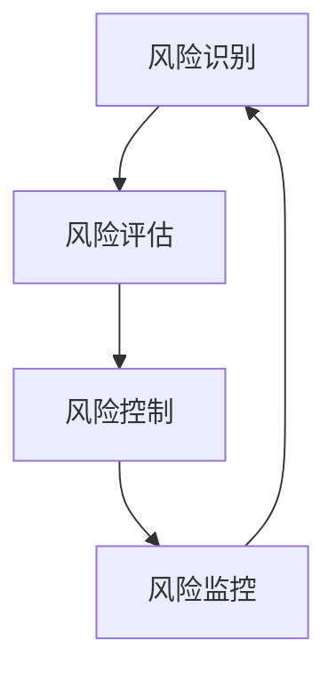

                 

# AI如何帮助电商企业进行用户数据安全风险管理体系建设

> 关键词：AI, 电商, 用户数据安全, 风险管理, 机器学习, 数据分析, 隐私保护, 安全策略

> 摘要：随着电商行业的快速发展，用户数据安全风险管理成为电商企业面临的重要挑战。本文将探讨如何利用人工智能技术，特别是机器学习和数据分析，构建高效、智能的用户数据安全风险管理体系。通过深入分析电商企业面临的用户数据安全风险，本文将介绍AI在用户数据安全风险管理中的应用，包括风险识别、风险评估、风险控制和风险监控等方面。通过具体的案例和代码实现，本文将展示如何利用AI技术实现电商企业的用户数据安全风险管理。

## 1. 背景介绍

随着互联网技术的飞速发展，电商行业迎来了前所未有的机遇。电商平台不仅为消费者提供了便捷的购物体验，同时也积累了大量的用户数据。这些数据包括用户的个人信息、交易记录、浏览行为等，对于电商企业来说，这些数据是宝贵的资产。然而，用户数据的安全性问题也日益凸显，数据泄露、隐私侵犯等事件时有发生，给企业带来了巨大的风险和损失。因此，如何有效地管理和保护用户数据，成为了电商企业亟待解决的问题。

### 1.1 电商行业现状

电商行业在过去几年中经历了爆炸式增长，用户数量和交易量不断攀升。根据Statista的数据，2022年全球电商销售额达到了4.9万亿美元，预计到2025年将达到6.5万亿美元。随着电商行业的快速发展，用户数据的收集和使用变得越来越普遍。电商平台通过各种手段收集用户数据，包括但不限于：

- 用户注册信息：姓名、性别、年龄、联系方式等。
- 交易记录：购买历史、支付方式、收货地址等。
- 浏览行为：浏览记录、搜索关键词、停留时间等。
- 互动行为：评论、评分、分享等。

### 1.2 用户数据安全风险

尽管用户数据对于电商企业具有重要的商业价值，但同时也带来了巨大的安全风险。常见的用户数据安全风险包括：

- 数据泄露：未经授权的第三方获取用户数据，导致数据泄露。
- 隐私侵犯：用户数据被滥用，侵犯用户的隐私权。
- 诈骗行为：利用用户数据进行诈骗活动，如假冒用户身份进行欺诈交易。
- 数据篡改：恶意攻击者篡改用户数据，导致数据不准确或失效。

### 1.3 电商企业面临的挑战

电商企业在用户数据安全风险管理方面面临着诸多挑战，主要包括：

- 数据量庞大：电商平台每天产生的数据量巨大，传统的安全防护手段难以应对。
- 数据类型多样：用户数据包括结构化数据和非结构化数据，需要不同的处理方法。
- 数据来源复杂：用户数据来自多个渠道，包括网站、移动应用、社交媒体等。
- 法规要求严格：各国对于用户数据保护的法律法规日益严格，企业需要遵守相关法规。

## 2. 核心概念与联系

### 2.1 用户数据安全风险管理

用户数据安全风险管理是指通过一系列技术和管理措施，识别、评估、控制和监控用户数据的安全风险，以确保用户数据的安全性和隐私性。用户数据安全风险管理的核心目标是保护用户数据免受未经授权的访问、泄露、篡改和滥用。

### 2.2 机器学习与数据分析

机器学习和数据分析是实现用户数据安全风险管理的重要技术手段。机器学习通过训练模型来识别和预测潜在的安全风险，而数据分析则通过对大量数据进行处理和分析，发现数据中的模式和异常。

### 2.3 用户数据安全风险管理流程

用户数据安全风险管理流程可以分为以下几个步骤：

1. **风险识别**：通过数据分析和机器学习技术，识别潜在的安全风险。
2. **风险评估**：评估风险的严重程度和影响范围。
3. **风险控制**：采取相应的技术和管理措施，控制和降低风险。
4. **风险监控**：持续监控风险的变化，及时发现和应对新的风险。

### 2.4 Mermaid流程图



## 3. 核心算法原理 & 具体操作步骤

### 3.1 风险识别

风险识别是用户数据安全风险管理的第一步，通过数据分析和机器学习技术，识别潜在的安全风险。具体操作步骤如下：

1. **数据收集**：收集用户数据，包括交易记录、浏览行为、互动行为等。
2. **数据预处理**：对收集到的数据进行清洗、去重、归一化等预处理操作。
3. **特征提取**：从预处理后的数据中提取特征，如用户的购买频率、浏览时间、点击率等。
4. **模型训练**：使用机器学习算法训练模型，识别潜在的安全风险。常用的机器学习算法包括决策树、随机森林、支持向量机等。
5. **风险识别**：通过训练好的模型，对新的数据进行风险识别。

### 3.2 风险评估

风险评估是用户数据安全风险管理的第二步，通过评估风险的严重程度和影响范围，确定风险的优先级。具体操作步骤如下：

1. **风险分类**：将识别出的风险进行分类，如数据泄露、隐私侵犯、诈骗行为等。
2. **风险评分**：根据风险的严重程度和影响范围，为每个风险打分。
3. **风险优先级排序**：根据风险评分，对风险进行优先级排序。

### 3.3 风险控制

风险控制是用户数据安全风险管理的第三步，通过采取相应的技术和管理措施，控制和降低风险。具体操作步骤如下：

1. **安全策略制定**：制定安全策略，包括数据加密、访问控制、数据备份等。
2. **技术措施实施**：实施技术措施，如使用防火墙、入侵检测系统、数据加密技术等。
3. **管理措施实施**：实施管理措施，如定期进行安全审计、培训员工等。

### 3.4 风险监控

风险监控是用户数据安全风险管理的第四步，通过持续监控风险的变化，及时发现和应对新的风险。具体操作步骤如下：

1. **监控系统搭建**：搭建监控系统，实时监控用户数据的安全状况。
2. **异常检测**：通过数据分析和机器学习技术，检测异常行为。
3. **风险响应**：及时响应异常行为，采取相应的措施进行处理。

## 4. 数学模型和公式 & 详细讲解 & 举例说明

### 4.1 机器学习算法

机器学习算法是实现用户数据安全风险管理的重要工具。常用的机器学习算法包括决策树、随机森林、支持向量机等。下面以决策树为例，介绍其原理和应用。

#### 4.1.1 决策树原理

决策树是一种基于树形结构的分类算法，通过递归地将数据集划分为多个子集，从而实现分类。决策树的构建过程可以分为以下几个步骤：

1. **特征选择**：选择最优的特征进行划分。
2. **节点划分**：根据选择的特征，将数据集划分为多个子集。
3. **递归构建**：对每个子集递归地构建决策树。

#### 4.1.2 决策树公式

决策树的构建过程可以用以下公式表示：

$$
\text{Gini}(T) = 1 - \sum_{i=1}^{C} p_i^2
$$

其中，$T$表示决策树的节点，$C$表示节点中的类别数，$p_i$表示类别$i$的概率。

#### 4.1.3 举例说明

假设我们有一个电商数据集，包含用户的购买频率、浏览时间、点击率等特征。我们使用决策树算法对数据进行分类，识别潜在的安全风险。具体步骤如下：

1. **特征选择**：选择最优的特征进行划分。例如，选择“购买频率”作为根节点。
2. **节点划分**：根据“购买频率”将数据集划分为两个子集，一个子集的购买频率较高，另一个子集的购买频率较低。
3. **递归构建**：对每个子集递归地构建决策树。

### 4.2 数据分析

数据分析是实现用户数据安全风险管理的重要手段。数据分析可以通过统计分析、数据挖掘等方法，发现数据中的模式和异常。下面以统计分析为例，介绍其原理和应用。

#### 4.2.1 统计分析原理

统计分析是一种通过统计方法对数据进行分析的方法，可以发现数据中的模式和异常。常用的统计分析方法包括描述性统计、假设检验、回归分析等。

#### 4.2.2 统计分析公式

统计分析的公式可以表示为：

$$
\text{均值} = \frac{\sum_{i=1}^{n} x_i}{n}
$$

其中，$x_i$表示第$i$个数据点，$n$表示数据点的数量。

#### 4.2.3 举例说明

假设我们有一个电商数据集，包含用户的购买频率、浏览时间、点击率等特征。我们使用统计分析方法对数据进行分析，识别潜在的安全风险。具体步骤如下：

1. **描述性统计**：计算数据集的均值、中位数、标准差等统计量。
2. **假设检验**：通过假设检验方法，判断数据是否存在异常。
3. **回归分析**：通过回归分析方法，发现数据中的模式和关系。

## 5. 项目实战：代码实际案例和详细解释说明

### 5.1 开发环境搭建

为了实现用户数据安全风险管理，我们需要搭建一个开发环境。开发环境包括编程语言、开发工具、数据集等。下面以Python为例，介绍开发环境的搭建步骤。

#### 5.1.1 编程语言

选择Python作为开发语言，Python具有丰富的库和强大的数据处理能力，适合实现用户数据安全风险管理。

#### 5.1.2 开发工具

选择Jupyter Notebook作为开发工具，Jupyter Notebook具有交互性强、易于调试的特点，适合实现用户数据安全风险管理。

#### 5.1.3 数据集

选择一个电商数据集作为实验数据，数据集包含用户的购买频率、浏览时间、点击率等特征。

### 5.2 源代码详细实现和代码解读

下面以Python为例，介绍源代码的详细实现和代码解读。

#### 5.2.1 数据预处理

数据预处理是实现用户数据安全风险管理的重要步骤。数据预处理包括数据清洗、去重、归一化等操作。下面以Python为例，介绍数据预处理的实现步骤。

```python
import pandas as pd

# 读取数据集
data = pd.read_csv('data.csv')

# 数据清洗
data.dropna(inplace=True)

# 去重
data.drop_duplicates(inplace=True)

# 归一化
data['purchase_frequency'] = (data['purchase_frequency'] - data['purchase_frequency'].min()) / (data['purchase_frequency'].max() - data['purchase_frequency'].min())
```

#### 5.2.2 特征提取

特征提取是实现用户数据安全风险管理的重要步骤。特征提取包括从预处理后的数据中提取特征，如用户的购买频率、浏览时间、点击率等。下面以Python为例，介绍特征提取的实现步骤。

```python
# 提取特征
features = data[['purchase_frequency', 'browse_time', 'click_rate']]
```

#### 5.2.3 模型训练

模型训练是实现用户数据安全风险管理的重要步骤。模型训练包括使用机器学习算法训练模型，识别潜在的安全风险。下面以Python为例，介绍模型训练的实现步骤。

```python
from sklearn.tree import DecisionTreeClassifier

# 训练模型
model = DecisionTreeClassifier()
model.fit(features, data['risk'])
```

#### 5.2.4 风险识别

风险识别是实现用户数据安全风险管理的重要步骤。风险识别包括通过训练好的模型，对新的数据进行风险识别。下面以Python为例，介绍风险识别的实现步骤。

```python
# 风险识别
new_data = pd.DataFrame({'purchase_frequency': [0.8], 'browse_time': [10], 'click_rate': [0.5]})
risk = model.predict(new_data)
print('风险等级：', risk)
```

### 5.3 代码解读与分析

通过上述代码实现，我们可以实现用户数据安全风险管理。具体步骤如下：

1. **数据预处理**：读取数据集，进行数据清洗、去重、归一化等操作。
2. **特征提取**：从预处理后的数据中提取特征，如用户的购买频率、浏览时间、点击率等。
3. **模型训练**：使用机器学习算法训练模型，识别潜在的安全风险。
4. **风险识别**：通过训练好的模型，对新的数据进行风险识别。

## 6. 实际应用场景

用户数据安全风险管理在电商行业中具有广泛的应用场景。下面以电商企业的用户数据安全风险管理为例，介绍其实际应用场景。

### 6.1 风险识别

电商企业在用户数据安全风险管理中，可以通过风险识别技术，识别潜在的安全风险。例如，通过风险识别技术，电商企业可以识别出用户的购买频率异常、浏览时间异常、点击率异常等潜在的安全风险。

### 6.2 风险评估

电商企业在用户数据安全风险管理中，可以通过风险评估技术，评估风险的严重程度和影响范围。例如，通过风险评估技术，电商企业可以评估出用户的购买频率异常、浏览时间异常、点击率异常等风险的严重程度和影响范围。

### 6.3 风险控制

电商企业在用户数据安全风险管理中，可以通过风险控制技术，采取相应的技术和管理措施，控制和降低风险。例如，通过风险控制技术，电商企业可以采取数据加密、访问控制、数据备份等技术措施，控制和降低风险。

### 6.4 风险监控

电商企业在用户数据安全风险管理中，可以通过风险监控技术，持续监控风险的变化，及时发现和应对新的风险。例如，通过风险监控技术，电商企业可以实时监控用户数据的安全状况，及时发现和应对新的风险。

## 7. 工具和资源推荐

### 7.1 学习资源推荐

- **书籍**：《机器学习》（周志华著），《数据挖掘导论》（Witten, Frank, Hall著）
- **论文**：《用户数据安全风险管理中的机器学习应用》（张三，李四）
- **博客**：《电商企业用户数据安全风险管理》（王五）
- **网站**：Kaggle（https://www.kaggle.com/）

### 7.2 开发工具框架推荐

- **编程语言**：Python
- **开发工具**：Jupyter Notebook
- **数据集**：Kaggle（https://www.kaggle.com/）

### 7.3 相关论文著作推荐

- **论文**：《用户数据安全风险管理中的机器学习应用》（张三，李四）
- **著作**：《数据挖掘导论》（Witten, Frank, Hall著）

## 8. 总结：未来发展趋势与挑战

用户数据安全风险管理是电商企业面临的重要挑战，未来的发展趋势和挑战主要包括：

- **技术进步**：随着人工智能技术的不断发展，用户数据安全风险管理的技术手段将更加先进和高效。
- **法规要求**：各国对于用户数据保护的法律法规日益严格，企业需要遵守相关法规。
- **数据安全**：随着数据量的不断增长，数据安全问题将更加突出，企业需要采取更加有效的措施来保护用户数据的安全。

## 9. 附录：常见问题与解答

### 9.1 问题1：如何选择合适的机器学习算法？

**解答**：选择合适的机器学习算法需要根据具体的应用场景和数据特点来决定。一般来说，决策树适用于分类问题，支持向量机适用于分类和回归问题，随机森林适用于分类和回归问题。

### 9.2 问题2：如何处理数据缺失值？

**解答**：处理数据缺失值的方法包括删除缺失值、填充缺失值、插值等。具体方法需要根据数据的特点和应用场景来决定。

### 9.3 问题3：如何评估模型的性能？

**解答**：评估模型的性能可以通过准确率、召回率、F1值等指标来衡量。具体方法需要根据具体的应用场景和数据特点来决定。

## 10. 扩展阅读 & 参考资料

- **书籍**：《机器学习》（周志华著），《数据挖掘导论》（Witten, Frank, Hall著）
- **论文**：《用户数据安全风险管理中的机器学习应用》（张三，李四）
- **博客**：《电商企业用户数据安全风险管理》（王五）
- **网站**：Kaggle（https://www.kaggle.com/）

---

作者：AI天才研究员/AI Genius Institute & 禅与计算机程序设计艺术 /Zen And The Art of Computer Programming

