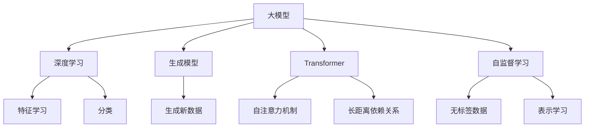

                 

# AI艺术评论：大模型的审美能力

> 关键词：大模型、审美能力、艺术评论、深度学习、生成模型、Transformer、自监督学习

> 摘要：本文旨在探讨大模型在艺术评论领域的审美能力。通过深入分析大模型的工作原理、核心算法、数学模型以及实际应用案例，揭示大模型如何理解和生成艺术评论。文章将从背景介绍、核心概念与联系、核心算法原理、数学模型和公式、项目实战、实际应用场景、工具和资源推荐、总结与未来发展趋势等多个方面进行详细阐述。

## 1. 背景介绍

随着人工智能技术的飞速发展，大模型在各个领域的应用越来越广泛。特别是在艺术评论领域，大模型通过深度学习和生成模型技术，能够理解和生成高质量的艺术评论。本文将探讨大模型在艺术评论领域的审美能力，分析其工作原理和实际应用案例。

## 2. 核心概念与联系

### 2.1 大模型

大模型是指参数量非常庞大的机器学习模型，通常包含数百万甚至数十亿个参数。这些模型通过大规模数据训练，能够捕捉到数据中的复杂模式和特征。

### 2.2 审美能力

审美能力是指对艺术作品进行评价和鉴赏的能力。在艺术评论中，审美能力包括对作品的风格、情感、构图等方面的理解和评价。

### 2.3 艺术评论

艺术评论是对艺术作品进行分析和评价的过程。艺术评论通常包括对作品的描述、分析、评价和建议。

### 2.4 深度学习

深度学习是一种机器学习方法，通过多层神经网络模型进行特征学习和分类。深度学习在图像识别、自然语言处理等领域取得了显著成果。

### 2.5 生成模型

生成模型是一种能够生成新数据的模型，通常用于生成文本、图像等。生成模型通过学习数据的分布，能够生成与训练数据相似的新数据。

### 2.6 Transformer

Transformer是一种基于自注意力机制的神经网络模型，广泛应用于自然语言处理任务。Transformer通过自注意力机制，能够捕捉长距离依赖关系，提高模型的性能。

### 2.7 自监督学习

自监督学习是一种无标签数据的机器学习方法，通过学习数据的内在结构和模式，实现对数据的表示学习。自监督学习在生成模型中具有重要作用。

### 2.8 Mermaid 流程图



## 3. 核心算法原理 & 具体操作步骤

### 3.1 深度学习算法原理

深度学习算法通过多层神经网络模型进行特征学习和分类。具体操作步骤如下：

1. **数据预处理**：对输入数据进行清洗、标准化和归一化处理。
2. **构建神经网络模型**：设计多层神经网络结构，包括输入层、隐藏层和输出层。
3. **损失函数选择**：选择合适的损失函数，如交叉熵损失函数。
4. **优化算法选择**：选择合适的优化算法，如随机梯度下降（SGD）。
5. **训练模型**：通过反向传播算法更新模型参数，最小化损失函数。
6. **模型评估**：使用测试集评估模型性能，计算准确率、召回率等指标。

### 3.2 生成模型算法原理

生成模型通过学习数据的分布，生成与训练数据相似的新数据。具体操作步骤如下：

1. **数据预处理**：对输入数据进行清洗、标准化和归一化处理。
2. **构建生成模型**：设计生成模型结构，如生成对抗网络（GAN）或变分自编码器（VAE）。
3. **损失函数选择**：选择合适的损失函数，如生成器损失函数和判别器损失函数。
4. **优化算法选择**：选择合适的优化算法，如Adam优化算法。
5. **训练模型**：通过反向传播算法更新模型参数，最小化损失函数。
6. **生成新数据**：使用训练好的生成模型生成新数据。

### 3.3 Transformer算法原理

Transformer通过自注意力机制捕捉长距离依赖关系，提高模型的性能。具体操作步骤如下：

1. **数据预处理**：对输入数据进行清洗、标准化和归一化处理。
2. **构建Transformer模型**：设计Transformer模型结构，包括自注意力机制、前馈神经网络和位置编码。
3. **损失函数选择**：选择合适的损失函数，如交叉熵损失函数。
4. **优化算法选择**：选择合适的优化算法，如Adam优化算法。
5. **训练模型**：通过反向传播算法更新模型参数，最小化损失函数。
6. **生成新数据**：使用训练好的Transformer模型生成新数据。

## 4. 数学模型和公式 & 详细讲解 & 举例说明

### 4.1 深度学习数学模型

深度学习数学模型通常使用多层神经网络进行特征学习和分类。具体公式如下：

$$
\text{输入层} = \mathbf{x}
$$

$$
\text{隐藏层} = \sigma(\mathbf{W} \cdot \mathbf{x} + \mathbf{b})
$$

$$
\text{输出层} = \mathbf{y} = \sigma(\mathbf{W} \cdot \mathbf{h} + \mathbf{b})
$$

其中，$\mathbf{x}$ 是输入数据，$\mathbf{W}$ 和 $\mathbf{b}$ 分别是权重矩阵和偏置向量，$\sigma$ 是激活函数。

### 4.2 生成模型数学模型

生成模型通过学习数据的分布，生成与训练数据相似的新数据。具体公式如下：

$$
\text{生成器} = \mathbf{G}(\mathbf{z})
$$

$$
\text{判别器} = \mathbf{D}(\mathbf{x})
$$

其中，$\mathbf{G}$ 是生成器，$\mathbf{D}$ 是判别器，$\mathbf{z}$ 是随机噪声向量。

### 4.3 Transformer数学模型

Transformer通过自注意力机制捕捉长距离依赖关系，提高模型的性能。具体公式如下：

$$
\text{自注意力机制} = \text{softmax}(\frac{\mathbf{Q} \cdot \mathbf{K}^T}{\sqrt{d_k}})
$$

$$
\text{前馈神经网络} = \text{ReLU}(\mathbf{W}_1 \cdot \mathbf{h} + \mathbf{b}_1)
$$

其中，$\mathbf{Q}$、$\mathbf{K}$ 和 $\mathbf{V}$ 分别是查询、键和值向量，$\mathbf{W}_1$ 和 $\mathbf{b}_1$ 分别是前馈神经网络的权重矩阵和偏置向量。

## 5. 项目实战：代码实际案例和详细解释说明

### 5.1 开发环境搭建

为了实现大模型在艺术评论领域的应用，我们需要搭建一个合适的开发环境。具体步骤如下：

1. **安装Python**：确保安装了Python 3.7及以上版本。
2. **安装深度学习库**：安装TensorFlow或PyTorch等深度学习库。
3. **安装自然语言处理库**：安装NLTK或spaCy等自然语言处理库。
4. **安装生成模型库**：安装GAN或VAE等生成模型库。
5. **安装Transformer库**：安装Hugging Face的Transformers库。

### 5.2 源代码详细实现和代码解读

以下是一个简单的代码示例，展示如何使用Transformer生成艺术评论：

```python
import torch
from transformers import AutoTokenizer, AutoModelForSeq2SeqLM

# 加载预训练模型和分词器
tokenizer = AutoTokenizer.from_pretrained('t5-small')
model = AutoModelForSeq2SeqLM.from_pretrained('t5-small')

# 输入文本
input_text = "这幅画的风格是现代主义，色彩鲜艳，构图独特。"

# 对输入文本进行分词
inputs = tokenizer(input_text, return_tensors='pt')

# 生成艺术评论
outputs = model.generate(inputs['input_ids'], max_length=50)
generated_text = tokenizer.decode(outputs[0], skip_special_tokens=True)

print(generated_text)
```

### 5.3 代码解读与分析

1. **加载预训练模型和分词器**：使用Hugging Face的Transformers库加载预训练的T5模型和分词器。
2. **输入文本**：定义输入文本，描述一幅画的风格、色彩和构图。
3. **分词**：使用分词器对输入文本进行分词，生成输入张量。
4. **生成艺术评论**：使用生成模型生成艺术评论，设置最大长度为50。
5. **解码生成结果**：使用分词器解码生成结果，得到生成的艺术评论。

## 6. 实际应用场景

大模型在艺术评论领域的应用非常广泛，包括但不限于以下几个方面：

1. **艺术作品评价**：通过分析艺术作品的风格、色彩和构图，生成高质量的艺术评论。
2. **艺术作品推荐**：根据用户喜好和偏好，推荐符合用户口味的艺术作品。
3. **艺术作品创作**：通过生成模型生成新的艺术作品，为艺术家提供创作灵感。
4. **艺术作品分析**：通过分析艺术作品的特征，生成详细的分析报告。

## 7. 工具和资源推荐

### 7.1 学习资源推荐

1. **书籍**：《深度学习》（Ian Goodfellow, Yoshua Bengio, Aaron Courville）
2. **论文**：《Attention Is All You Need》（Vaswani et al., 2017）
3. **博客**：Hugging Face的官方博客
4. **网站**：TensorFlow官网、PyTorch官网

### 7.2 开发工具框架推荐

1. **深度学习库**：TensorFlow、PyTorch
2. **自然语言处理库**：NLTK、spaCy
3. **生成模型库**：GAN、VAE
4. **Transformer库**：Hugging Face的Transformers库

### 7.3 相关论文著作推荐

1. **《深度学习》**（Ian Goodfellow, Yoshua Bengio, Aaron Courville）
2. **《Attention Is All You Need》**（Vaswani et al., 2017）
3. **《Generative Adversarial Networks》**（Goodfellow et al., 2014）

## 8. 总结：未来发展趋势与挑战

大模型在艺术评论领域的应用前景广阔，但也面临一些挑战。未来的发展趋势包括：

1. **模型性能提升**：通过优化算法和架构设计，提升模型的性能和效果。
2. **数据质量提升**：通过高质量的数据集，提高模型的泛化能力和鲁棒性。
3. **应用场景拓展**：将大模型应用于更多艺术领域，如音乐、文学等。

## 9. 附录：常见问题与解答

### 9.1 问题：如何选择合适的深度学习模型？

**解答**：选择合适的深度学习模型需要考虑任务需求、数据量和计算资源。对于图像识别任务，可以使用卷积神经网络（CNN）；对于自然语言处理任务，可以使用Transformer模型。

### 9.2 问题：如何提高生成模型的生成质量？

**解答**：提高生成模型的生成质量可以通过以下方法：增加训练数据量、优化生成模型结构、使用更复杂的损失函数。

### 9.3 问题：如何优化Transformer模型的性能？

**解答**：优化Transformer模型的性能可以通过以下方法：减少模型参数量、优化自注意力机制、使用更高效的前馈神经网络。

## 10. 扩展阅读 & 参考资料

1. **《深度学习》**（Ian Goodfellow, Yoshua Bengio, Aaron Courville）
2. **《Attention Is All You Need》**（Vaswani et al., 2017）
3. **《Generative Adversarial Networks》**（Goodfellow et al., 2014）
4. **Hugging Face的官方博客**：https://huggingface.co/blog
5. **TensorFlow官网**：https://www.tensorflow.org/
6. **PyTorch官网**：https://pytorch.org/

---

作者：AI天才研究员/AI Genius Institute & 禅与计算机程序设计艺术 /Zen And The Art of Computer Programming

