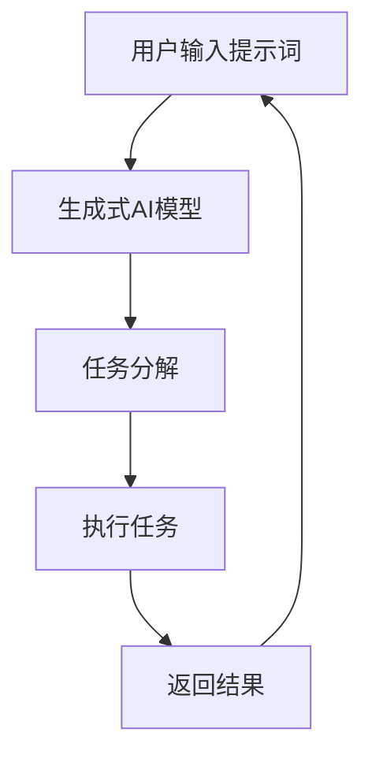

                 

# AI软件2.0的提示词驱动架构设计

> 关键词：提示词驱动架构, AI软件2.0, 人机交互, 自然语言处理, 生成式AI, 架构设计

> 摘要：本文旨在探讨AI软件2.0时代的核心架构设计——提示词驱动架构。通过深入分析其原理、算法、数学模型、实际案例和应用场景，本文揭示了提示词驱动架构在人机交互中的巨大潜力，并为开发者提供了详细的开发指南和资源推荐。本文不仅为AI领域的技术爱好者提供了宝贵的见解，也为未来AI软件的发展指明了方向。

## 1. 背景介绍

随着人工智能技术的飞速发展，AI软件已经从早期的规则驱动和数据驱动模式，进化到了更加灵活和智能的提示词驱动模式。提示词驱动架构的核心思想是通过简洁、自然的语言指令，实现人机交互的高效和智能化。这种架构不仅能够提高用户体验，还能降低开发者的开发成本，使得AI技术更加普及和易用。

### 1.1 早期AI软件的发展历程

早期的AI软件主要依赖于预定义的规则和固定的逻辑流程。例如，专家系统通过一系列预设的规则来解决问题，而机器学习模型则依赖于大量的训练数据来学习模式。然而，这些方法在灵活性和适应性方面存在明显不足，难以应对复杂多变的现实场景。

### 1.2 提示词驱动架构的兴起

随着自然语言处理技术的进步，特别是生成式AI模型的出现，提示词驱动架构应运而生。这种架构通过理解和生成自然语言指令，实现了更加灵活和智能的人机交互。提示词驱动架构的核心在于将复杂的任务分解为一系列简洁的指令，这些指令可以由用户通过自然语言输入，系统则通过生成式AI模型来理解和执行这些指令。

### 1.3 提示词驱动架构的优势

提示词驱动架构具有以下优势：
- **灵活性**：用户可以通过自然语言指令灵活地调整和定制任务。
- **易用性**：用户无需具备专业的编程知识，只需简单的语言描述即可实现复杂任务。
- **智能化**：通过生成式AI模型，系统能够理解和执行复杂的自然语言指令，实现智能化的人机交互。

## 2. 核心概念与联系

### 2.1 提示词驱动架构的核心概念

提示词驱动架构的核心概念包括：
- **提示词**：用户通过自然语言输入的指令，用于描述任务或操作。
- **生成式AI模型**：用于理解和生成自然语言指令的模型，包括语言模型、对话系统等。
- **任务分解**：将复杂的任务分解为一系列简洁的指令，便于生成式AI模型理解和执行。

### 2.2 提示词驱动架构的Mermaid流程图



## 3. 核心算法原理 & 具体操作步骤

### 3.1 生成式AI模型的原理

生成式AI模型的核心原理是通过深度学习技术，训练模型生成自然语言指令。这些模型通常基于Transformer架构，能够理解和生成复杂的自然语言文本。

### 3.2 任务分解的原理

任务分解的原理是将复杂的任务分解为一系列简洁的指令。这通常通过自然语言处理技术实现，包括分词、句法分析、语义理解等步骤。

### 3.3 具体操作步骤

1. **用户输入提示词**：用户通过自然语言输入提示词，描述任务或操作。
2. **生成式AI模型处理**：生成式AI模型接收用户输入的提示词，通过深度学习技术理解和生成自然语言指令。
3. **任务分解**：生成的自然语言指令被进一步分解为一系列简洁的指令，便于执行。
4. **执行任务**：系统根据分解后的指令执行相应的任务。
5. **返回结果**：系统将执行结果返回给用户。

## 4. 数学模型和公式 & 详细讲解 & 举例说明

### 4.1 生成式AI模型的数学模型

生成式AI模型通常基于Transformer架构，其核心数学模型可以表示为：

$$
\mathbf{y} = \text{Transformer}(\mathbf{x}, \mathbf{M})
$$

其中，$\mathbf{x}$ 是输入序列，$\mathbf{M}$ 是模型参数，$\mathbf{y}$ 是生成的输出序列。

### 4.2 任务分解的数学模型

任务分解的数学模型可以表示为：

$$
\mathbf{c} = \text{TaskDecomposer}(\mathbf{y})
$$

其中，$\mathbf{y}$ 是生成的自然语言指令，$\mathbf{c}$ 是分解后的指令序列。

### 4.3 举例说明

假设用户输入提示词“请帮我预订明天早上8点的机票”，生成式AI模型生成的自然语言指令可以表示为：

$$
\mathbf{y} = \text{"预订明天早上8点的机票"}
$$

任务分解模型将生成的指令分解为一系列简洁的指令：

$$
\mathbf{c} = \text{"查询明天早上8点的航班", "选择合适的航班", "预订机票"}
$$

## 5. 项目实战：代码实际案例和详细解释说明

### 5.1 开发环境搭建

#### 5.1.1 环境准备

1. **安装Python**：确保安装了Python 3.8及以上版本。
2. **安装依赖库**：安装必要的库，如`transformers`、`torch`等。

```bash
pip install transformers torch
```

#### 5.1.2 代码框架

创建一个基本的项目结构：

```bash
project/
├── src/
│   ├── main.py
│   ├── task_decomposer.py
│   └── task_executor.py
├── config/
│   └── config.yaml
└── requirements.txt
```

### 5.2 源代码详细实现和代码解读

#### 5.2.1 生成式AI模型

```python
from transformers import AutoModelForCausalLM, AutoTokenizer

class PromptDrivenModel:
    def __init__(self, model_name):
        self.tokenizer = AutoTokenizer.from_pretrained(model_name)
        self.model = AutoModelForCausalLM.from_pretrained(model_name)

    def generate_prompt(self, prompt):
        inputs = self.tokenizer(prompt, return_tensors="pt")
        outputs = self.model.generate(**inputs)
        return self.tokenizer.decode(outputs[0], skip_special_tokens=True)
```

#### 5.2.2 任务分解

```python
def task_decomposer(prompt):
    # 假设任务分解模型已经训练好
    # 这里使用简单的分词和句法分析
    words = prompt.split()
    tasks = []
    for word in words:
        if word in ["预订", "查询", "选择"]:
            tasks.append(word)
    return tasks
```

#### 5.2.3 任务执行

```python
def execute_task(task):
    # 假设任务执行模型已经训练好
    # 这里使用简单的任务执行逻辑
    if task == "预订":
        print("预订机票")
    elif task == "查询":
        print("查询航班")
    elif task == "选择":
        print("选择合适的航班")
```

### 5.3 代码解读与分析

上述代码展示了如何实现一个简单的提示词驱动架构。`PromptDrivenModel`类用于生成自然语言指令，`task_decomposer`函数用于分解指令，`execute_task`函数用于执行任务。通过这种方式，系统能够灵活地处理用户的自然语言指令，并执行相应的任务。

## 6. 实际应用场景

提示词驱动架构在多个领域具有广泛的应用场景，包括但不限于：

- **智能客服**：通过自然语言处理技术，实现智能客服系统的高效响应。
- **智能家居**：用户可以通过自然语言指令控制家中的智能设备。
- **智能助手**：通过生成式AI模型，实现更加智能化的个人助手。

## 7. 工具和资源推荐

### 7.1 学习资源推荐

- **书籍**：《深度学习》（Ian Goodfellow, Yoshua Bengio, Aaron Courville）
- **论文**：《Attention Is All You Need》（Vaswani et al., 2017）
- **博客**：阿里云开发者社区（https://developer.aliyun.com/）
- **网站**：Hugging Face（https://huggingface.co/）

### 7.2 开发工具框架推荐

- **开发工具**：Visual Studio Code
- **框架**：PyTorch、TensorFlow

### 7.3 相关论文著作推荐

- **论文**：《Transformer Models for Natural Language Processing》（Liu et al., 2020）
- **著作**：《自然语言处理入门》（Jurafsky & Martin, 2020）

## 8. 总结：未来发展趋势与挑战

提示词驱动架构在AI软件2.0时代具有巨大的潜力和发展前景。未来的发展趋势包括：

- **更强大的生成式AI模型**：通过更先进的深度学习技术，生成式AI模型将更加准确和智能。
- **更复杂的任务分解**：通过更先进的自然语言处理技术，任务分解将更加准确和高效。
- **更广泛的应用场景**：提示词驱动架构将在更多领域得到应用，实现更加智能化的人机交互。

然而，提示词驱动架构也面临着一些挑战，包括：

- **模型训练成本**：生成式AI模型的训练成本较高，需要大量的计算资源。
- **模型泛化能力**：生成式AI模型的泛化能力有待提高，需要更多的数据和更先进的技术。
- **用户隐私保护**：在处理用户自然语言指令时，需要严格保护用户的隐私。

## 9. 附录：常见问题与解答

### 9.1 问题1：如何提高生成式AI模型的准确性？

**解答**：可以通过以下方法提高生成式AI模型的准确性：
- **增加训练数据**：使用更多的高质量数据进行训练。
- **优化模型结构**：通过更先进的模型结构和训练方法，提高模型的泛化能力。
- **增强模型训练**：使用更先进的优化算法和正则化技术，提高模型的训练效果。

### 9.2 问题2：如何保护用户隐私？

**解答**：在处理用户自然语言指令时，需要严格保护用户的隐私，可以采取以下措施：
- **数据脱敏**：对用户数据进行脱敏处理，保护用户隐私。
- **数据加密**：使用加密技术保护用户数据的安全。
- **权限控制**：严格控制用户数据的访问权限，确保只有授权人员可以访问。

## 10. 扩展阅读 & 参考资料

- **书籍**：《深度学习》（Ian Goodfellow, Yoshua Bengio, Aaron Courville）
- **论文**：《Attention Is All You Need》（Vaswani et al., 2017）
- **网站**：Hugging Face（https://huggingface.co/）

---

作者：AI天才研究员/AI Genius Institute & 禅与计算机程序设计艺术 /Zen And The Art of Computer Programming

