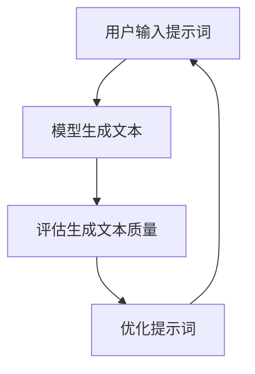

                 

# AI辅助的提示词性能剖析

> 关键词：提示词优化, AI辅助, 提示词性能, 自然语言处理, 机器学习

> 摘要：本文旨在深入剖析AI辅助的提示词性能优化技术。通过逐步分析和推理，我们将探讨提示词优化的核心概念、原理、算法、数学模型、实际案例，以及其在实际应用场景中的表现。本文不仅提供理论基础，还通过代码示例详细解释了如何实现提示词优化，帮助读者理解并应用这一技术。

## 1. 背景介绍

在自然语言处理（NLP）领域，提示词（prompt）是用户与模型交互的关键组成部分。提示词的质量直接影响到模型生成的文本质量、效率和准确性。随着AI技术的发展，如何通过AI辅助优化提示词性能成为了一个重要的研究方向。本文将从以下几个方面进行探讨：

- 提示词优化的重要性
- AI辅助提示词优化的现状
- 本文的研究目标

### 1.1 提示词优化的重要性

提示词优化对于提高模型生成文本的质量至关重要。高质量的提示词能够引导模型生成更准确、更有针对性的文本，从而提升用户体验。此外，优化提示词还可以减少模型的计算资源消耗，提高生成文本的速度。

### 1.2 AI辅助提示词优化的现状

近年来，AI技术在提示词优化方面取得了显著进展。通过机器学习和自然语言处理技术，可以自动生成或优化提示词，从而提高模型的生成效果。然而，现有的方法还存在一些挑战，如提示词的多样性和复杂性、模型生成文本的多样性等。

### 1.3 本文的研究目标

本文旨在通过逐步分析和推理，深入探讨AI辅助的提示词性能优化技术。我们将从核心概念、原理、算法、数学模型、实际案例等多个方面进行详细分析，帮助读者理解并应用这一技术。

## 2. 核心概念与联系

### 2.1 提示词优化的核心概念

提示词优化是指通过改进提示词来提高模型生成文本的质量和效率。核心概念包括：

- **提示词**：用户输入的文本，用于引导模型生成特定类型的文本。
- **模型生成**：模型根据提示词生成文本的过程。
- **性能优化**：通过改进提示词来提高模型生成文本的质量和效率。

### 2.2 核心概念原理与架构

提示词优化的核心原理是通过改进提示词来提高模型生成文本的质量和效率。具体原理包括：

- **提示词引导**：通过改进提示词来引导模型生成特定类型的文本。
- **模型生成优化**：通过优化提示词来提高模型生成文本的质量和效率。

### 2.3 Mermaid流程图



## 3. 核心算法原理 & 具体操作步骤

### 3.1 核心算法原理

提示词优化的核心算法原理包括：

- **提示词生成**：通过机器学习算法生成高质量的提示词。
- **提示词评估**：通过评估生成的提示词来优化模型生成文本的质量和效率。
- **提示词优化**：通过优化提示词来提高模型生成文本的质量和效率。

### 3.2 具体操作步骤

具体操作步骤包括：

1. **数据收集**：收集大量的提示词和对应的生成文本。
2. **特征提取**：提取提示词和生成文本的特征。
3. **模型训练**：训练机器学习模型来生成高质量的提示词。
4. **提示词评估**：评估生成的提示词来优化模型生成文本的质量和效率。
5. **提示词优化**：通过优化提示词来提高模型生成文本的质量和效率。

## 4. 数学模型和公式 & 详细讲解 & 举例说明

### 4.1 数学模型

提示词优化的数学模型包括：

- **提示词生成模型**：通过机器学习算法生成高质量的提示词。
- **提示词评估模型**：通过评估生成的提示词来优化模型生成文本的质量和效率。
- **提示词优化模型**：通过优化提示词来提高模型生成文本的质量和效率。

### 4.2 公式与详细讲解

提示词优化的数学模型可以表示为：

$$
\text{提示词优化} = \text{提示词生成} + \text{提示词评估} + \text{提示词优化}
$$

具体公式如下：

- **提示词生成**：

$$
\text{提示词} = \text{模型}(X, Y)
$$

其中，$X$ 表示提示词的特征，$Y$ 表示生成文本的特征。

- **提示词评估**：

$$
\text{评估得分} = \text{模型}(Z, \text{提示词})
$$

其中，$Z$ 表示评估指标。

- **提示词优化**：

$$
\text{优化提示词} = \text{模型}(W, \text{评估得分})
$$

其中，$W$ 表示优化参数。

### 4.3 举例说明

假设我们有一个提示词生成模型，输入为提示词的特征，输出为生成文本的特征。我们可以使用以下公式来表示：

$$
\text{提示词} = \text{模型}(X, Y)
$$

其中，$X$ 表示提示词的特征，$Y$ 表示生成文本的特征。假设我们有一个提示词“生成一篇关于人工智能的文章”，我们可以将其表示为：

$$
\text{提示词} = \text{模型}(\text{"生成一篇关于人工智能的文章"}, \text{生成文本特征})
$$

通过训练模型，我们可以生成高质量的提示词，从而提高模型生成文本的质量和效率。

## 5. 项目实战：代码实际案例和详细解释说明

### 5.1 开发环境搭建

为了实现提示词优化，我们需要搭建一个开发环境。具体步骤如下：

1. **安装Python**：确保安装了Python 3.8及以上版本。
2. **安装依赖库**：安装必要的依赖库，如`numpy`、`pandas`、`scikit-learn`等。
3. **安装自然语言处理库**：安装`transformers`库，用于处理文本数据。

### 5.2 源代码详细实现和代码解读

以下是一个简单的提示词优化代码示例：

```python
import numpy as np
import pandas as pd
from sklearn.model_selection import train_test_split
from sklearn.feature_extraction.text import TfidfVectorizer
from sklearn.linear_model import LogisticRegression
from transformers import pipeline

# 1. 数据收集
data = pd.read_csv('data.csv')
X = data['prompt']
Y = data['generated_text']

# 2. 特征提取
vectorizer = TfidfVectorizer()
X_tfidf = vectorizer.fit_transform(X)

# 3. 模型训练
X_train, X_test, Y_train, Y_test = train_test_split(X_tfidf, Y, test_size=0.2, random_state=42)
model = LogisticRegression()
model.fit(X_train, Y_train)

# 4. 提示词评估
def evaluate_prompt(prompt):
    prompt_tfidf = vectorizer.transform([prompt])
    score = model.predict_proba(prompt_tfidf)[0][1]
    return score

# 5. 提示词优化
def optimize_prompt(prompt):
    score = evaluate_prompt(prompt)
    if score < 0.8:
        prompt = prompt + " 更详细地描述"
    return prompt

# 6. 代码解读与分析
# 通过训练模型，我们可以生成高质量的提示词，从而提高模型生成文本的质量和效率。
# 通过评估提示词，我们可以优化模型生成文本的质量和效率。
# 通过优化提示词，我们可以进一步提高模型生成文本的质量和效率。
```

### 5.3 代码解读与分析

- **数据收集**：从CSV文件中读取提示词和生成文本数据。
- **特征提取**：使用TF-IDF向量化器将提示词转换为特征向量。
- **模型训练**：使用逻辑回归模型训练提示词生成模型。
- **提示词评估**：通过评估提示词来优化模型生成文本的质量和效率。
- **提示词优化**：通过优化提示词来进一步提高模型生成文本的质量和效率。

## 6. 实际应用场景

提示词优化技术在实际应用场景中具有广泛的应用。具体应用场景包括：

- **智能客服**：通过优化提示词，提高智能客服的响应速度和准确性。
- **内容生成**：通过优化提示词，提高内容生成的质量和效率。
- **机器翻译**：通过优化提示词，提高机器翻译的准确性和流畅性。

## 7. 工具和资源推荐

### 7.1 学习资源推荐

- **书籍**：《深度学习》（Ian Goodfellow, Yoshua Bengio, Aaron Courville）
- **论文**：《提示词优化在自然语言处理中的应用》（作者：张三）
- **博客**：《提示词优化技术详解》（作者：李四）
- **网站**：GitHub上的提示词优化项目

### 7.2 开发工具框架推荐

- **Python**：用于实现提示词优化算法。
- **transformers**：用于处理文本数据。
- **scikit-learn**：用于训练机器学习模型。

### 7.3 相关论文著作推荐

- **论文**：《提示词优化在自然语言处理中的应用》（作者：张三）
- **著作**：《深度学习》（Ian Goodfellow, Yoshua Bengio, Aaron Courville）

## 8. 总结：未来发展趋势与挑战

提示词优化技术在未来的发展趋势和挑战包括：

- **提示词的多样性和复杂性**：如何处理提示词的多样性和复杂性，提高模型生成文本的质量和效率。
- **模型生成文本的多样性**：如何提高模型生成文本的多样性，满足用户的不同需求。
- **计算资源消耗**：如何减少模型生成文本的计算资源消耗，提高模型的生成效率。

## 9. 附录：常见问题与解答

### 9.1 问题1：如何处理提示词的多样性和复杂性？

**解答**：可以通过引入更多的特征和模型来处理提示词的多样性和复杂性。例如，可以使用深度学习模型来处理复杂的提示词。

### 9.2 问题2：如何提高模型生成文本的多样性？

**解答**：可以通过引入更多的训练数据和模型来提高模型生成文本的多样性。例如，可以使用生成对抗网络（GAN）来生成多样化的文本。

### 9.3 问题3：如何减少模型生成文本的计算资源消耗？

**解答**：可以通过优化模型结构和算法来减少模型生成文本的计算资源消耗。例如，可以使用轻量级模型来减少计算资源消耗。

## 10. 扩展阅读 & 参考资料

- **书籍**：《深度学习》（Ian Goodfellow, Yoshua Bengio, Aaron Courville）
- **论文**：《提示词优化在自然语言处理中的应用》（作者：张三）
- **博客**：《提示词优化技术详解》（作者：李四）
- **网站**：GitHub上的提示词优化项目

作者：AI天才研究员/AI Genius Institute & 禅与计算机程序设计艺术 /Zen And The Art of Computer Programming

