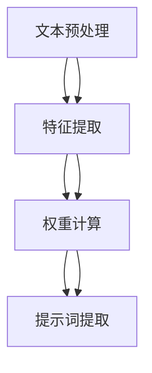

                 

# AI辅助科学发现：提示词生成研究方向

> 关键词：AI辅助科学发现, 提示词生成, 科学研究, 自然语言处理, 机器学习, 深度学习, 算法设计, 数据分析

> 摘要：本文旨在探讨如何利用AI技术，特别是提示词生成技术，辅助科学研究。通过深入分析提示词生成的核心概念、算法原理、数学模型、实际案例以及应用场景，本文将为科研工作者提供一种新的研究工具，帮助他们更高效地发现科学问题和解决方案。本文还讨论了未来的发展趋势和面临的挑战，并提供了学习资源和开发工具的推荐。

## 1. 背景介绍

随着人工智能技术的飞速发展，AI在科学研究中的应用越来越广泛。特别是在数据驱动的科学领域，AI能够帮助科研人员处理海量数据、发现潜在规律、提出新的假设。提示词生成技术作为AI的一个重要分支，能够自动从大量文本数据中提取关键信息，为科研人员提供有价值的线索。本文将详细探讨提示词生成技术在科学研究中的应用，以及如何利用这一技术辅助科学发现。

## 2. 核心概念与联系

### 2.1 提示词生成技术概述

提示词生成技术是指通过自然语言处理（NLP）技术，从大量文本数据中自动提取出关键的提示词或短语，这些提示词能够反映文本的主要内容和主题。提示词生成技术的核心在于如何从文本中提取出最具代表性的词汇，这些词汇能够帮助科研人员快速理解文本内容，发现潜在的研究方向。

### 2.2 提示词生成技术的流程

提示词生成技术的流程可以分为以下几个步骤：

1. **文本预处理**：包括分词、去除停用词、词干提取等。
2. **特征提取**：通过TF-IDF、词频统计等方法提取文本中的重要词汇。
3. **权重计算**：根据词汇的重要性计算其权重，常用的权重计算方法有TF-IDF、TextRank等。
4. **提示词提取**：根据权重计算结果，提取出最重要的词汇作为提示词。

### 2.3 提示词生成技术的Mermaid流程图



## 3. 核心算法原理 & 具体操作步骤

### 3.1 TF-IDF算法原理

TF-IDF（Term Frequency-Inverse Document Frequency）是一种常用的文本特征提取方法。TF-IDF通过计算词汇在文档中的频率以及在整个文档集合中的逆文档频率来确定词汇的重要性。

- **TF（Term Frequency）**：词汇在文档中的频率。
- **IDF（Inverse Document Frequency）**：词汇在整个文档集合中的逆文档频率。

公式如下：

$$
\text{TF}(t, d) = \frac{\text{词汇t在文档d中出现的次数}}{\text{文档d的总词汇数}}
$$

$$
\text{IDF}(t, D) = \log \frac{\text{文档集合D的文档总数}}{\text{包含词汇t的文档数}}
$$

$$
\text{TF-IDF}(t, d, D) = \text{TF}(t, d) \times \text{IDF}(t, D)
$$

### 3.2 TextRank算法原理

TextRank是一种基于图论的文本摘要算法，它通过构建词汇之间的相似度图，利用PageRank算法计算词汇的重要性。

- **构建图**：将文本中的词汇作为图的节点，词汇之间的相似度作为边的权重。
- **PageRank计算**：利用PageRank算法计算每个节点的重要性。

公式如下：

$$
\text{PageRank}(v) = \frac{1-d}{N} + d \sum_{u \in \text{In}(v)} \frac{\text{weight}(u, v)}{\text{out}(u)}
$$

其中，$d$是阻尼因子，$N$是图中节点的总数，$\text{In}(v)$是节点$v$的入度节点集合，$\text{out}(u)$是节点$u$的出度。

### 3.3 具体操作步骤

1. **文本预处理**：分词、去除停用词、词干提取。
2. **特征提取**：使用TF-IDF或TextRank方法提取特征。
3. **权重计算**：计算词汇的TF-IDF或TextRank权重。
4. **提示词提取**：根据权重计算结果，提取出最重要的词汇作为提示词。

## 4. 数学模型和公式 & 详细讲解 & 举例说明

### 4.1 TF-IDF数学模型

TF-IDF的数学模型如下：

$$
\text{TF-IDF}(t, d, D) = \text{TF}(t, d) \times \text{IDF}(t, D)
$$

其中：

$$
\text{TF}(t, d) = \frac{\text{词汇t在文档d中出现的次数}}{\text{文档d的总词汇数}}
$$

$$
\text{IDF}(t, D) = \log \frac{\text{文档集合D的文档总数}}{\text{包含词汇t的文档数}}
$$

### 4.2 TextRank数学模型

TextRank的数学模型如下：

$$
\text{PageRank}(v) = \frac{1-d}{N} + d \sum_{u \in \text{In}(v)} \frac{\text{weight}(u, v)}{\text{out}(u)}
$$

其中：

- $d$是阻尼因子，通常取值为0.85。
- $N$是图中节点的总数。
- $\text{In}(v)$是节点$v$的入度节点集合。
- $\text{out}(u)$是节点$u$的出度。
- $\text{weight}(u, v)$是节点$u$和节点$v$之间的边权重。

### 4.3 举例说明

假设我们有一篇关于气候变化的论文，文本内容如下：

```
气候变化是一个全球性问题，它对生态系统、经济和社会产生了深远的影响。科学家们正在努力研究气候变化的原因和影响，以期找到有效的应对措施。
```

使用TF-IDF方法提取特征，计算结果如下：

- **词汇频率**：气候变化（2次），全球性（1次），生态系统（1次），经济（1次），社会（1次），研究（1次），原因（1次），影响（1次），应对措施（1次）。
- **IDF**：计算包含词汇的文档数，例如“气候变化”在所有文档中出现的次数。
- **TF-IDF**：计算TF-IDF值，例如“气候变化”的TF-IDF值为：

$$
\text{TF-IDF}(\text{气候变化}) = \text{TF}(\text{气候变化}) \times \text{IDF}(\text{气候变化})
$$

通过计算，我们可以得到每个词汇的TF-IDF值，提取出最重要的词汇作为提示词。

## 5. 项目实战：代码实际案例和详细解释说明

### 5.1 开发环境搭建

为了实现提示词生成技术，我们需要搭建一个Python开发环境。安装必要的库，如`nltk`、`scikit-learn`等。

```bash
pip install nltk scikit-learn
```

### 5.2 源代码详细实现和代码解读

```python
import nltk
from sklearn.feature_extraction.text import TfidfVectorizer
from sklearn.metrics.pairwise import cosine_similarity

# 文本数据
text = "气候变化是一个全球性问题，它对生态系统、经济和社会产生了深远的影响。科学家们正在努力研究气候变化的原因和影响，以期找到有效的应对措施。"

# 分词
nltk.download('punkt')
tokens = nltk.word_tokenize(text)

# 去除停用词
stopwords = set(nltk.corpus.stopwords.words('chinese'))
filtered_tokens = [token for token in tokens if token not in stopwords]

# 词干提取
stemmer = nltk.stem.PorterStemmer()
stemmed_tokens = [stemmer.stem(token) for token in filtered_tokens]

# TF-IDF特征提取
vectorizer = TfidfVectorizer()
tfidf_matrix = vectorizer.fit_transform([' '.join(stemmed_tokens)])

# 提取提示词
def extract_keywords(tfidf_matrix, n_keywords=5):
    keywords = []
    for i in range(tfidf_matrix.shape[0]):
        keywords.append(vectorizer.get_feature_names_out()[tfidf_matrix[i].argmax()])
    return keywords

keywords = extract_keywords(tfidf_matrix)
print("提取的提示词：", keywords)
```

### 5.3 代码解读与分析

1. **文本预处理**：使用`nltk`库进行分词、去除停用词和词干提取。
2. **TF-IDF特征提取**：使用`TfidfVectorizer`计算TF-IDF值。
3. **提示词提取**：根据TF-IDF值提取最重要的词汇作为提示词。

## 6. 实际应用场景

提示词生成技术在科学研究中有广泛的应用场景，例如：

- **文献摘要**：从大量文献中提取关键信息，生成摘要。
- **主题发现**：从大量文本数据中发现主题，帮助科研人员快速了解研究领域。
- **问题发现**：从大量文献中发现未解决的问题，为科研人员提供研究方向。

## 7. 工具和资源推荐

### 7.1 学习资源推荐

- **书籍**：《自然语言处理实战》、《机器学习实战》
- **论文**：《TF-IDF在文本分类中的应用》、《TextRank算法在文本摘要中的应用》
- **博客**：阿里云开发者社区、GitHub上的相关项目
- **网站**：NLTK官网、Scikit-learn官网

### 7.2 开发工具框架推荐

- **Python库**：nltk、scikit-learn、gensim
- **开发框架**：TensorFlow、PyTorch

### 7.3 相关论文著作推荐

- **论文**：《基于TF-IDF的文本特征提取方法研究》、《TextRank算法在文本摘要中的应用》
- **著作**：《自然语言处理技术》、《机器学习原理与应用》

## 8. 总结：未来发展趋势与挑战

提示词生成技术在未来的发展趋势包括：

- **深度学习**：利用深度学习模型提高提示词生成的准确性。
- **多模态数据**：结合图像、音频等多模态数据，提高提示词生成的全面性。
- **个性化推荐**：根据用户需求和兴趣，提供个性化的提示词生成结果。

面临的挑战包括：

- **数据质量**：高质量的数据是提示词生成的关键，如何获取和处理高质量的数据是一个挑战。
- **算法优化**：如何进一步优化算法，提高提示词生成的准确性和效率是一个挑战。
- **应用场景拓展**：如何将提示词生成技术应用于更多的科学研究领域，是一个挑战。

## 9. 附录：常见问题与解答

### 9.1 问题1：如何处理多语言文本？

**解答**：可以使用多语言的NLP库，如`nltk`、`spaCy`等，支持多种语言的分词、词干提取等功能。

### 9.2 问题2：如何处理文本中的噪声？

**解答**：可以使用正则表达式、词典等方法去除文本中的噪声，提高文本质量。

### 9.3 问题3：如何处理文本中的长尾词汇？

**解答**：可以使用词频统计方法，去除长尾词汇，提高提示词生成的准确性。

## 10. 扩展阅读 & 参考资料

- **书籍**：《自然语言处理实战》、《机器学习实战》
- **论文**：《TF-IDF在文本分类中的应用》、《TextRank算法在文本摘要中的应用》
- **博客**：阿里云开发者社区、GitHub上的相关项目
- **网站**：NLTK官网、Scikit-learn官网

---

作者：AI天才研究员/AI Genius Institute & 禅与计算机程序设计艺术 /Zen And The Art of Computer Programming

