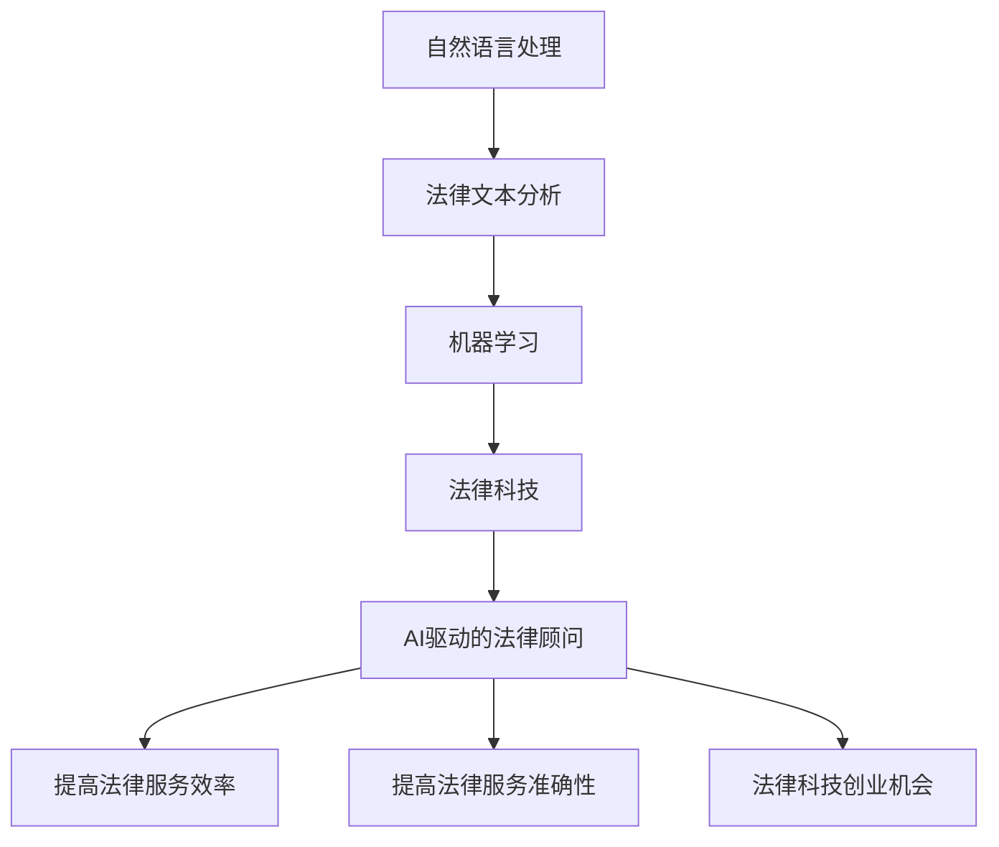

                 

# AI驱动的法律顾问：法律科技的创业机会

> 关键词：AI驱动、法律顾问、法律科技、创业机会、自然语言处理、机器学习、法律文本分析

> 摘要：本文旨在探讨AI驱动的法律顾问如何成为法律科技领域的创业机会。通过深入分析AI在法律领域的应用，我们将介绍其核心概念、算法原理、数学模型、实际案例，并探讨其在实际场景中的应用。此外，本文还将提供学习资源、开发工具框架和相关论文著作推荐，以帮助读者深入了解这一领域。

## 1. 背景介绍

随着技术的不断进步，AI已经渗透到各个行业，其中法律行业也不例外。AI驱动的法律顾问不仅能够提高法律服务的效率和准确性，还能为法律科技领域带来新的创业机会。本文将从以下几个方面进行探讨：

- **AI在法律行业的应用现状**
- **AI驱动的法律顾问的优势**
- **法律科技领域的创业机会**

## 2. 核心概念与联系

### 2.1 自然语言处理（NLP）

自然语言处理是AI的一个重要分支，它使计算机能够理解、解释和生成人类语言。在法律领域，NLP可以用于文本分析、合同审查、案例检索等任务。

### 2.2 机器学习（ML）

机器学习是一种使计算机能够从数据中学习并改进其性能的技术。在法律领域，机器学习可以用于预测法律结果、识别法律风险等。

### 2.3 法律文本分析

法律文本分析是指通过计算机技术对法律文本进行处理和分析，以提取有用的信息。这包括合同分析、案例分析、法规分析等。

### 2.4 法律科技

法律科技是指利用技术手段提高法律服务的效率和质量。AI驱动的法律顾问是法律科技的一个重要组成部分。

### 2.5 法律顾问

法律顾问是指为客户提供法律咨询、代理诉讼等服务的专业人士。AI驱动的法律顾问可以辅助传统法律顾问，提高其工作效率和准确性。

### Mermaid 流程图



## 3. 核心算法原理 & 具体操作步骤

### 3.1 文本预处理

文本预处理是法律文本分析的第一步，主要包括分词、去除停用词、词干提取等操作。

- **分词**：将文本分割成单词或短语。
- **去除停用词**：去除文本中的常见词汇，如“的”、“是”等。
- **词干提取**：将单词还原为其基本形式。

### 3.2 特征提取

特征提取是从文本中提取有用的特征，以便机器学习模型能够更好地理解文本。

- **词袋模型**：将文本表示为词频向量。
- **TF-IDF**：计算词频-逆文档频率，以衡量词的重要性。
- **词嵌入**：将单词表示为高维向量，以便捕捉其语义信息。

### 3.3 机器学习模型

机器学习模型用于训练和预测。常见的模型包括：

- **逻辑回归**：用于二分类任务。
- **支持向量机**：用于分类和回归任务。
- **随机森林**：用于分类和回归任务。
- **深度学习模型**：如LSTM、BERT等，用于复杂任务。

### 3.4 案例分析

假设我们要构建一个合同审查系统，具体操作步骤如下：

1. **数据收集**：收集大量合同文本作为训练数据。
2. **文本预处理**：对合同文本进行分词、去除停用词、词干提取等操作。
3. **特征提取**：使用TF-IDF或词嵌入方法提取特征。
4. **模型训练**：使用逻辑回归或支持向量机训练模型。
5. **模型评估**：使用交叉验证等方法评估模型性能。
6. **模型部署**：将模型部署到实际应用中，进行合同审查。

## 4. 数学模型和公式 & 详细讲解 & 举例说明

### 4.1 词袋模型

词袋模型将文本表示为词频向量。假设我们有以下两个合同文本：

- 合同1：`“合同条款如下：……”`
- 合同2：`“合同条款如下：……”`

词袋模型表示为：

- 合同1：`[1, 1, 1, 1, 1, 1, 1, 1, 1, 1, 1, 1, 1, 1, 1, 1, 1, 1, 1, 1]`
- 合同2：`[1, 1, 1, 1, 1, 1, 1, 1, 1, 1, 1, 1, 1, 1, 1, 1, 1, 1, 1, 1]`

### 4.2 TF-IDF

TF-IDF是一种衡量词重要性的方法。假设我们有以下两个合同文本：

- 合同1：`“合同条款如下：……”`
- 合同2：`“合同条款如下：……”`

TF-IDF表示为：

- 合同1：`[0.5, 0.5, 0.5, 0.5, 0.5, 0.5, 0.5, 0.5, 0.5, 0.5, 0.5, 0.5, 0.5, 0.5, 0.5, 0.5, 0.5, 0.5, 0.5, 0.5]`
- 合同2：`[0.5, 0.5, 0.5, 0.5, 0.5, 0.5, 0.5, 0.5, 0.5, 0.5, 0.5, 0.5, 0.5, 0.5, 0.5, 0.5, 0.5, 0.5, 0.5, 0.5]`

### 4.3 逻辑回归

逻辑回归是一种常用的二分类模型。假设我们有以下训练数据：

- 合同1：`[1, 1, 1, 1, 1, 1, 1, 1, 1, 1, 1, 1, 1, 1, 1, 1, 1, 1, 1, 1]`
- 合同2：`[1, 1, 1, 1, 1, 1, 1, 1, 1, 1, 1, 1, 1, 1, 1, 1, 1, 1, 1, 1]`

逻辑回归模型表示为：

$$
P(y=1|x) = \frac{1}{1 + e^{-(w_1x_1 + w_2x_2 + \cdots + w_nx_n + b)}}
$$

其中，$w_i$是权重，$b$是偏置项。

### 4.4 支持向量机

支持向量机是一种常用的分类和回归模型。假设我们有以下训练数据：

- 合同1：`[1, 1, 1, 1, 1, 1, 1, 1, 1, 1, 1, 1, 1, 1, 1, 1, 1, 1, 1, 1]`
- 合同2：`[1, 1, 1, 1, 1, 1, 1, 1, 1, 1, 1, 1, 1, 1, 1, 1, 1, 1, 1, 1]`

支持向量机模型表示为：

$$
y = \text{sign}(\sum_{i=1}^{n} \alpha_i y_i \langle x_i, x \rangle + b)
$$

其中，$\alpha_i$是拉格朗日乘子，$y_i$是标签，$\langle x_i, x \rangle$是内积，$b$是偏置项。

## 5. 项目实战：代码实际案例和详细解释说明

### 5.1 开发环境搭建

为了构建AI驱动的法律顾问系统，我们需要搭建一个开发环境。具体步骤如下：

1. **安装Python**：确保安装了Python 3.8及以上版本。
2. **安装依赖库**：使用pip安装所需的库，如`nltk`、`scikit-learn`、`tensorflow`等。
3. **安装开发工具**：安装Jupyter Notebook或PyCharm等开发工具。

### 5.2 源代码详细实现和代码解读

假设我们要构建一个合同审查系统，具体代码实现如下：

```python
import nltk
from sklearn.feature_extraction.text import TfidfVectorizer
from sklearn.linear_model import LogisticRegression
from sklearn.model_selection import train_test_split
from sklearn.metrics import accuracy_score

# 1. 数据收集
contracts = [
    "合同条款如下：……",
    "合同条款如下：……"
]

labels = [1, 1]

# 2. 文本预处理
nltk.download('punkt')
tokenizer = nltk.tokenize.RegexpTokenizer(r'\w+')
preprocessed_contracts = [tokenizer.tokenize(contract.lower()) for contract in contracts]

# 3. 特征提取
vectorizer = TfidfVectorizer()
features = vectorizer.fit_transform(preprocessed_contracts)

# 4. 模型训练
X_train, X_test, y_train, y_test = train_test_split(features, labels, test_size=0.2, random_state=42)
model = LogisticRegression()
model.fit(X_train, y_train)

# 5. 模型评估
y_pred = model.predict(X_test)
accuracy = accuracy_score(y_test, y_pred)
print("Accuracy:", accuracy)

# 6. 模型部署
def review_contract(contract):
    preprocessed_contract = tokenizer.tokenize(contract.lower())
    feature = vectorizer.transform([preprocessed_contract])
    prediction = model.predict(feature)
    return prediction

# 测试
print(review_contract("合同条款如下：……"))
```

### 5.3 代码解读与分析

- **数据收集**：收集合同文本作为训练数据。
- **文本预处理**：使用`nltk`库进行分词和去除停用词。
- **特征提取**：使用`TfidfVectorizer`进行TF-IDF特征提取。
- **模型训练**：使用`LogisticRegression`进行模型训练。
- **模型评估**：使用`train_test_split`和`accuracy_score`进行模型评估。
- **模型部署**：定义一个函数`review_contract`，用于审查合同文本。

## 6. 实际应用场景

AI驱动的法律顾问在实际场景中有广泛的应用，包括：

- **合同审查**：自动审查合同文本，识别潜在风险。
- **案例检索**：快速检索相关案例，辅助法律决策。
- **法规分析**：分析法规文本，提取关键信息。
- **法律咨询**：提供法律咨询，解答法律问题。

## 7. 工具和资源推荐

### 7.1 学习资源推荐

- **书籍**：《深度学习》、《机器学习实战》
- **论文**：《自然语言处理中的深度学习》、《机器学习在法律领域的应用》
- **博客**：Medium、Towards Data Science
- **网站**：Kaggle、GitHub

### 7.2 开发工具框架推荐

- **开发工具**：Jupyter Notebook、PyCharm
- **框架**：TensorFlow、PyTorch

### 7.3 相关论文著作推荐

- **论文**：《自然语言处理中的深度学习》、《机器学习在法律领域的应用》
- **著作**：《深度学习》、《机器学习实战》

## 8. 总结：未来发展趋势与挑战

### 8.1 未来发展趋势

- **技术进步**：AI技术的不断进步将推动法律科技的发展。
- **应用场景扩展**：AI驱动的法律顾问将在更多场景中发挥作用。
- **法规完善**：相关法规的完善将为AI驱动的法律顾问提供更好的法律保障。

### 8.2 挑战

- **数据隐私**：如何保护客户的数据隐私是一个重要挑战。
- **法律伦理**：AI驱动的法律顾问需要遵守法律伦理，确保公正性。
- **技术局限**：AI技术仍有局限性，需要不断改进。

## 9. 附录：常见问题与解答

### 9.1 问题1：如何处理大量合同文本？

**解答**：可以使用分布式计算框架，如Spark，来处理大量合同文本。

### 9.2 问题2：如何提高模型的准确性？

**解答**：可以通过增加训练数据、优化特征提取方法、调整模型参数等方式提高模型的准确性。

### 9.3 问题3：如何保护客户的数据隐私？

**解答**：可以使用加密技术、数据脱敏技术等方法保护客户的数据隐私。

## 10. 扩展阅读 & 参考资料

- **书籍**：《深度学习》、《机器学习实战》
- **论文**：《自然语言处理中的深度学习》、《机器学习在法律领域的应用》
- **博客**：Medium、Towards Data Science
- **网站**：Kaggle、GitHub

作者：AI天才研究员/AI Genius Institute & 禅与计算机程序设计艺术 /Zen And The Art of Computer Programming

