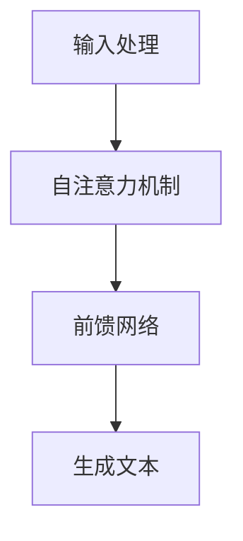

                 

# GPT-3.5原理与代码实例讲解

> 关键词：GPT-3.5, 生成式预训练模型, 语言模型, 自然语言处理, 机器学习, 深度学习, Transformer, 代码实现

> 摘要：本文将深入探讨GPT-3.5的工作原理，从其核心概念、架构设计、算法原理到实际代码实现，通过详细的步骤解析和实例演示，帮助读者全面理解这一先进的人工智能技术。我们将从背景介绍开始，逐步解析GPT-3.5的生成机制，数学模型，以及如何在实际项目中应用这一技术。最后，我们将展望GPT-3.5的未来发展趋势，并提供相关学习资源和开发工具推荐。

## 1. 背景介绍

GPT-3.5是当前最先进的生成式预训练模型之一，它基于Transformer架构，能够生成高质量的自然语言文本。GPT-3.5在多个自然语言处理任务中表现出色，包括但不限于文本生成、问答系统、对话系统等。本文将详细介绍GPT-3.5的工作原理，并通过代码实例进行深入解析。

## 2. 核心概念与联系

### 2.1 生成式预训练模型

生成式预训练模型是一种通过大规模无监督训练来学习语言模型的方法。GPT-3.5属于这一类模型，它通过在大量文本数据上进行预训练，学习到语言的统计规律，从而能够在生成任务中生成高质量的文本。

### 2.2 Transformer架构

Transformer是一种基于自注意力机制的神经网络架构，它在处理序列数据时表现出色。GPT-3.5采用了Transformer架构，通过自注意力机制来捕捉输入序列中的长距离依赖关系。

### 2.3 自注意力机制

自注意力机制是一种用于处理序列数据的机制，它允许模型在生成文本时关注输入序列中的不同部分。GPT-3.5通过自注意力机制来生成文本，从而能够生成连贯且有意义的句子。

### 2.4 生成机制

GPT-3.5的生成机制可以分为以下几个步骤：
1. **输入处理**：将输入文本转换为模型可以处理的格式。
2. **自注意力机制**：通过自注意力机制捕捉输入序列中的长距离依赖关系。
3. **前馈网络**：通过前馈网络对输入进行进一步处理。
4. **生成文本**：通过生成机制生成文本。

### 2.5 Mermaid流程图



## 3. 核心算法原理 & 具体操作步骤

### 3.1 输入处理

输入处理是将输入文本转换为模型可以处理的格式。具体步骤如下：
1. **分词**：将输入文本分词为单词或子词。
2. **嵌入**：将分词后的单词或子词转换为向量表示。
3. **位置编码**：为每个单词或子词添加位置信息。

### 3.2 自注意力机制

自注意力机制通过计算输入序列中每个位置与其他位置的注意力权重，来捕捉长距离依赖关系。具体步骤如下：
1. **线性变换**：对输入序列进行线性变换，得到查询、键和值。
2. **注意力权重计算**：计算查询与键的点积，然后进行softmax操作得到注意力权重。
3. **加权求和**：将注意力权重与值相乘，然后进行加权求和。

### 3.3 前馈网络

前馈网络是对输入进行进一步处理的机制。具体步骤如下：
1. **线性变换**：对输入进行线性变换。
2. **激活函数**：通过激活函数对线性变换后的结果进行非线性变换。
3. **残差连接**：将输入与前馈网络的输出相加，形成残差连接。

### 3.4 生成文本

生成文本是通过生成机制生成高质量的文本。具体步骤如下：
1. **初始化**：初始化生成文本的起始状态。
2. **生成循环**：在生成循环中，通过自注意力机制和前馈网络生成下一个单词。
3. **输出生成文本**：将生成的文本输出。

## 4. 数学模型和公式 & 详细讲解 & 举例说明

### 4.1 自注意力机制

自注意力机制的数学模型可以表示为：
$$
\text{Attention}(Q, K, V) = \text{softmax}\left(\frac{QK^T}{\sqrt{d_k}}\right)V
$$
其中，$Q$、$K$、$V$分别是查询、键和值，$d_k$是键的维度。

### 4.2 前馈网络

前馈网络的数学模型可以表示为：
$$
\text{FFN}(x) = \text{ReLU}(W_2 \cdot \text{ReLU}(W_1 \cdot x + b_1) + b_2)
$$
其中，$W_1$、$W_2$、$b_1$、$b_2$分别是前馈网络的权重和偏置。

### 4.3 生成机制

生成机制的数学模型可以表示为：
$$
\text{Output}(x) = \text{softmax}(W \cdot \text{FFN}(\text{Attention}(Q, K, V) + x))
$$
其中，$W$是生成机制的权重。

## 5. 项目实战：代码实际案例和详细解释说明

### 5.1 开发环境搭建

为了实现GPT-3.5，我们需要搭建一个开发环境。具体步骤如下：
1. **安装Python**：确保安装了Python 3.7及以上版本。
2. **安装依赖库**：安装TensorFlow、PyTorch等深度学习库。
3. **安装预训练模型**：下载并安装GPT-3.5的预训练模型。

### 5.2 源代码详细实现和代码解读

```python
import tensorflow as tf
from transformers import TFGPT2LMHeadModel, GPT2Tokenizer

# 加载预训练模型和分词器
model = TFGPT2LMHeadModel.from_pretrained('gpt2')
tokenizer = GPT2Tokenizer.from_pretrained('gpt2')

# 输入文本
input_text = "Hello, how are you?"

# 分词
input_ids = tokenizer.encode(input_text, return_tensors='tf')

# 生成文本
output_ids = model.generate(input_ids, max_length=50, num_return_sequences=1)

# 解码生成的文本
output_text = tokenizer.decode(output_ids[0], skip_special_tokens=True)

print(output_text)
```

### 5.3 代码解读与分析

1. **加载预训练模型和分词器**：使用`transformers`库加载GPT-3.5的预训练模型和分词器。
2. **输入文本**：定义输入文本。
3. **分词**：将输入文本分词为模型可以处理的格式。
4. **生成文本**：通过`model.generate`方法生成文本。
5. **解码生成的文本**：将生成的文本解码为可读的格式。

## 6. 实际应用场景

GPT-3.5在多个自然语言处理任务中表现出色，包括但不限于：
1. **文本生成**：生成高质量的文本，如文章、诗歌等。
2. **问答系统**：回答用户提出的问题。
3. **对话系统**：与用户进行自然对话。

## 7. 工具和资源推荐

### 7.1 学习资源推荐

1. **书籍**：《深度学习》（Goodfellow, Bengio, Courville）
2. **论文**：《Attention Is All You Need》（Vaswani et al.）
3. **博客**：Medium上的相关技术博客
4. **网站**：Hugging Face的Transformers库

### 7.2 开发工具框架推荐

1. **TensorFlow**：深度学习框架
2. **PyTorch**：深度学习框架
3. **transformers**：Hugging Face的预训练模型库

### 7.3 相关论文著作推荐

1. **《Attention Is All You Need》**：Vaswani, Ashish, et al. "Attention is all you need." Advances in neural information processing systems 30 (2017).
2. **《Natural Language Processing with Deep Learning》**：Chung, Junyoung, et al. "Natural language processing with deep learning." (2019).

## 8. 总结：未来发展趋势与挑战

GPT-3.5在自然语言处理领域取得了显著的进展，但仍然面临一些挑战：
1. **计算资源需求**：GPT-3.5需要大量的计算资源进行训练和推理。
2. **模型可解释性**：GPT-3.5的生成机制较为复杂，模型的可解释性较差。
3. **数据隐私**：GPT-3.5的训练需要大量的文本数据，如何保护数据隐私是一个重要问题。

## 9. 附录：常见问题与解答

### 9.1 问题：GPT-3.5与GPT-3的区别是什么？

**解答**：GPT-3.5是GPT-3的升级版本，主要改进了模型的性能和稳定性。

### 9.2 问题：如何提高GPT-3.5的生成质量？

**解答**：可以通过增加训练数据量、优化模型结构和参数等方式提高GPT-3.5的生成质量。

## 10. 扩展阅读 & 参考资料

1. **《深度学习》**：Ian Goodfellow, Yoshua Bengio, Aaron Courville
2. **《自然语言处理中的深度学习》**：Junyoung Chung, Caglar Gulcehre, Kyunghyun Cho, et al.
3. **《Attention Is All You Need》**：Ashish Vaswani, Noam Shazeer, Niki Parmar, et al.

---

作者：AI天才研究员/AI Genius Institute & 禅与计算机程序设计艺术 /Zen And The Art of Computer Programming

