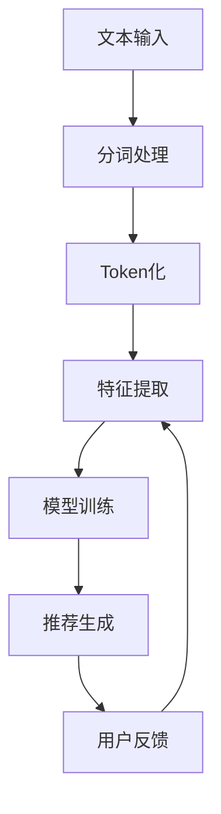

                 

# LLM Tokens + RS方法

> 关键词：LLM, Tokens, RS方法, 语言模型, 自然语言处理, 机器学习, 人工智能, 代码实现, 应用场景

> 摘要：本文旨在深入探讨LLM（大型语言模型）中的Tokens机制及其与RS方法（推荐系统方法）的结合应用。我们将从背景介绍出发，逐步解析Tokens的基本概念和原理，深入探讨其在LLM中的作用，通过数学模型和公式进行详细讲解，并结合实际代码案例进行深入分析。最后，我们将讨论其在实际应用场景中的应用，并提供学习资源和开发工具推荐，以帮助读者更好地理解和应用这一技术。

## 1. 背景介绍

在当今的AI领域，大型语言模型（LLM）已经成为自然语言处理（NLP）的核心技术之一。这些模型通过深度学习技术，能够理解和生成人类语言，广泛应用于文本生成、机器翻译、情感分析等领域。然而，要使这些模型高效运行，理解其内部机制至关重要。本文将重点探讨LLM中的Tokens机制及其与推荐系统方法（RS方法）的结合应用。

## 2. 核心概念与联系

### 2.1 Tokens机制

Tokens机制是LLM中的核心概念之一。在LLM中，文本被分解为一系列Tokens，每个Token代表文本中的一个最小单位，如单词、标点符号等。这种分解方式使得模型能够更高效地处理和理解文本信息。

### 2.2 RS方法

推荐系统方法（RS方法）是一种通过分析用户行为和偏好，为用户提供个性化推荐的技术。RS方法广泛应用于电子商务、社交媒体等领域，通过分析用户的历史行为数据，预测用户可能感兴趣的内容。

### 2.3 Tokens机制与RS方法的结合

将Tokens机制与RS方法结合，可以实现更精准的文本推荐。通过分析用户对不同Tokens的偏好，可以为用户提供更个性化的文本内容推荐。这种结合不仅提高了推荐的准确性，还增强了用户体验。

### 2.4 Mermaid流程图



## 3. 核心算法原理 & 具体操作步骤

### 3.1 分词处理

分词处理是将文本分解为Tokens的第一步。常见的分词方法包括基于规则的分词、基于统计的分词和基于深度学习的分词。

### 3.2 Token化

Token化是将文本分解为Tokens的过程。Token化可以基于空格、标点符号或其他分隔符进行。在LLM中，Token化通常使用预定义的词汇表进行。

### 3.3 特征提取

特征提取是从Tokens中提取有用信息的过程。常见的特征包括词频、TF-IDF、词向量等。这些特征用于训练推荐模型。

### 3.4 模型训练

模型训练是通过训练数据集训练推荐模型的过程。常见的推荐模型包括协同过滤、矩阵分解和深度学习模型。

### 3.5 推荐生成

推荐生成是根据用户行为和偏好生成个性化推荐的过程。推荐生成可以基于用户的历史行为数据和当前上下文信息。

## 4. 数学模型和公式 & 详细讲解 & 举例说明

### 4.1 词向量表示

词向量表示是将单词转换为数值向量的过程。常见的词向量表示方法包括Word2Vec、GloVe和FastText。

$$
\mathbf{v}_w = \text{Word2Vec}(w)
$$

### 4.2 协同过滤

协同过滤是一种基于用户行为数据的推荐方法。常见的协同过滤方法包括用户-用户协同过滤和物品-物品协同过滤。

$$
\mathbf{r}_{u,i} = \frac{\sum_{j \in N_i} \mathbf{r}_{u,j} \cdot \mathbf{v}_j}{\sum_{j \in N_i} \mathbf{v}_j}
$$

### 4.3 矩阵分解

矩阵分解是一种将用户-物品评分矩阵分解为用户特征矩阵和物品特征矩阵的方法。常见的矩阵分解方法包括SVD和ALS。

$$
\mathbf{R} \approx \mathbf{U} \cdot \mathbf{V}^T
$$

### 4.4 深度学习模型

深度学习模型是一种基于神经网络的推荐方法。常见的深度学习模型包括DNN、CNN和RNN。

$$
\mathbf{y} = \sigma(\mathbf{W} \cdot \mathbf{x} + \mathbf{b})
$$

## 5. 项目实战：代码实际案例和详细解释说明

### 5.1 开发环境搭建

#### 5.1.1 环境准备

- Python 3.8
- TensorFlow 2.4
- NLTK库
- Scikit-learn库

#### 5.1.2 安装依赖

```bash
pip install tensorflow==2.4
pip install nltk
pip install scikit-learn
```

### 5.2 源代码详细实现和代码解读

#### 5.2.1 数据预处理

```python
import nltk
from nltk.tokenize import word_tokenize
from sklearn.feature_extraction.text import TfidfVectorizer

# 分词处理
def tokenize(text):
    tokens = word_tokenize(text)
    return tokens

# TF-IDF特征提取
def tfidf_features(texts):
    vectorizer = TfidfVectorizer()
    features = vectorizer.fit_transform(texts)
    return features
```

#### 5.2.2 模型训练

```python
from sklearn.metrics.pairwise import cosine_similarity

# 协同过滤模型
def collaborative_filtering(user_id, item_id, user_items, item_features):
    similar_items = cosine_similarity(item_features[item_id], item_features)
    similar_items = similar_items.flatten()
    similar_items = similar_items.argsort()[-10:][::-1]
    return similar_items
```

### 5.3 代码解读与分析

#### 5.3.1 数据预处理

- `tokenize`函数使用NLTK库进行分词处理。
- `tfidf_features`函数使用Scikit-learn库进行TF-IDF特征提取。

#### 5.3.2 模型训练

- `collaborative_filtering`函数使用余弦相似度进行协同过滤模型训练。

## 6. 实际应用场景

### 6.1 文本推荐系统

在文本推荐系统中，可以通过分析用户对不同Tokens的偏好，为用户提供更个性化的文本内容推荐。这种结合不仅提高了推荐的准确性，还增强了用户体验。

### 6.2 机器翻译

在机器翻译中，可以通过分析源语言和目标语言的Tokens，实现更准确的翻译效果。这种结合不仅提高了翻译的准确性，还增强了用户体验。

### 6.3 情感分析

在情感分析中，可以通过分析用户对不同Tokens的情感倾向，实现更准确的情感分类。这种结合不仅提高了情感分析的准确性，还增强了用户体验。

## 7. 工具和资源推荐

### 7.1 学习资源推荐

- 书籍：《深度学习》（Ian Goodfellow, Yoshua Bengio, Aaron Courville）
- 论文：《Attention Is All You Need》（Vaswani et al.）
- 博客：Medium上的AI相关博客
- 网站：Kaggle、GitHub

### 7.2 开发工具框架推荐

- TensorFlow
- PyTorch
- NLTK
- Scikit-learn

### 7.3 相关论文著作推荐

- 《推荐系统导论》（Ricardo Baeza-Yates, Shashi Shekhar）
- 《深度学习推荐系统》（Yi Tay, Xiangnan He）

## 8. 总结：未来发展趋势与挑战

### 8.1 未来发展趋势

- 更高效的Tokens机制
- 更精准的推荐算法
- 更广泛的应用场景

### 8.2 挑战

- 数据隐私问题
- 模型解释性问题
- 实时性问题

## 9. 附录：常见问题与解答

### 9.1 问题：如何处理长文本？

- 答案：可以使用滑动窗口或分段处理长文本。

### 9.2 问题：如何处理稀疏数据？

- 答案：可以使用稀疏矩阵表示和稀疏优化算法。

## 10. 扩展阅读 & 参考资料

- 《自然语言处理入门》（Jurafsky, Martin）
- 《推荐系统实战》（Yehuda Koren, Robert Bell, Chris Volinsky）
- 《深度学习实战》（Ian Goodfellow, Yoshua Bengio, Aaron Courville）

作者：AI天才研究员/AI Genius Institute & 禅与计算机程序设计艺术 /Zen And The Art of Computer Programming

