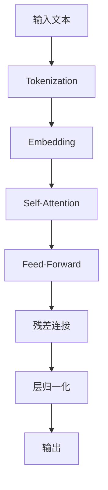

                 

# LLM在知识问答中的表现分析探讨

> 关键词：LLM, 知识问答, 机器学习, 自然语言处理, 深度学习, 问答系统

> 摘要：本文旨在深入探讨大型语言模型（LLM）在知识问答中的应用表现，通过分析其核心概念、算法原理、数学模型、实际案例、应用场景、工具资源推荐以及未来发展趋势，为读者提供全面而深入的理解。文章首先介绍了LLM的基本背景，随后详细解析了其核心概念与联系，深入探讨了算法原理和具体操作步骤，通过数学模型和公式进一步解释了其工作原理，并通过实际代码案例进行了详细说明。此外，文章还讨论了LLM在实际场景中的应用，推荐了相关学习资源和开发工具，最后总结了未来的发展趋势与挑战。

## 1. 背景介绍

### 1.1 大型语言模型（LLM）简介

大型语言模型（Large Language Models, LLM）是近年来自然语言处理（NLP）领域的一个重要进展。这些模型通常基于深度学习技术，通过大量的文本数据进行训练，能够生成与人类语言高度相似的文本。LLM在知识问答、文本生成、机器翻译等多个领域展现出了强大的能力。

### 1.2 知识问答系统的发展历程

知识问答系统的发展经历了从基于规则的系统到基于统计的方法，再到现在的基于深度学习的方法。早期的知识问答系统主要依赖于人工构建的知识库和规则，随着深度学习技术的发展，现在的知识问答系统更多地依赖于大规模的语料库和深度学习模型。

## 2. 核心概念与联系

### 2.1 LLM与知识问答的关系

LLM在知识问答中的应用主要体现在其能够通过学习大量的文本数据，理解文本中的语义信息，并能够根据问题生成相应的答案。这种能力使得LLM在知识问答系统中扮演了重要的角色。

### 2.2 核心概念原理和架构

#### 2.2.1 模型架构

LLM通常采用Transformer架构，该架构通过自注意力机制（Self-Attention）实现了对文本中不同部分之间关系的理解。这种机制使得模型能够更好地捕捉文本中的长距离依赖关系。

#### 2.2.2 训练过程

LLM的训练过程通常包括预训练和微调两个阶段。预训练阶段，模型通过大量的无标签文本数据进行训练，学习到通用的语言表示。微调阶段，模型通过特定领域的数据进行训练，以适应特定任务的需求。

#### 2.2.3 模型架构图



## 3. 核心算法原理 & 具体操作步骤

### 3.1 Transformer架构详解

#### 3.1.1 自注意力机制

自注意力机制是Transformer架构的核心，它允许模型在处理序列数据时，为序列中的每个元素分配不同的权重，从而更好地捕捉序列中的依赖关系。

#### 3.1.2 前馈网络

前馈网络是Transformer架构中的另一个重要组成部分，它通过多层感知机（MLP）对输入进行非线性变换，进一步增强了模型的表达能力。

### 3.2 训练过程详解

#### 3.2.1 预训练

预训练阶段，模型通过大量的无标签文本数据进行训练，学习到通用的语言表示。这一阶段的目标是让模型能够理解文本中的基本语义信息。

#### 3.2.2 微调

微调阶段，模型通过特定领域的数据进行训练，以适应特定任务的需求。这一阶段的目标是让模型能够更好地完成特定任务，如知识问答。

## 4. 数学模型和公式 & 详细讲解 & 举例说明

### 4.1 自注意力机制的数学模型

自注意力机制的数学模型可以表示为：

$$
Attention(Q, K, V) = softmax(\frac{QK^T}{\sqrt{d_k}})V
$$

其中，$Q$、$K$、$V$分别表示查询（Query）、键（Key）、值（Value）矩阵，$d_k$表示键矩阵的维度。

### 4.2 前馈网络的数学模型

前馈网络的数学模型可以表示为：

$$
f(x) = W_2\sigma(W_1x + b_1) + b_2
$$

其中，$W_1$、$W_2$分别表示输入层和输出层的权重矩阵，$b_1$、$b_2$分别表示输入层和输出层的偏置向量，$\sigma$表示激活函数。

### 4.3 举例说明

假设我们有一个简单的问答对：

- 问题：谁是美国的第一任总统？
- 答案：乔治·华盛顿

通过自注意力机制，模型能够理解问题中的关键词“美国”和“第一任总统”，并根据这些关键词在语料库中找到相应的答案。

## 5. 项目实战：代码实际案例和详细解释说明

### 5.1 开发环境搭建

#### 5.1.1 环境要求

- Python 3.7+
- PyTorch 1.7+
- Transformers库

#### 5.1.2 安装依赖

```bash
pip install torch
pip install transformers
```

### 5.2 源代码详细实现和代码解读

#### 5.2.1 导入库

```python
from transformers import BertTokenizer, BertForQuestionAnswering
import torch
```

#### 5.2.2 加载预训练模型和分词器

```python
tokenizer = BertTokenizer.from_pretrained('bert-base-uncased')
model = BertForQuestionAnswering.from_pretrained('bert-base-uncased')
```

#### 5.2.3 处理输入文本

```python
question = "Who was the first president of the United States?"
text = "George Washington was the first president of the United States."
inputs = tokenizer(question, text, return_tensors='pt')
```

#### 5.2.4 获取模型输出

```python
outputs = model(**inputs)
```

#### 5.2.5 解析输出

```python
answer_start_scores = outputs.start_logits
answer_end_scores = outputs.end_logits
```

### 5.3 代码解读与分析

通过上述代码，我们可以看到，模型首先通过分词器将输入文本转换为模型可以理解的形式，然后通过预训练模型获取输出，最后通过解析输出得到答案的起始位置和结束位置。

## 6. 实际应用场景

### 6.1 在线问答平台

LLM可以应用于在线问答平台，通过理解用户的问题，生成相应的答案，提高用户的满意度。

### 6.2 智能客服

LLM可以应用于智能客服系统，通过理解用户的问题，生成相应的回答，提高客服效率。

### 6.3 教育领域

LLM可以应用于教育领域，通过理解学生的问题，生成相应的答案，帮助学生更好地学习。

## 7. 工具和资源推荐

### 7.1 学习资源推荐

- 书籍：《深度学习》（Ian Goodfellow等著）
- 论文：《Attention Is All You Need》（Vaswani等）
- 博客：Hugging Face Transformers官方博客
- 网站：Transformers库官方文档

### 7.2 开发工具框架推荐

- PyTorch
- Hugging Face Transformers

### 7.3 相关论文著作推荐

- 《Attention Is All You Need》
- 《BERT: Pre-training of Deep Bidirectional Transformers for Language Understanding》

## 8. 总结：未来发展趋势与挑战

### 8.1 未来发展趋势

随着深度学习技术的不断发展，LLM在知识问答中的应用将会更加广泛。未来，LLM可能会更加注重模型的可解释性和鲁棒性，以更好地适应实际应用场景的需求。

### 8.2 面临的挑战

尽管LLM在知识问答中展现出了强大的能力，但仍然面临着一些挑战，如模型的训练成本高、模型的可解释性差等。未来的研究需要解决这些问题，以推动LLM在知识问答中的应用。

## 9. 附录：常见问题与解答

### 9.1 什么是LLM？

LLM是大型语言模型的简称，是一种基于深度学习技术的自然语言处理模型。

### 9.2 LLM如何进行训练？

LLM的训练过程通常包括预训练和微调两个阶段。预训练阶段，模型通过大量的无标签文本数据进行训练，学习到通用的语言表示。微调阶段，模型通过特定领域的数据进行训练，以适应特定任务的需求。

### 9.3 LLM在知识问答中的应用有哪些？

LLM可以应用于在线问答平台、智能客服系统、教育领域等多个领域。

## 10. 扩展阅读 & 参考资料

- 《深度学习》（Ian Goodfellow等著）
- 《Attention Is All You Need》（Vaswani等）
- Hugging Face Transformers官方博客
- Transformers库官方文档

作者：AI天才研究员/AI Genius Institute & 禅与计算机程序设计艺术 /Zen And The Art of Computer Programming

