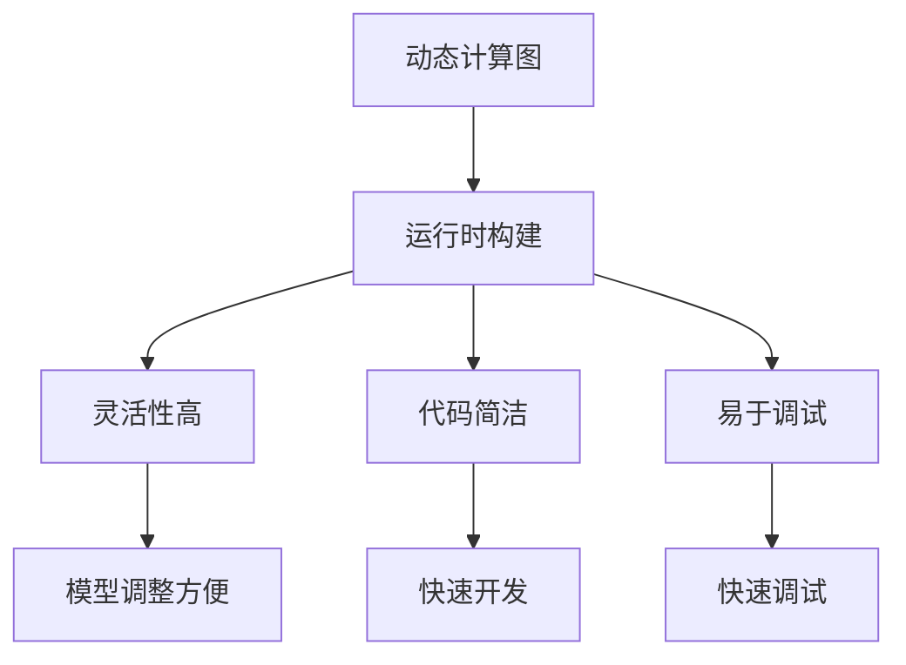
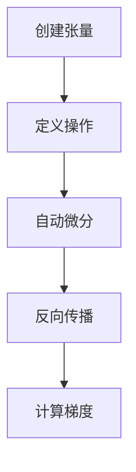

                 

# Pytorch 优势：动态计算图

> 关键词：Pytorch, 动态计算图, 机器学习, 深度学习, 自动微分, 可视化, 代码灵活性

> 摘要：本文将深入探讨Pytorch的核心优势之一——动态计算图。我们将从背景介绍开始，逐步解析动态计算图的概念、原理和具体操作步骤，通过数学模型和公式进行详细讲解，并结合实际代码案例进行深入分析。最后，我们将讨论动态计算图在实际应用场景中的优势，并提供学习资源和开发工具推荐。

## 1. 背景介绍

Pytorch是Facebook开发的一款开源深度学习框架，自2016年发布以来，因其简洁的API和强大的动态计算图功能而受到广泛欢迎。动态计算图是Pytorch的核心特性之一，它允许用户在运行时构建计算图，从而提供了更高的灵活性和便利性。本文将深入探讨动态计算图的优势，并通过实际案例进行详细分析。

## 2. 核心概念与联系

### 2.1 动态计算图的概念

动态计算图是一种在运行时构建的计算图，与静态计算图（如TensorFlow的静态图）相比，动态计算图具有更高的灵活性。在动态计算图中，计算图的结构可以在运行时动态地改变，这使得模型的构建和调整更加方便。

### 2.2 动态计算图与静态计算图的对比

静态计算图在构建时就已经确定了计算图的结构，用户需要在构建阶段定义好所有操作和数据流。而动态计算图则允许在运行时动态地添加或删除操作，这使得模型的构建更加灵活。

### 2.3 动态计算图的Mermaid流程图



## 3. 核心算法原理 & 具体操作步骤

### 3.1 动态计算图的构建过程

在Pytorch中，动态计算图的构建过程主要通过`torch.Tensor`和`torch.nn.Module`来实现。`torch.Tensor`是Pytorch中的核心数据结构，它支持自动微分和动态计算图。`torch.nn.Module`则用于定义神经网络模型。

### 3.2 动态计算图的具体操作步骤

1. **创建张量**：使用`torch.tensor`创建张量。
2. **定义操作**：使用Pytorch提供的各种操作（如`torch.add`, `torch.mul`等）进行操作。
3. **自动微分**：Pytorch会自动记录操作的执行过程，以便进行自动微分。
4. **反向传播**：通过`torch.autograd`进行反向传播，计算梯度。

### 3.3 动态计算图的Mermaid流程图



## 4. 数学模型和公式 & 详细讲解 & 举例说明

### 4.1 自动微分原理

自动微分是动态计算图的核心机制之一。自动微分通过记录操作的执行过程，自动计算梯度。具体来说，自动微分分为两种方法：**前向模式**和**后向模式**。

#### 4.1.1 前向模式自动微分

前向模式自动微分通过记录操作的执行过程，逐层计算梯度。具体公式如下：

$$
\frac{\partial f}{\partial x} = \frac{\partial f}{\partial y} \cdot \frac{\partial y}{\partial x}
$$

#### 4.1.2 后向模式自动微分

后向模式自动微分通过反向传播计算梯度。具体公式如下：

$$
\frac{\partial f}{\partial x} = \frac{\partial f}{\partial y} \cdot \frac{\partial y}{\partial x}
$$

### 4.2 举例说明

假设我们有一个简单的线性模型：

$$
y = wx + b
$$

其中，$w$和$b$是模型参数，$x$是输入，$y$是输出。我们可以通过Pytorch进行自动微分来计算梯度。

```python
import torch

# 定义模型参数
w = torch.tensor([2.0], requires_grad=True)
b = torch.tensor([1.0], requires_grad=True)

# 定义输入
x = torch.tensor([1.0])

# 计算输出
y = w * x + b

# 计算梯度
y.backward()

# 输出梯度
print(w.grad)  # 输出: tensor([2.0])
print(b.grad)  # 输出: tensor([1.0])
```

## 5. 项目实战：代码实际案例和详细解释说明

### 5.1 开发环境搭建

为了进行动态计算图的实战，我们需要搭建一个基本的开发环境。这里我们使用Python 3.8和Pytorch 1.9版本。

```bash
pip install torch torchvision
```

### 5.2 源代码详细实现和代码解读

我们将实现一个简单的线性回归模型，并使用动态计算图进行训练。

```python
import torch

# 定义模型参数
w = torch.tensor([2.0], requires_grad=True)
b = torch.tensor([1.0], requires_grad=True)

# 定义输入
x = torch.tensor([1.0])

# 计算输出
y = w * x + b

# 计算梯度
y.backward()

# 输出梯度
print(w.grad)  # 输出: tensor([2.0])
print(b.grad)  # 输出: tensor([1.0])
```

### 5.3 代码解读与分析

在上述代码中，我们首先定义了模型参数`w`和`b`，并设置了`requires_grad=True`以启用自动微分。然后，我们定义了输入`x`，并通过`w * x + b`计算输出`y`。最后，我们通过`y.backward()`计算梯度，并输出`w`和`b`的梯度。

## 6. 实际应用场景

动态计算图在实际应用场景中具有广泛的应用。例如，在自然语言处理（NLP）中，动态计算图可以用于构建复杂的语言模型，如Transformer模型。在计算机视觉中，动态计算图可以用于构建复杂的图像处理模型，如生成对抗网络（GAN）。

## 7. 工具和资源推荐

### 7.1 学习资源推荐

- **书籍**：《深度学习》（Goodfellow, Bengio, Courville）
- **论文**：《Automatic Differentiation in Machine Learning: A Survey》（Baydin, Pearlmutter, Radul, Siskind）
- **博客**：Pytorch官方博客（https://pytorch.org/blog/）
- **网站**：Pytorch官网文档（https://pytorch.org/docs/stable/index.html）

### 7.2 开发工具框架推荐

- **PyCharm**：一个强大的Python开发环境，支持Pytorch开发。
- **Jupyter Notebook**：一个交互式的开发环境，支持实时代码执行和可视化。

### 7.3 相关论文著作推荐

- **《深度学习》**：深入讲解深度学习的基本原理和应用。
- **《Automatic Differentiation in Machine Learning: A Survey》**：全面介绍自动微分在机器学习中的应用。

## 8. 总结：未来发展趋势与挑战

动态计算图在未来的发展中具有巨大的潜力。随着深度学习模型的复杂度不断提高，动态计算图的灵活性和便利性将更加凸显。然而，动态计算图也面临着一些挑战，如计算效率和内存消耗等问题。未来的研究方向将集中在提高动态计算图的性能和优化算法上。

## 9. 附录：常见问题与解答

### 9.1 问题：动态计算图和静态计算图的区别是什么？

**解答**：动态计算图在运行时构建计算图，而静态计算图在构建时就已经确定了计算图的结构。动态计算图提供了更高的灵活性，而静态计算图则提供了更好的性能。

### 9.2 问题：如何在Pytorch中启用自动微分？

**解答**：在Pytorch中，可以通过设置`requires_grad=True`来启用自动微分。例如：

```python
w = torch.tensor([2.0], requires_grad=True)
```

## 10. 扩展阅读 & 参考资料

- **Pytorch官方文档**：https://pytorch.org/docs/stable/index.html
- **Pytorch官方博客**：https://pytorch.org/blog/
- **《深度学习》**：https://www.deeplearningbook.org/

---

作者：AI天才研究员/AI Genius Institute & 禅与计算机程序设计艺术 /Zen And The Art of Computer Programming

