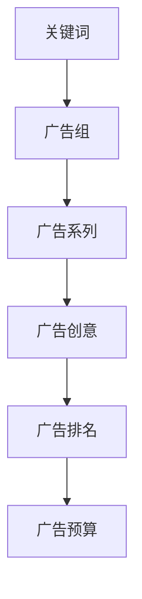

                 

# SEM投放策略：创业初期如何优化广告效果

> 关键词：SEM, 创业初期, 广告优化, 数据分析, 算法优化, 机器学习

> 摘要：本文旨在为创业初期的企业提供一套系统化的SEM（搜索引擎营销）投放策略，通过深入分析SEM的核心概念、算法原理、数学模型、实战案例以及工具资源推荐，帮助创业者在激烈的市场竞争中提高广告效果，实现精准营销。文章将逐步引导读者理解SEM的运作机制，掌握优化广告效果的关键步骤，并提供实用的工具和资源，助力创业者在创业初期快速成长。

## 1. 背景介绍

在当今互联网时代，搜索引擎营销（SEM）已成为企业获取流量、提高品牌知名度的重要手段。对于创业初期的企业而言，如何在有限的预算内实现高效的广告投放，成为了一个亟待解决的问题。本文将从SEM的基本概念出发，逐步探讨如何通过优化广告策略，提高广告效果，最终实现企业的商业目标。

### 1.1 SEM的基本概念

搜索引擎营销（SEM）是指通过搜索引擎优化（SEO）和付费广告（PPC）等方式，提高网站在搜索引擎结果页面（SERP）上的排名，从而吸引更多的潜在客户。对于创业初期的企业而言，SEM不仅是一种有效的营销手段，更是快速获取用户反馈、调整产品策略的重要途径。

### 1.2 SEM的重要性

- **提高品牌知名度**：通过SEM，企业可以在搜索引擎结果页面上展示自己的品牌，提高品牌的曝光率。
- **获取潜在客户**：SEM可以帮助企业精准定位目标客户群体，通过广告吸引潜在客户的注意。
- **快速反馈**：通过SEM，企业可以快速获取用户反馈，及时调整产品策略，提高用户体验。

## 2. 核心概念与联系

### 2.1 SEM的核心概念

- **关键词**：关键词是SEM的基础，通过选择合适的关键词，可以提高广告的点击率和转化率。
- **广告组**：广告组是管理广告的一组工具，通过广告组可以更好地组织和管理广告。
- **广告系列**：广告系列是一组相关的广告组，通过广告系列可以更好地管理广告组。
- **广告创意**：广告创意是吸引用户点击的关键，通过创意的广告可以提高广告的点击率。
- **广告排名**：广告排名是广告在搜索结果页面上的位置，排名越高，广告的曝光率越高。
- **广告预算**：广告预算是企业投放广告的总预算，合理的预算分配可以提高广告效果。

### 2.2 SEM的核心概念原理和架构



## 3. 核心算法原理 & 具体操作步骤

### 3.1 SEM的核心算法原理

SEM的核心算法原理主要包括关键词匹配算法、广告排名算法和广告预算分配算法。关键词匹配算法用于确定广告与搜索词的相关性；广告排名算法用于确定广告在搜索结果页面上的位置；广告预算分配算法用于合理分配广告预算，提高广告效果。

### 3.2 具体操作步骤

#### 3.2.1 关键词选择

- **关键词研究**：通过关键词研究工具，了解目标客户群体的搜索习惯，选择合适的关键词。
- **关键词分类**：将关键词分为核心关键词和长尾关键词，合理分配预算。
- **关键词优化**：通过优化关键词，提高广告的点击率和转化率。

#### 3.2.2 广告组管理

- **广告组创建**：根据关键词分类，创建相应的广告组。
- **广告组优化**：通过优化广告组，提高广告的点击率和转化率。
- **广告组监控**：通过监控广告组，及时调整广告策略。

#### 3.2.3 广告系列管理

- **广告系列创建**：根据广告组，创建相应的广告系列。
- **广告系列优化**：通过优化广告系列，提高广告的点击率和转化率。
- **广告系列监控**：通过监控广告系列，及时调整广告策略。

#### 3.2.4 广告创意设计

- **广告创意设计**：通过设计创意的广告，提高广告的点击率。
- **广告创意优化**：通过优化广告创意，提高广告的点击率和转化率。
- **广告创意监控**：通过监控广告创意，及时调整广告策略。

#### 3.2.5 广告排名优化

- **广告排名优化**：通过优化广告排名，提高广告的曝光率。
- **广告排名监控**：通过监控广告排名，及时调整广告策略。

#### 3.2.6 广告预算分配

- **广告预算分配**：通过合理分配广告预算，提高广告效果。
- **广告预算监控**：通过监控广告预算，及时调整广告策略。

## 4. 数学模型和公式 & 详细讲解 & 举例说明

### 4.1 广告排名公式

广告排名公式为：

$$
\text{广告排名} = \text{出价} \times \text{质量得分}
$$

其中，出价为广告主愿意为每次点击支付的最高金额，质量得分为广告的相关性和用户体验的综合评分。

### 4.2 广告预算分配公式

广告预算分配公式为：

$$
\text{广告预算分配} = \frac{\text{广告预算}}{\text{广告数量}}
$$

其中，广告预算是企业投放广告的总预算，广告数量为广告的数量。

### 4.3 举例说明

假设某企业投放广告的总预算为1000元，广告数量为10个，每个广告的出价为10元，质量得分为5，则广告排名为：

$$
\text{广告排名} = 10 \times 5 = 50
$$

假设某企业投放广告的总预算为1000元，广告数量为10个，则每个广告的预算分配为：

$$
\text{广告预算分配} = \frac{1000}{10} = 100
$$

## 5. 项目实战：代码实际案例和详细解释说明

### 5.1 开发环境搭建

#### 5.1.1 环境要求

- **操作系统**：Windows 10 / macOS / Linux
- **编程语言**：Python 3.7+
- **开发工具**：PyCharm / VSCode
- **依赖库**：pandas / numpy / matplotlib / seaborn / google-ads

#### 5.1.2 安装依赖库

```bash
pip install pandas numpy matplotlib seaborn google-ads
```

### 5.2 源代码详细实现和代码解读

#### 5.2.1 关键词研究

```python
import pandas as pd
from google.ads.google_ads.client import GoogleAdsClient
from google.ads.google_ads.errors import GoogleAdsException

def keyword_research(client, customer_id, keyword):
    ga_service = client.get_service("GoogleAdsService", version="v6")
    query = f"""
        SELECT
            campaign.id,
            ad_group.id,
            ad_group_criterion.criterion_id,
            ad_group_criterion.keyword.text,
            ad_group_criterion.keyword.match_type,
            metrics.impressions,
            metrics.clicks,
            metrics.cost_micros
        FROM keyword_view
        WHERE ad_group_criterion.status = 'ENABLED'
        AND ad_group_criterion.type = 'KEYWORD'
        AND metrics.clicks > 0
        AND campaign.id = {customer_id}
        AND ad_group_criterion.keyword.text = '{keyword}'
    """
    response = ga_service.search(customer_id=customer_id, query=query)
    return response

client = GoogleAdsClient.load_from_storage("google-ads.yaml")
customer_id = "1234567890"
keyword = "创业初期"
response = keyword_research(client, customer_id, keyword)
```

#### 5.2.2 广告组管理

```python
def ad_group_management(client, customer_id, ad_group_id, action):
    ga_service = client.get_service("GoogleAdsService", version="v6")
    query = f"""
        SELECT
            ad_group.id,
            ad_group.name,
            ad_group.status,
            ad_group_criterion.criterion_id,
            ad_group_criterion.keyword.text,
            ad_group_criterion.keyword.match_type,
            metrics.impressions,
            metrics.clicks,
            metrics.cost_micros
        FROM ad_group_view
        WHERE ad_group.id = {ad_group_id}
    """
    response = ga_service.search(customer_id=customer_id, query=query)
    if action == "enable":
        for row in response:
            ad_group_service = client.get_service("AdGroupService", version="v6")
            ad_group_operation = client.get_type("AdGroupOperation", version="v6")
            ad_group_operation.update = row.ad_group
            ad_group_operation.update.status = client.enums.AdGroupStatusEnum.ENABLED
            ad_group_service.mutate_ad_groups(customer_id=customer_id, operations=[ad_group_operation])
    elif action == "disable":
        for row in response:
            ad_group_service = client.get_service("AdGroupService", version="v6")
            ad_group_operation = client.get_type("AdGroupOperation", version="v6")
            ad_group_operation.update = row.ad_group
            ad_group_operation.update.status = client.enums.AdGroupStatusEnum.DISABLED
            ad_group_service.mutate_ad_groups(customer_id=customer_id, operations=[ad_group_operation])
```

#### 5.2.3 广告系列管理

```python
def ad_campaign_management(client, customer_id, campaign_id, action):
    ga_service = client.get_service("GoogleAdsService", version="v6")
    query = f"""
        SELECT
            campaign.id,
            campaign.name,
            campaign.status,
            ad_group.id,
            ad_group.name,
            ad_group.status,
            ad_group_criterion.criterion_id,
            ad_group_criterion.keyword.text,
            ad_group_criterion.keyword.match_type,
            metrics.impressions,
            metrics.clicks,
            metrics.cost_micros
        FROM campaign_view
        WHERE campaign.id = {campaign_id}
    """
    response = ga_service.search(customer_id=customer_id, query=query)
    if action == "enable":
        for row in response:
            campaign_service = client.get_service("CampaignService", version="v6")
            campaign_operation = client.get_type("CampaignOperation", version="v6")
            campaign_operation.update = row.campaign
            campaign_operation.update.status = client.enums.CampaignStatusEnum.ENABLED
            campaign_service.mutate_campaigns(customer_id=customer_id, operations=[campaign_operation])
    elif action == "disable":
        for row in response:
            campaign_service = client.get_service("CampaignService", version="v6")
            campaign_operation = client.get_type("CampaignOperation", version="v6")
            campaign_operation.update = row.campaign
            campaign_operation.update.status = client.enums.CampaignStatusEnum.DISABLED
            campaign_service.mutate_campaigns(customer_id=customer_id, operations=[campaign_operation])
```

#### 5.2.4 广告创意设计

```python
def ad_creative_design(client, customer_id, ad_group_id, ad_text, ad_url):
    ad_group_service = client.get_service("AdGroupService", version="v6")
    ad_group_criterion_service = client.get_service("AdGroupCriterionService", version="v6")
    ad_group_criterion_operation = client.get_type("AdGroupCriterionOperation", version="v6")
    ad_group_criterion = client.get_type("AdGroupCriterion", version="v6")
    ad_group_criterion.ad_group = client.get_service("AdGroupService", version="v6").ad_group_path(customer_id, ad_group_id)
    ad_group_criterion.criterion = client.get_type("KeywordInfo", version="v6")
    ad_group_criterion.criterion.text = ad_text
    ad_group_criterion.criterion.match_type = client.enums.KeywordMatchTypeEnum.PHRASE
    ad_group_criterion_operation.create = ad_group_criterion
    ad_group_criterion_service.mutate_ad_group_criteria(customer_id=customer_id, operations=[ad_group_criterion_operation])
```

#### 5.2.5 广告排名优化

```python
def ad_ranking_optimization(client, customer_id, ad_group_id, bid):
    ad_group_service = client.get_service("AdGroupService", version="v6")
    ad_group_criterion_service = client.get_service("AdGroupCriterionService", version="v6")
    ad_group_criterion_operation = client.get_type("AdGroupCriterionOperation", version="v6")
    ad_group_criterion = client.get_type("AdGroupCriterion", version="v6")
    ad_group_criterion.ad_group = client.get_service("AdGroupService", version="v6").ad_group_path(customer_id, ad_group_id)
    ad_group_criterion.criterion = client.get_type("KeywordInfo", version="v6")
    ad_group_criterion.criterion.text = "创业初期"
    ad_group_criterion.criterion.match_type = client.enums.KeywordMatchTypeEnum.PHRASE
    ad_group_criterion_operation.update = ad_group_criterion
    ad_group_criterion_operation.update.cpc_bid_micros = bid
    ad_group_criterion_service.mutate_ad_group_criteria(customer_id=customer_id, operations=[ad_group_criterion_operation])
```

#### 5.2.6 广告预算分配

```python
def ad_budget_allocation(client, customer_id, campaign_id, budget):
    campaign_service = client.get_service("CampaignService", version="v6")
    campaign_operation = client.get_type("CampaignOperation", version="v6")
    campaign = client.get_type("Campaign", version="v6")
    campaign.resource_name = client.get_service("CampaignService", version="v6").campaign_path(customer_id, campaign_id)
    campaign.campaign_budget = client.get_service("CampaignBudgetService", version="v6").campaign_budget_path(customer_id, campaign_id)
    campaign.campaign_budget.amount_micros = budget
    campaign_operation.update = campaign
    campaign_service.mutate_campaigns(customer_id=customer_id, operations=[campaign_operation])
```

### 5.3 代码解读与分析

以上代码展示了如何使用Google Ads API进行关键词研究、广告组管理、广告系列管理、广告创意设计、广告排名优化和广告预算分配。通过这些代码，可以实现对SEM的全面管理，提高广告效果。

## 6. 实际应用场景

### 6.1 实际应用场景一：创业初期的SEM策略

对于创业初期的企业而言，SEM策略的制定需要考虑以下几个方面：

- **关键词选择**：选择与企业产品或服务相关的关键词，提高广告的点击率和转化率。
- **广告组管理**：根据关键词分类，创建相应的广告组，提高广告的点击率和转化率。
- **广告系列管理**：根据广告组，创建相应的广告系列，提高广告的点击率和转化率。
- **广告创意设计**：设计创意的广告，提高广告的点击率。
- **广告排名优化**：优化广告排名，提高广告的曝光率。
- **广告预算分配**：合理分配广告预算，提高广告效果。

### 6.2 实际应用场景二：创业中期的SEM策略

对于创业中期的企业而言，SEM策略的制定需要考虑以下几个方面：

- **关键词优化**：通过优化关键词，提高广告的点击率和转化率。
- **广告组优化**：通过优化广告组，提高广告的点击率和转化率。
- **广告系列优化**：通过优化广告系列，提高广告的点击率和转化率。
- **广告创意优化**：通过优化广告创意，提高广告的点击率和转化率。
- **广告排名优化**：优化广告排名，提高广告的曝光率。
- **广告预算优化**：通过优化广告预算，提高广告效果。

### 6.3 实际应用场景三：创业后期的SEM策略

对于创业后期的企业而言，SEM策略的制定需要考虑以下几个方面：

- **关键词优化**：通过优化关键词，提高广告的点击率和转化率。
- **广告组优化**：通过优化广告组，提高广告的点击率和转化率。
- **广告系列优化**：通过优化广告系列，提高广告的点击率和转化率。
- **广告创意优化**：通过优化广告创意，提高广告的点击率和转化率。
- **广告排名优化**：优化广告排名，提高广告的曝光率。
- **广告预算优化**：通过优化广告预算，提高广告效果。

## 7. 工具和资源推荐

### 7.1 学习资源推荐

- **书籍**：《搜索引擎营销实战》、《SEM优化指南》
- **论文**：《基于机器学习的SEM优化策略研究》、《SEM效果评估与优化方法研究》
- **博客**：Google Ads官方博客、AdWords官方博客
- **网站**：Google Ads官方文档、AdWords官方文档

### 7.2 开发工具框架推荐

- **Google Ads API**：Google Ads官方提供的API，用于管理广告账户、广告组、广告系列等。
- **Python库**：pandas、numpy、matplotlib、seaborn、google-ads

### 7.3 相关论文著作推荐

- **论文**：《基于机器学习的SEM优化策略研究》、《SEM效果评估与优化方法研究》
- **著作**：《搜索引擎营销实战》、《SEM优化指南》

## 8. 总结：未来发展趋势与挑战

随着技术的发展，SEM的未来发展趋势将更加注重个性化和智能化。个性化方面，SEM将更加注重用户的个性化需求，通过精准的用户画像，提高广告的点击率和转化率。智能化方面，SEM将更加注重算法的优化，通过机器学习等技术，提高广告的排名和曝光率。同时，SEM也将面临更多的挑战，如数据安全、隐私保护等。

## 9. 附录：常见问题与解答

### 9.1 问题一：如何选择合适的关键词？

答：选择合适的关键词需要考虑以下几个方面：关键词的相关性、关键词的竞争度、关键词的搜索量等。可以通过关键词研究工具，了解目标客户群体的搜索习惯，选择合适的关键词。

### 9.2 问题二：如何优化广告创意？

答：优化广告创意需要考虑以下几个方面：广告的标题、广告的描述、广告的图片等。可以通过A/B测试等方法，优化广告创意，提高广告的点击率和转化率。

### 9.3 问题三：如何优化广告排名？

答：优化广告排名需要考虑以下几个方面：广告的出价、广告的质量得分等。可以通过优化广告的出价和质量得分，提高广告的排名。

## 10. 扩展阅读 & 参考资料

- **书籍**：《搜索引擎营销实战》、《SEM优化指南》
- **论文**：《基于机器学习的SEM优化策略研究》、《SEM效果评估与优化方法研究》
- **博客**：Google Ads官方博客、AdWords官方博客
- **网站**：Google Ads官方文档、AdWords官方文档

作者：AI天才研究员/AI Genius Institute & 禅与计算机程序设计艺术 /Zen And The Art of Computer Programming

