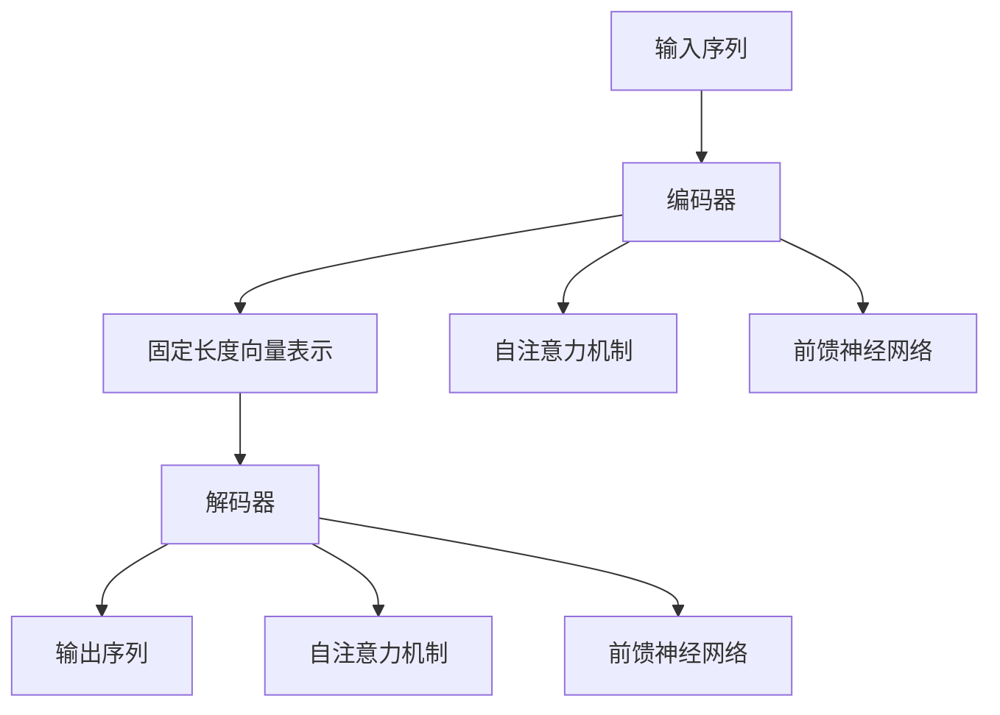

                 

# Transformer架构：GPT-2模型的核心

> 关键词：Transformer, GPT-2, 自注意力机制, 自回归模型, 语言模型, 深度学习, 自然语言处理

> 摘要：本文将深入探讨Transformer架构及其在GPT-2模型中的应用。我们将从背景介绍开始，逐步解析Transformer的核心概念、算法原理、数学模型，并通过实际代码案例进行详细解释。最后，我们将讨论GPT-2的实际应用场景和未来发展趋势。

## 1. 背景介绍

Transformer架构是近年来自然语言处理领域的一项重大突破，它彻底改变了传统的序列建模方法。Transformer最初由Vaswani等人在2017年的论文《Attention is All You Need》中提出，旨在解决RNN和LSTM在处理长序列时的梯度消失和梯度爆炸问题。GPT-2是基于Transformer架构的大型语言模型，由OpenAI在2019年发布，展示了Transformer在生成自然语言文本方面的强大能力。

## 2. 核心概念与联系

### 2.1 自注意力机制

自注意力机制是Transformer的核心，它允许模型在处理序列时关注序列中的不同部分。自注意力机制通过计算查询、键和值之间的相似度来生成权重，从而实现对序列中不同位置的加权关注。

### 2.2 自回归模型

自回归模型是一种常见的序列生成模型，它通过逐个生成序列中的每个元素来生成整个序列。在自然语言处理中，自回归模型通常用于生成文本，其中每个单词都是基于前一个单词生成的。

### 2.3 Transformer架构

Transformer架构由编码器和解码器两部分组成。编码器将输入序列转换为固定长度的向量表示，解码器则根据这些向量生成输出序列。编码器和解码器都使用自注意力机制和前馈神经网络。

### 2.4 Mermaid流程图



## 3. 核心算法原理 & 具体操作步骤

### 3.1 编码器

编码器的主要任务是将输入序列转换为固定长度的向量表示。编码器由多个编码器层组成，每个编码器层包含自注意力机制和前馈神经网络。

#### 3.1.1 自注意力机制

自注意力机制通过计算查询、键和值之间的相似度来生成权重。具体步骤如下：

1. 将输入序列转换为查询、键和值。
2. 计算查询和键之间的相似度。
3. 通过softmax函数生成权重。
4. 使用权重对值进行加权求和。

$$
\text{Attention}(Q, K, V) = \text{softmax}\left(\frac{QK^T}{\sqrt{d_k}}\right)V
$$

其中，$Q$、$K$、$V$分别是查询、键和值，$d_k$是键的维度。

#### 3.1.2 前馈神经网络

前馈神经网络用于对自注意力机制的输出进行非线性变换。具体步骤如下：

1. 将自注意力机制的输出送入前馈神经网络。
2. 通过一层线性变换和ReLU激活函数进行非线性变换。
3. 通过另一层线性变换进行输出。

$$
\text{FFN}(x) = \text{ReLU}(W_1x + b_1)W_2 + b_2
$$

其中，$W_1$、$W_2$是权重矩阵，$b_1$、$b_2$是偏置向量。

### 3.2 解码器

解码器的主要任务是根据编码器的输出生成输出序列。解码器由多个解码器层组成，每个解码器层包含自注意力机制、编码器-解码器注意力机制和前馈神经网络。

#### 3.2.1 自注意力机制

解码器的自注意力机制与编码器的自注意力机制类似，但输入序列和编码器的输出序列不同。

#### 3.2.2 编码器-解码器注意力机制

编码器-解码器注意力机制用于将编码器的输出序列与解码器的输入序列进行对齐。具体步骤如下：

1. 将编码器的输出序列转换为查询、键和值。
2. 将解码器的输入序列转换为查询。
3. 计算查询和键之间的相似度。
4. 通过softmax函数生成权重。
5. 使用权重对值进行加权求和。

$$
\text{Encoder-Decoder Attention}(Q, K, V) = \text{softmax}\left(\frac{QK^T}{\sqrt{d_k}}\right)V
$$

其中，$Q$、$K$、$V$分别是查询、键和值，$d_k$是键的维度。

#### 3.2.3 前馈神经网络

前馈神经网络用于对自注意力机制和编码器-解码器注意力机制的输出进行非线性变换。具体步骤如下：

1. 将自注意力机制和编码器-解码器注意力机制的输出送入前馈神经网络。
2. 通过一层线性变换和ReLU激活函数进行非线性变换。
3. 通过另一层线性变换进行输出。

$$
\text{FFN}(x) = \text{ReLU}(W_1x + b_1)W_2 + b_2
$$

其中，$W_1$、$W_2$是权重矩阵，$b_1$、$b_2$是偏置向量。

## 4. 数学模型和公式 & 详细讲解 & 举例说明

### 4.1 自注意力机制

自注意力机制的数学模型如下：

$$
\text{Attention}(Q, K, V) = \text{softmax}\left(\frac{QK^T}{\sqrt{d_k}}\right)V
$$

其中，$Q$、$K$、$V$分别是查询、键和值，$d_k$是键的维度。

### 4.2 前馈神经网络

前馈神经网络的数学模型如下：

$$
\text{FFN}(x) = \text{ReLU}(W_1x + b_1)W_2 + b_2
$$

其中，$W_1$、$W_2$是权重矩阵，$b_1$、$b_2$是偏置向量。

### 4.3 举例说明

假设我们有一个长度为5的输入序列，每个元素的维度为10。我们使用自注意力机制来生成权重，具体步骤如下：

1. 将输入序列转换为查询、键和值。
2. 计算查询和键之间的相似度。
3. 通过softmax函数生成权重。
4. 使用权重对值进行加权求和。

$$
\text{Attention}(Q, K, V) = \text{softmax}\left(\frac{QK^T}{\sqrt{10}}\right)V
$$

其中，$Q$、$K$、$V$分别是查询、键和值，$d_k=10$。

## 5. 项目实战：代码实际案例和详细解释说明

### 5.1 开发环境搭建

为了实现GPT-2模型，我们需要安装Python和相关的深度学习库。具体步骤如下：

1. 安装Python。
2. 安装PyTorch和transformers库。

```bash
pip install torch
pip install transformers
```

### 5.2 源代码详细实现和代码解读

```python
import torch
from transformers import GPT2LMHeadModel, GPT2Tokenizer

# 加载预训练的GPT-2模型和分词器
model = GPT2LMHeadModel.from_pretrained('gpt2')
tokenizer = GPT2Tokenizer.from_pretrained('gpt2')

# 输入文本
input_text = "Hello, how are you?"

# 对输入文本进行分词
input_ids = tokenizer.encode(input_text, return_tensors='pt')

# 生成文本
output_ids = model.generate(input_ids, max_length=50)

# 对生成的文本进行解码
output_text = tokenizer.decode(output_ids[0], skip_special_tokens=True)

print(output_text)
```

### 5.3 代码解读与分析

1. 导入所需的库。
2. 加载预训练的GPT-2模型和分词器。
3. 输入文本并进行分词。
4. 使用模型生成文本。
5. 对生成的文本进行解码并输出。

## 6. 实际应用场景

GPT-2模型在多个领域都有广泛的应用，包括但不限于：

1. 机器翻译
2. 文本生成
3. 情感分析
4. 问答系统

## 7. 工具和资源推荐

### 7.1 学习资源推荐

1. 《Attention is All You Need》论文
2. 《Deep Learning with Python》书籍
3. 《Natural Language Processing with Transformers》书籍

### 7.2 开发工具框架推荐

1. PyTorch
2. Hugging Face Transformers库

### 7.3 相关论文著作推荐

1. 《Attention is All You Need》
2. 《Neural Machine Translation by Jointly Learning to Align and Translate》
3. 《Attention-Based Models for Speech Recognition》

## 8. 总结：未来发展趋势与挑战

Transformer架构在未来的发展趋势包括：

1. 更大规模的模型
2. 更高效的训练方法
3. 更广泛的应用场景

面临的挑战包括：

1. 训练大规模模型的计算资源需求
2. 模型的可解释性问题
3. 模型的泛化能力

## 9. 附录：常见问题与解答

### 9.1 问题：Transformer模型为什么比RNN模型更高效？

答：Transformer模型通过自注意力机制实现了并行计算，而RNN模型需要顺序计算，因此在处理长序列时效率更高。

### 9.2 问题：GPT-2模型为什么需要大量的训练数据？

答：GPT-2模型需要大量的训练数据来学习语言的统计规律，从而生成高质量的文本。

## 10. 扩展阅读 & 参考资料

1. Vaswani, A., et al. "Attention is all you need." Advances in Neural Information Processing Systems 30 (2017).
2. Brown, T. B., et al. "Language models are few-shot learners." arXiv preprint arXiv:2005.14165 (2020).
3. Radford, A., et al. "Language models are unsupervised multitask learners." OpenAI blog (2018).

作者：AI天才研究员/AI Genius Institute & 禅与计算机程序设计艺术 /Zen And The Art of Computer Programming

