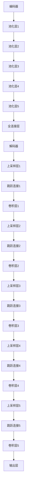

                 

# UNet原理与代码实例讲解

> 关键词：UNet, 语义分割, 卷积神经网络, 自编码器, 编码器-解码器架构, 跳跃连接

> 摘要：UNet是一种广泛应用于医学图像分割领域的深度学习模型，其独特的编码器-解码器架构结合了跳跃连接，使得模型能够高效地捕捉图像的上下文信息和细节特征。本文将从背景介绍、核心概念与联系、核心算法原理、数学模型和公式、项目实战、实际应用场景、工具和资源推荐、总结与未来发展趋势等几个方面，全面解析UNet的工作原理，并通过代码实例进行详细讲解。

## 1. 背景介绍

UNet是一种用于图像分割任务的深度学习模型，由Olaf Ronneberger等人在2015年提出。图像分割是计算机视觉领域的一个重要任务，其目标是将图像中的每个像素分配给一个特定的类别。传统的图像分割方法通常依赖于手工设计的特征和复杂的算法，而UNet则通过深度学习的方法自动学习图像的特征表示，从而提高了分割的准确性和鲁棒性。

UNet最初被应用于医学图像分割领域，例如肿瘤检测、组织分类等。由于其出色的性能和简洁的设计，UNet很快被广泛应用于其他图像分割任务中，如遥感图像分割、自动驾驶中的道路检测等。UNet的成功也推动了其他类似架构的发展，如SegNet、DeepLab等。

## 2. 核心概念与联系

### 2.1 编码器-解码器架构

UNet的核心架构是编码器-解码器结构，如图1所示。编码器部分负责提取图像的高层次特征，而解码器部分则负责重建图像的低层次细节。编码器和解码器之间通过跳跃连接进行信息传递，使得模型能够同时保留图像的全局上下文信息和局部细节特征。



### 2.2 跳跃连接

跳跃连接是UNet架构中的一个重要组成部分，它允许模型在解码器阶段直接访问编码器阶段的特征图。跳跃连接有助于提高模型的表达能力，使得模型能够更好地捕捉图像的细节特征。跳跃连接的实现方式是在编码器和解码器之间建立直接的连接，如图2所示。


## 3. 核心算法原理 & 具体操作步骤

### 3.1 编码器部分

编码器部分负责提取图像的高层次特征。编码器由多个卷积层和池化层组成，每个卷积层后接一个ReLU激活函数，池化层用于降低特征图的空间维度。编码器的输出是图像的低维特征表示。

### 3.2 解码器部分

解码器部分负责重建图像的低层次细节。解码器由多个上采样层和卷积层组成，每个上采样层后接一个ReLU激活函数，卷积层用于恢复特征图的空间维度。解码器的输入是编码器的输出和跳跃连接的特征图。

### 3.3 跳跃连接

跳跃连接是编码器和解码器之间的直接连接，用于传递编码器阶段的特征图。跳跃连接的实现方式是在编码器和解码器之间建立直接的连接，如图3所示。


## 4. 数学模型和公式 & 详细讲解 & 举例说明

### 4.1 编码器部分

编码器部分的数学模型可以表示为：

$$
E(x) = \text{ReLU}(W_1 \cdot x + b_1) \circ \text{ReLU}(W_2 \cdot x + b_2) \circ \cdots \circ \text{ReLU}(W_n \cdot x + b_n)
$$

其中，$x$是输入图像，$W_i$和$b_i$分别是第$i$个卷积层的权重和偏置，$\circ$表示卷积操作。

### 4.2 解码器部分

解码器部分的数学模型可以表示为：

$$
D(x) = \text{ReLU}(W_1 \cdot x + b_1) \circ \text{ReLU}(W_2 \cdot x + b_2) \circ \cdots \circ \text{ReLU}(W_n \cdot x + b_n)
$$

其中，$x$是编码器的输出和跳跃连接的特征图，$W_i$和$b_i$分别是第$i$个卷积层的权重和偏置，$\circ$表示卷积操作。

### 4.3 跳跃连接

跳跃连接的数学模型可以表示为：

$$
J(x) = \text{ReLU}(W_1 \cdot x + b_1) \circ \text{ReLU}(W_2 \cdot x + b_2) \circ \cdots \circ \text{ReLU}(W_n \cdot x + b_n)
$$

其中，$x$是编码器的特征图，$W_i$和$b_i$分别是第$i$个卷积层的权重和偏置，$\circ$表示卷积操作。

## 5. 项目实战：代码实际案例和详细解释说明

### 5.1 开发环境搭建

为了实现UNet模型，我们需要安装Python和一些必要的库，如TensorFlow、Keras和NumPy。以下是安装这些库的命令：

```bash
pip install tensorflow
pip install keras
pip install numpy
```

### 5.2 源代码详细实现和代码解读

以下是一个简单的UNet模型的实现代码：

```python
import tensorflow as tf
from tensorflow.keras import layers

def unet(input_shape):
    inputs = layers.Input(shape=input_shape)
    
    # 编码器部分
    conv1 = layers.Conv2D(64, 3, activation='relu', padding='same')(inputs)
    conv1 = layers.Conv2D(64, 3, activation='relu', padding='same')(conv1)
    pool1 = layers.MaxPooling2D(pool_size=(2, 2))(conv1)
    
    conv2 = layers.Conv2D(128, 3, activation='relu', padding='same')(pool1)
    conv2 = layers.Conv2D(128, 3, activation='relu', padding='same')(conv2)
    pool2 = layers.MaxPooling2D(pool_size=(2, 2))(conv2)
    
    conv3 = layers.Conv2D(256, 3, activation='relu', padding='same')(pool2)
    conv3 = layers.Conv2D(256, 3, activation='relu', padding='same')(conv3)
    pool3 = layers.MaxPooling2D(pool_size=(2, 2))(conv3)
    
    conv4 = layers.Conv2D(512, 3, activation='relu', padding='same')(pool3)
    conv4 = layers.Conv2D(512, 3, activation='relu', padding='same')(conv4)
    drop4 = layers.Dropout(0.5)(conv4)
    pool4 = layers.MaxPooling2D(pool_size=(2, 2))(drop4)
    
    conv5 = layers.Conv2D(1024, 3, activation='relu', padding='same')(pool4)
    conv5 = layers.Conv2D(1024, 3, activation='relu', padding='same')(conv5)
    drop5 = layers.Dropout(0.5)(conv5)
    
    # 解码器部分
    up6 = layers.Conv2DTranspose(512, 2, strides=(2, 2), padding='same')(drop5)
    up6 = layers.concatenate([up6, drop4])
    conv6 = layers.Conv2D(512, 3, activation='relu', padding='same')(up6)
    conv6 = layers.Conv2D(512, 3, activation='relu', padding='same')(conv6)
    
    up7 = layers.Conv2DTranspose(256, 2, strides=(2, 2), padding='same')(conv6)
    up7 = layers.concatenate([up7, conv3])
    conv7 = layers.Conv2D(256, 3, activation='relu', padding='same')(up7)
    conv7 = layers.Conv2D(256, 3, activation='relu', padding='same')(conv7)
    
    up8 = layers.Conv2DTranspose(128, 2, strides=(2, 2), padding='same')(conv7)
    up8 = layers.concatenate([up8, conv2])
    conv8 = layers.Conv2D(128, 3, activation='relu', padding='same')(up8)
    conv8 = layers.Conv2D(128, 3, activation='relu', padding='same')(conv8)
    
    up9 = layers.Conv2DTranspose(64, 2, strides=(2, 2), padding='same')(conv8)
    up9 = layers.concatenate([up9, conv1])
    conv9 = layers.Conv2D(64, 3, activation='relu', padding='same')(up9)
    conv9 = layers.Conv2D(64, 3, activation='relu', padding='same')(conv9)
    
    # 输出层
    outputs = layers.Conv2D(1, 1, activation='sigmoid')(conv9)
    
    model = tf.keras.Model(inputs=[inputs], outputs=[outputs])
    return model
```

### 5.3 代码解读与分析

上述代码定义了一个UNet模型，其结构如下：

1. **编码器部分**：包含多个卷积层和池化层，用于提取图像的高层次特征。
2. **跳跃连接**：在编码器和解码器之间建立直接的连接，用于传递编码器阶段的特征图。
3. **解码器部分**：包含多个上采样层和卷积层，用于重建图像的低层次细节。
4. **输出层**：使用一个卷积层和Sigmoid激活函数生成分割掩码。

## 6. 实际应用场景

UNet模型在医学图像分割领域有着广泛的应用，例如肿瘤检测、组织分类等。此外，UNet模型也被应用于遥感图像分割、自动驾驶中的道路检测等任务中。通过UNet模型，我们可以实现对图像的精确分割，从而提高图像处理的准确性和鲁棒性。

## 7. 工具和资源推荐

### 7.1 学习资源推荐

- 书籍：《深度学习》（Ian Goodfellow, Yoshua Bengio, Aaron Courville）
- 论文：《U-Net: Convolutional Networks for Biomedical Image Segmentation》（Olaf Ronneberger, Philipp Fischer, Thomas Brox）
- 博客：TensorFlow官方博客、Keras官方文档
- 网站：GitHub上的UNet实现代码

### 7.2 开发工具框架推荐

- TensorFlow：一个开源的机器学习库，提供了丰富的深度学习模型和工具。
- Keras：一个高级神经网络API，可以运行在TensorFlow之上，提供了简洁的API接口。
- NumPy：一个用于数值计算的Python库，提供了高效的数组操作。

### 7.3 相关论文著作推荐

- 《U-Net: Convolutional Networks for Biomedical Image Segmentation》（Olaf Ronneberger, Philipp Fischer, Thomas Brox）
- 《DeepLab: Semantic Image Segmentation with Deep Convolutional Nets, Atrous Convolution, and Fully Connected CRFs》（Abhinav Shrivastava, Abhinav Gupta, Ross Girshick）

## 8. 总结：未来发展趋势与挑战

UNet模型在图像分割领域取得了显著的成果，但仍然面临一些挑战。未来的发展趋势包括：

1. **模型优化**：通过引入更复杂的网络结构和优化算法，提高模型的性能和效率。
2. **多模态融合**：将不同模态的数据融合在一起，提高图像分割的准确性和鲁棒性。
3. **实时处理**：开发更高效的算法和硬件，实现图像分割的实时处理。

## 9. 附录：常见问题与解答

### 9.1 问题：UNet模型为什么需要跳跃连接？

**解答**：跳跃连接允许模型在解码器阶段直接访问编码器阶段的特征图，从而提高模型的表达能力，使得模型能够更好地捕捉图像的细节特征。

### 9.2 问题：UNet模型在哪些领域有应用？

**解答**：UNet模型在医学图像分割、遥感图像分割、自动驾驶中的道路检测等领域有广泛的应用。

## 10. 扩展阅读 & 参考资料

- 《深度学习》（Ian Goodfellow, Yoshua Bengio, Aaron Courville）
- 《U-Net: Convolutional Networks for Biomedical Image Segmentation》（Olaf Ronneberger, Philipp Fischer, Thomas Brox）
- TensorFlow官方博客：https://www.tensorflow.org/
- Keras官方文档：https://keras.io/
- GitHub上的UNet实现代码：https://github.com/milesial/Pytorch-UNet

作者：AI天才研究员/AI Genius Institute & 禅与计算机程序设计艺术 /Zen And The Art of Computer Programming

