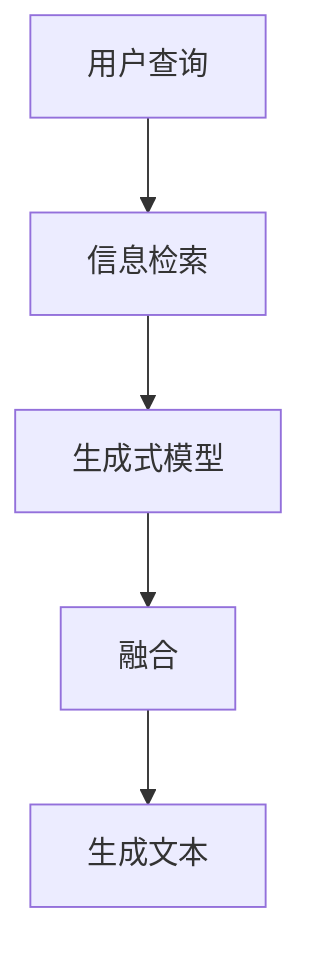

                 

# 【LangChain编程：从入门到实践】LangChain中的RAG组件

> 关键词：LangChain, RAG, Retrieval-Augmented Generation, 生成式检索增强, 信息检索, 机器学习, 自然语言处理, 代码实现

> 摘要：本文旨在深入探讨LangChain中的RAG组件，从其核心概念、原理、数学模型到实际代码实现，通过逐步推理的方式，帮助读者全面理解RAG的工作机制及其在实际项目中的应用。LangChain中的RAG组件是生成式检索增强技术的典型应用，它结合了信息检索和生成式模型的优势，为用户提供高质量的文本生成结果。本文将通过详细的代码示例，帮助读者掌握RAG组件的开发和应用。

## 1. 背景介绍

LangChain是一个开源的框架，旨在简化生成式模型的开发和部署。它提供了一系列工具和库，使得开发者能够轻松地构建和使用生成式模型。RAG（Retrieval-Augmented Generation）是LangChain中的一个重要组件，它通过结合信息检索和生成式模型，提高了生成文本的质量和准确性。

### 1.1 信息检索与生成式模型

信息检索（Information Retrieval, IR）是计算机科学中的一个重要领域，主要研究如何从大量信息中快速找到用户所需的信息。生成式模型（Generative Models）则是机器学习中的一个重要分支，用于生成新的数据样本，如文本、图像等。

### 1.2 LangChain框架

LangChain框架提供了一系列工具和库，使得开发者能够轻松地构建和使用生成式模型。它包括但不限于以下组件：

- **模型管理**：管理各种生成式模型，如Transformer、BERT等。
- **数据处理**：提供数据预处理和后处理工具。
- **推理引擎**：提供高效的推理和生成工具。
- **RAG组件**：结合信息检索和生成式模型，提高生成文本的质量。

## 2. 核心概念与联系

### 2.1 RAG组件概述

RAG组件是LangChain中的一个重要组成部分，它通过结合信息检索和生成式模型，提高了生成文本的质量和准确性。RAG组件的工作流程如下：

1. **信息检索**：从大量文档中检索与查询相关的文档片段。
2. **生成式模型**：使用生成式模型生成高质量的文本。
3. **融合**：将检索到的文档片段与生成的文本融合，生成最终的高质量文本。

### 2.2 Mermaid流程图



## 3. 核心算法原理 & 具体操作步骤

### 3.1 信息检索

信息检索是RAG组件中的一个重要步骤，它通过从大量文档中检索与查询相关的文档片段，为生成式模型提供上下文信息。信息检索的主要步骤如下：

1. **文档预处理**：对文档进行分词、去除停用词等预处理操作。
2. **查询向量化**：将查询转换为向量表示。
3. **相似度计算**：计算查询向量与文档向量之间的相似度。
4. **文档排序**：根据相似度对文档进行排序，选择最相关的文档片段。

### 3.2 生成式模型

生成式模型是RAG组件中的另一个重要步骤，它通过生成高质量的文本，提高生成文本的质量和准确性。生成式模型的主要步骤如下：

1. **模型选择**：选择合适的生成式模型，如Transformer、BERT等。
2. **模型训练**：使用大量文本数据对模型进行训练。
3. **文本生成**：使用训练好的模型生成高质量的文本。

### 3.3 融合

融合是RAG组件中的最后一个步骤，它将检索到的文档片段与生成的文本融合，生成最终的高质量文本。融合的主要步骤如下：

1. **文档片段提取**：从检索到的文档中提取与查询相关的片段。
2. **文本生成**：使用生成式模型生成高质量的文本。
3. **融合**：将检索到的文档片段与生成的文本融合，生成最终的高质量文本。

## 4. 数学模型和公式 & 详细讲解 & 举例说明

### 4.1 信息检索

信息检索的主要数学模型是余弦相似度（Cosine Similarity），它用于计算查询向量与文档向量之间的相似度。余弦相似度的公式如下：

$$
\text{similarity}(q, d) = \frac{q \cdot d}{\|q\| \|d\|}
$$

其中，$q$ 是查询向量，$d$ 是文档向量，$\cdot$ 表示点积，$\|\cdot\|$ 表示向量的范数。

### 4.2 生成式模型

生成式模型的主要数学模型是Transformer模型，它是一种基于自注意力机制的生成式模型。Transformer模型的主要公式如下：

$$
\text{Attention}(Q, K, V) = \text{softmax}\left(\frac{QK^T}{\sqrt{d_k}}\right)V
$$

其中，$Q$ 是查询矩阵，$K$ 是键矩阵，$V$ 是值矩阵，$\text{softmax}$ 是softmax函数，$d_k$ 是键向量的维度。

### 4.3 融合

融合的主要数学模型是加权平均（Weighted Average），它用于将检索到的文档片段与生成的文本融合。加权平均的公式如下：

$$
\text{weighted\_average}(x, w) = \sum_{i=1}^{n} w_i x_i
$$

其中，$x$ 是文本向量，$w$ 是权重向量。

## 5. 项目实战：代码实际案例和详细解释说明

### 5.1 开发环境搭建

为了搭建RAG组件的开发环境，我们需要安装以下依赖库：

```bash
pip install langchain transformers torch
```

### 5.2 源代码详细实现和代码解读

#### 5.2.1 信息检索

```python
from langchain.embeddings import HuggingFaceEmbeddings
from langchain.vectorstores import FAISS
from langchain.text_splitter import CharacterTextSplitter
from langchain.document_loaders import TextLoader

# 加载文档
loader = TextLoader("path/to/documents.txt")
documents = loader.load()

# 文本分割
text_splitter = CharacterTextSplitter(chunk_size=1000, chunk_overlap=0)
texts = text_splitter.split_documents(documents)

# 创建向量存储
embeddings = HuggingFaceEmbeddings(model_name="sentence-transformers/all-MiniLM-L6-v2")
docsearch = FAISS.from_documents(texts, embeddings)

# 查询文档
query = "查询内容"
docs = docsearch.similarity_search(query)
```

#### 5.2.2 生成式模型

```python
from transformers import AutoModelForCausalLM, AutoTokenizer

# 加载模型和分词器
model_name = "distilbert-base-uncased"
tokenizer = AutoTokenizer.from_pretrained(model_name)
model = AutoModelForCausalLM.from_pretrained(model_name)

# 生成文本
input_ids = tokenizer.encode("输入文本", return_tensors="pt")
output = model.generate(input_ids, max_length=50)
print(tokenizer.decode(output[0], skip_special_tokens=True))
```

#### 5.2.3 融合

```python
# 融合检索到的文档片段与生成的文本
def merge_text(documents, generated_text):
    merged_text = ""
    for doc in documents:
        merged_text += doc.page_content + "\n"
    merged_text += generated_text
    return merged_text

# 示例
merged_text = merge_text(docs, output[0])
print(merged_text)
```

### 5.3 代码解读与分析

上述代码展示了如何使用LangChain和Transformers库实现RAG组件。首先，我们加载文档并进行文本分割，然后使用HuggingFaceEmbeddings创建向量存储，最后使用生成式模型生成高质量的文本，并将检索到的文档片段与生成的文本融合。

## 6. 实际应用场景

RAG组件在实际项目中有着广泛的应用场景，如智能客服、智能问答、文本生成等。通过结合信息检索和生成式模型，RAG组件能够提供高质量的文本生成结果，提高用户体验。

### 6.1 智能客服

在智能客服场景中，RAG组件可以结合用户查询和文档片段，生成高质量的回复，提高客服效率和用户体验。

### 6.2 智能问答

在智能问答场景中，RAG组件可以结合用户查询和文档片段，生成高质量的答案，提高问答系统的准确性和可靠性。

### 6.3 文本生成

在文本生成场景中，RAG组件可以结合用户查询和文档片段，生成高质量的文本，提高文本生成的质量和准确性。

## 7. 工具和资源推荐

### 7.1 学习资源推荐

- **书籍**：《深度学习》、《自然语言处理实战》
- **论文**：《Attention is All You Need》、《BERT: Pre-training of Deep Bidirectional Transformers for Language Understanding》
- **博客**：LangChain官方博客、HuggingFace官方博客
- **网站**：LangChain GitHub、HuggingFace GitHub

### 7.2 开发工具框架推荐

- **开发工具**：VSCode、PyCharm
- **框架**：LangChain、Transformers

### 7.3 相关论文著作推荐

- **论文**：《Retrieval-Augmented Generation for Knowledge-Intensive NLP Tasks》
- **著作**：《自然语言处理实战》

## 8. 总结：未来发展趋势与挑战

RAG组件在未来的发展趋势是更加高效、准确和智能化。随着技术的不断发展，RAG组件将能够更好地结合信息检索和生成式模型，提供更加高质量的文本生成结果。同时，RAG组件也面临着一些挑战，如如何提高检索的效率和准确性、如何提高生成式模型的性能等。

## 9. 附录：常见问题与解答

### 9.1 问题：如何提高RAG组件的检索效率？

**解答**：可以通过优化向量存储和查询算法来提高RAG组件的检索效率。例如，可以使用更高效的向量存储结构，如HNSW、Annoy等，以及优化查询算法，如使用近似最近邻搜索算法。

### 9.2 问题：如何提高RAG组件的生成式模型性能？

**解答**：可以通过优化生成式模型的训练过程和模型结构来提高RAG组件的生成式模型性能。例如，可以使用更高效的训练算法，如Adam、Adagrad等，以及优化模型结构，如使用更高效的注意力机制等。

## 10. 扩展阅读 & 参考资料

- **书籍**：《深度学习》、《自然语言处理实战》
- **论文**：《Attention is All You Need》、《BERT: Pre-training of Deep Bidirectional Transformers for Language Understanding》
- **博客**：LangChain官方博客、HuggingFace官方博客
- **网站**：LangChain GitHub、HuggingFace GitHub

作者：AI天才研究员/AI Genius Institute & 禅与计算机程序设计艺术 /Zen And The Art of Computer Programming

