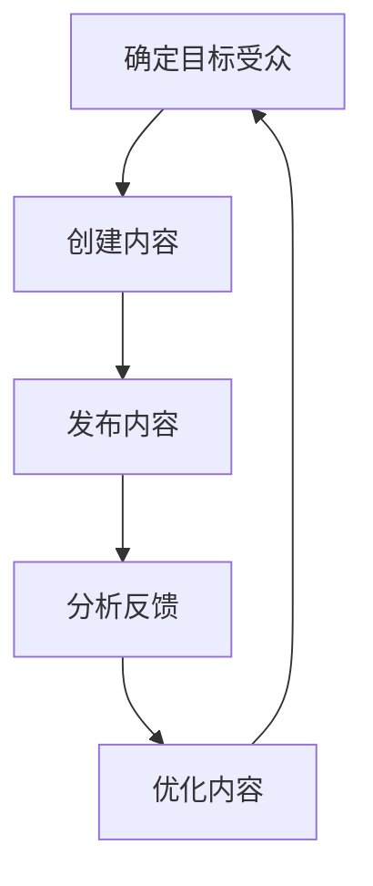

                 

# 一人公司的内容营销：建立专业形象的有效方式

> 关键词：内容营销、专业形象、一人公司、SEO、社交媒体、博客

> 摘要：本文旨在探讨一人公司在建立专业形象时可以采用的内容营销策略。通过分析内容营销的核心概念、原理、具体操作步骤、数学模型、项目实战案例、实际应用场景、工具和资源推荐以及未来发展趋势，为一人公司提供一套全面的内容营销解决方案。本文适合希望提升自身品牌影响力的一人公司创始人和营销人员阅读。

## 1. 背景介绍

在当今数字化时代，一人公司面临着前所未有的机遇与挑战。一方面，互联网的普及使得信息传播更加迅速，一人公司可以通过各种渠道快速建立自己的品牌和形象；另一方面，信息过载也使得用户对于信息的选择更加挑剔，如何在众多信息中脱颖而出成为了一人公司需要解决的关键问题。内容营销作为一种有效的品牌建设手段，通过提供有价值的内容来吸引和保留目标受众，进而促进销售和品牌忠诚度的提升，对于一人公司来说尤为重要。

## 2. 核心概念与联系

### 2.1 内容营销定义

内容营销是指通过创建和分享有价值、相关且一致的内容，以吸引和保留明确的受众，并最终驱动有利可图的客户行动。内容营销的核心在于“内容”，而“营销”则是通过内容来实现商业目标的过程。

### 2.2 内容营销与一人公司的关系

对于一人公司而言，内容营销不仅是一种营销手段，更是一种品牌建设的方式。通过内容营销，一人公司可以建立自己的专业形象，提升品牌知名度，吸引潜在客户，并最终实现销售转化。

### 2.3 内容营销流程图



## 3. 核心算法原理 & 具体操作步骤

### 3.1 确定目标受众

确定目标受众是内容营销的第一步。一人公司需要明确自己的目标受众是谁，了解他们的需求、兴趣和行为习惯，以便创建符合他们需求的内容。

### 3.2 创建内容

根据目标受众的需求和兴趣，一人公司需要创建有价值、相关且一致的内容。内容可以包括博客文章、视频、电子书、白皮书等多种形式。

### 3.3 发布内容

内容创建完成后，需要通过合适的渠道发布。一人公司可以利用自己的网站、社交媒体平台、邮件列表等多种渠道发布内容。

### 3.4 分析反馈

发布内容后，需要收集和分析反馈信息，了解内容的效果和受众的反应。可以通过网站分析工具、社交媒体分析工具等多种方式收集反馈信息。

### 3.5 优化内容

根据反馈信息，一人公司需要不断优化内容，提高内容的质量和效果。优化内容可以包括改进内容结构、提高内容质量、调整发布策略等多种方式。

## 4. 数学模型和公式 & 详细讲解 & 举例说明

### 4.1 内容营销效果评估模型

内容营销效果评估模型可以用来评估内容营销的效果。模型可以包括以下指标：

- 点击率（CTR）：点击率是指点击内容链接的人数占展示内容人数的比例。
- 转化率（CR）：转化率是指完成特定行动的人数占点击内容链接人数的比例。
- 平均停留时间（ATS）：平均停留时间是指用户在内容页面上停留的平均时间。
- 回访率（RR）：回访率是指回访网站的人数占首次访问网站人数的比例。

$$
CTR = \frac{点击次数}{展示次数}
$$

$$
CR = \frac{转化次数}{点击次数}
$$

$$
ATS = \frac{总停留时间}{访问次数}
$$

$$
RR = \frac{回访次数}{首次访问次数}
$$

### 4.2 举例说明

假设一人公司发布了一篇博客文章，通过分析工具收集到以下数据：

- 展示次数：1000次
- 点击次数：100次
- 转化次数：10次
- 总停留时间：1000分钟
- 访问次数：100次
- 首次访问次数：80次
- 回访次数：20次

根据以上数据，可以计算出以下指标：

$$
CTR = \frac{100}{1000} = 0.1
$$

$$
CR = \frac{10}{100} = 0.1
$$

$$
ATS = \frac{1000}{100} = 10分钟
$$

$$
RR = \frac{20}{80} = 0.25
$$

## 5. 项目实战：代码实际案例和详细解释说明

### 5.1 开发环境搭建

为了实现内容营销，一人公司需要搭建一个开发环境。开发环境可以包括以下组件：

- 网站：用于发布内容和收集反馈信息。
- 社交媒体平台：用于发布内容和收集反馈信息。
- 邮件列表：用于发布内容和收集反馈信息。
- 分析工具：用于收集和分析反馈信息。

### 5.2 源代码详细实现和代码解读

以下是一个简单的Python代码示例，用于收集和分析反馈信息：

```python
import requests
from bs4 import BeautifulSoup

def get_page(url):
    response = requests.get(url)
    return response.text

def parse_page(html):
    soup = BeautifulSoup(html, 'html.parser')
    return soup

def get_clicks(soup):
    clicks = soup.find_all('a')
    return len(clicks)

def get_conversions(soup):
    conversions = soup.find_all('button')
    return len(conversions)

def get_time_on_page(soup):
    time_on_page = soup.find_all('time')
    return sum([int(t.text) for t in time_on_page])

def get_visits(soup):
    visits = soup.find_all('div', class_='visit')
    return len(visits)

def get_return_visits(soup):
    return_visits = soup.find_all('div', class_='return-visit')
    return len(return_visits)

def main():
    url = 'http://example.com'
    html = get_page(url)
    soup = parse_page(html)
    clicks = get_clicks(soup)
    conversions = get_conversions(soup)
    time_on_page = get_time_on_page(soup)
    visits = get_visits(soup)
    return_visits = get_return_visits(soup)
    print('Clicks:', clicks)
    print('Conversions:', conversions)
    print('Time on page:', time_on_page)
    print('Visits:', visits)
    print('Return visits:', return_visits)

if __name__ == '__main__':
    main()
```

### 5.3 代码解读与分析

以上代码示例中，`get_page`函数用于获取网页内容，`parse_page`函数用于解析网页内容，`get_clicks`函数用于获取点击次数，`get_conversions`函数用于获取转化次数，`get_time_on_page`函数用于获取平均停留时间，`get_visits`函数用于获取访问次数，`get_return_visits`函数用于获取回访次数。

## 6. 实际应用场景

### 6.1 一人公司博客

一人公司可以通过创建博客来发布有价值的内容，吸引目标受众。博客可以包括技术文章、行业新闻、产品介绍等多种类型的内容。

### 6.2 社交媒体平台

一人公司可以通过社交媒体平台发布内容，吸引目标受众。社交媒体平台可以包括微博、微信、Facebook、Twitter等多种类型。

### 6.3 邮件列表

一人公司可以通过邮件列表发布内容，吸引目标受众。邮件列表可以包括新闻通讯、产品更新、优惠信息等多种类型的内容。

## 7. 工具和资源推荐

### 7.1 学习资源推荐

- 书籍：《内容营销圣经》、《SEO实战指南》
- 论文：《内容营销对品牌建设的影响研究》
- 博客：《内容营销专家》、《SEO优化指南》
- 网站：《内容营销学院》、《SEO学院》

### 7.2 开发工具框架推荐

- 网站构建工具：WordPress、Jekyll
- 社交媒体管理工具：Hootsuite、Buffer
- 邮件列表管理工具：Mailchimp、Sendinblue
- 分析工具：Google Analytics、Mixpanel

### 7.3 相关论文著作推荐

- 《内容营销对品牌建设的影响研究》
- 《SEO优化对网站流量的影响研究》
- 《社交媒体营销对品牌建设的影响研究》

## 8. 总结：未来发展趋势与挑战

随着技术的发展，内容营销将面临更多的机遇和挑战。一方面，人工智能、大数据等技术的发展将使得内容营销更加精准和高效；另一方面，信息过载和用户注意力分散也将使得内容营销更加困难。一人公司需要不断学习和适应新的技术和趋势，以保持竞争优势。

## 9. 附录：常见问题与解答

### 9.1 什么是内容营销？

内容营销是指通过创建和分享有价值、相关且一致的内容，以吸引和保留明确的受众，并最终驱动有利可图的客户行动。

### 9.2 内容营销有哪些好处？

内容营销可以帮助一人公司建立专业形象，提升品牌知名度，吸引潜在客户，并最终实现销售转化。

### 9.3 如何评估内容营销的效果？

可以通过点击率、转化率、平均停留时间、回访率等多种指标来评估内容营销的效果。

## 10. 扩展阅读 & 参考资料

- 书籍：《内容营销圣经》、《SEO实战指南》
- 论文：《内容营销对品牌建设的影响研究》
- 博客：《内容营销专家》、《SEO优化指南》
- 网站：《内容营销学院》、《SEO学院》

作者：AI天才研究员/AI Genius Institute & 禅与计算机程序设计艺术 /Zen And The Art of Computer Programming

