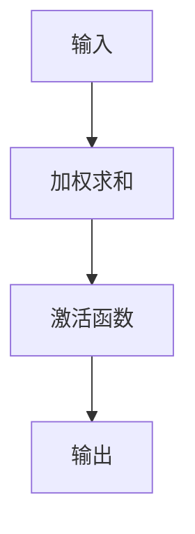

                 

# 一切皆是映射：神经网络中的激活函数深度解析

> **关键词**：神经网络、激活函数、深度学习、ReLU、Sigmoid、Tanh、Softmax、数学模型、机器学习
>
> **摘要**：本文深入探讨了神经网络中的激活函数，从其基本概念出发，逐步解析了不同类型的激活函数及其背后的数学原理。通过详细的数学模型和公式讲解，结合实际代码案例，帮助读者理解激活函数在神经网络中的作用和重要性。文章还介绍了激活函数在实际应用场景中的应用，并推荐了相关的学习资源和开发工具，旨在为读者提供一个全面而深入的学习路径。

## 1. 背景介绍

神经网络是深度学习的核心组成部分，它模仿人脑的神经元结构，通过多层神经元的连接来处理和学习数据。激活函数是神经网络中的关键组件之一，它决定了神经元的输出。激活函数的引入使得神经网络能够学习非线性关系，从而极大地提高了模型的表达能力和学习能力。本文将从激活函数的基本概念出发，逐步解析其背后的数学原理和实际应用。

## 2. 核心概念与联系

### 2.1 激活函数的定义

激活函数是神经网络中用于引入非线性特性的函数。它决定了神经元的输出，即神经元是否被激活。激活函数的引入使得神经网络能够学习和处理复杂的非线性关系，从而提高了模型的表达能力和学习能力。

### 2.2 激活函数的作用

激活函数的主要作用是引入非线性，使得神经网络能够学习和处理复杂的非线性关系。此外，激活函数还能够帮助神经网络避免梯度消失或梯度爆炸的问题，从而提高模型的训练效率和稳定性。

### 2.3 激活函数的类型

常见的激活函数包括Sigmoid、Tanh、ReLU、Leaky ReLU、ELU、Softmax等。每种激活函数都有其独特的数学特性和应用场景。

### 2.4 激活函数的数学模型

激活函数的数学模型是其背后的数学原理的体现。通过数学模型，我们可以更深入地理解激活函数的工作机制和特性。

### 2.5 激活函数的Mermaid流程图



## 3. 核心算法原理 & 具体操作步骤

### 3.1 Sigmoid激活函数

Sigmoid激活函数是一种常用的激活函数，其数学表达式为：

$$
f(x) = \frac{1}{1 + e^{-x}}
$$

Sigmoid函数将输入值映射到(0, 1)区间，常用于二分类问题的输出层。

### 3.2 Tanh激活函数

Tanh激活函数也是一种常用的激活函数，其数学表达式为：

$$
f(x) = \frac{e^x - e^{-x}}{e^x + e^{-x}}
$$

Tanh函数将输入值映射到(-1, 1)区间，常用于隐藏层。

### 3.3 ReLU激活函数

ReLU激活函数是一种简单而有效的激活函数，其数学表达式为：

$$
f(x) = max(0, x)
$$

ReLU函数将输入值映射到[0, +∞)区间，常用于隐藏层。

### 3.4 Leaky ReLU激活函数

Leaky ReLU激活函数是对ReLU函数的一种改进，其数学表达式为：

$$
f(x) = max(0.01x, x)
$$

Leaky ReLU函数解决了ReLU函数中的“死亡神经元”问题。

### 3.5 ELU激活函数

ELU激活函数是一种自适应的激活函数，其数学表达式为：

$$
f(x) = \begin{cases} 
x & \text{if } x > 0 \\
\alpha(e^x - 1) & \text{if } x \leq 0 
\end{cases}
$$

ELU函数能够自适应地调整负值部分的输出，从而提高模型的训练效率。

### 3.6 Softmax激活函数

Softmax激活函数是一种常用的多分类问题的输出层激活函数，其数学表达式为：

$$
f(x_i) = \frac{e^{x_i}}{\sum_{j=1}^{n} e^{x_j}}
$$

Softmax函数将输入值映射到(0, 1)区间，并且所有输出值之和为1。

## 4. 数学模型和公式 & 详细讲解 & 举例说明

### 4.1 Sigmoid函数的数学模型

Sigmoid函数的数学模型为：

$$
f(x) = \frac{1}{1 + e^{-x}}
$$

Sigmoid函数的导数为：

$$
f'(x) = f(x)(1 - f(x))
$$

### 4.2 Tanh函数的数学模型

Tanh函数的数学模型为：

$$
f(x) = \frac{e^x - e^{-x}}{e^x + e^{-x}}
$$

Tanh函数的导数为：

$$
f'(x) = 1 - f(x)^2
$$

### 4.3 ReLU函数的数学模型

ReLU函数的数学模型为：

$$
f(x) = max(0, x)
$$

ReLU函数的导数为：

$$
f'(x) = \begin{cases} 
1 & \text{if } x > 0 \\
0 & \text{if } x \leq 0 
\end{cases}
$$

### 4.4 Leaky ReLU函数的数学模型

Leaky ReLU函数的数学模型为：

$$
f(x) = max(0.01x, x)
$$

Leaky ReLU函数的导数为：

$$
f'(x) = \begin{cases} 
1 & \text{if } x > 0 \\
0.01 & \text{if } x \leq 0 
\end{cases}
$$

### 4.5 ELU函数的数学模型

ELU函数的数学模型为：

$$
f(x) = \begin{cases} 
x & \text{if } x > 0 \\
\alpha(e^x - 1) & \text{if } x \leq 0 
\end{cases}
$$

ELU函数的导数为：

$$
f'(x) = \begin{cases} 
1 & \text{if } x > 0 \\
\alpha e^x & \text{if } x \leq 0 
\end{cases}
$$

### 4.6 Softmax函数的数学模型

Softmax函数的数学模型为：

$$
f(x_i) = \frac{e^{x_i}}{\sum_{j=1}^{n} e^{x_j}}
$$

Softmax函数的导数为：

$$
f'(x_i) = f(x_i)(1 - f(x_i)) - f(x_i)f(x_j)
$$

## 5. 项目实战：代码实际案例和详细解释说明

### 5.1 开发环境搭建

为了实现激活函数的代码案例，我们需要搭建一个基本的开发环境。这里我们使用Python和TensorFlow框架。

#### 5.1.1 安装TensorFlow

```bash
pip install tensorflow
```

#### 5.1.2 导入必要的库

```python
import tensorflow as tf
import numpy as np
```

### 5.2 源代码详细实现和代码解读

#### 5.2.1 Sigmoid激活函数

```python
def sigmoid(x):
    return 1 / (1 + np.exp(-x))
```

#### 5.2.2 Tanh激活函数

```python
def tanh(x):
    return np.tanh(x)
```

#### 5.2.3 ReLU激活函数

```python
def relu(x):
    return np.maximum(0, x)
```

#### 5.2.4 Leaky ReLU激活函数

```python
def leaky_relu(x, alpha=0.01):
    return np.maximum(alpha * x, x)
```

#### 5.2.5 ELU激活函数

```python
def elu(x, alpha=1.0):
    return np.where(x > 0, x, alpha * (np.exp(x) - 1))
```

#### 5.2.6 Softmax激活函数

```python
def softmax(x):
    exp_x = np.exp(x - np.max(x))
    return exp_x / exp_x.sum(axis=0)
```

### 5.3 代码解读与分析

通过上述代码，我们可以实现不同类型的激活函数。这些函数的实现基于NumPy库，可以方便地应用于深度学习模型中。

## 6. 实际应用场景

激活函数在实际应用场景中有着广泛的应用，包括但不限于图像识别、自然语言处理、语音识别等领域。通过选择合适的激活函数，可以提高模型的性能和准确性。

## 7. 工具和资源推荐

### 7.1 学习资源推荐

- 书籍：《深度学习》（Ian Goodfellow等著）
- 论文：《Understanding the difficulty of training deep feedforward neural networks》（Xavier Glorot, Yoshua Bengio）
- 博客：Medium上的深度学习系列文章
- 网站：Kaggle、GitHub上的深度学习项目

### 7.2 开发工具框架推荐

- TensorFlow
- PyTorch
- Keras

### 7.3 相关论文著作推荐

- 《Deep Learning》（Ian Goodfellow等著）
- 《Neural Networks and Deep Learning》（Michael Nielsen著）

## 8. 总结：未来发展趋势与挑战

随着深度学习技术的不断发展，激活函数的研究也在不断深入。未来，激活函数的研究将更加注重其在实际应用中的表现和优化，以提高模型的性能和效率。

## 9. 附录：常见问题与解答

### 9.1 什么是激活函数？

激活函数是神经网络中的关键组件之一，用于引入非线性特性，决定了神经元的输出。

### 9.2 为什么需要激活函数？

激活函数的引入使得神经网络能够学习和处理复杂的非线性关系，从而提高了模型的表达能力和学习能力。

### 9.3 常见的激活函数有哪些？

常见的激活函数包括Sigmoid、Tanh、ReLU、Leaky ReLU、ELU、Softmax等。

## 10. 扩展阅读 & 参考资料

- 《深度学习》（Ian Goodfellow等著）
- 《Neural Networks and Deep Learning》（Michael Nielsen著）
- Medium上的深度学习系列文章
- Kaggle、GitHub上的深度学习项目

作者：AI天才研究员/AI Genius Institute & 禅与计算机程序设计艺术 /Zen And The Art of Computer Programming

