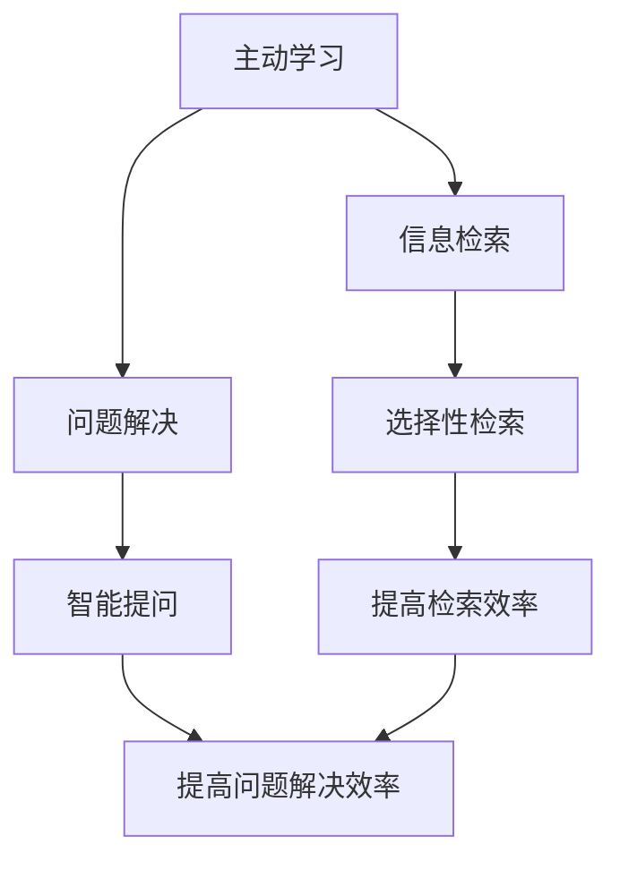

                 

# 主动学习：让软件2.0更高效地问问题

> 关键词：主动学习, 软件2.0, 机器学习, 自适应算法, 信息检索, 问题解决

> 摘要：本文旨在探讨如何通过主动学习技术提升软件2.0的智能化水平，使其能够更高效地提出问题和解决问题。我们将从主动学习的基本概念出发，深入解析其核心算法原理，通过数学模型和公式进行详细讲解，并结合实际代码案例进行深入分析。此外，本文还将探讨主动学习在实际应用场景中的应用，并推荐相关学习资源和开发工具，为读者提供全面的技术指导。

## 1. 背景介绍

随着人工智能技术的飞速发展，软件2.0时代已经到来。软件2.0不仅能够执行预设的任务，还能通过学习和适应来提升性能。主动学习作为一种重要的机器学习技术，能够使软件在面对未知问题时更加智能地提出问题和解决问题。本文将详细介绍主动学习的基本概念、核心算法原理、数学模型、实际案例，并探讨其在实际应用中的价值。

## 2. 核心概念与联系

### 2.1 主动学习的基本概念

主动学习是一种机器学习方法，它允许学习算法主动选择最有价值的数据点进行标注，从而提高学习效率。与被动学习不同，主动学习通过选择性地获取数据，减少了标注成本，提高了学习效果。

### 2.2 主动学习与信息检索的关系

主动学习与信息检索密切相关。在信息检索中，主动学习可以帮助系统更有效地选择和检索相关信息。通过主动学习，系统可以更好地理解用户需求，从而提供更准确的搜索结果。

### 2.3 主动学习与问题解决的关系

主动学习在问题解决中扮演着重要角色。通过主动学习，软件可以更智能地提出问题和解决问题，从而提高整体性能。主动学习可以帮助软件更好地理解问题的复杂性，从而提供更有效的解决方案。

### 2.4 Mermaid 流程图



## 3. 核心算法原理 & 具体操作步骤

### 3.1 主动学习的基本流程

主动学习的基本流程包括初始化、选择样本、标注样本、训练模型和评估模型等步骤。具体操作步骤如下：

1. **初始化**：选择初始数据集和学习算法。
2. **选择样本**：根据某种策略选择最有价值的数据点进行标注。
3. **标注样本**：人工或自动标注选择的数据点。
4. **训练模型**：使用标注后的数据训练模型。
5. **评估模型**：评估模型的性能，判断是否需要继续选择样本。

### 3.2 主动学习策略

主动学习策略主要包括随机选择、不确定性采样、多样性采样和基于模型的采样等。具体策略如下：

- **随机选择**：随机选择数据点进行标注。
- **不确定性采样**：选择不确定性最高的数据点进行标注。
- **多样性采样**：选择具有代表性的数据点进行标注。
- **基于模型的采样**：根据模型预测结果选择最有价值的数据点进行标注。

### 3.3 具体操作步骤

1. **初始化**：选择初始数据集和学习算法。
2. **选择样本**：根据不确定性采样策略选择数据点进行标注。
3. **标注样本**：人工或自动标注选择的数据点。
4. **训练模型**：使用标注后的数据训练模型。
5. **评估模型**：评估模型的性能，判断是否需要继续选择样本。

## 4. 数学模型和公式 & 详细讲解 & 举例说明

### 4.1 不确定性采样策略

不确定性采样策略的核心思想是选择不确定性最高的数据点进行标注。具体公式如下：

$$
\text{Uncertainty}(x) = -\sum_{y \in \mathcal{Y}} P(y|x) \log P(y|x)
$$

其中，$P(y|x)$ 表示在给定数据点 $x$ 的条件下，模型预测标签 $y$ 的概率。

### 4.2 多样性采样策略

多样性采样策略的核心思想是选择具有代表性的数据点进行标注。具体公式如下：

$$
\text{Diversity}(x) = \sum_{i=1}^{n} \left| \frac{1}{n} \sum_{j=1}^{n} \text{Similarity}(x_i, x_j) \right|
$$

其中，$\text{Similarity}(x_i, x_j)$ 表示数据点 $x_i$ 和 $x_j$ 之间的相似度。

### 4.3 基于模型的采样策略

基于模型的采样策略的核心思想是根据模型预测结果选择最有价值的数据点进行标注。具体公式如下：

$$
\text{Model-based}(x) = \sum_{i=1}^{n} \left| \frac{1}{n} \sum_{j=1}^{n} \text{Confidence}(x_i, x_j) \right|
$$

其中，$\text{Confidence}(x_i, x_j)$ 表示数据点 $x_i$ 和 $x_j$ 之间的置信度。

### 4.4 举例说明

假设我们有一个二分类问题，数据集包含1000个样本。我们使用不确定性采样策略选择数据点进行标注。具体步骤如下：

1. **初始化**：选择初始数据集和学习算法。
2. **选择样本**：计算每个数据点的不确定性，选择不确定性最高的10个数据点进行标注。
3. **标注样本**：人工或自动标注选择的数据点。
4. **训练模型**：使用标注后的数据训练模型。
5. **评估模型**：评估模型的性能，判断是否需要继续选择样本。

## 5. 项目实战：代码实际案例和详细解释说明

### 5.1 开发环境搭建

为了实现主动学习，我们需要搭建一个开发环境。具体步骤如下：

1. **安装Python**：确保安装了Python 3.7及以上版本。
2. **安装依赖库**：安装必要的Python库，如NumPy、Pandas、Scikit-learn等。
3. **安装主动学习库**：安装主动学习库，如ActiveLearning。

### 5.2 源代码详细实现和代码解读

```python
import numpy as np
from sklearn.datasets import load_iris
from sklearn.model_selection import train_test_split
from sklearn.ensemble import RandomForestClassifier
from active_learning import UncertaintySampling

# 加载数据集
data = load_iris()
X, y = data.data, data.target

# 划分训练集和测试集
X_train, X_test, y_train, y_test = train_test_split(X, y, test_size=0.2, random_state=42)

# 初始化随机森林分类器
clf = RandomForestClassifier(n_estimators=100)

# 初始化主动学习策略
strategy = UncertaintySampling(clf, X_train, y_train)

# 选择样本进行标注
selected_indices = strategy.query(X_train, n=10)

# 标注样本
y_train[selected_indices] = np.random.choice([0, 1], size=len(selected_indices))

# 训练模型
clf.fit(X_train, y_train)

# 评估模型
accuracy = clf.score(X_test, y_test)
print(f"Accuracy: {accuracy}")
```

### 5.3 代码解读与分析

1. **加载数据集**：使用Scikit-learn的`load_iris`函数加载鸢尾花数据集。
2. **划分训练集和测试集**：使用`train_test_split`函数将数据集划分为训练集和测试集。
3. **初始化随机森林分类器**：使用`RandomForestClassifier`初始化分类器。
4. **初始化主动学习策略**：使用`UncertaintySampling`初始化主动学习策略。
5. **选择样本进行标注**：使用`query`方法选择10个样本进行标注。
6. **标注样本**：随机标注选择的数据点。
7. **训练模型**：使用标注后的数据训练模型。
8. **评估模型**：使用测试集评估模型的性能。

## 6. 实际应用场景

### 6.1 信息检索

主动学习在信息检索中的应用非常广泛。通过主动学习，系统可以更有效地选择和检索相关信息，从而提高检索效率和准确性。

### 6.2 问题解决

主动学习在问题解决中的应用也非常广泛。通过主动学习，软件可以更智能地提出问题和解决问题，从而提高整体性能。

### 6.3 自然语言处理

主动学习在自然语言处理中的应用也非常广泛。通过主动学习，系统可以更有效地学习和理解自然语言，从而提高自然语言处理的性能。

## 7. 工具和资源推荐

### 7.1 学习资源推荐

- **书籍**：《机器学习》（周志华著）
- **论文**：《Active Learning Literature Survey》（Raymond J. Mooney）
- **博客**：《Active Learning in Machine Learning》（Towards Data Science）
- **网站**：Scikit-learn官网

### 7.2 开发工具框架推荐

- **Python库**：Scikit-learn、ActiveLearning
- **IDE**：PyCharm、Jupyter Notebook

### 7.3 相关论文著作推荐

- **论文**：《Active Learning for Natural Language Processing》（Raymond J. Mooney）
- **著作**：《机器学习》（周志华著）

## 8. 总结：未来发展趋势与挑战

### 8.1 未来发展趋势

主动学习在未来的发展趋势主要体现在以下几个方面：

- **更高效的算法**：开发更高效的主动学习算法，提高学习效率。
- **更广泛的应用**：将主动学习应用于更多领域，提高应用范围。
- **更智能的系统**：开发更智能的主动学习系统，提高系统性能。

### 8.2 挑战

主动学习在未来的发展中面临以下挑战：

- **标注成本**：主动学习需要标注数据，如何降低标注成本是一个重要问题。
- **数据质量**：如何保证标注数据的质量是一个重要问题。
- **算法优化**：如何优化主动学习算法，提高学习效果是一个重要问题。

## 9. 附录：常见问题与解答

### 9.1 问题1：如何选择合适的主动学习策略？

**解答**：选择合适的主动学习策略需要根据具体问题和数据集的特点进行选择。不确定性采样策略适用于数据分布不均匀的情况，多样性采样策略适用于数据分布均匀的情况，基于模型的采样策略适用于模型预测结果不准确的情况。

### 9.2 问题2：如何评估主动学习的效果？

**解答**：评估主动学习的效果可以通过比较主动学习和被动学习的性能来实现。具体方法包括计算准确率、召回率、F1值等指标。

## 10. 扩展阅读 & 参考资料

- **书籍**：《机器学习》（周志华著）
- **论文**：《Active Learning Literature Survey》（Raymond J. Mooney）
- **博客**：《Active Learning in Machine Learning》（Towards Data Science）
- **网站**：Scikit-learn官网

---

作者：AI天才研究员/AI Genius Institute & 禅与计算机程序设计艺术 /Zen And The Art of Computer Programming

