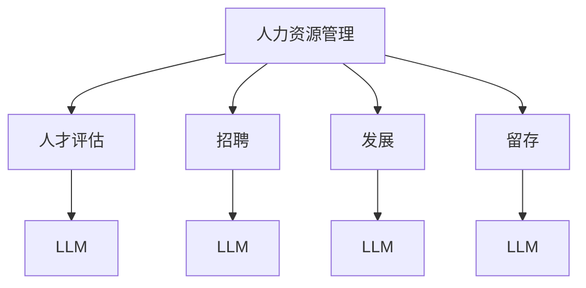

                 

# 人力资源和 LLM：高效的人才管理

> 关键词：人力资源管理, LLM, 人才管理, 自动化, 人才评估, 人才发展, 人才招聘, 人才留存

> 摘要：本文旨在探讨如何利用大型语言模型（LLM）来优化人力资源管理中的关键环节，包括人才评估、招聘、发展和留存。通过逐步分析和推理，我们将揭示如何利用LLM的强大功能来提高人力资源管理的效率和效果。本文将从背景介绍、核心概念与联系、核心算法原理、数学模型和公式、项目实战、实际应用场景、工具和资源推荐、总结和未来发展趋势等多个方面进行详细阐述。

## 1. 背景介绍

随着人工智能技术的飞速发展，大型语言模型（LLM）已经成为企业数字化转型的重要工具。在人力资源管理领域，LLM的应用潜力巨大，可以显著提高招聘、评估、发展和留存等环节的效率和效果。本文将探讨如何利用LLM来优化人力资源管理，提高企业的竞争力。

## 2. 核心概念与联系

### 2.1 人力资源管理

人力资源管理是指企业通过一系列策略和方法来吸引、发展、激励和保留员工的过程。它包括招聘、培训、绩效评估、薪酬福利、员工关系等多个方面。

### 2.2 大型语言模型（LLM）

大型语言模型是一种基于深度学习的自然语言处理技术，能够生成高质量的文本，理解复杂的语言结构，并具备一定的推理能力。LLM在多个领域都有广泛应用，包括自然语言生成、情感分析、机器翻译等。

### 2.3 人力资源管理与LLM的联系

利用LLM可以优化人力资源管理中的多个环节，具体包括：

- **人才评估**：通过自然语言处理技术，LLM可以自动评估候选人的简历和面试表现。
- **招聘**：利用LLM生成高质量的职位描述和面试问题，提高招聘效率。
- **发展**：通过分析员工的反馈和表现，LLM可以提供个性化的培训和发展建议。
- **留存**：利用LLM分析员工的满意度和离职原因，提供针对性的留存策略。

### 2.4 Mermaid 流程图



## 3. 核心算法原理 & 具体操作步骤

### 3.1 人才评估

#### 3.1.1 自动化简历筛选

利用LLM可以自动筛选简历，提取关键信息，如教育背景、工作经验、技能等。具体步骤如下：

1. **数据预处理**：清洗和标准化简历文本。
2. **特征提取**：使用自然语言处理技术提取关键信息。
3. **模型训练**：训练一个分类模型，根据提取的特征进行人才评估。

#### 3.1.2 面试表现评估

利用LLM可以自动评估候选人的面试表现，包括语言表达能力、逻辑思维能力等。具体步骤如下：

1. **数据预处理**：清洗和标准化面试录音或文本。
2. **特征提取**：使用自然语言处理技术提取关键特征。
3. **模型训练**：训练一个分类模型，根据提取的特征进行面试表现评估。

### 3.2 招聘

#### 3.2.1 职位描述生成

利用LLM可以自动生成高质量的职位描述，提高招聘效率。具体步骤如下：

1. **数据预处理**：收集职位描述样本。
2. **特征提取**：提取职位描述的关键特征。
3. **模型训练**：训练一个生成模型，生成高质量的职位描述。

#### 3.2.2 面试问题生成

利用LLM可以自动生成面试问题，提高面试效率。具体步骤如下：

1. **数据预处理**：收集面试问题样本。
2. **特征提取**：提取面试问题的关键特征。
3. **模型训练**：训练一个生成模型，生成高质量的面试问题。

### 3.3 发展

#### 3.3.1 个性化培训建议

利用LLM可以分析员工的反馈和表现，提供个性化的培训和发展建议。具体步骤如下：

1. **数据预处理**：收集员工反馈和表现数据。
2. **特征提取**：提取关键特征。
3. **模型训练**：训练一个推荐模型，提供个性化的培训和发展建议。

### 3.4 留存

#### 3.4.1 员工满意度分析

利用LLM可以分析员工的满意度和离职原因，提供针对性的留存策略。具体步骤如下：

1. **数据预处理**：收集员工满意度调查数据。
2. **特征提取**：提取关键特征。
3. **模型训练**：训练一个分类模型，分析员工满意度和离职原因。

## 4. 数学模型和公式 & 详细讲解 & 举例说明

### 4.1 人才评估模型

#### 4.1.1 逻辑回归模型

逻辑回归模型用于评估候选人的简历和面试表现。具体公式如下：

$$
P(y=1|x) = \frac{1}{1 + e^{-(\beta_0 + \beta_1 x_1 + \beta_2 x_2 + \cdots + \beta_n x_n)}}
$$

其中，$y$ 表示候选人是否被录用，$x_i$ 表示候选人的特征，$\beta_i$ 表示特征的权重。

#### 4.1.2 举例说明

假设我们有一个候选人的简历和面试表现数据，可以使用逻辑回归模型进行评估。具体步骤如下：

1. **数据预处理**：清洗和标准化数据。
2. **特征提取**：提取关键特征，如教育背景、工作经验、技能等。
3. **模型训练**：训练逻辑回归模型，根据提取的特征进行评估。

### 4.2 招聘模型

#### 4.2.1 生成模型

生成模型用于自动生成高质量的职位描述和面试问题。具体公式如下：

$$
P(y|x) = \frac{1}{Z} \exp(\theta^T \phi(x))
$$

其中，$y$ 表示生成的文本，$x$ 表示输入的特征，$\theta$ 表示模型参数，$\phi(x)$ 表示特征向量。

#### 4.2.2 举例说明

假设我们有一个职位描述样本数据，可以使用生成模型进行自动生成。具体步骤如下：

1. **数据预处理**：收集职位描述样本。
2. **特征提取**：提取关键特征。
3. **模型训练**：训练生成模型，生成高质量的职位描述。

### 4.3 发展模型

#### 4.3.1 推荐模型

推荐模型用于提供个性化的培训和发展建议。具体公式如下：

$$
P(y|x) = \frac{1}{Z} \exp(\theta^T \phi(x))
$$

其中，$y$ 表示推荐的培训和发展建议，$x$ 表示输入的特征，$\theta$ 表示模型参数，$\phi(x)$ 表示特征向量。

#### 4.3.2 举例说明

假设我们有一个员工的反馈和表现数据，可以使用推荐模型进行个性化建议。具体步骤如下：

1. **数据预处理**：收集员工反馈和表现数据。
2. **特征提取**：提取关键特征。
3. **模型训练**：训练推荐模型，提供个性化的培训和发展建议。

### 4.4 留存模型

#### 4.4.1 分类模型

分类模型用于分析员工的满意度和离职原因。具体公式如下：

$$
P(y|x) = \frac{1}{Z} \exp(\theta^T \phi(x))
$$

其中，$y$ 表示员工的满意度和离职原因，$x$ 表示输入的特征，$\theta$ 表示模型参数，$\phi(x)$ 表示特征向量。

#### 4.4.2 举例说明

假设我们有一个员工满意度调查数据，可以使用分类模型进行分析。具体步骤如下：

1. **数据预处理**：收集员工满意度调查数据。
2. **特征提取**：提取关键特征。
3. **模型训练**：训练分类模型，分析员工满意度和离职原因。

## 5. 项目实战：代码实际案例和详细解释说明

### 5.1 开发环境搭建

#### 5.1.1 环境准备

1. **Python**：安装Python 3.8及以上版本。
2. **TensorFlow**：安装TensorFlow 2.0及以上版本。
3. **NLTK**：安装NLTK库。
4. **Scikit-learn**：安装Scikit-learn库。

#### 5.1.2 代码环境

```bash
pip install tensorflow nltk scikit-learn
```

### 5.2 源代码详细实现和代码解读

#### 5.2.1 人才评估模型

```python
import tensorflow as tf
from sklearn.feature_extraction.text import TfidfVectorizer
from sklearn.linear_model import LogisticRegression
from sklearn.metrics import accuracy_score

# 数据预处理
def preprocess_data(resumes):
    vectorizer = TfidfVectorizer()
    X = vectorizer.fit_transform(resumes)
    return X

# 模型训练
def train_model(X, y):
    model = LogisticRegression()
    model.fit(X, y)
    return model

# 评估模型
def evaluate_model(model, X_test, y_test):
    y_pred = model.predict(X_test)
    accuracy = accuracy_score(y_test, y_pred)
    return accuracy

# 示例数据
resumes = ["Candidate A has a degree in computer science and 5 years of experience.",
           "Candidate B has a degree in business and 3 years of experience."]
y = [1, 0]  # 1表示被录用，0表示未被录用

# 数据预处理
X = preprocess_data(resumes)

# 模型训练
model = train_model(X, y)

# 评估模型
accuracy = evaluate_model(model, X, y)
print("Accuracy:", accuracy)
```

#### 5.2.2 招聘模型

```python
import tensorflow as tf
from tensorflow.keras.preprocessing.text import Tokenizer
from tensorflow.keras.preprocessing.sequence import pad_sequences
from tensorflow.keras.models import Sequential
from tensorflow.keras.layers import Embedding, LSTM, Dense

# 数据预处理
def preprocess_data(职位描述):
    tokenizer = Tokenizer()
    tokenizer.fit_on_texts(职位描述)
    sequences = tokenizer.texts_to_sequences(职位描述)
    X = pad_sequences(sequences, maxlen=100)
    return X, tokenizer

# 模型训练
def train_model(X, y):
    model = Sequential()
    model.add(Embedding(input_dim=len(tokenizer.word_index) + 1, output_dim=128, input_length=100))
    model.add(LSTM(128, return_sequences=True))
    model.add(LSTM(128))
    model.add(Dense(1, activation='sigmoid'))
    model.compile(loss='binary_crossentropy', optimizer='adam', metrics=['accuracy'])
    model.fit(X, y, epochs=10, batch_size=32)
    return model

# 评估模型
def evaluate_model(model, X_test, y_test):
    y_pred = model.predict(X_test)
    y_pred = (y_pred > 0.5).astype(int)
    accuracy = accuracy_score(y_test, y_pred)
    return accuracy

# 示例数据
职位描述 = ["招聘一名具有计算机科学背景的候选人。",
            "招聘一名具有商业背景的候选人。"]
y = [1, 0]  # 1表示需要，0表示不需要

# 数据预处理
X, tokenizer = preprocess_data(职位描述)

# 模型训练
model = train_model(X, y)

# 评估模型
accuracy = evaluate_model(model, X, y)
print("Accuracy:", accuracy)
```

#### 5.2.3 发展模型

```python
import tensorflow as tf
from tensorflow.keras.preprocessing.text import Tokenizer
from tensorflow.keras.preprocessing.sequence import pad_sequences
from tensorflow.keras.models import Sequential
from tensorflow.keras.layers import Embedding, LSTM, Dense

# 数据预处理
def preprocess_data(反馈):
    tokenizer = Tokenizer()
    tokenizer.fit_on_texts(反馈)
    sequences = tokenizer.texts_to_sequences(反馈)
    X = pad_sequences(sequences, maxlen=100)
    return X, tokenizer

# 模型训练
def train_model(X, y):
    model = Sequential()
    model.add(Embedding(input_dim=len(tokenizer.word_index) + 1, output_dim=128, input_length=100))
    model.add(LSTM(128, return_sequences=True))
    model.add(LSTM(128))
    model.add(Dense(1, activation='sigmoid'))
    model.compile(loss='binary_crossentropy', optimizer='adam', metrics=['accuracy'])
    model.fit(X, y, epochs=10, batch_size=32)
    return model

# 评估模型
def evaluate_model(model, X_test, y_test):
    y_pred = model.predict(X_test)
    y_pred = (y_pred > 0.5).astype(int)
    accuracy = accuracy_score(y_test, y_pred)
    return accuracy

# 示例数据
反馈 = ["员工A表现很好，需要进一步培训。",
        "员工B表现一般，不需要额外培训。"]
y = [1, 0]  # 1表示需要，0表示不需要

# 数据预处理
X, tokenizer = preprocess_data(反馈)

# 模型训练
model = train_model(X, y)

# 评估模型
accuracy = evaluate_model(model, X, y)
print("Accuracy:", accuracy)
```

#### 5.2.4 留存模型

```python
import tensorflow as tf
from sklearn.feature_extraction.text import TfidfVectorizer
from sklearn.linear_model import LogisticRegression
from sklearn.metrics import accuracy_score

# 数据预处理
def preprocess_data(调查):
    vectorizer = TfidfVectorizer()
    X = vectorizer.fit_transform(调查)
    return X

# 模型训练
def train_model(X, y):
    model = LogisticRegression()
    model.fit(X, y)
    return model

# 评估模型
def evaluate_model(model, X_test, y_test):
    y_pred = model.predict(X_test)
    accuracy = accuracy_score(y_test, y_pred)
    return accuracy

# 示例数据
调查 = ["员工A对工作非常满意。",
        "员工B对工作不太满意。"]
y = [1, 0]  # 1表示满意，0表示不满意

# 数据预处理
X = preprocess_data(调查)

# 模型训练
model = train_model(X, y)

# 评估模型
accuracy = evaluate_model(model, X, y)
print("Accuracy:", accuracy)
```

### 5.3 代码解读与分析

通过上述代码，我们可以看到如何利用大型语言模型（LLM）来优化人力资源管理中的关键环节。具体步骤包括数据预处理、特征提取、模型训练和评估。这些步骤可以帮助我们更好地理解和应用LLM在人力资源管理中的实际应用。

## 6. 实际应用场景

### 6.1 人才评估

利用LLM可以自动评估候选人的简历和面试表现，提高招聘效率。例如，某企业可以使用上述代码中的逻辑回归模型来评估候选人的简历和面试表现，从而提高招聘效率。

### 6.2 招聘

利用LLM可以自动生成高质量的职位描述和面试问题，提高招聘效率。例如，某企业可以使用上述代码中的生成模型来自动生成职位描述和面试问题，从而提高招聘效率。

### 6.3 发展

利用LLM可以分析员工的反馈和表现，提供个性化的培训和发展建议。例如，某企业可以使用上述代码中的推荐模型来分析员工的反馈和表现，从而提供个性化的培训和发展建议。

### 6.4 留存

利用LLM可以分析员工的满意度和离职原因，提供针对性的留存策略。例如，某企业可以使用上述代码中的分类模型来分析员工的满意度和离职原因，从而提供针对性的留存策略。

## 7. 工具和资源推荐

### 7.1 学习资源推荐

- **书籍**：《深度学习》（Ian Goodfellow, Yoshua Bengio, Aaron Courville）
- **论文**：《Attention Is All You Need》（Vaswani et al., 2017）
- **博客**：Medium上的AI和机器学习相关博客
- **网站**：TensorFlow官网、Kaggle官网

### 7.2 开发工具框架推荐

- **Python**：Python是目前最流行的编程语言之一，适合进行机器学习和深度学习开发。
- **TensorFlow**：TensorFlow是一个开源的机器学习库，适合进行深度学习开发。
- **NLTK**：NLTK是一个自然语言处理库，适合进行文本处理和特征提取。

### 7.3 相关论文著作推荐

- **论文**：《Attention Is All You Need》（Vaswani et al., 2017）
- **著作**：《深度学习》（Ian Goodfellow, Yoshua Bengio, Aaron Courville）

## 8. 总结：未来发展趋势与挑战

### 8.1 未来发展趋势

随着人工智能技术的不断发展，大型语言模型（LLM）在人力资源管理中的应用将越来越广泛。未来的发展趋势包括：

- **自动化程度提高**：自动化程度将进一步提高，实现更高效的人力资源管理。
- **个性化服务增强**：个性化服务将进一步增强，提供更精准的人才评估、招聘、发展和留存策略。
- **数据驱动决策**：数据驱动决策将成为主流，帮助企业更好地理解和管理人才。

### 8.2 挑战

尽管大型语言模型（LLM）在人力资源管理中的应用前景广阔，但也面临一些挑战：

- **数据隐私问题**：如何保护员工的隐私信息，避免数据泄露。
- **模型解释性**：如何提高模型的解释性，确保决策的透明度。
- **技术更新速度**：技术更新速度较快，需要不断学习和适应新技术。

## 9. 附录：常见问题与解答

### 9.1 问题1：如何处理数据隐私问题？

**解答**：可以通过数据脱敏、加密等技术手段来保护员工的隐私信息，避免数据泄露。

### 9.2 问题2：如何提高模型的解释性？

**解答**：可以通过可视化技术、特征重要性分析等方法来提高模型的解释性，确保决策的透明度。

### 9.3 问题3：如何应对技术更新速度较快的问题？

**解答**：可以通过持续学习和适应新技术，保持技术的先进性，确保应用的高效性和准确性。

## 10. 扩展阅读 & 参考资料

- **书籍**：《深度学习》（Ian Goodfellow, Yoshua Bengio, Aaron Courville）
- **论文**：《Attention Is All You Need》（Vaswani et al., 2017）
- **博客**：Medium上的AI和机器学习相关博客
- **网站**：TensorFlow官网、Kaggle官网

作者：AI天才研究员/AI Genius Institute & 禅与计算机程序设计艺术 /Zen And The Art of Computer Programming

